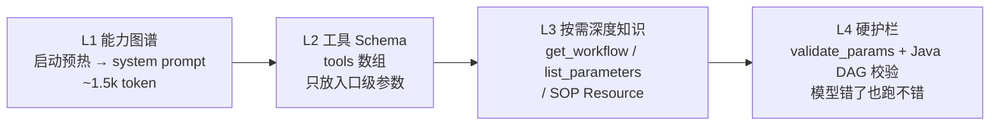
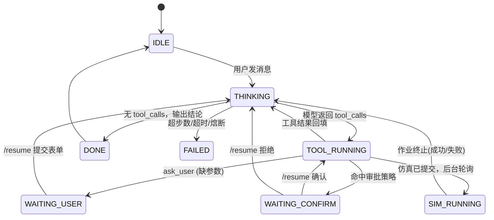
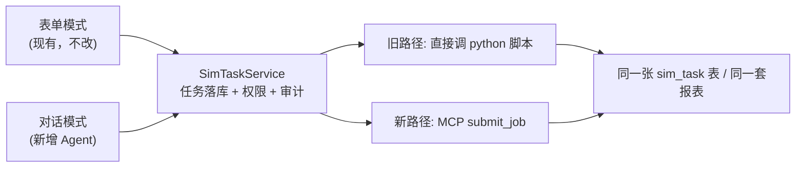

# 01 · 架构设计与关键决策（先看懂这一页再看代码）

## 1. 职责边界：谁该做什么

这是整个方案最容易做错的地方。记住一句话：**MCP Server 只管「怎么算」，Java 引擎管「算不算、谁能算、算完怎么记」。**

| 层 | 负责 | 绝不负责 |
| --- | --- | --- |
| 前端 | 聊天、流式展示、渲染补参表单/审批卡片/进度 | 不拼 prompt、不直连 MCP、不存业务状态 |
| Java 核心引擎 | 意图理解编排、工具聚合与路由、上下文管理、审批/幂等/限流/审计、**任务落库**、DAG 确定性执行、SSE 推送 | 不硬编码任何一种仿真的参数、步骤、依赖 |
| Python MCP Server（插件） | 声明自己的工作流/参数/前置依赖/预设；参数校验；提交与监控仿真作业；产物管理 | 不访问业务库、不做权限、不管审批、不知道“用户”是谁 |
| 仿真脚本（现有） | 真实调用 Coventor / S-Litho 完成计算 | 不感知 MCP、不感知大模型 |

<aside>
💡

**为什么不让 MCP Server 直连业务库？**

① 仿真机往往在内网/计算集群，与业务库网络隔离；② MCP Server 要能被其他客户端（Cursor / Claude / 未来另一个系统）复用，不能绑定你的表结构；③ 权限与审计必须汇聚到一处，否则无法合规。

因此：**引擎先建 `sim_task` 记录 → 再调 MCP 提交 → 拿到 `job_id` 回写 → 轮询回写状态**。这样你现有的报表/历史/重跑功能全部不变。

</aside>

---

## 2. 《仿真插件合约》：整套方案的地基

插件化的前提是 **所有插件长得一模一样**。所以每个仿真 MCP Server 必须暴露下面这 12 个工具（名字、语义、返回结构完全一致）。引擎和 prompt 因此可以完全通用，新增仿真不需要改 Java。

| 工具名 | 作用 | 典型调用时机 | 只读 |
| --- | --- | --- | --- |
| `describe_capability` | 返回插件能力卡片（我能干什么、适用场景、危险操作清单） | 引擎启动预热 | ✅ |
| `list_workflows` | 本插件有哪几种仿真流程 | 路由阶段 | ✅ |
| `get_workflow` | **某个流程的 SOP：步骤、前置依赖、产物、耗时** | 模型确定要跑哪个仿真后 | ✅ |
| `list_parameters` | 参数目录（分组、单位、范围、默认值、条件必填） | 收集参数前 | ✅ |
| `list_presets` | 典型工况预设（一句话就能跑的模板） | 用户说“跑个标准的” | ✅ |
| `validate_params` | **服务端校验；返回缺什么、错在哪、该问用户什么、现成表单 Schema** | 提交前必调 | ✅ |
| `submit_job` | 提交仿真（异步），返回 `job_id` | 审批通过后 | ❌ 写 |
| `run_job_sync` | 同步跑完并上报进度（仅秒级任务） | 快速预估/小算例 | ❌ 写 |
| `get_job_status` | 状态、进度、当前步骤、日志尾部、输出、错误 | 轮询 | ✅ |
| `list_artifacts` / `read_artifact` | 产物清单与内容（报告、曲线、轮廓文件） | 交付结果 / 传给下游仿真 | ✅ |
| `cancel_job` | 取消作业 | 用户叫停 | ❌ 写 |

另外附带两类非工具能力：

- **Resources**：`sim://coventor/sop/mems_resonator_modal`（SOP 全文 Markdown）、`sim://coventor/params/...`（参数字典）—— 给需要深度阅读时按需拉取，不占平时 token。
- **Prompts**：`how_to_run`（带 few-shot 的流程引导模板），以及 `initialize` 返回的 `instructions` 字段（插件自带的使用说明，引擎会自动拼进 system prompt）。

---

## 3. 让大模型「懂仿真」的四层知识注入（直接回答你前两个疑问）

很多人失败的原因：把所有知识都塞进 system prompt（token 爆炋、模型忽略），或者完全靠模型自己猜（一本正经胡说八道）。正确做法是**分层**：



| 层 | 内容 | 成本 | 解决什么问题 |
| --- | --- | --- | --- |
| L1 能力图谱 | 引擎启动时逐个调 `describe_capability`，拼成一张「有哪些仿真 + 适用场景 + 依赖关系」的紧凑清单，写进 system prompt | 固定 1~2k token | **路由**：用户说一句话，模型知道该找谁；也知道 A 依赖 B |
| L2 工具 Schema | 12 个合约工具的 JSON Schema（`submit_job` 的 `params` 是自由 object，不展开 80 个字段） | 每个插件 ~600 token | **可执行**：模型知道怎么调，且不会被参数海洋淡化注意力 |
| L3 按需知识 | 真正的步骤、参数说明书、单位、范围、前置任务、SOP 全文 | 只在需要时花 | **准确**：模型锁定了仿真类型后才拉详情 |
| L4 硬护栏 | `validate_params` 服务端校验 + Java 侧 DAG/依赖校验 + 幂等键 | 几乎为零 | **安全**：就算模型幻觉也提不了错误任务 |

### L1 能力图谱实际长什么样（引擎自动生成）

```
【可用仿真能力】
server=litho (S-Litho 光刻仿真)
  • mask_opc         掩模 OPC 优化 | 用于修正光刻失真 | 产物: opc_mask_file, mrc_report | 约 8min
  • pattern_transfer 光刻成像与图形转移 | 产出光刻胶轮廓 | 产物: resist_profile_file, cd_report | 约 15min
      └─ 可选前置: mask_opc 的 opc_mask_file
server=coventor (Coventor MEMS 多物理场仿真)
  • mems_resonator_modal 谐振器模态分析 | 求固有频率/振型 | 约 25min
      └─ 必需前置: litho.pattern_transfer 的 resist_profile_file  ←─ 模型就是这样知道依赖的
  • mems_pull_in         静电吸合电压分析 | 可选前置: mems_resonator_modal
【依赖链】litho.mask_opc → litho.pattern_transfer → coventor.mems_resonator_modal → coventor.mems_pull_in
```

---

## 4. 两种执行模式（回答「多仿真串联」）

|  | 模式 A：ReAct 直跑 | 模式 B：Plan-DAG |
| --- | --- | --- |
| 适用 | 单个仿真、查询类、参数收集 | 多仿真串联、有前置依赖、需要传递产物 |
| 控制权 | 大模型逐步决定下一步 | 大模型一次性产出 DAG，**Java 确定性执行** |
| 优点 | 灵活、实现简单 | 可审批、可重试、可恢复、不会跑飞、token 消耗低 |
| 风险 | 步数多了容易跑偏、重复提交 | 需要额外实现 DAG 执行器（已给你写好） |
| 触发 | 默认 | system prompt 规则：“涉及 ≥ 2 个仿真作业或存在前置依赖时，**必须**调用 `submit_plan`” |

一个真实的 plan 长这样（模型输出，引擎执行）：

```json
{
  "goal": "先做光刻图形转移，再用得到的轮廓做谐振器模态分析",
  "steps": [
    {
      "id": "s1",
      "tool": "litho__submit_job",
      "args": { "workflow_id": "pattern_transfer",
                "params": { "mask_file": "/data/mask/res_v3.gds", "dose_mj_cm2": 32, "focus_nm": 0 } },
      "depends_on": [],
      "wait_for_completion": true
    },
    {
      "id": "s2",
      "tool": "coventor__submit_job",
      "args": { "workflow_id": "mems_resonator_modal",
                "params": { "beam_length_um": 200, "beam_width_um": 20,
                            "thickness_um": 2, "material": "Si", "num_modes": 5 },
                "upstream_artifacts": { "resist_profile_file": "${s1.outputs.resist_profile_file}" } },
      "depends_on": ["s1"],
      "wait_for_completion": true
    }
  ]
}
```

`${s1.outputs.resist_profile_file}` 由 Java 的 `ExpressionResolver` 在运行时替换——模型不需要（也不可能）提前知道文件路径。这一招把「嵌套仿真」从模型难题变成了工程问题。

---

## 5. 会话状态机（会话可挂起是企业级的分水岭）



关键实现细节（很多人在这里踩坑）：挂起时必须把 **`tool_call_id`** 存下来。OpenAI 消息协议要求：一个 `assistant(tool_calls=[...])` 消息后面，**必须**紧跟相同数量、相同 id 的 `tool` 消息，否则下一次请求直接 400。所以用户填完表单后，我们把答案包成那个 `tool_call_id` 的 `tool` 消息再继续循环。

---

## 6. 上下文与落库时机

| 时机 | 动作 | 表 |
| --- | --- | --- |
| 用户发消息 | 创建/复用会话，追写 user 消息 | `agent_session` / `agent_message` |
| 模型回复 | 追写 assistant 消息（含 `tool_calls` 原文） | `agent_message` |
| 每次工具调用 | 入参/出参/耗时/结果全量审计（给 LLM 的是截断版） | `agent_tool_call` |
| 挂起等用户 | 存 pending action（含 `tool_call_id` 与表单 Schema） | `agent_pending_action` |
| **提交仿真前** | **先建 `sim_task`（沿用现有逻辑），拿到任务号** | `sim_task` |
| MCP 返回 job_id | 回写 `mcp_job_id`，状态置 RUNNING | `sim_task` |
| 后台轮询 | 更新进度/步骤/产物，推 SSE 给前端 | `sim_task` / `sim_task_step` |

上下文裁剪策略（防 token 爆炋）：`system` + 最新 `N` 轮完整消息 + 更远的工具结果只留摘要（> 2000 字的 tool 结果存全文入库，给模型只给前 1500 字 + “完整内容可用 read_artifact 获取”）。

---

## 7. 护栏矩阵（企业级的「完成率/安全率」就是这些构成的）

| 风险 | 护栏手段 | 代码位置 |
| --- | --- | --- |
| 模型重复提交同一仿真（烧钱！） | 幂等键 = SHA256(session+tool+规范化参数)，MCP 侧唯一索引拦截 | `IdempotencyInterceptor`  • `jobstore` 唯一索引 |
| 模型死循环 | 同工具同参数连续 3 次 → 注入系统纠正消息；最大步数 12 | `LoopGuard` |
| 参数编造/单位错 | 服务端 `validate_params`  • 范围/枚举/单位校验，错误结构化回传 | `validation.py` |
| 跳过前置任务 | 插件返回 `PRECONDITION_MISSING`  • 引擎 DAG 拓扑校验，非法顺序直接报错 | `validation.py`  • `PlanExecutor` |
| 未经同意花钱 | `confirm-tools` 白名单拦截 → 前端审批卡片 | `ConfirmationInterceptor` |
| MCP 挂了/超时 | 超时 + 指数退避重试 + 熍断器 + 会话过期自动重连 | `StreamableHttpMcpTransport` / `McpClientManager` |
| 提示词注入（恶意文件名/日志） | 工具结果一律当数据，不当指令；写操作一律白名单 + 人审 | `PromptBuilder` 规则 + 审批 |
| 越权跑仿真 | 引擎侧校验用户对 `sim_type` 的权限（沿用现有 RBAC） | `ToolExecutor` 前置拦截 |
| 上下文爆炋 | 结果截断 + 历史摘要 + 工具择优（工具多于 30 个时按相关度筛选） | `ToolRegistry.selectTools` |

---

## 8. 引擎 12 个核心类，一句话职责

| 类 | 职责 |
| --- | --- |
| `StreamableHttpMcpTransport` | 手写 MCP 传输：initialize 握手、`Mcp-Session-Id` 管理、JSON 与 SSE 双模式响应、进度通知回调、会话过期重连 |
| `StdioMcpTransport` | 本地子进程模式（调试/单机部署） |
| `McpClient` | 工具缓存、`tools/call` 封装、结果解包（text + structuredContent） |
| `McpClientManager` | 多插件生命周期、异步预热、定时健康检查与工具刷新、能力图谱缓存 |
| `OpenAiCompatibleLlmClient` | 流式/非流式对话、`tool_calls` 分片聚合、重试与退避 |
| `PromptBuilder` | 拼 system prompt：角色 + 能力图谱 + 8 条硬规则 + 输出规范 |
| `ToolRegistry` | MCP 工具 + 内置工具 → OpenAI `tools` 数组；`server__tool` 命名；工具择优 |
| `ToolExecutor` | 拦截器链（鉴权→幂等→审批→审计→落库）+ 超时/重试/结果压缩 |
| `AgentOrchestrator` | **核心引擎**：ReAct 主循环、挂起与恢复、事件发布 |
| `PlanExecutor` | DAG 拓扑排序、`${step.outputs.x}` 变量解析、等待作业完成、失败中断与回报 |
| `SimTaskService` / `SimTaskPoller` | 任务落库（接你现有业务）与后台轮询回写 + 进度推送 |
| `SseHub` | sessionId → SseEmitter 注册表，让后台线程也能往前端推事件 |

---

## 9. 与你现有系统的兼容（零拆除接入）

你现在的链路是：`前端表单 → Controller → 存库 → 调 Python 脚本`。接入后变成两条入口、共享一个尾巴：



迁移建议：先让 MCP Server 内部调用你已有的 python 脚本（`subprocess` 或直接 `import`），**不要重写仿真逻辑**；MCP Server 只多了一层「元数据声明 + 参数校验 + 作业状态机」。本方案的 `mock_runner.py` 就是那个唯一需要替换的文件。