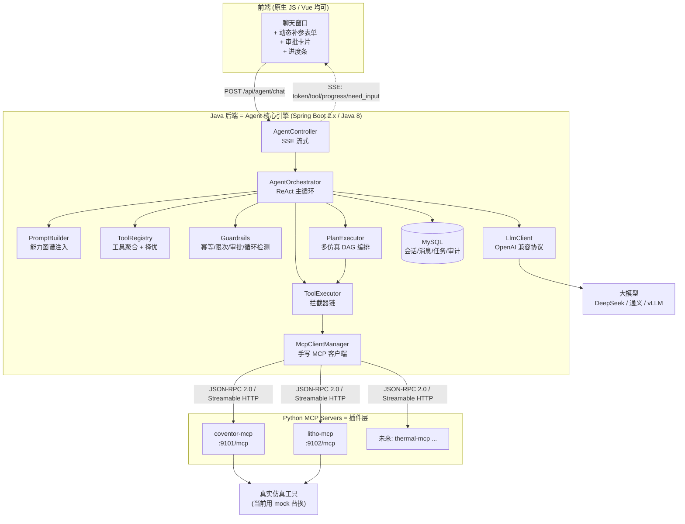
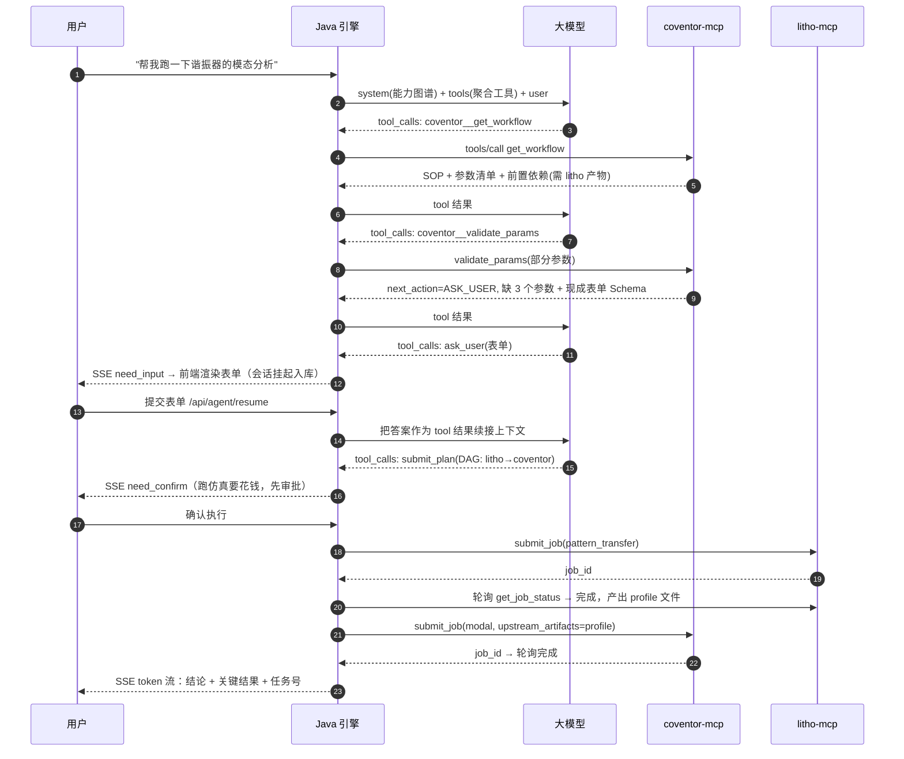

# 仿真 Agent 平台：MCP 插件化架构完整实现方案（Java 核心引擎 + Python MCP Server）

<aside>
🎯

**结论先行**：Java 后端做 **Agent 核心引擎**（自研 ReAct 循环 + 自研 MCP 客户端，不依赖 Spring AI / LangChain4j，Java 8 + Spring Boot 2.x 即可跑）；每一类仿真做成一个遵守同一份《仿真插件合约》的 **Python MCP Server**。

新增一种仿真 = 新增一个 Python 声明文件，**引擎零改动**。这就是你领导说的「核心引擎化 + 插件化」。

</aside>

## 0. 这份文档怎么读

| 顺序 | 内容 | 你能得到什么 |
| --- | --- | --- |
| 01 | 架构设计与关键决策 | 想清楚「为什么这么做」，避免走弯路 |
| 02 | Python MCP Server 完整代码 | 两个可运行插件（Coventor / S-Litho）+ mock 仿真引擎 |
| 03 | Java：MCP 客户端 + LLM 客户端 | 手写 JSON-RPC / Streamable HTTP / stdio，全部可复制 |
| 04 | Java：Agent 编排引擎 | ReAct 循环、补参、审批、DAG 计划执行、护栏 |
| 05 | Java：接口层 + 建表 + 配置 + 前端 | SSE 流式对话、动态补参表单、审批卡片 |
| 06 | MCP 从零部署与联调手册 | 你没接触过 MCP 也能一步步跑起来 |
| 07 | 你的疑问逐条解答 | 流程/依赖/参数怎么让大模型知道、怎么提高成功率 |

---

## 1. 全局架构



### 一次完整对话的时序（含缺参追问 + 前置仿真）



---

## 2. 关键设计决策（先看这张表，能省你两周）

| 决策点 | 选择 | 理由 |
| --- | --- | --- |
| Agent 框架 | **自研 ReAct 循环**（约 400 行） | Spring AI 需要 Spring Boot 3 + JDK 17；工具调用循环本质就是「HTTP + JSON + for 循环」，自研可控且无版本包袱 |
| LLM 协议 | **OpenAI 兼容 /v1/chat/completions**（function calling） | DeepSeek / 通义 / 智谱 / vLLM / Ollama 全部兼容，换模型只改配置 |
| MCP 传输 | **Streamable HTTP** 为主，stdio 备用 | HTTP 可独立部署/扩容/加鉴权；stdio 适合本地调试和单机部署 |
| MCP 协议版本 | `2025-06-18`（带 initialize 握手 + `Mcp-Session-Id`） | Python SDK 与所有工具链支持最好；`2026-07-28` 改为无状态，见 06 的迁移说明 |
| 仿真调用模式 | **异步提交 + 轮询**（`submit_job` → `get_job_status`） | 仿真动辄几十分钟，绝不能占着 HTTP 连接；同时提供 `run_job_sync` 给秒级任务 |
| 任务落库归属 | **Java 落库**（沿用你现有 `sim_task` 逻辑），MCP 只管算 | 权限、审计、报表、与老功能共用一套数据；MCP Server 保持无业务耦合、可复用 |
| 多仿真串联 | LLM 产出 **DAG 计划** → Java **确定性执行** | 让模型只做「翻译 + 决策」，不做「流程控制」，成功率提升最明显的一招 |
| 参数太多 | **分层参数目录 + 预设(preset) + 服务端 `validate_params`** | 不把 80 个参数塞进 tool schema；缺什么由插件告诉引擎，引擎再问用户 |
| 前置依赖 | 插件声明 `prerequisites`  • 结构化错误 `PRECONDITION_MISSING` | 模型不靠「猜」，靠「被告知」；引擎再用 DAG 校验做硬护栏 |
| 人机协同 | **会话可挂起**：`ask_user` / `need_confirm` 落库，恢复时续接 `tool_call_id` | 企业级 Agent 的必备能力，也是 OpenAI 消息协议的正确用法 |

---

## 3. 代码仓库总目录

```
sim-agent/
├── sim-mcp/                          # ① Python 插件层（每个仿真一个 MCP Server）
│   ├── requirements.txt
│   ├── sim_mcp_common/               # 统一《仿真插件合约》，所有插件共用
│   │   ├── contracts.py              #   数据契约（WorkflowSpec / ParamSpec / 前置依赖…）
│   │   ├── validation.py             #   参数校验引擎 + 自动生成补参表单 Schema
│   │   ├── jobstore.py               #   任务存储（SQLite）+ 线程池执行
│   │   ├── mock_runner.py            #   mock 仿真执行器（分步 + 进度 + 产物）
│   │   └── server_factory.py         #   把合约自动注册成 MCP tools/resources/prompts
│   ├── plugins/
│   │   ├── coventor_plugin.py        #   Coventor 仿真元数据声明（纯声明，无逻辑）
│   │   └── litho_plugin.py           #   S-Litho 仿真元数据声明
│   ├── servers/
│   │   ├── coventor_server.py        #   启动入口 :9101
│   │   └── litho_server.py           #   启动入口 :9102
│   ├── app_wrapper.py                # 生产用：Bearer 鉴权 + /healthz
│   ├── Dockerfile
│   └── docker-compose.yml
│
└── sim-agent-java/                   # ② Java 核心引擎
    └── src/main/java/com/acme/simagent/
        ├── SimAgentApplication.java
        ├── config/       AgentProperties, BeanConfig
        ├── mcp/          McpTransport, StreamableHttpMcpTransport, StdioMcpTransport,
        │                 McpClient, McpClientManager, model/*
        ├── llm/          LlmClient, OpenAiCompatibleLlmClient, model/*
        ├── agent/        AgentOrchestrator ★核心, PromptBuilder, ToolRegistry,
        │                 ToolExecutor, LoopGuard, builtin/*, interceptor/*, plan/*
        ├── conversation/ ConversationStore, PendingActionStore
        ├── simtask/      SimTaskService, SimTaskPoller
        ├── sse/          SseHub, AgentEvent
        └── web/          AgentController, dto/*
    └── src/main/resources/
        ├── application.yml, schema.sql
        └── static/index.html          # ③ 前端
```

---

## 4. 15 分钟跑通清单

- [ ]  `cd sim-mcp && pip install -r requirements.txt`
- [ ]  `python -m servers.litho_server`（:9102）与 `python -m servers.coventor_server`（:9101）
- [ ]  `curl` 三连自检 initialize / tools/list / tools/call（06 有完整命令）
- [ ]  `npx @modelcontextprotocol/inspector` 图形化点一遍工具
- [ ]  MySQL 执行 `schema.sql`
- [ ]  配置 `application.yml` 里的 `agent.llm.api-key` 与两个 MCP 地址
- [ ]  `mvn spring-boot:run`，访问 `http://localhost:8080/index.html`
- [ ]  输入：**「帮我做一个 MEMS 谐振器的模态分析，梁长 200 微米」** → 观察补参、审批、前置 litho 自动编排全过程

<aside>
⚠️

下面 7 个子页面里的代码是**成套的**，包名/类名/字段名互相对应，可以直接落地到工程里。mock 仿真会真实生成产物文件、真实分步推进状态，因此整条链路（含轮询、进度推送、DAG 依赖传参）都能被完整验证；接真实仿真时只需替换 `mock_runner.py` 里的一个函数。

</aside>

[01 · 架构设计与关键决策（先看懂这一页再看代码）](%E4%BB%BF%E7%9C%9F%20Agent%20%E5%B9%B3%E5%8F%B0%EF%BC%9AMCP%20%E6%8F%92%E4%BB%B6%E5%8C%96%E6%9E%B6%E6%9E%84%E5%AE%8C%E6%95%B4%E5%AE%9E%E7%8E%B0%E6%96%B9%E6%A1%88%EF%BC%88Java%20%E6%A0%B8%E5%BF%83%E5%BC%95%E6%93%8E%20+%20Python%20MCP/01%20%C2%B7%20%E6%9E%B6%E6%9E%84%E8%AE%BE%E8%AE%A1%E4%B8%8E%E5%85%B3%E9%94%AE%E5%86%B3%E7%AD%96%EF%BC%88%E5%85%88%E7%9C%8B%E6%87%82%E8%BF%99%E4%B8%80%E9%A1%B5%E5%86%8D%E7%9C%8B%E4%BB%A3%E7%A0%81%EF%BC%89%20dac48614259c4f0bb312b5cc9767a638.md)

[02 · Python MCP Server 完整代码（统一合约 + 两个仿真插件）](%E4%BB%BF%E7%9C%9F%20Agent%20%E5%B9%B3%E5%8F%B0%EF%BC%9AMCP%20%E6%8F%92%E4%BB%B6%E5%8C%96%E6%9E%B6%E6%9E%84%E5%AE%8C%E6%95%B4%E5%AE%9E%E7%8E%B0%E6%96%B9%E6%A1%88%EF%BC%88Java%20%E6%A0%B8%E5%BF%83%E5%BC%95%E6%93%8E%20+%20Python%20MCP/02%20%C2%B7%20Python%20MCP%20Server%20%E5%AE%8C%E6%95%B4%E4%BB%A3%E7%A0%81%EF%BC%88%E7%BB%9F%E4%B8%80%E5%90%88%E7%BA%A6%20+%20%E4%B8%A4%E4%B8%AA%E4%BB%BF%E7%9C%9F%E6%8F%92%E4%BB%B6%EF%BC%89%208e342f45834f47feb0fe11fa0429432f.md)

[03 · Java 代码（一）手写 MCP 客户端 + LLM 客户端](%E4%BB%BF%E7%9C%9F%20Agent%20%E5%B9%B3%E5%8F%B0%EF%BC%9AMCP%20%E6%8F%92%E4%BB%B6%E5%8C%96%E6%9E%B6%E6%9E%84%E5%AE%8C%E6%95%B4%E5%AE%9E%E7%8E%B0%E6%96%B9%E6%A1%88%EF%BC%88Java%20%E6%A0%B8%E5%BF%83%E5%BC%95%E6%93%8E%20+%20Python%20MCP/03%20%C2%B7%20Java%20%E4%BB%A3%E7%A0%81%EF%BC%88%E4%B8%80%EF%BC%89%E6%89%8B%E5%86%99%20MCP%20%E5%AE%A2%E6%88%B7%E7%AB%AF%20+%20LLM%20%E5%AE%A2%E6%88%B7%E7%AB%AF%201ed5058f41d14f2c83c0cf8d439eb873.md)

[04 · Java 代码（二）Agent 核心引擎：提示工程、ReAct 循环、拦截器、DAG 编排](%E4%BB%BF%E7%9C%9F%20Agent%20%E5%B9%B3%E5%8F%B0%EF%BC%9AMCP%20%E6%8F%92%E4%BB%B6%E5%8C%96%E6%9E%B6%E6%9E%84%E5%AE%8C%E6%95%B4%E5%AE%9E%E7%8E%B0%E6%96%B9%E6%A1%88%EF%BC%88Java%20%E6%A0%B8%E5%BF%83%E5%BC%95%E6%93%8E%20+%20Python%20MCP/04%20%C2%B7%20Java%20%E4%BB%A3%E7%A0%81%EF%BC%88%E4%BA%8C%EF%BC%89Agent%20%E6%A0%B8%E5%BF%83%E5%BC%95%E6%93%8E%EF%BC%9A%E6%8F%90%E7%A4%BA%E5%B7%A5%E7%A8%8B%E3%80%81ReAct%20%E5%BE%AA%E7%8E%AF%E3%80%81%E6%8B%A6%E6%88%AA%E5%99%A8%E3%80%81DAG%20%E7%BC%96%E6%8E%92%20a3f119e5179a4e28973364b40079ed4d.md)

[05 · Java 代码（三）持久层、SSE、接口层、配置与前端页面](%E4%BB%BF%E7%9C%9F%20Agent%20%E5%B9%B3%E5%8F%B0%EF%BC%9AMCP%20%E6%8F%92%E4%BB%B6%E5%8C%96%E6%9E%B6%E6%9E%84%E5%AE%8C%E6%95%B4%E5%AE%9E%E7%8E%B0%E6%96%B9%E6%A1%88%EF%BC%88Java%20%E6%A0%B8%E5%BF%83%E5%BC%95%E6%93%8E%20+%20Python%20MCP/05%20%C2%B7%20Java%20%E4%BB%A3%E7%A0%81%EF%BC%88%E4%B8%89%EF%BC%89%E6%8C%81%E4%B9%85%E5%B1%82%E3%80%81SSE%E3%80%81%E6%8E%A5%E5%8F%A3%E5%B1%82%E3%80%81%E9%85%8D%E7%BD%AE%E4%B8%8E%E5%89%8D%E7%AB%AF%E9%A1%B5%E9%9D%A2%2080392190e729414f93307f7dd249b39a.md)

[06 · MCP 从零到上线：部署与调试完整手册](%E4%BB%BF%E7%9C%9F%20Agent%20%E5%B9%B3%E5%8F%B0%EF%BC%9AMCP%20%E6%8F%92%E4%BB%B6%E5%8C%96%E6%9E%B6%E6%9E%84%E5%AE%8C%E6%95%B4%E5%AE%9E%E7%8E%B0%E6%96%B9%E6%A1%88%EF%BC%88Java%20%E6%A0%B8%E5%BF%83%E5%BC%95%E6%93%8E%20+%20Python%20MCP/06%20%C2%B7%20MCP%20%E4%BB%8E%E9%9B%B6%E5%88%B0%E4%B8%8A%E7%BA%BF%EF%BC%9A%E9%83%A8%E7%BD%B2%E4%B8%8E%E8%B0%83%E8%AF%95%E5%AE%8C%E6%95%B4%E6%89%8B%E5%86%8C%20be5f959b7cc84d898c008ddb8f4c26f0.md)

[07 · 疑问逐条解答：知识注入、参数完备、主动追问与成功率工程](%E4%BB%BF%E7%9C%9F%20Agent%20%E5%B9%B3%E5%8F%B0%EF%BC%9AMCP%20%E6%8F%92%E4%BB%B6%E5%8C%96%E6%9E%B6%E6%9E%84%E5%AE%8C%E6%95%B4%E5%AE%9E%E7%8E%B0%E6%96%B9%E6%A1%88%EF%BC%88Java%20%E6%A0%B8%E5%BF%83%E5%BC%95%E6%93%8E%20+%20Python%20MCP/07%20%C2%B7%20%E7%96%91%E9%97%AE%E9%80%90%E6%9D%A1%E8%A7%A3%E7%AD%94%EF%BC%9A%E7%9F%A5%E8%AF%86%E6%B3%A8%E5%85%A5%E3%80%81%E5%8F%82%E6%95%B0%E5%AE%8C%E5%A4%87%E3%80%81%E4%B8%BB%E5%8A%A8%E8%BF%BD%E9%97%AE%E4%B8%8E%E6%88%90%E5%8A%9F%E7%8E%87%E5%B7%A5%E7%A8%8B%208cf28011a8124451b427861d2d2ee135.md)