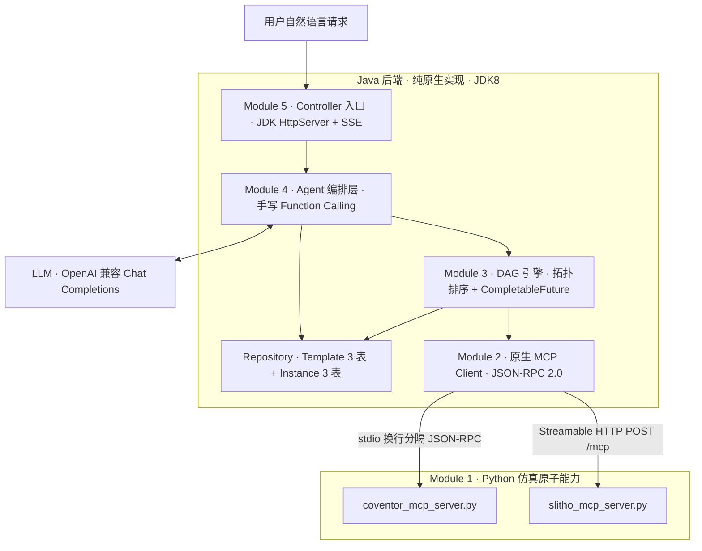
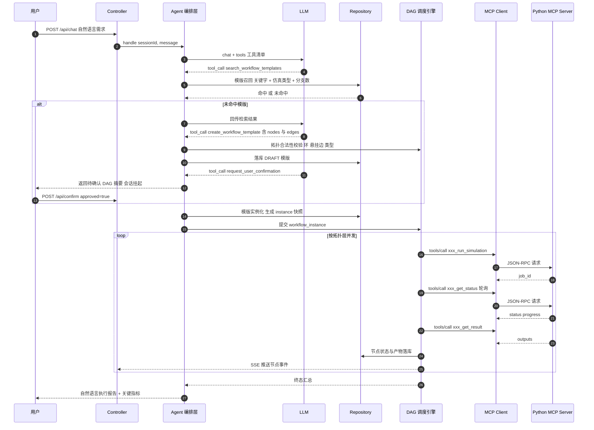

# NL2SimWorkflow · 自然语言驱动仿真工作流平台（端到端可运行原型）

<aside>
🧩

**交付物**：一套**零外部依赖、可直接编译运行**的端到端原型。Python 端 2 个 Mock 仿真 MCP Server（仅标准库），Java 端 5 大模块（**不使用 Spring / Spring AI / LangChain / Jackson / Gson**，只用 JDK 8 自带能力：`ProcessBuilder`、`HttpURLConnection`、`CompletableFuture`、`com.sun.net.httpserver`，并自带一个手写 JSON 内核）。默认内置离线 `HeuristicLlmProvider`，**没有 LLM Key 也能完整跑通全链路**；配置 `LLM_API_KEY` 后自动切换到真实 OpenAI 兼容 Function Calling。

</aside>

## 1. 分层架构



**核心分层原则**：Agent 层只做「意图 → 模版 → 实例」的语义决策，**绝不参与具体调度**；DAG 引擎只认 `workflow_instance` 快照，**不感知 LLM 存在**；MCP Client 只认 JSON-RPC，**不感知业务语义**。三层可独立替换与压测。

## 2. 端到端主链路时序



## 3. 工程目录

```
nl2sim/
├── python/
│   ├── mcp_common.py             # 极简 MCP 服务端框架：stdio + HTTP 双传输 + Mock 作业池
│   ├── coventor_mcp_server.py    # Coventor 结构/网格仿真 Mock Server
│   └── slitho_mcp_server.py      # S-Litho 光刻仿真 Mock Server
├── src/main/java/com/sim/agent/
│   ├── json/MiniJson.java                     # 手写 JSON 解析/序列化内核（零依赖）
│   ├── mcp/McpTransport.java                  # 传输抽象
│   ├── mcp/StdioMcpTransport.java             # ProcessBuilder 子进程 + 换行分隔 JSON-RPC
│   ├── mcp/HttpMcpTransport.java              # HttpURLConnection + Streamable HTTP / SSE
│   ├── mcp/McpClient.java                     # initialize / tools/list / tools/call + id 关联
│   ├── mcp/McpToolInfo.java  mcp/McpErrors.java
│   ├── mcp/McpServerRegistry.java             # 仿真类型 → MCP Server 路由与懒加载连接池
│   ├── domain/*.java                          # 模版 3 表 + 实例 3 表的领域模型与状态枚举
│   ├── repo/WorkflowRepository.java           # 仓储接口
│   ├── repo/InMemoryWorkflowRepository.java   # 开箱即跑实现
│   ├── repo/JdbcWorkflowRepository.java       # 纯 JDBC 生产实现（见附录 A）
│   ├── engine/TopologySorter.java             # 入度计算 / 分层拓扑排序 / 环检测
│   ├── engine/ParamResolver.java              # ${nodes.x.outputs.y} 前置节点参数透传
│   ├── engine/RetryPolicy.java  engine/WorkflowEvent.java  engine/EngineErrors.java
│   ├── engine/DagScheduler.java                # CompletableFuture 并发调度 + 重试 + 超时 + 续跑
│   ├── agent/ChatMessage.java  agent/ToolCall.java  agent/ToolDef.java
│   ├── agent/LlmProvider.java  agent/OpenAiLlmProvider.java  agent/HeuristicLlmProvider.java
│   ├── agent/AgentTools.java  agent/AgentSession.java  agent/AgentOrchestrator.java
│   └── app/Config.java  app/SeedData.java  app/SimApplication.java
├── sql/schema.sql                              # 6 张表 DDL（附录 A）
└── run.sh
```

## 4. 五分钟跑通

```bash
# 0) 前置：JDK 8+ 与 Python 3.8+。无需 Maven、无需 pip install
java -version && python3 -V

# 1) 编译（Windows: dir /s /b src\*.java > sources.txt）
mkdir -p out && find src -name "*.java" > sources.txt
javac -encoding UTF-8 -d out @sources.txt

# 2) 不经 Java，先冒烟测试 Python MCP Server 的裸协议
printf '%s\n' \
 '{"jsonrpc":"2.0","id":1,"method":"initialize","params":{"protocolVersion":"2025-06-18","capabilities":{},"clientInfo":{"name":"smoke","version":"1"}}}' \
 '{"jsonrpc":"2.0","method":"notifications/initialized"}' \
 '{"jsonrpc":"2.0","id":2,"method":"tools/list"}' \
 '{"jsonrpc":"2.0","id":3,"method":"tools/call","params":{"name":"coventor_run_simulation","arguments":{"structure":"mems_cantilever","mesh_size_um":0.5}}}' \
 | python3 python/coventor_mcp_server.py

# 3) 一键跑通全链路（离线模式，无需任何 Key）
java -cp out com.sim.agent.app.SimApplication --demo

# 3b) 演示「节点失败 → 指数退避重试 → 成功」
java -cp out com.sim.agent.app.SimApplication --demo --chaos

# 3c) 演示「超时熔断 + 断点续跑」
java -cp out com.sim.agent.app.SimApplication --demo --timeout-demo

# 4) 起 REST 服务 + 内置调试控制台
java -cp out com.sim.agent.app.SimApplication --port 8080
#    浏览器打开 http://127.0.0.1:8080/

# 5) 接真实 LLM（任意 OpenAI 兼容网关：OpenAI / DeepSeek / Qwen / vLLM）
export LLM_BASE_URL=https://api.openai.com/v1
export LLM_API_KEY=sk-xxxx
export LLM_MODEL=gpt-4o-mini
java -cp out com.sim.agent.app.SimApplication --port 8080

# 6) 切 HTTP 传输（先手工常驻 Python 侧 MCP Server）
python3 python/slitho_mcp_server.py --transport http --port 9002 &
java -Dmcp.slitho.transport=http -Dmcp.slitho.endpoint=http://127.0.0.1:9002/mcp \
     -cp out com.sim.agent.app.SimApplication --demo
```

## 5. 预期运行输出（`--demo --chaos` 节选）

```
[boot] MCP 注册: coventor -> stdio[python3 python/coventor_mcp_server.py]
[boot] MCP 注册: slitho   -> stdio[python3 python/slitho_mcp_server.py]
[boot] LLM Provider = HeuristicLlmProvider(离线规则引擎，未检测到 LLM_API_KEY)
[boot] 种子模版: wf_cov_mesh_dual_slitho v1 (3 nodes / 2 edges)

===== 场景 1：命中既有模版 =====
[user ] 先跑一个 Coventor 基础网格仿真，然后基于其输出并行跑两个不同光强参数的 S-Litho 仿真
[agent] STATE: ANALYZING -> MATCHING
[agent] tool_call#1 search_workflow_templates{"keyword":"coventor 网格 slitho 光强 并行","simulation_types":["COVENTOR","S_LITHO"],"parallel_branch_hint":2}
[agent] tool_ret  命中 1 个模版: wf_cov_mesh_dual_slitho (score=0.92)
[agent] STATE: MATCHING -> INSTANTIATING
[agent] tool_call#2 instantiate_and_run{"template_key":"wf_cov_mesh_dual_slitho","inputs":{"structure":"mems_cantilever","mesh_size_um":0.5},"node_overrides":{"slitho_low":{"illumination_intensity":0.8},"slitho_high":{"illumination_intensity":1.2}}}
[dag  ] 实例 wi-7c1f0a 拓扑分层: L0=[cov_mesh] L1=[slitho_low, slitho_high]
[dag  ] cov_mesh      RUNNING   attempt=1/3 tool=coventor_run_simulation job=cov-3b91f2d0aa41
[dag  ] cov_mesh      PROGRESS  38% stage=meshing
[dag  ] cov_mesh      PROGRESS  79% stage=solving
[dag  ] cov_mesh      SUCCEEDED 1.62s outputs.node_count=42317 outputs.mesh_file=/mnt/sim/mems_cantilever/mesh_0p5.msh
[dag  ] slitho_low    RUNNING   attempt=1/3 参数透传 mask/mesh_file <- ${nodes.cov_mesh.outputs.mesh_file}
[dag  ] slitho_high   RUNNING   attempt=1/3 (与 slitho_low 同层并发)
[dag  ] slitho_low    FAILED    attempt=1/3 SOLVER_DIVERGED 求解器在第 60 迭代步发散 -> 可重试
[dag  ] slitho_low    RETRYING  backoff=812ms
[dag  ] slitho_high   SUCCEEDED 2.04s outputs.cd_nm=44.71 outputs.ils=1.83
[dag  ] slitho_low    SUCCEEDED 2.11s attempt=2/3 outputs.cd_nm=51.36 outputs.ils=1.42
[dag  ] 实例 wi-7c1f0a 终态=SUCCEEDED 墙钟=4.9s 串行估算=6.1s 并发收益=19.7%
[agent] STATE: EXECUTING -> DONE
[reply] 已复用模版《Coventor 基础网格 + 双光强 S-Litho 并行》执行完成：
        · cov_mesh 网格节点数 42317，网格质量 0.913，最大应力 168.4 MPa
        · slitho_low  光强 0.8 → CD 51.36 nm，ILS 1.42（曾失败 1 次，重试后成功）
        · slitho_high 光强 1.2 → CD 44.71 nm，ILS 1.83
        结论：光强由 0.8 提升至 1.2，CD 收缩 12.9%，ILS 提升 28.9%。

===== 场景 2：模版未命中 → Agent 动态建模 → 人机确认 =====
[user ] 先跑 Coventor 粗网格再跑细网格，然后基于细网格并行跑三个不同 NA 的 S-Litho
[agent] STATE: ANALYZING -> MATCHING -> DRAFTING
[agent] tool_call#1 search_workflow_templates -> 0 命中
[agent] tool_call#2 list_simulation_capabilities -> 从 MCP tools/list 实时发现 8 个 Tool
[agent] tool_call#3 create_workflow_template{"nodes":5,"edges":4}
[dag  ] 拓扑校验通过: L0=[cov_coarse] L1=[cov_fine] L2=[slitho_na133, slitho_na135, slitho_na140]
[agent] tool_call#4 request_user_confirmation -> STATE: WAITING_CONFIRM（会话挂起，等待 /api/confirm）
[user ] 确认执行
[agent] STATE: WAITING_CONFIRM -> INSTANTIATING -> EXECUTING -> DONE
[dag  ] 实例 wi-91ab34 终态=SUCCEEDED 墙钟=7.3s（3 个 NA 分支并发）
```

## 6. 关键技术取舍

| 决策点 | 选择 | 理由 |
| --- | --- | --- |
| JSON 库 | 手写 `MiniJson`（约 260 行） | Java 版本低且要求零第三方依赖；JSON-RPC 与 LLM 报文结构简单，手写内核可控、无 classpath 冲突 |
| MCP 传输 | stdio 为主 + Streamable HTTP 备选 | 仿真 Server 与引擎同机部署时 stdio 零网络开销、生命周期随进程；跨机/多实例时切 HTTP，代码零改动（只换 `McpTransport` 实现） |
| 长仿真调用 | 提交 + 轮询 + 取结果 三段式 Tool | 仿真动辄数十分钟，绝不能让一个 JSON-RPC 请求长挂；三段式天然支持超时、取消、进度上报与断点续跑 |
| 并发模型 | `CompletableFuture`  • 有界线程池 + 层内并发 | 纯 JDK8 可用；用 `allOf` 表达「前驱全部完成」语义，天然贴合 DAG，无需自研状态轮询循环 |
| 节点超时 | 轮询循环内 deadline 判定 + RPC 级超时双层 | 不额外占用「看门狗线程」，避免线程被 `Future.get` 阻塞；两层超时分别覆盖「仿真跑太久」和「MCP 卡死」 |
| 实例与模版 | 实例化时**深拷贝快照** | 模版随时可被 Agent 迭代，运行中的实例必须参数冻结，保证可复现与可审计 |
| LLM 可靠性 | `LlmProvider` 双实现 + 严格 Schema 校验 | 离线可跑、可回归测试；真实 LLM 的产出必须过 `TopologySorter` 校验，不合法直接打回重生成 |

## 7. 模块索引

下方 9 个子页面即完整交付内容，建议按序阅读：Module 1 → 2A → 2B → 3A → 3B → 4 → 5 → 附录 A → 全链路架构文档。

[② Module 2A · MiniJson：零依赖 JSON 内核（JDK8）](%E2%91%A1%20Module%202A%20%C2%B7%20MiniJson%EF%BC%9A%E9%9B%B6%E4%BE%9D%E8%B5%96%20JSON%20%E5%86%85%E6%A0%B8%EF%BC%88JDK8%EF%BC%89%20c88b5333259242f9ba28e1a289cd1bbe.md)

[① Module 1 · Python Mock MCP Server（stdio + HTTP 双传输，零依赖）](%E2%91%A0%20Module%201%20%C2%B7%20Python%20Mock%20MCP%20Server%EF%BC%88stdio%20+%20HTTP%20%E5%8F%8C%20dc30c80390a748c08f6d6d29cc031a46.md)

[④ Module 3A · 领域模型 6 表映射 + 拓扑排序 + 参数透传](%E2%91%A3%20Module%203A%20%C2%B7%20%E9%A2%86%E5%9F%9F%E6%A8%A1%E5%9E%8B%206%20%E8%A1%A8%E6%98%A0%E5%B0%84%20+%20%E6%8B%93%E6%89%91%E6%8E%92%E5%BA%8F%20+%20%E5%8F%82%E6%95%B0%E9%80%8F%E4%BC%A0%20baa3f8fa2db0486d84d8ba001e380954.md)

[③ Module 2B · 原生 Java MCP Client（Stdio 子进程 / Streamable HTTP）](%E2%91%A2%20Module%202B%20%C2%B7%20%E5%8E%9F%E7%94%9F%20Java%20MCP%20Client%EF%BC%88Stdio%20%E5%AD%90%E8%BF%9B%E7%A8%8B%20Streama%202488702e9e5042a18a6c60f54324ed89.md)

[⑤ Module 3B · DAG 并发调度引擎（CompletableFuture / 重试 / 超时 / 续跑）](%E2%91%A4%20Module%203B%20%C2%B7%20DAG%20%E5%B9%B6%E5%8F%91%E8%B0%83%E5%BA%A6%E5%BC%95%E6%93%8E%EF%BC%88CompletableFuture%20%E9%87%8D%E8%AF%95%20%E8%B6%85%E6%97%B6%20%E7%BB%AD%20dd709222e48840e9a6ed00fd630022f1.md)

[⑥ Module 4 · Agent 编排与 LLM Function Calling 层](%E2%91%A5%20Module%204%20%C2%B7%20Agent%20%E7%BC%96%E6%8E%92%E4%B8%8E%20LLM%20Function%20Calling%20%E5%B1%82%203221d8bb4d734c848d0345a68039553c.md)

[⑦ Module 5 · Controller、入口与端到端 Demo](%E2%91%A6%20Module%205%20%C2%B7%20Controller%E3%80%81%E5%85%A5%E5%8F%A3%E4%B8%8E%E7%AB%AF%E5%88%B0%E7%AB%AF%20Demo%20dbdce8c3c1cf4603a94d5e892719f6dc.md)

[⑧ 附录 A · 数据库 DDL（6 张表）与 JDBC 仓储实现](%E2%91%A7%20%E9%99%84%E5%BD%95%20A%20%C2%B7%20%E6%95%B0%E6%8D%AE%E5%BA%93%20DDL%EF%BC%886%20%E5%BC%A0%E8%A1%A8%EF%BC%89%E4%B8%8E%20JDBC%20%E4%BB%93%E5%82%A8%E5%AE%9E%E7%8E%B0%20fdcc091f760348fd8ab880a8d1c47ecb.md)

[⑨ 全链路技术文档 · 通信规范、状态机与容错方案](%E2%91%A8%20%E5%85%A8%E9%93%BE%E8%B7%AF%E6%8A%80%E6%9C%AF%E6%96%87%E6%A1%A3%20%C2%B7%20%E9%80%9A%E4%BF%A1%E8%A7%84%E8%8C%83%E3%80%81%E7%8A%B6%E6%80%81%E6%9C%BA%E4%B8%8E%E5%AE%B9%E9%94%99%E6%96%B9%E6%A1%88%20fed649e9ae4246369d2f15a42cea9ac5.md)