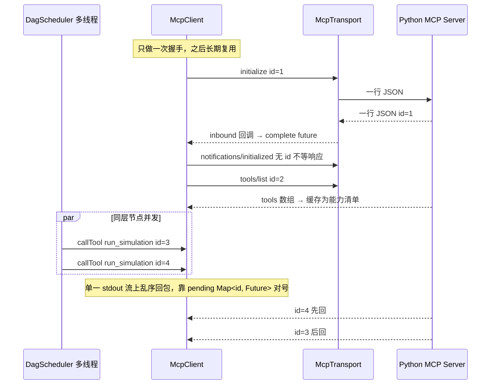

# ③ Module 2B · 原生 Java MCP Client（Stdio 子进程 / Streamable HTTP）

<aside>
🔌

设计要点：**传输与协议彻底分离**。`McpTransport` 只负责把一行 JSON 送出去 / 把每条入站报文回吐；`McpClient` 只负责 JSON-RPC 的 id 关联、握手、能力发现与错误分类。因此 stdio ↔ HTTP 切换只需换一个实现类，上层零改动。

</aside>

## 协议交互模型



<aside>
⚠️

**这里是自研 MCP Client 最容易出事的地方**：stdio 只有一条双向字节流，而 DAG 同层节点是多线程并发调用的。如果用「写一行→读一行」的同步写法，两个线程会互相抢对方的响应。**必须用独立 reader 线程 + `ConcurrentMap<id, CompletableFuture>` 做异步对号**，写入端加锁保证报文不交错。

</aside>

---

## 1. `mcp/McpTransport.java`

```java
package com.sim.agent.mcp;

import java.io.Closeable;
import java.util.function.Consumer;

/**
 * MCP 传输抽象：stdio 与 HTTP 共用同一套 JSON-RPC 语义。
 * 实现类只需保证：每条入站报文回吐一次 inbound.accept(json)。
 */
public interface McpTransport extends Closeable {

    /** 建立底层通道。inbound 可能在任意线程被回调，必须线程安全 */
    void start(Consumer<String> inbound) throws Exception;

    /** 发送一条已序列化的 JSON-RPC 报文（不含换行） */
    void send(String json) throws Exception;

    boolean isAlive();

    String describe();
}
```

## 2. `mcp/McpErrors.java`

错误分类直接决定了 DAG 引擎的重试行为，所以每个异常都携带 `retryable()` 语义。

```java
package com.sim.agent.mcp;

import java.util.LinkedHashMap;
import java.util.Map;

/** MCP 相关异常集合（集中一个文件，避免一堆 5 行的类文件） */
public final class McpErrors {

    private McpErrors() { }

    public static class McpException extends RuntimeException {
        private static final long serialVersionUID = 1L;
        public McpException(String msg) { super(msg); }
        public McpException(String msg, Throwable cause) { super(msg, cause); }
        /** 引擎的 RetryPolicy 会读它来决定要不要重试 */
        public boolean retryable() { return false; }
    }

    /** 传输层：子进程死了 / 连接被拒 / Socket 断开 —— 可重试 */
    public static class TransportError extends McpException {
        private static final long serialVersionUID = 1L;
        public TransportError(String msg) { super(msg); }
        public TransportError(String msg, Throwable c) { super(msg, c); }
        @Override public boolean retryable() { return true; }
    }

    /** JSON-RPC 协议级错误 */
    public static class RpcError extends McpException {
        private static final long serialVersionUID = 1L;
        public final int code;
        public final Object data;
        public RpcError(int code, String msg, Object data) {
            super("JSON-RPC error " + code + ": " + msg);
            this.code = code;
            this.data = data;
        }
        /** -32603 内部错误通常是瞬时故障；参数/方法类错误重试没意义 */
        @Override public boolean retryable() { return code == -32603; }
    }

    /** 工具业务错误（result.isError=true），是否可重试由服务端告知 */
    public static class ToolError extends McpException {
        private static final long serialVersionUID = 1L;
        public final String toolName;
        public final String errorCode;
        public final boolean canRetry;
        public final Map<String, Object> structured;
        public ToolError(String toolName, String errorCode, String msg,
                         boolean canRetry, Map<String, Object> structured) {
            super("tool[" + toolName + "] " + errorCode + ": " + msg);
            this.toolName = toolName;
            this.errorCode = errorCode;
            this.canRetry = canRetry;
            this.structured = (structured == null) ? new LinkedHashMap<String, Object>() : structured;
        }
        @Override public boolean retryable() { return canRetry; }
    }

    /** RPC 级超时（区别于“节点级超时”，后者在引擎层） */
    public static class RpcTimeout extends McpException {
        private static final long serialVersionUID = 1L;
        public RpcTimeout(String msg) { super(msg); }
        @Override public boolean retryable() { return true; }
    }
}
```

## 3. `mcp/StdioMcpTransport.java`

```java
package com.sim.agent.mcp;

import java.io.BufferedReader;
import java.io.BufferedWriter;
import java.io.File;
import java.io.IOException;
import java.io.InputStreamReader;
import java.io.OutputStreamWriter;
import java.nio.charset.Charset;
import java.util.ArrayList;
import java.util.List;
import java.util.Map;
import java.util.concurrent.TimeUnit;
import java.util.function.Consumer;

/**
 * stdio 传输：用 ProcessBuilder 拉起 Python MCP Server 子进程。
 * 约定：一行一条 JSON-RPC 报文；子进程 stderr 仅作日志转发，绝不参与协议。
 */
public class StdioMcpTransport implements McpTransport {

    private static final Charset UTF8 = Charset.forName("UTF-8");

    private final String key;
    private final List<String> command;
    private final File workDir;
    private final Map<String, String> extraEnv;

    private volatile Process process;
    private volatile BufferedWriter stdin;
    private volatile boolean closed;

    public StdioMcpTransport(String key, List<String> command, File workDir, Map<String, String> extraEnv) {
        this.key = key;
        this.command = new ArrayList<String>(command);
        this.workDir = workDir;
        this.extraEnv = extraEnv;
    }

    @Override
    public void start(final Consumer<String> inbound) throws IOException {
        ProcessBuilder pb = new ProcessBuilder(command);
        if (workDir != null) pb.directory(workDir);
        if (extraEnv != null && !extraEnv.isEmpty()) pb.environment().putAll(extraEnv);
        // 关键：强制 Python 不缓冲，否则报文可能卡在管道里，Java 一直等到超时
        pb.environment().put("PYTHONUNBUFFERED", "1");
        pb.environment().put("PYTHONIOENCODING", "utf-8");
        pb.redirectErrorStream(false);          // stderr 必须分开，否则日志会污染协议流

        process = pb.start();
        stdin = new BufferedWriter(new OutputStreamWriter(process.getOutputStream(), UTF8));

        final BufferedReader out = new BufferedReader(new InputStreamReader(process.getInputStream(), UTF8));
        Thread reader = new Thread(new Runnable() {
            @Override public void run() {
                try {
                    String line;
                    while ((line = out.readLine()) != null) {
                        String t = line.trim();
                        if (t.isEmpty()) continue;
                        char c0 = t.charAt(0);
                        if (c0 != '{' && c0 != '[') {      // 容错：Python 里误用 print() 的噪声
                            System.err.println("[mcp:" + key + "][stdout-noise] " + t);
                            continue;
                        }
                        try { inbound.accept(t); }
                        catch (Throwable th) { System.err.println("[mcp:" + key + "] inbound 异常: " + th); }
                    }
                } catch (IOException e) {
                    if (!closed) System.err.println("[mcp:" + key + "] stdout 中断: " + e.getMessage());
                }
            }
        }, "mcp-stdout-" + key);
        reader.setDaemon(true);
        reader.start();

        final BufferedReader err = new BufferedReader(new InputStreamReader(process.getErrorStream(), UTF8));
        Thread errPump = new Thread(new Runnable() {
            @Override public void run() {
                try {
                    String line;
                    while ((line = err.readLine()) != null) {
                        if (Boolean.parseBoolean(System.getProperty("mcp.verbose", "false"))) {
                            System.err.println("[mcp:" + key + "][py] " + line);
                        }
                    }
                } catch (IOException ignore) { }
            }
        }, "mcp-stderr-" + key);
        errPump.setDaemon(true);
        errPump.start();

        System.out.println("[mcp:" + key + "] 子进程已启动: " + describe());
    }

    /** 写入必须串行化：多个 DAG 节点线程共用一条 stdin */
    @Override
    public synchronized void send(String json) throws IOException {
        if (closed) throw new McpErrors.TransportError("传输已关闭: " + key);
        if (!isAlive()) throw new McpErrors.TransportError("MCP 子进程已退出: " + describe());
        stdin.write(json);
        stdin.write("\n");
        stdin.flush();
    }

    @Override
    public boolean isAlive() {
        Process p = process;
        return p != null && p.isAlive();
    }

    @Override
    public String describe() {
        return "stdio[" + String.join(" ", command) + "]";
    }

    @Override
    public void close() {
        closed = true;
        Process p = process;
        if (p == null) return;
        try {
            if (stdin != null) stdin.close();       // 先关 stdin，Python 侧 for-in stdin 会优雅退出
        } catch (IOException ignore) { }
        try {
            if (!p.waitFor(2, TimeUnit.SECONDS)) p.destroyForcibly();
        } catch (InterruptedException e) {
            Thread.currentThread().interrupt();
            p.destroyForcibly();
        }
        System.out.println("[mcp:" + key + "] 子进程已回收");
    }
}
```

## 4. `mcp/HttpMcpTransport.java`

```java
package com.sim.agent.mcp;

import java.io.BufferedReader;
import java.io.ByteArrayOutputStream;
import java.io.InputStream;
import java.io.InputStreamReader;
import java.io.OutputStream;
import java.net.HttpURLConnection;
import java.net.URL;
import java.nio.charset.Charset;
import java.util.function.Consumer;

/**
 * Streamable HTTP 传输（兼容 SSE 响应），只用 JDK 自带 HttpURLConnection。
 * 请求/响应在同一次 POST 内完成，因此 send() 会同步回吐 inbound。
 */
public class HttpMcpTransport implements McpTransport {

    private static final Charset UTF8 = Charset.forName("UTF-8");

    private final String key;
    private final String endpoint;
    private final int connectTimeoutMs;
    private final int readTimeoutMs;

    private volatile Consumer<String> inbound;
    private volatile String sessionId;
    private volatile boolean closed;

    public HttpMcpTransport(String key, String endpoint, int connectTimeoutMs, int readTimeoutMs) {
        this.key = key;
        this.endpoint = endpoint;
        this.connectTimeoutMs = connectTimeoutMs;
        this.readTimeoutMs = readTimeoutMs;
    }

    @Override
    public void start(Consumer<String> inbound) {
        this.inbound = inbound;
        System.out.println("[mcp:" + key + "] HTTP 传输就绪: " + endpoint);
    }

    @Override
    public void send(String json) throws Exception {
        if (closed) throw new McpErrors.TransportError("传输已关闭: " + endpoint);
        HttpURLConnection conn = (HttpURLConnection) new URL(endpoint).openConnection();
        try {
            conn.setRequestMethod("POST");
            conn.setDoOutput(true);
            conn.setUseCaches(false);
            conn.setConnectTimeout(connectTimeoutMs);
            conn.setReadTimeout(readTimeoutMs);
            conn.setRequestProperty("Content-Type", "application/json; charset=utf-8");
            conn.setRequestProperty("Accept", "application/json, text/event-stream");
            conn.setRequestProperty("MCP-Protocol-Version", McpClient.PROTOCOL_VERSION);
            if (sessionId != null) conn.setRequestProperty("Mcp-Session-Id", sessionId);

            byte[] body = json.getBytes(UTF8);
            conn.setFixedLengthStreamingMode(body.length);
            OutputStream os = conn.getOutputStream();
            os.write(body);
            os.flush();
            os.close();

            int code = conn.getResponseCode();
            String sid = conn.getHeaderField("Mcp-Session-Id");
            if (sid != null && !sid.isEmpty()) sessionId = sid;   // 会话保持

            if (code == 404 && sessionId != null) {
                sessionId = null;
                throw new McpErrors.TransportError("会话已失效(404)，需重新 initialize: " + endpoint);
            }

            InputStream is = (code >= 400) ? conn.getErrorStream() : conn.getInputStream();
            if (is == null) return;                              // 202 无体（纯通知）

            String ctype = String.valueOf(conn.getHeaderField("Content-Type"));
            if (ctype.contains("text/event-stream")) {
                readSse(is);
            } else {
                String text = readAll(is);
                if (code >= 400 && (text == null || text.trim().isEmpty())) {
                    throw new McpErrors.TransportError("HTTP " + code + " from " + endpoint);
                }
                if (text != null && !text.trim().isEmpty()) emit(text.trim());
            }
        } finally {
            conn.disconnect();
        }
    }

    /** 解析 SSE：累积 data: 行，遇空行交付一个事件 */
    private void readSse(InputStream is) throws Exception {
        BufferedReader r = new BufferedReader(new InputStreamReader(is, UTF8));
        StringBuilder data = new StringBuilder();
        String line;
        while ((line = r.readLine()) != null) {
            if (line.startsWith(":")) continue;                  // 心跳注释
            if (line.isEmpty()) {
                if (data.length() > 0) { emit(data.toString().trim()); data.setLength(0); }
                continue;
            }
            if (line.startsWith("data:")) data.append(line.substring(5).trim());
        }
        if (data.length() > 0) emit(data.toString().trim());
    }

    private static String readAll(InputStream is) throws Exception {
        ByteArrayOutputStream bos = new ByteArrayOutputStream();
        byte[] buf = new byte[4096];
        int n;
        while ((n = is.read(buf)) > 0) bos.write(buf, 0, n);
        is.close();
        return new String(bos.toByteArray(), UTF8);
    }

    private void emit(String json) {
        Consumer<String> c = inbound;
        if (c != null && json != null && !json.isEmpty()) c.accept(json);
    }

    @Override public boolean isAlive() { return !closed; }

    @Override public String describe() { return "http[" + endpoint + "]"; }

    @Override public void close() { closed = true; }
}
```

## 5. `mcp/McpToolInfo.java`

```java
package com.sim.agent.mcp;

import com.sim.agent.json.MiniJson;

import java.util.Map;

/** tools/list 返回的工具元信息，同时用作 Agent 的能力发现素材 */
public class McpToolInfo {

    public final String serverKey;
    public final String name;
    public final String title;
    public final String description;
    public final Map<String, Object> inputSchema;

    public McpToolInfo(String serverKey, Map<String, Object> raw) {
        this.serverKey = serverKey;
        this.name = MiniJson.getString(raw, "name", "");
        this.title = MiniJson.getString(raw, "title", this.name);
        this.description = MiniJson.getString(raw, "description", "");
        this.inputSchema = MiniJson.getMap(raw, "inputSchema");
    }

    /** 给 LLM 看的一行摘要 */
    public String brief() {
        StringBuilder sb = new StringBuilder();
        sb.append(serverKey).append('.').append(name).append(" - ");
        sb.append(description.length() > 150 ? description.substring(0, 150) + "..." : description);
        Object props = MiniJson.get(inputSchema, "properties");
        if (props instanceof Map) {
            sb.append(" | 参数: ");
            boolean first = true;
            for (Object k : ((Map<?, ?>) props).keySet()) {
                String p = String.valueOf(k);
                if (p.startsWith("_") || p.startsWith("mock_")) continue;   // 内部/测试参数不暴露给 LLM
                if (!first) sb.append(", ");
                first = false;
                sb.append(p);
            }
        }
        return sb.toString();
    }

    @Override public String toString() { return brief(); }
}
```

## 6. `mcp/McpClient.java`（核心）

```java
package com.sim.agent.mcp;

import com.sim.agent.json.MiniJson;

import java.io.Closeable;
import java.util.ArrayList;
import java.util.Iterator;
import java.util.List;
import java.util.Map;
import java.util.concurrent.CompletableFuture;
import java.util.concurrent.ConcurrentHashMap;
import java.util.concurrent.ConcurrentMap;
import java.util.concurrent.ExecutionException;
import java.util.concurrent.TimeUnit;
import java.util.concurrent.atomic.AtomicLong;
import java.util.function.Consumer;

/**
 * 原生 MCP 客户端：JSON-RPC 2.0 over 任意 McpTransport。
 * 线程安全：可被多个 DAG 节点线程并发调用。
 */
public class McpClient implements Closeable {

    public static final String PROTOCOL_VERSION = "2025-06-18";
    public static final String CLIENT_NAME = "nl2sim-java-mcp-client";

    private final String serverKey;
    private final McpTransport transport;
    private final long defaultTimeoutMs;

    private final AtomicLong seq = new AtomicLong(0L);
    private final ConcurrentMap<Long, CompletableFuture<Object>> pending =
            new ConcurrentHashMap<Long, CompletableFuture<Object>>();

    private final boolean verbose = Boolean.parseBoolean(System.getProperty("mcp.verbose", "false"));

    private volatile Map<String, Object> serverInfo = MiniJson.map();
    private volatile String negotiatedVersion = PROTOCOL_VERSION;
    private volatile List<McpToolInfo> tools = new ArrayList<McpToolInfo>();
    private volatile boolean initialized;

    public McpClient(String serverKey, McpTransport transport, long defaultTimeoutMs) {
        this.serverKey = serverKey;
        this.transport = transport;
        this.defaultTimeoutMs = defaultTimeoutMs <= 0 ? 20000L : defaultTimeoutMs;
    }

    /* ---------------- 生命周期 ---------------- */

    /** 握手：initialize -> notifications/initialized -> tools/list */
    public synchronized void initialize() {
        if (initialized) return;
        try {
            transport.start(new Consumer<String>() {
                @Override public void accept(String line) { onInbound(line); }
            });
        } catch (Exception e) {
            throw new McpErrors.TransportError("启动 MCP 传输失败: " + transport.describe(), e);
        }

        Map<String, Object> params = MiniJson.map(
                "protocolVersion", PROTOCOL_VERSION,
                "capabilities", MiniJson.map(
                        "tools", MiniJson.map(),
                        "roots", MiniJson.map("listChanged", Boolean.FALSE)),
                "clientInfo", MiniJson.map("name", CLIENT_NAME, "version", "1.0.0"));

        Object result = request("initialize", params, defaultTimeoutMs);
        this.negotiatedVersion = MiniJson.getString(result, "protocolVersion", PROTOCOL_VERSION);
        this.serverInfo = MiniJson.getMap(result, "serverInfo");

        // 协议要求：握手完成后必须发 initialized 通知（无 id，不等响应）
        sendNotification("notifications/initialized", null);
        this.initialized = true;
        this.tools = listTools();

        System.out.println("[mcp:" + serverKey + "] 握手完成 server="
                + MiniJson.getString(serverInfo, "name", "?") + " v"
                + MiniJson.getString(serverInfo, "version", "?")
                + " protocol=" + negotiatedVersion + " tools=" + tools.size());
    }

    public boolean isAlive() { return initialized && transport.isAlive(); }

    public String serverKey() { return serverKey; }

    public List<McpToolInfo> cachedTools() { return tools; }

    public boolean hasTool(String name) {
        for (McpToolInfo t : tools) if (t.name.equals(name)) return true;
        return false;
    }

    /* ---------------- 协议方法 ---------------- */

    /** tools/list，自动跟随 nextCursor 分页 */
    public List<McpToolInfo> listTools() {
        List<McpToolInfo> all = new ArrayList<McpToolInfo>();
        String cursor = null;
        int guard = 0;
        do {
            Map<String, Object> params = (cursor == null) ? MiniJson.map() : MiniJson.map("cursor", cursor);
            Object res = request("tools/list", params, defaultTimeoutMs);
            for (Object t : MiniJson.getList(res, "tools")) {
                all.add(new McpToolInfo(serverKey, MiniJson.asMap(t)));
            }
            cursor = MiniJson.getString(res, "nextCursor", null);
            guard++;
        } while (cursor != null && guard < 20);
        return all;
    }

    /**
     * tools/call。返回 structuredContent（没有则回退解析第一个 text content）。
     * isError=true 时抛 McpErrors.ToolError，并把服务端的 retryable 透传给引擎。
     */
    public Map<String, Object> callTool(String toolName, Map<String, Object> arguments, long timeoutMs) {
        Map<String, Object> params = MiniJson.map(
                "name", toolName,
                "arguments", (arguments == null) ? MiniJson.map() : arguments);
        Object res = request("tools/call", params, timeoutMs <= 0 ? defaultTimeoutMs : timeoutMs);

        Map<String, Object> structured = MiniJson.getMap(res, "structuredContent");
        String text = firstText(res);
        if (structured.isEmpty() && text != null && !text.isEmpty()) {
            try { structured = MiniJson.asMap(MiniJson.parseLoose(text)); }
            catch (RuntimeException ignore) { structured = MiniJson.map("text", text); }
        }
        if (MiniJson.getBoolean(res, "isError", false)) {
            throw new McpErrors.ToolError(toolName,
                    MiniJson.getString(structured, "error_code", "TOOL_ERROR"),
                    MiniJson.getString(structured, "error_message", text),
                    MiniJson.getBoolean(structured, "retryable", false),
                    structured);
        }
        return structured;
    }

    public Map<String, Object> callTool(String toolName, Map<String, Object> arguments) {
        return callTool(toolName, arguments, defaultTimeoutMs);
    }

    public void ping() { request("ping", MiniJson.map(), 5000L); }

    private static String firstText(Object res) {
        for (Object c : MiniJson.getList(res, "content")) {
            Map<String, Object> m = MiniJson.asMap(c);
            if ("text".equals(MiniJson.getString(m, "type", ""))) {
                return MiniJson.getString(m, "text", "");
            }
        }
        return "";
    }

    /* ---------------- JSON-RPC 底层 ---------------- */

    private Object request(String method, Map<String, Object> params, long timeoutMs) {
        long id = seq.incrementAndGet();
        Long key = Long.valueOf(id);
        CompletableFuture<Object> future = new CompletableFuture<Object>();
        pending.put(key, future);

        Map<String, Object> msg = MiniJson.map("jsonrpc", "2.0", "id", key, "method", method);
        if (params != null) msg.put("params", params);
        String payload = MiniJson.stringify(msg);

        try {
            if (verbose) System.out.println("[mcp:" + serverKey + "] --> " + payload);
            transport.send(payload);
            return future.get(timeoutMs, TimeUnit.MILLISECONDS);
        } catch (java.util.concurrent.TimeoutException te) {
            throw new McpErrors.RpcTimeout(serverKey + "." + method + " RPC 超时 " + timeoutMs + "ms");
        } catch (ExecutionException ee) {
            Throwable c = ee.getCause();
            if (c instanceof RuntimeException) throw (RuntimeException) c;
            throw new McpErrors.McpException(serverKey + "." + method + " 失败: " + c, c);
        } catch (InterruptedException ie) {
            Thread.currentThread().interrupt();
            throw new McpErrors.McpException(serverKey + "." + method + " 被中断", ie);
        } catch (McpErrors.McpException me) {
            throw me;
        } catch (Exception e) {
            throw new McpErrors.TransportError(serverKey + "." + method + " 发送失败", e);
        } finally {
            pending.remove(key);
        }
    }

    private void sendNotification(String method, Map<String, Object> params) {
        Map<String, Object> msg = MiniJson.map("jsonrpc", "2.0", "method", method);
        if (params != null) msg.put("params", params);
        try {
            String payload = MiniJson.stringify(msg);
            if (verbose) System.out.println("[mcp:" + serverKey + "] --> " + payload);
            transport.send(payload);
        } catch (Exception e) {
            throw new McpErrors.TransportError("发送通知失败: " + method, e);
        }
    }

    /** 传输层回吐入口：可能在 reader 线程，必须无锁快速返回 */
    private void onInbound(String line) {
        if (verbose) System.out.println("[mcp:" + serverKey + "] <-- " + line);
        Object parsed;
        try {
            parsed = MiniJson.parse(line);
        } catch (RuntimeException e) {
            System.err.println("[mcp:" + serverKey + "] 无法解析报文: " + line);
            return;
        }
        if (parsed instanceof List) {
            for (Object o : (List<?>) parsed) dispatch(MiniJson.asMap(o));
        } else {
            dispatch(MiniJson.asMap(parsed));
        }
    }

    private void dispatch(Map<String, Object> msg) {
        Object id = msg.get("id");
        if (id == null) {                                  // 服务端通知（进度/日志）
            String method = MiniJson.getString(msg, "method", "");
            if (!method.isEmpty() && verbose) {
                System.out.println("[mcp:" + serverKey + "] 通知 " + method
                        + " " + MiniJson.stringify(msg.get("params")));
            }
            return;
        }
        Long key = (id instanceof Number)
                ? Long.valueOf(((Number) id).longValue())
                : parseLongSafe(String.valueOf(id));
        if (key == null) return;
        CompletableFuture<Object> f = pending.remove(key);
        if (f == null) return;                             // 已超时被清理，丢弃迟到响应
        if (msg.containsKey("error")) {
            Map<String, Object> err = MiniJson.getMap(msg, "error");
            f.completeExceptionally(new McpErrors.RpcError(
                    (int) MiniJson.getLong(err, "code", -32000),
                    MiniJson.getString(err, "message", "unknown"),
                    err.get("data")));
        } else {
            f.complete(msg.get("result"));
        }
    }

    private static Long parseLongSafe(String s) {
        try { return Long.valueOf(Long.parseLong(s.trim())); }
        catch (NumberFormatException e) { return null; }
    }

    @Override
    public void close() {
        for (Iterator<Map.Entry<Long, CompletableFuture<Object>>> it = pending.entrySet().iterator(); it.hasNext(); ) {
            Map.Entry<Long, CompletableFuture<Object>> e = it.next();
            e.getValue().completeExceptionally(new McpErrors.TransportError("客户端已关闭: " + serverKey));
            it.remove();
        }
        try { transport.close(); } catch (Exception ignore) { }
        initialized = false;
    }
}
```

## 7. `mcp/McpServerRegistry.java`

仿真类型 → MCP Server 的**路由表 + 懒加载连接池 + 断线重建**。DAG 引擎与 Agent 都只依赖它。

```java
package com.sim.agent.mcp;

import java.io.Closeable;
import java.io.File;
import java.util.ArrayList;
import java.util.Arrays;
import java.util.LinkedHashMap;
import java.util.List;
import java.util.Map;
import java.util.Set;
import java.util.concurrent.ConcurrentHashMap;
import java.util.concurrent.ConcurrentMap;

public class McpServerRegistry implements Closeable {

    /** 一个 MCP Server 的接入配置（生产环境应从 DB / 配置中心加载） */
    public static class ServerSpec {
        public final String key;
        public String transport = "stdio";
        public List<String> command = new ArrayList<String>();
        public File workDir;
        public Map<String, String> env = new LinkedHashMap<String, String>();
        public String endpoint;
        public long rpcTimeoutMs = 20000L;

        public ServerSpec(String key) { this.key = key; }
        public ServerSpec stdio(String... cmd) {
            this.transport = "stdio";
            this.command = new ArrayList<String>(Arrays.asList(cmd));
            return this;
        }
        public ServerSpec http(String url) { this.transport = "http"; this.endpoint = url; return this; }
        public ServerSpec dir(File d) { this.workDir = d; return this; }
        public ServerSpec env(String k, String v) { this.env.put(k, v); return this; }
        public ServerSpec timeout(long ms) { this.rpcTimeoutMs = ms; return this; }
    }

    private final Map<String, ServerSpec> specs = new LinkedHashMap<String, ServerSpec>();
    private final ConcurrentMap<String, McpClient> clients = new ConcurrentHashMap<String, McpClient>();
    private final Object lock = new Object();

    public void register(ServerSpec spec) {
        specs.put(spec.key, spec);
        System.out.println("[boot] MCP 注册: " + spec.key + " -> "
                + ("http".equals(spec.transport) ? spec.endpoint : String.join(" ", spec.command)));
    }

    public Set<String> keys() { return specs.keySet(); }

    /** 懒加载 + 双检锁 + 进程死亡自动重建 */
    public McpClient client(String key) {
        McpClient c = clients.get(key);
        if (c != null && c.isAlive()) return c;
        synchronized (lock) {
            c = clients.get(key);
            if (c != null && c.isAlive()) return c;
            if (c != null) {
                System.err.println("[mcp:" + key + "] 连接已失效，重建中...");
                try { c.close(); } catch (RuntimeException ignore) { }
                clients.remove(key);
            }
            ServerSpec spec = specs.get(key);
            if (spec == null) throw new McpErrors.McpException("未注册的 MCP Server: " + key);
            McpTransport t = "http".equalsIgnoreCase(spec.transport)
                    ? new HttpMcpTransport(key, spec.endpoint, 5000, (int) spec.rpcTimeoutMs)
                    : new StdioMcpTransport(key, spec.command, spec.workDir, spec.env);
            McpClient fresh = new McpClient(key, t, spec.rpcTimeoutMs);
            try {
                fresh.initialize();
            } catch (RuntimeException e) {
                try { fresh.close(); } catch (RuntimeException ignore) { }
                throw new McpErrors.TransportError("MCP Server " + key + " 初始化失败: " + e.getMessage(), e);
            }
            clients.put(key, fresh);
            return fresh;
        }
    }

    /** 能力发现：汇总所有 Server 的 Tool，供 Agent 动态建模使用 */
    public List<McpToolInfo> allTools() {
        List<McpToolInfo> all = new ArrayList<McpToolInfo>();
        for (String k : specs.keySet()) {
            try {
                all.addAll(client(k).cachedTools());
            } catch (RuntimeException e) {
                System.err.println("[mcp] 能力发现跳过 " + k + ": " + e.getMessage());
            }
        }
        return all;
    }

    /**
     * 默认本地注册：coventor / slitho。
     * 可用 -Dmcp.<key>.transport=http -Dmcp.<key>.endpoint=... 切到 HTTP，代码零修改。
     */
    public static McpServerRegistry defaultLocal(String pythonExe, File projectDir) {
        McpServerRegistry reg = new McpServerRegistry();
        reg.register(build("coventor", pythonExe, "python/coventor_mcp_server.py", 9001, projectDir));
        reg.register(build("slitho", pythonExe, "python/slitho_mcp_server.py", 9002, projectDir));
        return reg;
    }

    private static ServerSpec build(String key, String python, String script, int defPort, File dir) {
        ServerSpec s = new ServerSpec(key);
        String transport = System.getProperty("mcp." + key + ".transport", "stdio");
        if ("http".equalsIgnoreCase(transport)) {
            s.http(System.getProperty("mcp." + key + ".endpoint",
                    "http://127.0.0.1:" + defPort + "/mcp"));
        } else {
            s.stdio(python, script).dir(dir);
        }
        s.timeout(Long.parseLong(System.getProperty("mcp." + key + ".timeoutMs", "20000")));
        return s;
    }

    @Override
    public void close() {
        for (McpClient c : clients.values()) {
            try { c.close(); } catch (RuntimeException ignore) { }
        }
        clients.clear();
    }
}
```

---

## 8. 真实报文报文流（`-Dmcp.verbose=true` 可直接看到）

```
[mcp:coventor] --> {"jsonrpc":"2.0","id":1,"method":"initialize","params":{"protocolVersion":"2025-06-18","capabilities":{"tools":{},"roots":{"listChanged":false}},"clientInfo":{"name":"nl2sim-java-mcp-client","version":"1.0.0"}}}
[mcp:coventor] <-- {"jsonrpc": "2.0", "id": 1, "result": {"protocolVersion": "2025-06-18", "capabilities": {...}, "serverInfo": {"name": "coventor-sim", "version": "1.0.0"}}}
[mcp:coventor] --> {"jsonrpc":"2.0","method":"notifications/initialized"}
[mcp:coventor] --> {"jsonrpc":"2.0","id":2,"method":"tools/list"}
[mcp:coventor] <-- {"jsonrpc": "2.0", "id": 2, "result": {"tools": [ ... 4 个 ... ]}}
[mcp:coventor] 握手完成 server=coventor-sim v1.0.0 protocol=2025-06-18 tools=4
[mcp:coventor] --> {"jsonrpc":"2.0","id":3,"method":"tools/call","params":{"name":"coventor_run_simulation","arguments":{"structure":"mems_cantilever","mesh_size_um":0.5,"_meta":{"workflow_instance_id":"wi-7c1f0a","node_key":"cov_mesh","attempt":1,"idempotency_key":"wi-7c1f0a:cov_mesh:1"}}}}
[mcp:coventor] <-- {"jsonrpc": "2.0", "id": 3, "result": {"content":[{"type":"text","text":"..."}],"structuredContent":{"ok":true,"job_id":"cov-3b91f2d0aa41","status":"RUNNING","eta_ms":2200},"isError":false}}
```

## 9. 工程细节清单（都是踩过的坑）

| 细节 | 处理方式 |
| --- | --- |
| 并发对号 | `ConcurrentMap<Long, CompletableFuture>`，`id` 统一归一化为 `Long` |
| 超时后的迟到响应 | `pending.remove` 后为 null 则丢弃，不会错配给下一个请求 |
| 子进程噪声 | 非 `{`/`[` 开头的 stdout 行归类为 `stdout-noise` 日志，不报错 |
| 子进程死亡 | `isAlive()` 失败 → Registry 下次取用时自动重建，重新握手 |
| 写入竞争 | `send` 方法 `synchronized`，保证一行 JSON 不被抦截 |
| 优雅退出 | 先关 stdin（Python `for line in sys.stdin` 自然结束），2s 后才 `destroyForcibly` |
| HTTP 会话 | 自动捕获与回带 `Mcp-Session-Id`，404 时清会话并报可重试错误 |
| 两层超时 | 此处是 **RPC 级**（单次 tools/call）；**节点级**超时在 Module 3B 的轮询循环里 |