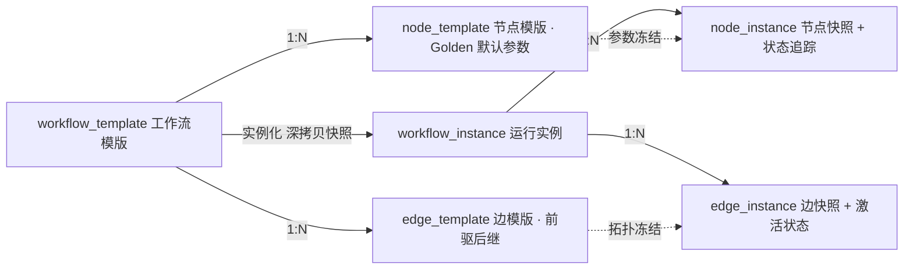

# ④ Module 3A · 领域模型 6 表映射 + 拓扑排序 + 参数透传

<aside>
🧮

这一页是引擎的「静态部分」：6 张表对应的领域模型、模版→实例的快照工厂、仓储层、入度拓扑排序与参数透传表达式引擎。下一页（Module 3B）才是并发调度。
下面代码块内用 `// ===== file: xxx.java =====` 分隔多个文件，拷出时按标记拆开即可。

</aside>

## 1. 模型与 6 张表的对应关系



<aside>
🔒

**为何必须深拷贝而不是存 template_id 引用？** 仿真作业可能跑好几小时，期间 Agent 可能已经把模版改了 3 版。如果实例只存引用，重试/续跑/复盘时拿到的就是新参数 —— **仿真结果将不可复现，这在工业场景是事故级缺陷**。因此 `node_instance.resolved_params` 必须是自包含的快照。

</aside>

---

## 2. 领域模型

```java
// ===== file: src/main/java/com/sim/agent/domain/WorkflowStatus.java =====
package com.sim.agent.domain;

public enum WorkflowStatus {
    DRAFT,              // Agent 刚生成的模版草稿
    PENDING_CONFIRM,    // 等待人工确认
    READY,              // 已实例化，待调度
    RUNNING,
    PAUSED,
    SUCCEEDED,
    PARTIAL_SUCCEEDED,  // 非关键节点失败，整体仍可交付
    FAILED,
    CANCELLED;

    public boolean terminal() {
        return this == SUCCEEDED || this == PARTIAL_SUCCEEDED || this == FAILED || this == CANCELLED;
    }
}

// ===== file: src/main/java/com/sim/agent/domain/NodeStatus.java =====
package com.sim.agent.domain;

public enum NodeStatus {
    PENDING,     // 初始
    READY,       // 前驱全部就绪
    RUNNING,     // 已提交到 MCP
    RETRYING,    // 失败后等待退避
    SUCCEEDED,
    FAILED,
    TIMEOUT,
    SKIPPED,     // 前驱失败或条件不满足
    CANCELLED;

    public boolean terminal() {
        return this == SUCCEEDED || this == FAILED || this == TIMEOUT
                || this == SKIPPED || this == CANCELLED;
    }
    public boolean success() { return this == SUCCEEDED; }
}

// ===== file: src/main/java/com/sim/agent/domain/NodeTemplate.java =====
package com.sim.agent.domain;

import com.sim.agent.json.MiniJson;

import java.util.LinkedHashMap;
import java.util.Map;

/** node_template：绑定仿真类型 + Golden 默认参数 */
public class NodeTemplate {
    public String id;
    public String templateId;
    public String nodeKey;                // DAG 内唯一标识，如 cov_mesh
    public String name;
    public String simulationType;         // COVENTOR / S_LITHO
    public String mcpServerKey;           // 路由到哪个 MCP Server
    public String runTool;
    public String statusTool;
    public String resultTool;
    public String cancelTool;

    /** Golden Template：默认参数 */
    public Map<String, Object> defaultParams = new LinkedHashMap<String, Object>();
    /** 参数映射：值可写 ${nodes.cov_mesh.outputs.mesh_file} 等表达式 */
    public Map<String, Object> paramMapping = new LinkedHashMap<String, Object>();

    public int retryLimit = 3;
    public long timeoutMs = 600000L;      // 节点级超时
    public long pollIntervalMs = 400L;
    public boolean critical = true;       // false = 失败不阻断整体
    public int orderNo;

    public NodeTemplate() { }

    public NodeTemplate(String nodeKey, String name, String simulationType, String mcpServerKey, String toolPrefix) {
        this.nodeKey = nodeKey;
        this.name = name;
        this.simulationType = simulationType;
        this.mcpServerKey = mcpServerKey;
        this.runTool = toolPrefix + "_run_simulation";
        this.statusTool = toolPrefix + "_get_status";
        this.resultTool = toolPrefix + "_get_result";
        this.cancelTool = toolPrefix + "_cancel";
    }

    public NodeTemplate param(String k, Object v) { defaultParams.put(k, v); return this; }
    public NodeTemplate mapping(String k, String expr) { paramMapping.put(k, expr); return this; }
    public NodeTemplate retry(int n) { this.retryLimit = n; return this; }
    public NodeTemplate timeout(long ms) { this.timeoutMs = ms; return this; }
    public NodeTemplate poll(long ms) { this.pollIntervalMs = ms; return this; }
    public NodeTemplate critical(boolean c) { this.critical = c; return this; }

    public Map<String, Object> toMap() {
        return MiniJson.map("node_key", nodeKey, "name", name, "simulation_type", simulationType,
                "mcp_server_key", mcpServerKey, "run_tool", runTool,
                "default_params", defaultParams, "param_mapping", paramMapping,
                "retry_limit", Integer.valueOf(retryLimit), "timeout_ms", Long.valueOf(timeoutMs),
                "critical", Boolean.valueOf(critical));
    }
}

// ===== file: src/main/java/com/sim/agent/domain/EdgeTemplate.java =====
package com.sim.agent.domain;

import com.sim.agent.json.MiniJson;

import java.util.LinkedHashMap;
import java.util.Map;

/** edge_template：存前驱/后继关系与边上的数据映射 */
public class EdgeTemplate {
    public String id;
    public String templateId;
    public String edgeKey;
    public String fromNodeKey;
    public String toNodeKey;
    /** 条件表达式，空 = 无条件。支持 ${nodes.x.outputs.y} > 0.9 这类简单比较 */
    public String conditionExpr;
    /** 边上的数据映射：目标参数名 -> 源表达式 */
    public Map<String, Object> dataMapping = new LinkedHashMap<String, Object>();

    public EdgeTemplate() { }

    public EdgeTemplate(String from, String to) {
        this.fromNodeKey = from;
        this.toNodeKey = to;
        this.edgeKey = from + "->" + to;
    }

    public EdgeTemplate map(String targetParam, String expr) { dataMapping.put(targetParam, expr); return this; }
    public EdgeTemplate when(String expr) { this.conditionExpr = expr; return this; }

    public Map<String, Object> toMap() {
        return MiniJson.map("edge_key", edgeKey, "from", fromNodeKey, "to", toNodeKey,
                "condition", conditionExpr, "data_mapping", dataMapping);
    }
}

// ===== file: src/main/java/com/sim/agent/domain/WorkflowTemplate.java =====
package com.sim.agent.domain;

import com.sim.agent.json.MiniJson;

import java.util.ArrayList;
import java.util.HashMap;
import java.util.LinkedHashSet;
import java.util.List;
import java.util.Map;
import java.util.Set;

/** workflow_template */
public class WorkflowTemplate {
    public String id;
    public String templateKey;            // 业务唯一键
    public String name;
    public String description;
    public int version = 1;
    public String domainTag = "SEMICONDUCTOR";
    public String source = "HUMAN";       // HUMAN / AGENT
    public WorkflowStatus status = WorkflowStatus.READY;
    public String createdBy = "system";
    public long createdAt = System.currentTimeMillis();
    public List<String> tags = new ArrayList<String>();
    public List<NodeTemplate> nodes = new ArrayList<NodeTemplate>();
    public List<EdgeTemplate> edges = new ArrayList<EdgeTemplate>();

    public NodeTemplate node(String nodeKey) {
        for (NodeTemplate n : nodes) if (n.nodeKey.equals(nodeKey)) return n;
        return null;
    }

    public WorkflowTemplate addNode(NodeTemplate n) {
        n.orderNo = nodes.size();
        nodes.add(n);
        return this;
    }

    public WorkflowTemplate addEdge(EdgeTemplate e) { edges.add(e); return this; }

    public Set<String> simulationTypes() {
        Set<String> s = new LinkedHashSet<String>();
        for (NodeTemplate n : nodes) s.add(n.simulationType);
        return s;
    }

    /** 最大扇出度 = 最大并行分支数（模版召回的关键结构特征） */
    public int maxParallelBranch() {
        Map<String, Integer> fanOut = new HashMap<String, Integer>();
        for (EdgeTemplate e : edges) {
            Integer c = fanOut.get(e.fromNodeKey);
            fanOut.put(e.fromNodeKey, Integer.valueOf(c == null ? 1 : c.intValue() + 1));
        }
        int max = 1;
        for (Integer v : fanOut.values()) max = Math.max(max, v.intValue());
        return max;
    }

    /** 给 LLM 阅读的紧凑结构 */
    public Map<String, Object> toLlmMap() {
        List<Object> ns = new ArrayList<Object>();
        for (NodeTemplate n : nodes) ns.add(n.toMap());
        List<Object> es = new ArrayList<Object>();
        for (EdgeTemplate e : edges) es.add(e.toMap());
        return MiniJson.map("template_key", templateKey, "name", name, "description", description,
                "version", Integer.valueOf(version), "tags", tags,
                "simulation_types", new ArrayList<String>(simulationTypes()),
                "max_parallel_branch", Integer.valueOf(maxParallelBranch()),
                "nodes", ns, "edges", es);
    }

    public String brief() {
        return templateKey + " v" + version + " [" + name + "] nodes=" + nodes.size()
                + " edges=" + edges.size() + " 并行分支=" + maxParallelBranch();
    }
}

// ===== file: src/main/java/com/sim/agent/domain/NodeInstance.java =====
package com.sim.agent.domain;

import com.sim.agent.json.MiniJson;

import java.util.ArrayList;
import java.util.Collections;
import java.util.LinkedHashMap;
import java.util.List;
import java.util.Map;

/** node_instance：参数快照 + 运行时状态追踪 */
public class NodeInstance {
    public String id;
    public String workflowInstanceId;
    public String nodeTemplateId;
    public String nodeKey;
    public String name;
    public String simulationType;
    public String mcpServerKey;
    public String runTool;
    public String statusTool;
    public String resultTool;
    public String cancelTool;

    /** 实例化时的参数快照（含未解析的 ${...} 表达式） */
    public Map<String, Object> paramSnapshot = new LinkedHashMap<String, Object>();
    /** 运行前真正送给 MCP 的参数（表达式已解析） */
    public Map<String, Object> resolvedParams = new LinkedHashMap<String, Object>();
    /** 仿真产物 */
    public Map<String, Object> outputs = new LinkedHashMap<String, Object>();

    public volatile NodeStatus status = NodeStatus.PENDING;
    public volatile int attempt = 0;
    public int maxAttempts = 3;
    public long timeoutMs = 600000L;
    public long pollIntervalMs = 400L;
    public boolean critical = true;

    public volatile String remoteJobId;
    public volatile double progress = 0.0;
    public volatile String stage;
    public volatile Long startedAt;
    public volatile Long finishedAt;
    public volatile String errorCode;
    public volatile String errorMessage;
    public final List<String> logs = Collections.synchronizedList(new ArrayList<String>());

    /** 幂等键：同一实例 + 节点 + 尝试次数唯一，供 MCP Server 做去重/缓存 */
    public String idempotencyKey() {
        return workflowInstanceId + ":" + nodeKey + ":" + attempt;
    }

    public long costMs() {
        if (startedAt == null) return 0L;
        long end = (finishedAt == null) ? System.currentTimeMillis() : finishedAt.longValue();
        return end - startedAt.longValue();
    }

    public void log(String msg) {
        logs.add(System.currentTimeMillis() + " " + msg);
    }

    public Map<String, Object> toMap() {
        return MiniJson.map("node_key", nodeKey, "name", name, "simulation_type", simulationType,
                "status", status.name(), "attempt", Integer.valueOf(attempt),
                "progress", Double.valueOf(progress), "stage", stage,
                "remote_job_id", remoteJobId, "cost_ms", Long.valueOf(costMs()),
                "resolved_params", resolvedParams, "outputs", outputs,
                "error_code", errorCode, "error_message", errorMessage);
    }
}

// ===== file: src/main/java/com/sim/agent/domain/EdgeInstance.java =====
package com.sim.agent.domain;

import com.sim.agent.json.MiniJson;

import java.util.LinkedHashMap;
import java.util.Map;

/** edge_instance */
public class EdgeInstance {
    public String id;
    public String workflowInstanceId;
    public String edgeTemplateId;
    public String edgeKey;
    public String fromNodeKey;
    public String toNodeKey;
    public String conditionExpr;
    public Map<String, Object> dataMapping = new LinkedHashMap<String, Object>();
    /** ACTIVE / SKIPPED：条件不满足时置 SKIPPED */
    public volatile String status = "ACTIVE";

    public Map<String, Object> toMap() {
        return MiniJson.map("edge_key", edgeKey, "from", fromNodeKey, "to", toNodeKey,
                "status", status, "condition", conditionExpr, "data_mapping", dataMapping);
    }
}

// ===== file: src/main/java/com/sim/agent/domain/WorkflowInstance.java =====
package com.sim.agent.domain;

import com.sim.agent.json.MiniJson;

import java.util.ArrayList;
import java.util.LinkedHashMap;
import java.util.List;
import java.util.Map;

/** workflow_instance */
public class WorkflowInstance {
    public String id;
    public String templateId;
    public String templateKey;
    public int templateVersion;
    public String name;
    public String traceId;
    public String createdBy = "system";
    public String agentSessionId;

    public volatile WorkflowStatus status = WorkflowStatus.READY;
    public Map<String, Object> inputs = new LinkedHashMap<String, Object>();
    public Map<String, Object> context = new LinkedHashMap<String, Object>();
    public List<NodeInstance> nodes = new ArrayList<NodeInstance>();
    public List<EdgeInstance> edges = new ArrayList<EdgeInstance>();

    public volatile Long startedAt;
    public volatile Long finishedAt;
    public volatile String errorMessage;
    public volatile int version = 0;      // 乐观锁

    /** 失败策略：true = 快速失败（取消未开始节点）；false = 尽力跑完 */
    public boolean failFast = true;
    /** 工作流级全局超时 */
    public long globalTimeoutMs = 3600000L;

    public NodeInstance node(String nodeKey) {
        for (NodeInstance n : nodes) if (n.nodeKey.equals(nodeKey)) return n;
        return null;
    }

    public long costMs() {
        if (startedAt == null) return 0L;
        long end = (finishedAt == null) ? System.currentTimeMillis() : finishedAt.longValue();
        return end - startedAt.longValue();
    }

    public Map<String, Object> toMap() {
        List<Object> ns = new ArrayList<Object>();
        for (NodeInstance n : nodes) ns.add(n.toMap());
        List<Object> es = new ArrayList<Object>();
        for (EdgeInstance e : edges) es.add(e.toMap());
        return MiniJson.map("instance_id", id, "template_key", templateKey, "name", name,
                "status", status.name(), "cost_ms", Long.valueOf(costMs()),
                "inputs", inputs, "nodes", ns, "edges", es, "error_message", errorMessage);
    }
}
```

---

## 3. 模版 → 实例快照工厂

```java
// ===== file: src/main/java/com/sim/agent/domain/InstanceFactory.java =====
package com.sim.agent.domain;

import com.sim.agent.json.MiniJson;

import java.util.LinkedHashMap;
import java.util.Map;
import java.util.UUID;

/** 模版实例化：**深拷贝**参数与拓扑，保证运行中的实例不受模版变更影响 */
public final class InstanceFactory {

    private InstanceFactory() { }

    private static String uid(String prefix) {
        return prefix + UUID.randomUUID().toString().replace("-", "").substring(0, 12);
    }

    /**
     * 根据模版创建一个全新实例。
     * 参数优先级（从低到高）：Golden 默认值 < 节点映射表达式 < 边上数据映射 < 本次节点覆盖
     */
    public static WorkflowInstance instantiate(WorkflowTemplate tpl,
                                               Map<String, Object> inputs,
                                               Map<String, Map<String, Object>> nodeOverrides) {
        if (tpl == null) throw new IllegalArgumentException("模版不能为空");

        // 先归集边上的数据映射：目标节点 -> {参数名: 表达式}
        Map<String, Map<String, Object>> edgeParams = new LinkedHashMap<String, Map<String, Object>>();
        for (EdgeTemplate et : tpl.edges) {
            Map<String, Object> m = edgeParams.get(et.toNodeKey);
            if (m == null) {
                m = new LinkedHashMap<String, Object>();
                edgeParams.put(et.toNodeKey, m);
            }
            m.putAll(MiniJson.deepCopyMap(et.dataMapping));
        }

        WorkflowInstance wi = new WorkflowInstance();
        wi.id = uid("wi-");
        wi.templateId = tpl.id;
        wi.templateKey = tpl.templateKey;
        wi.templateVersion = tpl.version;
        wi.name = tpl.name;
        wi.traceId = uid("tr-");
        wi.status = WorkflowStatus.READY;
        if (inputs != null) wi.inputs.putAll(MiniJson.deepCopyMap(inputs));

        for (NodeTemplate nt : tpl.nodes) {
            NodeInstance ni = new NodeInstance();
            ni.id = uid("ni-");
            ni.workflowInstanceId = wi.id;
            ni.nodeTemplateId = nt.id;
            ni.nodeKey = nt.nodeKey;
            ni.name = nt.name;
            ni.simulationType = nt.simulationType;
            ni.mcpServerKey = nt.mcpServerKey;
            ni.runTool = nt.runTool;
            ni.statusTool = nt.statusTool;
            ni.resultTool = nt.resultTool;
            ni.cancelTool = nt.cancelTool;
            ni.maxAttempts = Math.max(1, nt.retryLimit);
            ni.timeoutMs = nt.timeoutMs;
            ni.pollIntervalMs = nt.pollIntervalMs;
            ni.critical = nt.critical;

            ni.paramSnapshot.putAll(MiniJson.deepCopyMap(nt.defaultParams));      // 1) Golden 默认值
            ni.paramSnapshot.putAll(MiniJson.deepCopyMap(nt.paramMapping));       // 2) 节点映射表达式
            Map<String, Object> fromEdge = edgeParams.get(nt.nodeKey);
            if (fromEdge != null) ni.paramSnapshot.putAll(fromEdge);              // 3) 边上数据映射
            if (nodeOverrides != null && nodeOverrides.get(nt.nodeKey) != null) { // 4) 本次覆盖
                ni.paramSnapshot.putAll(MiniJson.deepCopyMap(nodeOverrides.get(nt.nodeKey)));
            }
            wi.nodes.add(ni);
        }

        for (EdgeTemplate et : tpl.edges) {
            EdgeInstance ei = new EdgeInstance();
            ei.id = uid("ei-");
            ei.workflowInstanceId = wi.id;
            ei.edgeTemplateId = et.id;
            ei.edgeKey = (et.edgeKey != null) ? et.edgeKey : (et.fromNodeKey + "->" + et.toNodeKey);
            ei.fromNodeKey = et.fromNodeKey;
            ei.toNodeKey = et.toNodeKey;
            ei.conditionExpr = et.conditionExpr;
            ei.dataMapping = MiniJson.deepCopyMap(et.dataMapping);
            ei.status = "ACTIVE";
            wi.edges.add(ei);
        }
        return wi;
    }

    public static WorkflowInstance instantiate(WorkflowTemplate tpl, Map<String, Object> inputs) {
        return instantiate(tpl, inputs, null);
    }
}
```

---

## 4. 仓储层（接口 + 内存实现）

内存实现让原型零配置跑起来；附录 A 提供同接口的 `JdbcWorkflowRepository`，切换只需换一行构造。

```java
// ===== file: src/main/java/com/sim/agent/repo/WorkflowRepository.java =====
package com.sim.agent.repo;

import com.sim.agent.domain.NodeInstance;
import com.sim.agent.domain.WorkflowInstance;
import com.sim.agent.domain.WorkflowTemplate;

import java.util.List;

public interface WorkflowRepository {

    /** 模版召回结果 */
    class TemplateMatch {
        public final WorkflowTemplate template;
        public final double score;
        public final String reason;
        public TemplateMatch(WorkflowTemplate template, double score, String reason) {
            this.template = template;
            this.score = score;
            this.reason = reason;
        }
    }

    /* ---- 模版体系 ---- */
    void saveTemplate(WorkflowTemplate t);
    WorkflowTemplate findTemplateByKey(String templateKey);
    List<WorkflowTemplate> listTemplates();
    /**
     * 模版召回。simulationTypes 与 parallelBranchHint 是硬门槛（结构不一致不能复用），
     * keyword 只做软加分。
     */
    List<TemplateMatch> searchTemplates(String keyword, List<String> simulationTypes,
                                        Integer parallelBranchHint, int limit);

    /* ---- 实例体系 ---- */
    void saveInstance(WorkflowInstance wi);
    WorkflowInstance findInstance(String instanceId);
    List<WorkflowInstance> listInstances(int limit);
    /** 工作流状态落库（带乐观锁版本推进） */
    void touchInstance(WorkflowInstance wi);
    /** 单节点状态落库，高频调用 */
    void touchNode(NodeInstance node);
}

// ===== file: src/main/java/com/sim/agent/repo/InMemoryWorkflowRepository.java =====
package com.sim.agent.repo;

import com.sim.agent.domain.NodeInstance;
import com.sim.agent.domain.WorkflowInstance;
import com.sim.agent.domain.WorkflowStatus;
import com.sim.agent.domain.WorkflowTemplate;

import java.util.ArrayList;
import java.util.Collections;
import java.util.Comparator;
import java.util.LinkedHashSet;
import java.util.List;
import java.util.Locale;
import java.util.Set;
import java.util.UUID;
import java.util.concurrent.ConcurrentHashMap;
import java.util.concurrent.ConcurrentMap;

public class InMemoryWorkflowRepository implements WorkflowRepository {

    private final ConcurrentMap<String, WorkflowTemplate> templates =
            new ConcurrentHashMap<String, WorkflowTemplate>();
    private final ConcurrentMap<String, WorkflowInstance> instances =
            new ConcurrentHashMap<String, WorkflowInstance>();
    private final List<String> instanceOrder = Collections.synchronizedList(new ArrayList<String>());

    /** 仿真类型归一化：s-litho / slitho / S_Litho 全部归为 S_LITHO */
    public static String normalizeSimType(String s) {
        if (s == null) return "";
        String x = s.trim().toUpperCase(Locale.ROOT).replace('-', '_').replace(' ', '_');
        if (x.equals("SLITHO") || x.equals("S_LITHO") || x.equals("LITHO")) return "S_LITHO";
        if (x.startsWith("COVENTOR")) return "COVENTOR";
        return x;
    }

    @Override
    public void saveTemplate(WorkflowTemplate t) {
        if (t.id == null) t.id = "wt-" + UUID.randomUUID().toString().replace("-", "").substring(0, 12);
        WorkflowTemplate old = templates.get(t.templateKey);
        if (old != null && old.version >= t.version) t.version = old.version + 1;
        for (int i = 0; i < t.nodes.size(); i++) {
            if (t.nodes.get(i).id == null) t.nodes.get(i).id = t.id + "-n" + i;
            t.nodes.get(i).templateId = t.id;
        }
        for (int i = 0; i < t.edges.size(); i++) {
            if (t.edges.get(i).id == null) t.edges.get(i).id = t.id + "-e" + i;
            t.edges.get(i).templateId = t.id;
        }
        templates.put(t.templateKey, t);
        System.out.println("[repo] 保存模版 " + t.brief());
    }

    @Override
    public WorkflowTemplate findTemplateByKey(String templateKey) {
        return (templateKey == null) ? null : templates.get(templateKey);
    }

    @Override
    public List<WorkflowTemplate> listTemplates() {
        return new ArrayList<WorkflowTemplate>(templates.values());
    }

    @Override
    public List<TemplateMatch> searchTemplates(String keyword, List<String> simulationTypes,
                                              Integer parallelBranchHint, int limit) {
        List<TemplateMatch> out = new ArrayList<TemplateMatch>();
        String kw = (keyword == null) ? "" : keyword.toLowerCase(Locale.ROOT);

        Set<String> want = new LinkedHashSet<String>();
        if (simulationTypes != null) {
            for (String s : simulationTypes) {
                String n = normalizeSimType(s);
                if (!n.isEmpty()) want.add(n);
            }
        }

        for (WorkflowTemplate t : templates.values()) {
            if (t.status == WorkflowStatus.DRAFT || t.status == WorkflowStatus.PENDING_CONFIRM) continue;

            double score = 0.0;
            StringBuilder reason = new StringBuilder();

            // 硬门槛 1：要求的仿真类型必须全部覆盖
            if (!want.isEmpty()) {
                Set<String> have = new LinkedHashSet<String>();
                for (String s : t.simulationTypes()) have.add(normalizeSimType(s));
                if (!have.containsAll(want)) continue;
                score += 0.5;
                reason.append("仿真类型全覆盖").append(want).append("; ");
            }

            // 硬门槛 2：并行分支数必须一致（拓扑结构不同就不能直接复用）
            if (parallelBranchHint != null && parallelBranchHint.intValue() > 0) {
                if (t.maxParallelBranch() != parallelBranchHint.intValue()) continue;
                score += 0.2;
                reason.append("并行分支数=").append(parallelBranchHint).append(" 匹配; ");
            }

            // 软加分：关键词命中名称/描述/标签
            if (!kw.isEmpty()) {
                StringBuilder hay = new StringBuilder();
                hay.append(t.templateKey).append(' ').append(t.name).append(' ')
                   .append(t.description == null ? "" : t.description);
                for (String tag : t.tags) hay.append(' ').append(tag);
                String h = hay.toString().toLowerCase(Locale.ROOT);
                int hit = 0, total = 0;
                for (String token : kw.split("[\\s,、/，]+")) {
                    if (token.length() < 2) continue;
                    total++;
                    if (h.contains(token)) hit++;
                }
                if (total > 0) {
                    double r = (double) hit / (double) total;
                    score += 0.3 * r;
                    reason.append("关键词命中 ").append(hit).append('/').append(total).append("; ");
                }
            }

            if (score <= 0.0) continue;
            out.add(new TemplateMatch(t, score, reason.toString()));
        }

        Collections.sort(out, new Comparator<TemplateMatch>() {
            @Override public int compare(TemplateMatch a, TemplateMatch b) {
                return Double.compare(b.score, a.score);
            }
        });
        return (out.size() > limit) ? new ArrayList<TemplateMatch>(out.subList(0, limit)) : out;
    }

    @Override
    public void saveInstance(WorkflowInstance wi) {
        instances.put(wi.id, wi);
        instanceOrder.add(wi.id);
        System.out.println("[repo] 创建实例 " + wi.id + " <- 模版 " + wi.templateKey
                + " v" + wi.templateVersion + " 节点数=" + wi.nodes.size());
    }

    @Override
    public WorkflowInstance findInstance(String instanceId) {
        return (instanceId == null) ? null : instances.get(instanceId);
    }

    @Override
    public List<WorkflowInstance> listInstances(int limit) {
        List<WorkflowInstance> out = new ArrayList<WorkflowInstance>();
        synchronized (instanceOrder) {
            for (int i = instanceOrder.size() - 1; i >= 0 && out.size() < limit; i--) {
                WorkflowInstance wi = instances.get(instanceOrder.get(i));
                if (wi != null) out.add(wi);
            }
        }
        return out;
    }

    @Override
    public void touchInstance(WorkflowInstance wi) {
        wi.version++;                 // 内存版本只做计数，JDBC 实现里是真乐观锁
    }

    @Override
    public void touchNode(NodeInstance node) {
        // 内存实现无需做任何事：对象引用就是存储
    }
}
```

---

## 5. 入度计算 + 拓扑排序 + 分层 + 环检测

```java
// ===== file: src/main/java/com/sim/agent/engine/TopologySorter.java =====
package com.sim.agent.engine;

import com.sim.agent.domain.EdgeInstance;
import com.sim.agent.domain.EdgeTemplate;
import com.sim.agent.domain.NodeInstance;
import com.sim.agent.domain.NodeTemplate;

import java.util.ArrayList;
import java.util.Collections;
import java.util.HashSet;
import java.util.LinkedHashMap;
import java.util.LinkedHashSet;
import java.util.List;
import java.util.Map;
import java.util.Set;

/**
 * 入度计算 + Kahn 拓扑排序 + BFS 分层 + 环检测（报出具体环路径）。
 * 全程使用 LinkedHashMap/LinkedHashSet，保证同一输入输出顺序确定（可复现）。
 */
public final class TopologySorter {

    private TopologySorter() { }

    public static class Result {
        /** 拓扑序（执行顺序） */
        public final List<String> order = new ArrayList<String>();
        /** 分层：同一层内的节点可以完全并行 */
        public final List<List<String>> layers = new ArrayList<List<String>>();
        public final Map<String, List<String>> predecessors = new LinkedHashMap<String, List<String>>();
        public final Map<String, List<String>> successors = new LinkedHashMap<String, List<String>>();
        public final Map<String, Integer> inDegree = new LinkedHashMap<String, Integer>();

        public int maxWidth() {
            int w = 0;
            for (List<String> l : layers) w = Math.max(w, l.size());
            return w;
        }

        public String describe() {
            StringBuilder sb = new StringBuilder();
            for (int i = 0; i < layers.size(); i++) {
                if (i > 0) sb.append("  ==>  ");
                sb.append('L').append(i).append(layers.get(i));
            }
            sb.append("  (层数=").append(layers.size()).append(", 最大并行度=").append(maxWidth()).append(')');
            return sb.toString();
        }
    }

    /** 图里有环 / 边指向不存在的节点，都属于不可调度的非法拓扑 */
    public static class InvalidDagException extends RuntimeException {
        private static final long serialVersionUID = 1L;
        public InvalidDagException(String msg) { super(msg); }
    }

    public static Result sortInstance(List<NodeInstance> nodes, List<EdgeInstance> edges) {
        List<String> keys = new ArrayList<String>();
        for (NodeInstance n : nodes) keys.add(n.nodeKey);
        List<String[]> pairs = new ArrayList<String[]>();
        for (EdgeInstance e : edges) pairs.add(new String[]{e.fromNodeKey, e.toNodeKey});
        return sort(keys, pairs);
    }

    public static Result sortTemplate(List<NodeTemplate> nodes, List<EdgeTemplate> edges) {
        List<String> keys = new ArrayList<String>();
        for (NodeTemplate n : nodes) keys.add(n.nodeKey);
        List<String[]> pairs = new ArrayList<String[]>();
        for (EdgeTemplate e : edges) pairs.add(new String[]{e.fromNodeKey, e.toNodeKey});
        return sort(keys, pairs);
    }

    public static Result sort(List<String> nodeKeys, List<String[]> edgePairs) {
        Result r = new Result();

        // 1) 初始化邻接表与入度表，同时校验 nodeKey 唯一
        Set<String> seen = new LinkedHashSet<String>();
        for (String k : nodeKeys) {
            if (k == null || k.trim().isEmpty()) throw new InvalidDagException("存在空的 node_key");
            if (!seen.add(k)) throw new InvalidDagException("node_key 重复: " + k);
            r.predecessors.put(k, new ArrayList<String>());
            r.successors.put(k, new ArrayList<String>());
            r.inDegree.put(k, Integer.valueOf(0));
        }

        // 2) 建边（去重，否则重复边会把入度算大导致永不就绪）
        Set<String> edgeSeen = new HashSet<String>();
        for (String[] p : edgePairs) {
            String from = p[0], to = p[1];
            if (!r.inDegree.containsKey(from)) throw new InvalidDagException("边的前驱节点不存在: " + from);
            if (!r.inDegree.containsKey(to)) throw new InvalidDagException("边的后继节点不存在: " + to);
            if (from.equals(to)) throw new InvalidDagException("存在自环: " + from);
            if (!edgeSeen.add(from + "-->" + to)) continue;
            r.successors.get(from).add(to);
            r.predecessors.get(to).add(from);
            r.inDegree.put(to, Integer.valueOf(r.inDegree.get(to).intValue() + 1));
        }

        // 3) Kahn 逐层弹出
        Map<String, Integer> deg = new LinkedHashMap<String, Integer>(r.inDegree);
        List<String> current = new ArrayList<String>();
        for (Map.Entry<String, Integer> e : deg.entrySet()) {
            if (e.getValue().intValue() == 0) current.add(e.getKey());
        }
        int visited = 0;
        while (!current.isEmpty()) {
            r.layers.add(new ArrayList<String>(current));
            List<String> next = new ArrayList<String>();
            for (String k : current) {
                r.order.add(k);
                visited++;
                for (String s : r.successors.get(k)) {
                    int d = deg.get(s).intValue() - 1;
                    deg.put(s, Integer.valueOf(d));
                    if (d == 0) next.add(s);
                }
            }
            current = next;
        }

        // 4) 有节点没能出队 => 有环，报出具体路径帮人定位
        if (visited != nodeKeys.size()) {
            Set<String> remaining = new LinkedHashSet<String>();
            for (Map.Entry<String, Integer> e : deg.entrySet()) {
                if (e.getValue().intValue() > 0) remaining.add(e.getKey());
            }
            List<String> cycle = findCycle(r.successors, remaining);
            throw new InvalidDagException("检测到环，无法拓扑排序: "
                    + (cycle.isEmpty() ? remaining.toString() : String.join(" -> ", cycle)));
        }
        return r;
    }

    private static List<String> findCycle(Map<String, List<String>> succ, Set<String> candidates) {
        Set<String> done = new HashSet<String>();
        for (String s : candidates) {
            List<String> path = dfs(s, succ, new LinkedHashSet<String>(), done, new ArrayList<String>());
            if (path != null) return path;
        }
        return Collections.emptyList();
    }

    private static List<String> dfs(String cur, Map<String, List<String>> succ,
                                    Set<String> stack, Set<String> done, List<String> path) {
        if (stack.contains(cur)) {
            List<String> cyc = new ArrayList<String>(path);
            cyc.add(cur);
            return cyc;
        }
        if (done.contains(cur)) return null;
        stack.add(cur);
        path.add(cur);
        List<String> ns = succ.get(cur);
        if (ns != null) {
            for (String n : ns) {
                List<String> res = dfs(n, succ, stack, done, path);
                if (res != null) return res;
            }
        }
        stack.remove(cur);
        path.remove(path.size() - 1);
        done.add(cur);
        return null;
    }
}
```

以本项目的种子模版为例，`describe()` 输出：

```
L0[cov_mesh]  ==>  L1[slitho_low, slitho_high]  (层数=2, 最大并行度=2)
```

<aside>
🔍

**为什么还要分层？** 纯拓扑序只能告诉你一个合法的串行顺序，**看不出并行度**。分层一方面用于日志/可视化（让人一眼看出哪些仿真会同时跑），另一方面用于容量预估（`maxWidth()` 就是线程池/license 需要的峰值并发）。省去它也能跑，但运维会很痛苦。

</aside>

---

## 6. 参数透传表达式引擎

这是「前置节点参数透传」的核心。模版里写 `"mesh_file": "${nodes.cov_mesh.outputs.mesh_file}"`，运行时自动替换为上游真实产物路径。

```java
// ===== file: src/main/java/com/sim/agent/engine/ParamResolver.java =====
package com.sim.agent.engine;

import com.sim.agent.domain.NodeInstance;
import com.sim.agent.domain.WorkflowInstance;
import com.sim.agent.json.MiniJson;

import java.util.ArrayList;
import java.util.Collection;
import java.util.LinkedHashMap;
import java.util.List;
import java.util.Map;
import java.util.regex.Matcher;
import java.util.regex.Pattern;

/**
 * 参数透传表达式引擎。支持：
 *   ${inputs.structure}                    工作流入参
 *   ${nodes.cov_mesh.outputs.mesh_file}    前置节点产物（核心能力）
 *   ${ctx.trace_id}                        运行时上下文
 *   ${nodes.cov_mesh.outputs.q:-0.8}       带默认值，避免非关键参数缺失就失败
 *   "pre_${inputs.a}_post"                 字符串插值
 *
 * 整串恰好是一个占位符时**保留原始类型**（数字仍是数字，对象仍是对象），
 * 否则做字符串插值。这一条很重要：如果把 0.5 变成 "0.5"，Python 侧 JSON Schema 校验会报错。
 */
public final class ParamResolver {

    private static final Pattern PLACEHOLDER = Pattern.compile("\\$\\{([^}]+)\\}");

    private ParamResolver() { }

    /** 表达式无法解析（且未提供默认值）—— 属于不可重试的硬错误 */
    public static class ParamResolveException extends RuntimeException {
        private static final long serialVersionUID = 1L;
        public ParamResolveException(String msg) { super(msg); }
    }

    /** 解析某个节点的全部参数，返回可直接送给 MCP 的 arguments */
    public static Map<String, Object> resolve(WorkflowInstance wi, NodeInstance node) {
        Map<String, Object> ctx = buildContext(wi);
        Map<String, Object> out = new LinkedHashMap<String, Object>();
        for (Map.Entry<String, Object> e : node.paramSnapshot.entrySet()) {
            Object v = resolveValue(e.getValue(), ctx, node.nodeKey + "." + e.getKey());
            if (v != null) out.put(e.getKey(), v);       // null 丢弃，不污染远端参数
        }
        return out;
    }

    /** 构建解析上下文：inputs / nodes.*.outputs / ctx */
    public static Map<String, Object> buildContext(WorkflowInstance wi) {
        Map<String, Object> nodes = new LinkedHashMap<String, Object>();
        for (NodeInstance n : wi.nodes) {
            nodes.put(n.nodeKey, MiniJson.map(
                    "outputs", n.outputs,
                    "params", n.resolvedParams,
                    "status", n.status.name(),
                    "job_id", n.remoteJobId,
                    "progress", Double.valueOf(n.progress)));
        }
        return MiniJson.map(
                "inputs", wi.inputs,
                "nodes", nodes,
                "ctx", MiniJson.map(
                        "instance_id", wi.id,
                        "trace_id", wi.traceId,
                        "template_key", wi.templateKey,
                        "now_ms", Long.valueOf(System.currentTimeMillis())));
    }

    /**
     * 边条件评估：支持 >= <= > < == != 与布尔值。
     * 例："${nodes.cov_mesh.outputs.mesh_quality} >= 0.85"
     */
    public static boolean evaluateCondition(WorkflowInstance wi, String expr) {
        if (expr == null || expr.trim().isEmpty()) return true;
        Map<String, Object> ctx = buildContext(wi);
        String s = String.valueOf(resolveValue(expr.trim(), ctx, "condition"));
        String[] ops = {">=", "<=", "!=", "==", ">", "<"};
        for (String op : ops) {
            int i = s.indexOf(op);
            if (i <= 0) continue;
            String l = unquote(s.substring(0, i).trim());
            String r = unquote(s.substring(i + op.length()).trim());
            Double ln = toNumber(l);
            Double rn = toNumber(r);
            if (ln != null && rn != null) {
                double c = ln.doubleValue() - rn.doubleValue();
                if (">=".equals(op)) return c >= 0;
                if ("<=".equals(op)) return c <= 0;
                if (">".equals(op)) return c > 0;
                if ("<".equals(op)) return c < 0;
                if ("==".equals(op)) return Math.abs(c) < 1e-9;
                return Math.abs(c) >= 1e-9;
            }
            if ("==".equals(op)) return l.equals(r);
            if ("!=".equals(op)) return !l.equals(r);
            throw new ParamResolveException("非数值不支持比较运算: " + expr);
        }
        String t = unquote(s.trim());
        return "true".equalsIgnoreCase(t) || "1".equals(t);
    }

    /* ---------------- 内部实现 ---------------- */

    @SuppressWarnings("unchecked")
    private static Object resolveValue(Object v, Map<String, Object> ctx, String where) {
        if (v instanceof String) return resolveString((String) v, ctx, where);
        if (v instanceof Map) {
            Map<String, Object> out = new LinkedHashMap<String, Object>();
            for (Map.Entry<String, Object> e : ((Map<String, Object>) v).entrySet()) {
                out.put(e.getKey(), resolveValue(e.getValue(), ctx, where + "." + e.getKey()));
            }
            return out;
        }
        if (v instanceof Collection) {
            List<Object> out = new ArrayList<Object>();
            for (Object o : (Collection<Object>) v) out.add(resolveValue(o, ctx, where));
            return out;
        }
        return v;
    }

    private static Object resolveString(String s, Map<String, Object> ctx, String where) {
        Matcher m = PLACEHOLDER.matcher(s);
        if (!m.find()) return s;                       // 不含占位符，原样返回

        Matcher whole = PLACEHOLDER.matcher(s);
        if (whole.matches()) {                         // 整串就是一个占位符 -> 保留类型
            return lookup(whole.group(1), ctx, where);
        }

        m.reset();                                     // 否则字符串插值
        StringBuffer sb = new StringBuffer();
        while (m.find()) {
            Object v = lookup(m.group(1), ctx, where);
            m.appendReplacement(sb, Matcher.quoteReplacement(v == null ? "" : String.valueOf(v)));
        }
        m.appendTail(sb);
        return sb.toString();
    }

    private static Object lookup(String raw, Map<String, Object> ctx, String where) {
        String path = raw.trim();
        String def = null;
        int i = path.indexOf(":-");                     // ${a.b:-默认值}
        if (i > 0) {
            def = path.substring(i + 2).trim();
            path = path.substring(0, i).trim();
        }
        Object v = MiniJson.get(ctx, path);
        if (v == null || "".equals(v)) {
            if (def != null) return coerce(def);
            throw new ParamResolveException("参数表达式无法解析: " + where + " = ${" + raw
                    + "}（前置节点产物不存在或尚未完成；可用 ${path:-默认值} 兼容）");
        }
        return v;
    }

    private static Object coerce(String s) {
        if ("null".equals(s)) return null;
        if ("true".equals(s)) return Boolean.TRUE;
        if ("false".equals(s)) return Boolean.FALSE;
        if (s.matches("-?\\d+")) {
            try { return Long.valueOf(Long.parseLong(s)); } catch (NumberFormatException ignore) { }
        }
        if (s.matches("-?\\d*\\.\\d+([eE][-+]?\\d+)?")) {
            try { return Double.valueOf(Double.parseDouble(s)); } catch (NumberFormatException ignore) { }
        }
        return unquote(s);
    }

    private static String unquote(String s) {
        if (s.length() >= 2
                && ((s.startsWith("\"") && s.endsWith("\"")) || (s.startsWith("'") && s.endsWith("'")))) {
            return s.substring(1, s.length() - 1);
        }
        return s;
    }

    private static Double toNumber(String s) {
        try { return Double.valueOf(Double.parseDouble(s.trim())); }
        catch (Exception e) { return null; }
    }
}
```

### 透传效果实例

以种子模版的 `slitho_high` 节点为例：

| 阶段 | 内容 |
| --- | --- |
| `paramSnapshot`（实例化时冻结） | `{"illumination_intensity": 1.2, "numerical_aperture": 1.35, "mask_file": "${inputs.mask_file:-/mnt/sim/default/mask.gds}", "mesh_file": "${nodes.cov_mesh.outputs.mesh_file}"}` |
| `cov_mesh` 完成后的产物 | `{"mesh_file": "/mnt/sim/mems_cantilever/mesh_0p5.msh", "node_count": 42381, ...}` |
| `resolvedParams`（真正送出去） | `{"illumination_intensity": 1.2, "numerical_aperture": 1.35, "mask_file": "/mnt/sim/default/mask.gds", "mesh_file": "/mnt/sim/mems_cantilever/mesh_0p5.msh"}` |

<aside>
❗

**三个容错设计意图**（1）**未解析就抛异常**：宁可节点 `FAILED` 也不能把 `null` 或 `"${...}"` 字面量送给仿真器 —— 后者会产生看起来正常但完全错误的仿真结果，这比直接失败危险得多。（2）`${path:-default}` 给非关键参数一个逆向兼容的口子。（3）`PARAM_ERROR` 被 `RetryPolicy` 判为**不可重试**，避免无意义的指数退避重试风暴。

</aside>