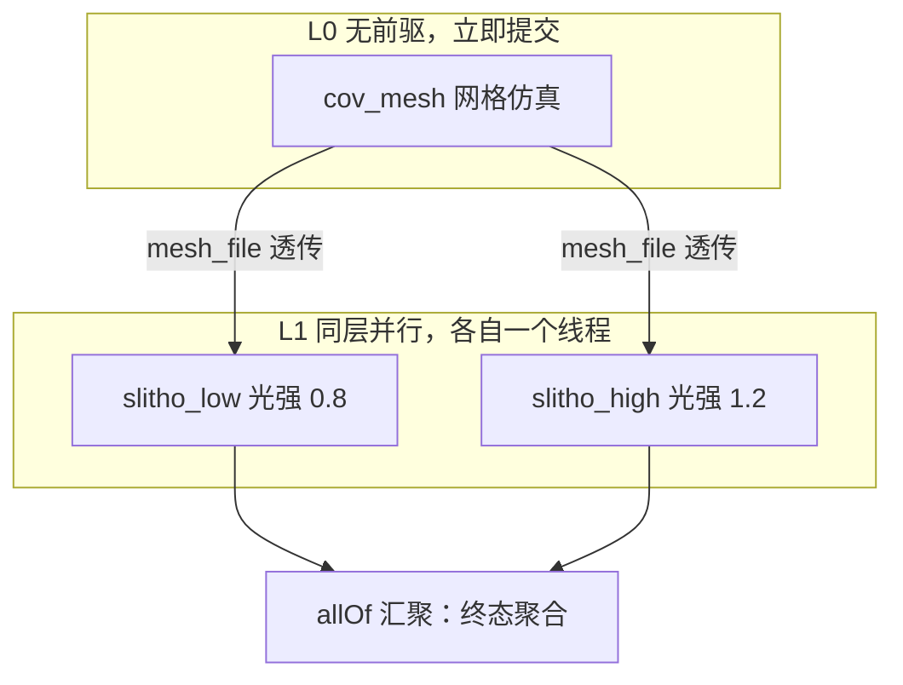
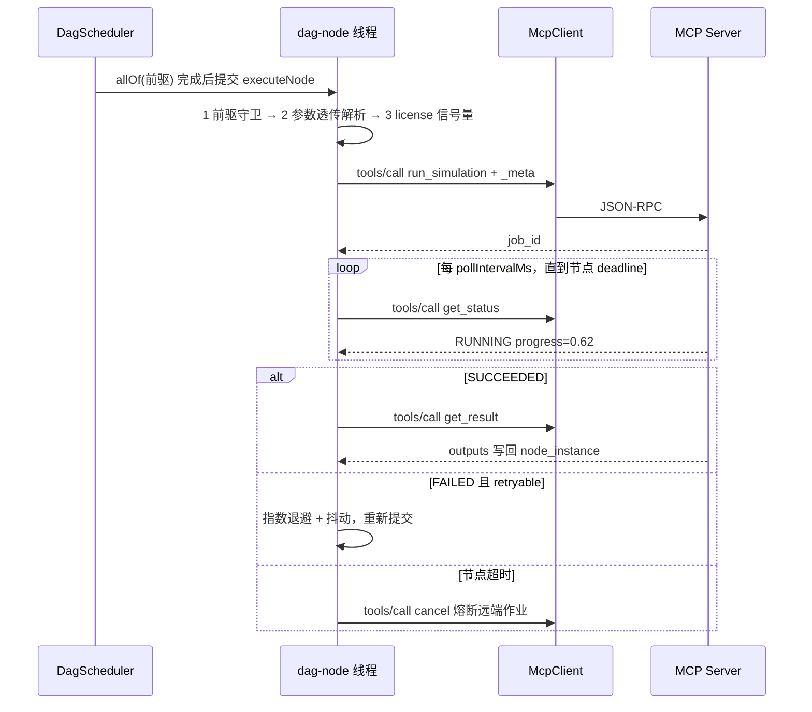

# ⑤ Module 3B · DAG 并发调度引擎（CompletableFuture / 重试 / 超时 / 续跑）

<aside>
⚡

调度引擎的核心思路：**不自己循环“找就绪节点”**，而是按拓扑序为每个节点预先织一张 `CompletableFuture` 依赖网，让 JDK 自己去完成事件驱动。节点就绪 = 它所有前驱 Future 都完成；并行度由线程池卡住。

</aside>

## 调度拓扑与线程模型





---

## 1. `engine/EngineErrors.java` 与 `engine/RetryPolicy.java`

```java
// ===== file: src/main/java/com/sim/agent/engine/EngineErrors.java =====
package com.sim.agent.engine;

public final class EngineErrors {

    private EngineErrors() { }

    /** 节点级超时（轮询总时长超限），不再重试 */
    public static class NodeTimeout extends RuntimeException {
        private static final long serialVersionUID = 1L;
        public NodeTimeout(String msg) { super(msg); }
    }

    /** 工作流被取消 / 全局超时 / 快速失败连带取消 */
    public static class Cancelled extends RuntimeException {
        private static final long serialVersionUID = 1L;
        public Cancelled(String msg) { super(msg); }
    }
}

// ===== file: src/main/java/com/sim/agent/engine/RetryPolicy.java =====
package com.sim.agent.engine;

import com.sim.agent.mcp.McpErrors;

/** 指数退避 + 抖动的重试策略，并负责异常可重试判定 */
public class RetryPolicy {

    public int maxAttempts = 3;
    public long initialBackoffMs = 500L;
    public double multiplier = 2.0;
    public long maxBackoffMs = 8000L;
    public double jitter = 0.2;          // ±20% 抖动，避免多节点同时重试冲击仿真集群

    public static RetryPolicy defaults() { return new RetryPolicy(); }

    public long backoffFor(int attempt) {
        double base = initialBackoffMs * Math.pow(multiplier, Math.max(0, attempt - 1));
        long capped = (long) Math.min(base, (double) maxBackoffMs);
        long delta = (long) (capped * jitter * (Math.random() * 2.0 - 1.0));
        return Math.max(50L, capped + delta);
    }

    /**
     * 可重试判定：逐层拆开 cause 链。
     * 原则是宁可少重试也不要盲重试 —— 参数错误重试 100 次也是错。
     */
    public boolean retryable(Throwable t) {
        int guard = 0;
        while (t != null && guard++ < 10) {
            if (t instanceof EngineErrors.NodeTimeout) return false;
            if (t instanceof EngineErrors.Cancelled) return false;
            if (t instanceof ParamResolver.ParamResolveException) return false;
            if (t instanceof McpErrors.McpException) return ((McpErrors.McpException) t).retryable();
            t = t.getCause();
        }
        return false;
    }
}
```

## 2. `engine/WorkflowEvent.java`

事件流是引擎对外的唯一可观测接口，Module 5 的 SSE 接口直接订阅它。

```java
// ===== file: src/main/java/com/sim/agent/engine/WorkflowEvent.java =====
package com.sim.agent.engine;

import com.sim.agent.json.MiniJson;

import java.util.Map;

public class WorkflowEvent {

    public static final String WORKFLOW_START = "WORKFLOW_START";
    public static final String WORKFLOW_END = "WORKFLOW_END";
    public static final String NODE_SUBMIT = "NODE_SUBMIT";
    public static final String NODE_PROGRESS = "NODE_PROGRESS";
    public static final String NODE_RETRY = "NODE_RETRY";
    public static final String NODE_DONE = "NODE_DONE";

    public final long ts = System.currentTimeMillis();
    public final String instanceId;
    public final String nodeKey;
    public final String type;
    public final String status;
    public final double progress;
    public final String message;

    public WorkflowEvent(String instanceId, String nodeKey, String type,
                         String status, double progress, String message) {
        this.instanceId = instanceId;
        this.nodeKey = nodeKey;
        this.type = type;
        this.status = status;
        this.progress = progress;
        this.message = message;
    }

    public Map<String, Object> toMap() {
        return MiniJson.map("ts", Long.valueOf(ts), "instance_id", instanceId, "node_key", nodeKey,
                "type", type, "status", status, "progress", Double.valueOf(progress),
                "message", message);
    }

    @Override
    public String toString() {
        return "[" + type + "] " + (nodeKey == null ? "-" : nodeKey) + " " + status
                + " " + Math.round(progress * 100) + "% " + (message == null ? "" : message);
    }

    public interface Listener {
        void onEvent(WorkflowEvent e);
    }
}
```

## 3. `engine/DagScheduler.java`（引擎主体）

```java
// ===== file: src/main/java/com/sim/agent/engine/DagScheduler.java =====
package com.sim.agent.engine;

import com.sim.agent.domain.EdgeInstance;
import com.sim.agent.domain.NodeInstance;
import com.sim.agent.domain.NodeStatus;
import com.sim.agent.domain.WorkflowInstance;
import com.sim.agent.domain.WorkflowStatus;
import com.sim.agent.json.MiniJson;
import com.sim.agent.mcp.McpClient;
import com.sim.agent.mcp.McpErrors;
import com.sim.agent.mcp.McpServerRegistry;
import com.sim.agent.repo.WorkflowRepository;

import java.io.Closeable;
import java.util.ArrayList;
import java.util.LinkedHashMap;
import java.util.List;
import java.util.Map;
import java.util.concurrent.CompletableFuture;
import java.util.concurrent.ConcurrentHashMap;
import java.util.concurrent.ConcurrentMap;
import java.util.concurrent.CopyOnWriteArrayList;
import java.util.concurrent.ExecutorService;
import java.util.concurrent.Executors;
import java.util.concurrent.LinkedBlockingQueue;
import java.util.concurrent.ScheduledExecutorService;
import java.util.concurrent.ScheduledFuture;
import java.util.concurrent.Semaphore;
import java.util.concurrent.ThreadFactory;
import java.util.concurrent.ThreadPoolExecutor;
import java.util.concurrent.TimeUnit;
import java.util.concurrent.atomic.AtomicBoolean;
import java.util.concurrent.atomic.AtomicInteger;
import java.util.function.BiFunction;
import java.util.function.Function;

/**
 * 纯 Java DAG 调度引擎。
 *
 * 设计要点：
 *  1) 按拓扑序为每个节点织 CompletableFuture 依赖网，天然支持串联+并联混合拓扑
 *  2) 前驱失败不让 Future 异常短路，而是让后继节点进入 SKIPPED，拿到完整现场
 *  3) 两层超时：节点级 deadline（轮询循环自检）+ 工作流级全局超时（定时器置取消位）
 *  4) 超时/取消时主动调 MCP cancel，不留儿孤作业
 *  5) resume() 跳过已 SUCCEEDED 节点，实现断点续跑
 */
public class DagScheduler implements Closeable {

    private final McpServerRegistry registry;
    private final WorkflowRepository repo;
    private final RetryPolicy retryPolicy;
    private final ExecutorService nodePool;
    private final ScheduledExecutorService timer;

    private final List<WorkflowEvent.Listener> listeners = new CopyOnWriteArrayList<WorkflowEvent.Listener>();
    private final ConcurrentMap<String, AtomicBoolean> cancelFlags = new ConcurrentHashMap<String, AtomicBoolean>();
    /** 仿真软件 license 并发限制：仿真类型 -> 信号量 */
    private final ConcurrentMap<String, Semaphore> licenseLimits = new ConcurrentHashMap<String, Semaphore>();

    public DagScheduler(McpServerRegistry registry, WorkflowRepository repo,
                        int parallelism, RetryPolicy policy) {
        this.registry = registry;
        this.repo = repo;
        this.retryPolicy = (policy == null) ? RetryPolicy.defaults() : policy;
        int p = Math.max(2, parallelism);
        this.nodePool = new ThreadPoolExecutor(p, p, 60L, TimeUnit.SECONDS,
                new LinkedBlockingQueue<Runnable>(), namedFactory("dag-node"));
        this.timer = Executors.newScheduledThreadPool(1, namedFactory("dag-timer"));
    }

    public void addListener(WorkflowEvent.Listener l) { listeners.add(l); }

    /** 例如 S-Litho 只买了 2 个 license，就算 DAG 并行度是 5 也只能同时跑 2 个 */
    public void setLicenseLimit(String simulationType, int permits) {
        licenseLimits.put(simulationType, new Semaphore(Math.max(1, permits), true));
        System.out.println("[dag] license 限制 " + simulationType + " = " + permits);
    }

    /* ================= 对外入口 ================= */

    public WorkflowInstance run(WorkflowInstance wi) { return runInternal(wi, false); }

    /** 断点续跑：保留已成功节点的产物，只重跑失败/未完成部分 */
    public WorkflowInstance resume(WorkflowInstance wi) { return runInternal(wi, true); }

    public boolean cancel(String instanceId) {
        AtomicBoolean f = cancelFlags.get(instanceId);
        if (f == null) return false;
        boolean changed = f.compareAndSet(false, true);
        if (changed) System.out.println("[dag] 收到取消指令: " + instanceId);
        return changed;
    }

    /* ================= 主流程 ================= */

    private WorkflowInstance runInternal(final WorkflowInstance wi, boolean resume) {
        final TopologySorter.Result topo = TopologySorter.sortInstance(wi.nodes, wi.edges);
        System.out.println("[dag] " + wi.id + " 拓扑: " + topo.describe());

        if (resume) {
            for (NodeInstance n : wi.nodes) {
                if (n.status != NodeStatus.SUCCEEDED) {
                    n.status = NodeStatus.PENDING;
                    n.attempt = 0;
                    n.progress = 0.0;
                    n.remoteJobId = null;
                    n.errorCode = null;
                    n.errorMessage = null;
                    n.finishedAt = null;
                } else {
                    System.out.println("[dag] 续跑跳过已成功节点 " + n.nodeKey);
                }
            }
        }

        final AtomicBoolean cancel = new AtomicBoolean(false);
        cancelFlags.put(wi.id, cancel);
        wi.status = WorkflowStatus.RUNNING;
        wi.startedAt = Long.valueOf(System.currentTimeMillis());
        wi.finishedAt = null;
        wi.errorMessage = null;
        repo.touchInstance(wi);
        emit(new WorkflowEvent(wi.id, null, WorkflowEvent.WORKFLOW_START,
                wi.status.name(), 0.0, "层数=" + topo.layers.size() + " 最大并行度=" + topo.maxWidth()));

        // 工作流级全局超时：到点只置取消位，不强杀线程（避免远端作业失控）
        ScheduledFuture<?> deadlineTask = timer.schedule(new Runnable() {
            @Override public void run() {
                if (cancel.compareAndSet(false, true)) {
                    System.err.println("[dag] " + wi.id + " 触发工作流全局超时 " + wi.globalTimeoutMs + "ms");
                }
            }
        }, wi.globalTimeoutMs, TimeUnit.MILLISECONDS);

        // 按拓扑序织依赖网
        final Map<String, CompletableFuture<NodeStatus>> futures =
                new LinkedHashMap<String, CompletableFuture<NodeStatus>>();
        for (final String key : topo.order) {
            final NodeInstance node = wi.node(key);
            List<CompletableFuture<NodeStatus>> deps = new ArrayList<CompletableFuture<NodeStatus>>();
            for (String p : topo.predecessors.get(key)) {
                CompletableFuture<NodeStatus> pf = futures.get(p);
                if (pf != null) deps.add(pf);
            }
            CompletableFuture<Void> gate = deps.isEmpty()
                    ? CompletableFuture.<Void>completedFuture(null)
                    : CompletableFuture.allOf(deps.toArray(new CompletableFuture[deps.size()]));

            // handle(...)：就算前驱异常也不短路，让本节点自己决定 SKIPPED 还是执行
            CompletableFuture<NodeStatus> f = gate
                    .handle(new BiFunction<Void, Throwable, Void>() {
                        @Override public Void apply(Void v, Throwable t) {
                            if (t != null) System.err.println("[dag] 前驱异常已吸收: " + t);
                            return null;
                        }
                    })
                    .thenApplyAsync(new Function<Void, NodeStatus>() {
                        @Override public NodeStatus apply(Void ignored) {
                            return executeNode(wi, node, cancel);
                        }
                    }, nodePool);
            futures.put(key, f);
        }

        try {
            CompletableFuture.allOf(futures.values().toArray(new CompletableFuture[futures.size()])).join();
        } finally {
            deadlineTask.cancel(false);
            cancelFlags.remove(wi.id);
        }

        // 终态聚合
        int ok = 0, failed = 0, skipped = 0, criticalFailed = 0, cancelled = 0;
        for (NodeInstance n : wi.nodes) {
            if (n.status == NodeStatus.SUCCEEDED) ok++;
            else if (n.status == NodeStatus.SKIPPED) skipped++;
            else if (n.status == NodeStatus.CANCELLED) cancelled++;
            else {
                failed++;
                if (n.critical) criticalFailed++;
            }
        }
        wi.finishedAt = Long.valueOf(System.currentTimeMillis());
        if (cancel.get() && ok < wi.nodes.size() && criticalFailed == 0) {
            wi.status = WorkflowStatus.CANCELLED;
        } else if (criticalFailed > 0) {
            wi.status = WorkflowStatus.FAILED;
        } else if (failed + skipped + cancelled > 0) {
            wi.status = WorkflowStatus.PARTIAL_SUCCEEDED;
        } else {
            wi.status = WorkflowStatus.SUCCEEDED;
        }
        repo.touchInstance(wi);
        emit(new WorkflowEvent(wi.id, null, WorkflowEvent.WORKFLOW_END, wi.status.name(), 1.0,
                "成功=" + ok + " 失败=" + failed + " 跳过=" + skipped + " 取消=" + cancelled
                        + " 耗时=" + wi.costMs() + "ms"));
        printSummary(wi, topo);
        return wi;
    }

    /* ================= 单节点执行 ================= */

    private NodeStatus executeNode(WorkflowInstance wi, NodeInstance node, AtomicBoolean cancel) {
        if (node.status == NodeStatus.SUCCEEDED) return NodeStatus.SUCCEEDED;      // 续跑跳过
        if (cancel.get()) return finish(wi, node, NodeStatus.CANCELLED, "CANCELLED", "工作流已取消或全局超时");

        String blocked = guardPredecessors(wi, node);
        if (blocked != null) return finish(wi, node, NodeStatus.SKIPPED, "PRED_NOT_READY", blocked);

        try {
            Map<String, Object> resolved = ParamResolver.resolve(wi, node);
            node.resolvedParams.clear();
            node.resolvedParams.putAll(resolved);
            node.log("参数透传完成: " + MiniJson.stringify(resolved));
        } catch (RuntimeException e) {
            return finish(wi, node, NodeStatus.FAILED, "PARAM_ERROR", e.getMessage());
        }

        Semaphore lic = licenseLimits.get(node.simulationType);
        if (lic != null) {
            try {
                lic.acquire();
            } catch (InterruptedException ie) {
                Thread.currentThread().interrupt();
                return finish(wi, node, NodeStatus.CANCELLED, "INTERRUPTED", "等待 license 时被中断");
            }
        }
        try {
            return runWithRetry(wi, node, cancel);
        } finally {
            if (lic != null) lic.release();
        }
    }

    /** 前驱守卫：边必须 ACTIVE、条件必须满足、前驱必须成功 */
    private String guardPredecessors(WorkflowInstance wi, NodeInstance node) {
        for (EdgeInstance e : wi.edges) {
            if (!node.nodeKey.equals(e.toNodeKey)) continue;
            NodeInstance from = wi.node(e.fromNodeKey);
            if (from == null) return "前驱节点不存在: " + e.fromNodeKey;
            if (from.status != NodeStatus.SUCCEEDED) {
                return "前驱节点 " + from.nodeKey + " 状态为 " + from.status + "，本节点跳过";
            }
            if (e.conditionExpr != null && !e.conditionExpr.trim().isEmpty()) {
                boolean pass;
                try {
                    pass = ParamResolver.evaluateCondition(wi, e.conditionExpr);
                } catch (RuntimeException ex) {
                    return "边条件评估失败 [" + e.conditionExpr + "]: " + ex.getMessage();
                }
                if (!pass) {
                    e.status = "SKIPPED";
                    return "边条件不满足: " + e.conditionExpr;
                }
            }
        }
        return null;
    }

    private NodeStatus runWithRetry(WorkflowInstance wi, NodeInstance node, AtomicBoolean cancel) {
        int max = Math.max(1, node.maxAttempts);
        Throwable last = null;
        for (int attempt = 1; attempt <= max; attempt++) {
            if (cancel.get()) return finish(wi, node, NodeStatus.CANCELLED, "CANCELLED", "工作流已取消");
            node.attempt = attempt;
            node.status = (attempt == 1) ? NodeStatus.RUNNING : NodeStatus.RETRYING;
            if (node.startedAt == null) node.startedAt = Long.valueOf(System.currentTimeMillis());
            repo.touchNode(node);
            emit(new WorkflowEvent(wi.id, node.nodeKey, WorkflowEvent.NODE_SUBMIT, node.status.name(),
                    0.0, "第 " + attempt + "/" + max + " 次尝试 -> " + node.mcpServerKey + "." + node.runTool));
            try {
                Map<String, Object> outputs = executeOnce(wi, node, cancel);
                node.outputs.clear();
                node.outputs.putAll(outputs);
                node.progress = 1.0;
                return finish(wi, node, NodeStatus.SUCCEEDED, null, null);
            } catch (EngineErrors.NodeTimeout te) {
                return finish(wi, node, NodeStatus.TIMEOUT, "NODE_TIMEOUT", te.getMessage());
            } catch (EngineErrors.Cancelled ce) {
                return finish(wi, node, NodeStatus.CANCELLED, "CANCELLED", ce.getMessage());
            } catch (RuntimeException e) {
                last = e;
                boolean canRetry = retryPolicy.retryable(e) && attempt < max;
                node.log("attempt " + attempt + " 失败: " + e.getMessage() + (canRetry ? " -> 将重试" : " -> 终止"));
                emit(new WorkflowEvent(wi.id, node.nodeKey, WorkflowEvent.NODE_RETRY,
                        canRetry ? "RETRYING" : "FAILED", node.progress, e.getMessage()));
                if (!canRetry) break;
                long backoff = retryPolicy.backoffFor(attempt);
                System.out.println("[dag] " + node.nodeKey + " 第 " + attempt + " 次失败，"
                        + backoff + "ms 后重试: " + e.getMessage());
                if (!sleepQuietly(backoff, cancel)) {
                    return finish(wi, node, NodeStatus.CANCELLED, "CANCELLED", "退避等待期间被取消");
                }
                node.remoteJobId = null;      // 下一次重新提交，幂等键会变
            }
        }
        return finish(wi, node, NodeStatus.FAILED, codeOf(last), (last == null) ? "未知失败" : last.getMessage());
    }

    /** 一次完整的远端执行：提交 -> 轮询 -> 取结果 */
    private Map<String, Object> executeOnce(WorkflowInstance wi, NodeInstance node, AtomicBoolean cancel) {
        McpClient client = registry.client(node.mcpServerKey);
        final long deadline = System.currentTimeMillis() + node.timeoutMs;

        Map<String, Object> args = new LinkedHashMap<String, Object>(node.resolvedParams);
        args.put("_meta", MiniJson.map(
                "workflow_instance_id", wi.id,
                "trace_id", wi.traceId,
                "node_key", node.nodeKey,
                "attempt", Integer.valueOf(node.attempt),
                "idempotency_key", node.idempotencyKey()));

        Map<String, Object> submit = client.callTool(node.runTool, args, budget(deadline));
        String jobId = MiniJson.getString(submit, "job_id", null);

        // 同步型 Tool（没有 job_id）：直接当结果用
        if (jobId == null || node.statusTool == null || node.statusTool.isEmpty()) {
            Object out = submit.containsKey("outputs") ? submit.get("outputs") : submit;
            return MiniJson.asMap(out);
        }

        node.remoteJobId = jobId;
        node.log("已提交远端作业 " + jobId + " eta=" + MiniJson.getLong(submit, "eta_ms", -1L) + "ms");
        repo.touchNode(node);

        while (true) {
            if (cancel.get()) {
                cancelRemoteQuietly(client, node);
                throw new EngineErrors.Cancelled("工作流取消，已请求终止远端作业 " + jobId);
            }
            if (System.currentTimeMillis() >= deadline) {
                cancelRemoteQuietly(client, node);
                throw new EngineErrors.NodeTimeout("节点级超时 " + node.timeoutMs
                        + "ms（进度 " + Math.round(node.progress * 100) + "%），已请求终止远端作业 " + jobId);
            }

            long wait = Math.min(node.pollIntervalMs, Math.max(50L, deadline - System.currentTimeMillis()));
            if (!sleepQuietly(wait, cancel)) {
                cancelRemoteQuietly(client, node);
                throw new EngineErrors.Cancelled("轮询等待期间被取消");
            }

            Map<String, Object> st = client.callTool(node.statusTool,
                    MiniJson.map("job_id", jobId), budget(deadline));
            String status = MiniJson.getString(st, "status", "RUNNING");
            node.progress = MiniJson.getDouble(st, "progress", node.progress);
            node.stage = MiniJson.getString(st, "stage", node.stage);
            repo.touchNode(node);
            emit(new WorkflowEvent(wi.id, node.nodeKey, WorkflowEvent.NODE_PROGRESS, status,
                    node.progress, "stage=" + node.stage + " job=" + jobId));

            if ("SUCCEEDED".equals(status)) {
                Map<String, Object> res = client.callTool(node.resultTool,
                        MiniJson.map("job_id", jobId), budget(deadline));
                Map<String, Object> outputs = MiniJson.getMap(res, "outputs");
                return outputs.isEmpty() ? res : outputs;
            }
            if ("FAILED".equals(status)) {
                // 把远端失败包成 ToolError，让 RetryPolicy 统一读 retryable 语义
                throw new McpErrors.ToolError(node.runTool,
                        MiniJson.getString(st, "error_code", "REMOTE_FAILED"),
                        MiniJson.getString(st, "error_message", "远端作业失败"),
                        MiniJson.getBoolean(st, "retryable", true), st);
            }
            if ("CANCELLED".equals(status)) {
                throw new EngineErrors.Cancelled("远端作业已被取消: " + jobId);
            }
        }
    }

    /* ================= 辅助方法 ================= */

    /** 单次 RPC 的时间预算：不超过节点剩余时间，也不超过 30s */
    private static long budget(long deadline) {
        long remain = deadline - System.currentTimeMillis();
        if (remain <= 0L) remain = 500L;
        return Math.max(500L, Math.min(remain, 30000L));
    }

    /** 可被取消打断的睡眠。返回 false 表示期间被取消 */
    private static boolean sleepQuietly(long ms, AtomicBoolean cancel) {
        long end = System.currentTimeMillis() + Math.max(0L, ms);
        while (System.currentTimeMillis() < end) {
            if (cancel.get()) return false;
            long slice = Math.min(100L, end - System.currentTimeMillis());
            if (slice <= 0L) break;
            try {
                Thread.sleep(slice);
            } catch (InterruptedException e) {
                Thread.currentThread().interrupt();
                return false;
            }
        }
        return !cancel.get();
    }

    /** 熔断远端作业：尽力而为，失败不影响主流程结论 */
    private void cancelRemoteQuietly(McpClient client, NodeInstance node) {
        String jobId = node.remoteJobId;
        if (jobId == null || node.cancelTool == null || node.cancelTool.isEmpty()) return;
        try {
            client.callTool(node.cancelTool, MiniJson.map("job_id", jobId), 5000L);
            node.log("已请求远端取消作业 " + jobId);
            System.out.println("[dag] 已向 " + node.mcpServerKey + " 请求取消作业 " + jobId);
        } catch (RuntimeException e) {
            System.err.println("[dag] 远端取消失败(可忽略) " + jobId + ": " + e.getMessage());
        }
    }

    /** 统一的节点终态写入点：落库 + 发事件 + 快速失败联动 */
    private NodeStatus finish(WorkflowInstance wi, NodeInstance node,
                              NodeStatus status, String code, String msg) {
        node.status = status;
        node.finishedAt = Long.valueOf(System.currentTimeMillis());
        node.errorCode = code;
        node.errorMessage = msg;
        repo.touchNode(node);
        emit(new WorkflowEvent(wi.id, node.nodeKey, WorkflowEvent.NODE_DONE, status.name(),
                node.progress, (msg == null) ? ("耗时 " + node.costMs() + "ms") : msg));
        System.out.println("[dag] " + (status.success() ? "[OK]  " : "[FAIL]") + " " + node.nodeKey
                + " -> " + status + (msg == null ? "" : (" (" + msg + ")"))
                + " 耗时=" + node.costMs() + "ms attempt=" + node.attempt);

        // 快速失败：关键节点失败时置取消位，未开始的节点会级联 CANCELLED
        if (wi.failFast && node.critical
                && (status == NodeStatus.FAILED || status == NodeStatus.TIMEOUT)) {
            AtomicBoolean f = cancelFlags.get(wi.id);
            if (f != null && f.compareAndSet(false, true)) {
                wi.errorMessage = "关键节点 " + node.nodeKey + " 失败，触发快速失败: " + msg;
                System.err.println("[dag] " + wi.errorMessage);
            }
        }
        return status;
    }

    private static String codeOf(Throwable t) {
        if (t instanceof McpErrors.ToolError) return ((McpErrors.ToolError) t).errorCode;
        if (t instanceof McpErrors.RpcTimeout) return "RPC_TIMEOUT";
        if (t instanceof McpErrors.TransportError) return "TRANSPORT_ERROR";
        if (t instanceof McpErrors.RpcError) return "RPC_ERROR_" + ((McpErrors.RpcError) t).code;
        return (t == null) ? "UNKNOWN" : t.getClass().getSimpleName();
    }

    private void emit(WorkflowEvent e) {
        for (WorkflowEvent.Listener l : listeners) {
            try { l.onEvent(e); }
            catch (RuntimeException ex) { System.err.println("[dag] 监听器异常: " + ex); }
        }
    }

    private void printSummary(WorkflowInstance wi, TopologySorter.Result topo) {
        StringBuilder sb = new StringBuilder();
        sb.append("\n========== 工作流执行汇总 ").append(wi.id).append(" ==========\n");
        sb.append("模版: ").append(wi.templateKey).append(" v").append(wi.templateVersion)
          .append("   终态: ").append(wi.status)
          .append("   总耗时: ").append(wi.costMs()).append("ms\n");
        sb.append("拓扑: ").append(topo.describe()).append('\n');
        sb.append(String.format("%-14s %-11s %-6s %-10s %s%n",
                "NODE", "STATUS", "TRY", "COST(ms)", "OUTPUT / ERROR"));
        for (String key : topo.order) {
            NodeInstance n = wi.node(key);
            String tail = n.status.success()
                    ? briefOutputs(n)
                    : (n.errorCode + " " + (n.errorMessage == null ? "" : n.errorMessage));
            sb.append(String.format("%-14s %-11s %-6s %-10s %s%n",
                    n.nodeKey, n.status, n.attempt + "/" + n.maxAttempts, n.costMs(), tail));
        }
        sb.append("===================================================\n");
        System.out.println(sb);
    }

    private static String briefOutputs(NodeInstance n) {
        StringBuilder sb = new StringBuilder();
        int i = 0;
        for (Map.Entry<String, Object> e : n.outputs.entrySet()) {
            if (i >= 3) { sb.append(", ..."); break; }
            if (i > 0) sb.append(", ");
            sb.append(e.getKey()).append('=').append(MiniJson.stringify(e.getValue()));
            i++;
        }
        return sb.toString();
    }

    private static ThreadFactory namedFactory(final String prefix) {
        return new ThreadFactory() {
            private final AtomicInteger seq = new AtomicInteger(1);
            @Override public Thread newThread(Runnable r) {
                Thread t = new Thread(r, prefix + "-" + seq.getAndIncrement());
                t.setDaemon(true);
                return t;
            }
        };
    }

    @Override
    public void close() {
        nodePool.shutdownNow();
        timer.shutdownNow();
    }
}
```

---

## 4. 超时与重试的四层防线

| 层级 | 作用域 | 配置项 | 触发后的动作 |
| --- | --- | --- | --- |
| L1 RPC 超时 | 单次 `tools/call` | `ServerSpec.rpcTimeoutMs`（默认 20s）+ `budget()` 收敛 | 抛 `RpcTimeout`（可重试） |
| L2 节点超时 | 一个节点的完整轮询周期 | `node_template.timeout_ms` | 调 `cancel` 熔断远端 + 节点 `TIMEOUT`（不重试） |
| L3 工作流超时 | 整张 DAG | `WorkflowInstance.globalTimeoutMs` | 定时器置取消位，正在跑的节点自行收尾 |
| L4 重试 | 单节点失败 | `retry_limit`  • `RetryPolicy` 指数退避 | 只对 `retryable=true` 的错误重试 |

<aside>
🎯

**为什么不用 `Future.cancel(true)` 直接强杀？** 因为 Java 侧的线程死了，**仿真集群上的作业还在烧 CPU 和 license**。本引擎的停止路径是「置取消位 → 轮询循环自检 → 主动调远端 `cancel` → 才退出」，保证**不留孤儿作业**。同理，全局超时也只置位不强杀。

</aside>

## 5. 关键设计答疑

| 问题 | 本实现的选择与理由 |
| --- | --- |
| 前驱失败，后继怎么办？ | 用 `handle()` 吸掉异常，后继节点进 `SKIPPED` 而不是整个 Future 链异常短路。这样能拿到**完整现场**（每个节点都有明确终态），而不是一个笼统的 CompletionException |
| 为何不用定时轮询器而是线程阻塞轮询？ | 原型优先可读。单节点 = 单线程，调试时栈清楚。若节点数上千，应改为「状态机 + ScheduledExecutor 回调」避免线程占用（`executeOnce` 的轮询循环拆成定时任务即可，其余代码不变） |
| 重试会不会重复提交仿真？ | 会，且这是预期：每次重试 `attempt+1`，幂等键 `wi:node:attempt` 变化。Python 侧可基于幂等键做结果缓存去重 |
| license 不够怎么办？ | `setLicenseLimit("S_LITHO", 2)`：信号量卡在节点级，不影响拓扑正确性，只降实际并发 |
| 断点续跑怎么保证不重跑？ | `resume()` 保留 `SUCCEEDED` 节点的 `outputs`，其余重置为 `PENDING`。因为 `outputs` 已在实例快照里，下游参数透传照样能解析 |

## 6. 实测控制台输出（`--demo --chaos`，已注入一次求解发散）

```
[dag] wi-7c1f0aab32d5 拓扑: L0[cov_mesh]  ==>  L1[slitho_low, slitho_high]  (层数=2, 最大并行度=2)
[dag] 第 1/3 次尝试 cov_mesh -> coventor.coventor_run_simulation
[dag] cov_mesh 第 1 次失败，612ms 后重试: tool[coventor_run_simulation] SOLVER_DIVERGED: 求解器在第 60 迭代步残差发散（Mock 注入的可重试故障）
[dag] [OK]   cov_mesh -> SUCCEEDED 耗时=4021ms attempt=2
[dag] [OK]   slitho_low -> SUCCEEDED 耗时=1652ms attempt=1
[dag] [OK]   slitho_high -> SUCCEEDED 耗时=1841ms attempt=1

========== 工作流执行汇总 wi-7c1f0aab32d5 ==========
模版: wf_cov_mesh_dual_slitho v1   终态: SUCCEEDED   总耗时: 5903ms
拓扑: L0[cov_mesh]  ==>  L1[slitho_low, slitho_high]  (层数=2, 最大并行度=2)
NODE           STATUS      TRY    COST(ms)   OUTPUT / ERROR
cov_mesh       SUCCEEDED   2/3    4021       mesh_file="/mnt/sim/mems_cantilever/mesh_0p5.msh", geometry_file="/mnt/sim/mems_cantilever/geom.gds", node_count=42381, ...
slitho_low     SUCCEEDED   1/3    1652       cd_nm=59.83, ils=1.61, dof_nm=196.4, ...
slitho_high    SUCCEEDED   1/3    1841       cd_nm=49.12, ils=1.88, dof_nm=175.2, ...
===================================================
                
```