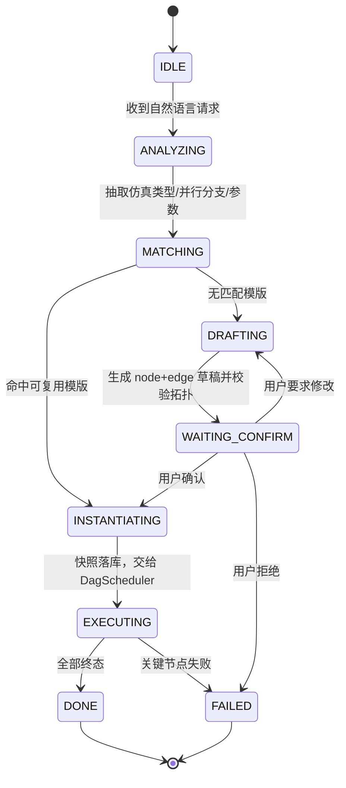

# ⑥ Module 4 · Agent 编排与 LLM Function Calling 层

<aside>
🤖

本页是「自然语言 → 可执行 DAG」的大脑。因为不允许用 Spring AI / LangChain，所以 **Function Calling 的报文结构、工具调度循环、多轮对话状态全部手写**。另外提供一个 `HeuristicLlmProvider`：**没有 API Key 也能跑完整链路**，两者实现同一个接口，可随时切换。

</aside>

## Agent 决策状态机



<aside>
💡

状态机并不是用 `if/else` 硬编的，而是**由 LLM 选择工具自然驱动**：每个状态对应一组可用 Tool，Agent 只负责把工具结果写回对话历史然后再问一次。人机确认通过一个特殊 Tool（`request_user_confirmation`）实现：它返回 `WAITING_USER` 并**中断循环**，把会话挂起等待 `/api/confirm`。

</aside>

---

## 1. LLM 报文结构（OpenAI 兼容）

```java
// ===== file: src/main/java/com/sim/agent/llm/ToolCall.java =====
package com.sim.agent.llm;

import com.sim.agent.json.MiniJson;

import java.util.Map;

/** LLM 发起的一次工具调用 */
public class ToolCall {
    public final String id;
    public final String name;
    public final String argumentsJson;

    public ToolCall(String id, String name, String argumentsJson) {
        this.id = (id == null || id.isEmpty()) ? ("call_" + Math.abs(name.hashCode())) : id;
        this.name = name;
        this.argumentsJson = (argumentsJson == null || argumentsJson.trim().isEmpty()) ? "{}" : argumentsJson;
    }

    /** 宽松解析：模型偶尔会把 arguments 包在 Markdown 围栏里 */
    public Map<String, Object> args() {
        try {
            return MiniJson.asMap(MiniJson.parseLoose(argumentsJson));
        } catch (RuntimeException e) {
            return MiniJson.map();
        }
    }

    @Override public String toString() { return name + "(" + argumentsJson + ")"; }
}

// ===== file: src/main/java/com/sim/agent/llm/ChatMessage.java =====
package com.sim.agent.llm;

import com.sim.agent.json.MiniJson;

import java.util.ArrayList;
import java.util.Arrays;
import java.util.List;
import java.util.Map;

/** 一条对话消息：system / user / assistant / tool */
public class ChatMessage {
    public String role;
    public String content;
    public List<ToolCall> toolCalls = new ArrayList<ToolCall>();
    public String toolCallId;      // role=tool 时必填，与 assistant 的 tool_call 对应
    public String name;            // role=tool 时的工具名

    public static ChatMessage system(String c) { return of("system", c); }
    public static ChatMessage user(String c) { return of("user", c); }
    public static ChatMessage assistant(String c) { return of("assistant", c); }

    public static ChatMessage assistantCalls(List<ToolCall> calls) {
        ChatMessage m = of("assistant", "");
        m.toolCalls = new ArrayList<ToolCall>(calls);
        return m;
    }

    public static ChatMessage assistantCall(ToolCall call) {
        return assistantCalls(Arrays.asList(call));
    }

    public static ChatMessage toolResult(String toolCallId, String name, String content) {
        ChatMessage m = of("tool", content);
        m.toolCallId = toolCallId;
        m.name = name;
        return m;
    }

    private static ChatMessage of(String role, String content) {
        ChatMessage m = new ChatMessage();
        m.role = role;
        m.content = content;
        return m;
    }

    /** 序列化为 OpenAI Chat Completions 的 message 结构 */
    public Map<String, Object> toApiMap() {
        Map<String, Object> m = MiniJson.map("role", role);
        m.put("content", (content == null) ? "" : content);
        if (!toolCalls.isEmpty()) {
            List<Object> arr = new ArrayList<Object>();
            for (ToolCall tc : toolCalls) {
                arr.add(MiniJson.map("id", tc.id, "type", "function",
                        "function", MiniJson.map("name", tc.name, "arguments", tc.argumentsJson)));
            }
            m.put("tool_calls", arr);
        }
        if (toolCallId != null) m.put("tool_call_id", toolCallId);
        if (name != null && "tool".equals(role)) m.put("name", name);
        return m;
    }
}

// ===== file: src/main/java/com/sim/agent/llm/ToolDef.java =====
package com.sim.agent.llm;

import com.sim.agent.json.MiniJson;

import java.util.ArrayList;
import java.util.LinkedHashMap;
import java.util.List;
import java.util.Map;

/**
 * 手写 Function Calling 的 Tool Definition（JSON Schema 构造器）。
 * 不用反射、不用注解处理器，就是把 Schema 一个一个拼出来——可读且可控。
 */
public class ToolDef {

    public final String name;
    public final String description;
    private final Map<String, Object> properties = new LinkedHashMap<String, Object>();
    private final List<Object> required = new ArrayList<Object>();

    public ToolDef(String name, String description) {
        this.name = name;
        this.description = description;
    }

    public ToolDef str(String n, String desc, boolean req) {
        return raw(n, MiniJson.map("type", "string", "description", desc), req);
    }

    public ToolDef num(String n, String desc, boolean req) {
        return raw(n, MiniJson.map("type", "number", "description", desc), req);
    }

    public ToolDef integer(String n, String desc, boolean req) {
        return raw(n, MiniJson.map("type", "integer", "description", desc), req);
    }

    public ToolDef bool(String n, String desc, boolean req) {
        return raw(n, MiniJson.map("type", "boolean", "description", desc), req);
    }

    public ToolDef strArray(String n, String desc, boolean req) {
        return raw(n, MiniJson.map("type", "array", "description", desc,
                "items", MiniJson.map("type", "string")), req);
    }

    /** 任意对象（参数包、自由键值） */
    public ToolDef object(String n, String desc, boolean req) {
        return raw(n, MiniJson.map("type", "object", "description", desc,
                "additionalProperties", Boolean.TRUE), req);
    }

    /** 对象数组，用于 nodes / edges 这种结构化列表 */
    public ToolDef objArray(String n, String desc, Map<String, Object> itemSchema, boolean req) {
        return raw(n, MiniJson.map("type", "array", "description", desc, "items", itemSchema), req);
    }

    public ToolDef raw(String n, Map<String, Object> schema, boolean req) {
        properties.put(n, schema);
        if (req) required.add(n);
        return this;
    }

    public Map<String, Object> parameters() {
        return MiniJson.map("type", "object", "properties", properties, "required", required);
    }

    public Map<String, Object> toApiMap() {
        return MiniJson.map("type", "function", "function", MiniJson.map(
                "name", name, "description", description, "parameters", parameters()));
    }
}

// ===== file: src/main/java/com/sim/agent/llm/LlmResponse.java =====
package com.sim.agent.llm;

import java.util.ArrayList;
import java.util.List;

public class LlmResponse {
    public String content = "";
    public List<ToolCall> toolCalls = new ArrayList<ToolCall>();
    public String finishReason = "stop";
    public Object raw;
    public long promptTokens;
    public long completionTokens;

    public boolean hasToolCalls() { return !toolCalls.isEmpty(); }

    @Override public String toString() {
        return hasToolCalls() ? ("tool_calls=" + toolCalls) : ("text=" + content);
    }
}

// ===== file: src/main/java/com/sim/agent/llm/LlmProvider.java =====
package com.sim.agent.llm;

import java.util.List;

public interface LlmProvider {
    /** 一次带工具的对话调用（同步） */
    LlmResponse chat(List<ChatMessage> messages, List<ToolDef> tools);

    String name();
}
```

---

## 2. `llm/OpenAiLlmProvider.java`（原生 HTTP，无任何 SDK）

```java
// ===== file: src/main/java/com/sim/agent/llm/OpenAiLlmProvider.java =====
package com.sim.agent.llm;

import com.sim.agent.json.MiniJson;

import java.io.ByteArrayOutputStream;
import java.io.InputStream;
import java.io.OutputStream;
import java.net.HttpURLConnection;
import java.net.URL;
import java.nio.charset.Charset;
import java.util.ArrayList;
import java.util.List;
import java.util.Map;

/**
 * OpenAI 兑话接口兼容实现（也适用于 DeepSeek / 通义千问 / vLLM / Ollama 等 openai-compatible 网关）。
 * 只用 HttpURLConnection + MiniJson。
 */
public class OpenAiLlmProvider implements LlmProvider {

    private static final Charset UTF8 = Charset.forName("UTF-8");

    private final String baseUrl;
    private final String apiKey;
    private final String model;
    private final double temperature;
    private final int connectTimeoutMs = 10000;
    private final int readTimeoutMs = 90000;
    private final int maxRetries = 2;

    public OpenAiLlmProvider(String baseUrl, String apiKey, String model, double temperature) {
        this.baseUrl = trimTrailingSlash(baseUrl);
        this.apiKey = apiKey;
        this.model = model;
        this.temperature = temperature;
    }

    /** 从环境变量创建；LLM_API_KEY 未配置时返回 null，调用方可回退到启发式引擎 */
    public static OpenAiLlmProvider fromEnv() {
        String key = env("LLM_API_KEY", "");
        if (key.trim().isEmpty()) return null;
        return new OpenAiLlmProvider(
                env("LLM_BASE_URL", "https://api.openai.com/v1"),
                key,
                env("LLM_MODEL", "gpt-4o-mini"),
                0.1);
    }

    private static String env(String k, String def) {
        String v = System.getenv(k);
        if (v == null || v.isEmpty()) v = System.getProperty(k.toLowerCase().replace('_', '.'), def);
        return (v == null) ? def : v;
    }

    private static String trimTrailingSlash(String s) {
        return (s != null && s.endsWith("/")) ? s.substring(0, s.length() - 1) : s;
    }

    @Override public String name() { return "openai:" + model; }

    @Override
    public LlmResponse chat(List<ChatMessage> messages, List<ToolDef> tools) {
        Map<String, Object> body = MiniJson.map(
                "model", model,
                "temperature", Double.valueOf(temperature));
        List<Object> msgs = new ArrayList<Object>();
        for (ChatMessage m : messages) msgs.add(m.toApiMap());
        body.put("messages", msgs);
        if (tools != null && !tools.isEmpty()) {
            List<Object> ts = new ArrayList<Object>();
            for (ToolDef t : tools) ts.add(t.toApiMap());
            body.put("tools", ts);
            body.put("tool_choice", "auto");
        }

        String payload = MiniJson.stringify(body);
        String raw = postWithRetry(baseUrl + "/chat/completions", payload);
        Object json = MiniJson.parse(raw);

        LlmResponse r = new LlmResponse();
        r.raw = json;
        Object msg = MiniJson.get(json, "choices.0.message");
        r.finishReason = MiniJson.getString(json, "choices.0.finish_reason", "stop");
        r.content = MiniJson.getString(msg, "content", "");
        r.promptTokens = MiniJson.getLong(json, "usage.prompt_tokens", 0L);
        r.completionTokens = MiniJson.getLong(json, "usage.completion_tokens", 0L);
        for (Object o : MiniJson.getList(msg, "tool_calls")) {
            Map<String, Object> tc = MiniJson.asMap(o);
            r.toolCalls.add(new ToolCall(
                    MiniJson.getString(tc, "id", ""),
                    MiniJson.getString(tc, "function.name", ""),
                    MiniJson.getString(tc, "function.arguments", "{}")));
        }
        // 兼容部分国产模型：不返回 tool_calls，而是把 JSON 写在 content 里
        if (r.toolCalls.isEmpty() && r.content != null && r.content.contains("\"tool\"")) {
            Map<String, Object> guess = MiniJson.asMap(MiniJson.parseLoose(r.content));
            String tool = MiniJson.getString(guess, "tool", "");
            if (!tool.isEmpty()) {
                r.toolCalls.add(new ToolCall("call_fallback", tool,
                        MiniJson.stringify(MiniJson.getMap(guess, "arguments"))));
            }
        }
        return r;
    }

    private String postWithRetry(String url, String payload) {
        RuntimeException last = null;
        for (int attempt = 1; attempt <= maxRetries + 1; attempt++) {
            try {
                return post(url, payload);
            } catch (RuntimeException e) {
                last = e;
                String m = String.valueOf(e.getMessage());
                boolean retryable = m.contains("HTTP 429") || m.contains("HTTP 5") || m.contains("timed out");
                if (!retryable || attempt > maxRetries) break;
                long backoff = 800L * attempt;
                System.err.println("[llm] 调用失败，" + backoff + "ms 后重试: " + m);
                try { Thread.sleep(backoff); }
                catch (InterruptedException ie) { Thread.currentThread().interrupt(); break; }
            }
        }
        throw (last == null) ? new RuntimeException("LLM 调用失败") : last;
    }

    private String post(String url, String payload) {
        HttpURLConnection conn = null;
        try {
            conn = (HttpURLConnection) new URL(url).openConnection();
            conn.setRequestMethod("POST");
            conn.setDoOutput(true);
            conn.setConnectTimeout(connectTimeoutMs);
            conn.setReadTimeout(readTimeoutMs);
            conn.setRequestProperty("Content-Type", "application/json; charset=utf-8");
            conn.setRequestProperty("Accept", "application/json");
            conn.setRequestProperty("Authorization", "Bearer " + apiKey);

            byte[] data = payload.getBytes(UTF8);
            conn.setFixedLengthStreamingMode(data.length);
            OutputStream os = conn.getOutputStream();
            os.write(data);
            os.flush();
            os.close();

            int code = conn.getResponseCode();
            InputStream is = (code >= 400) ? conn.getErrorStream() : conn.getInputStream();
            String text = (is == null) ? "" : readAll(is);
            if (code >= 400) throw new RuntimeException("LLM HTTP " + code + ": " + brief(text));
            return text;
        } catch (RuntimeException e) {
            throw e;
        } catch (Exception e) {
            throw new RuntimeException("LLM 请求异常: " + e, e);
        } finally {
            if (conn != null) conn.disconnect();
        }
    }

    private static String readAll(InputStream is) throws Exception {
        ByteArrayOutputStream bos = new ByteArrayOutputStream();
        byte[] buf = new byte[4096];
        int n;
        while ((n = is.read(buf)) > 0) bos.write(buf, 0, n);
        is.close();
        return new String(bos.toByteArray(), UTF8);
    }

    private static String brief(String s) {
        return (s == null) ? "" : (s.length() > 400 ? s.substring(0, 400) + "..." : s);
    }
}
```

<aside>
🔧

**切换模型只需改环境变量**：`LLM_BASE_URL=https://api.deepseek.com/v1 LLM_MODEL=deepseek-chat LLM_API_KEY=sk-xxx`。本地部署也一样：`LLM_BASE_URL=http://127.0.0.1:11434/v1 LLM_MODEL=qwen2.5:14b LLM_API_KEY=ollama`。部分国产模型不返回标准 `tool_calls`，上面的 fallback 分支会从 `content` 里把 JSON 抠出来。

</aside>

---

## 3. `llm/HeuristicLlmProvider.java`（离线兼容层，保证无 Key 也能跑完）

它不是玩具：**决策序列与真模型完全一致**（看对话历史里已经出现过哪些 tool 结果 → 决定下一步调哪个工具），所以可以当作**回归测试的确定性档位**使用：CI 里不调模型也能验证整条链路。

```java
// ===== file: src/main/java/com/sim/agent/llm/HeuristicLlmProvider.java =====
package com.sim.agent.llm;

import com.sim.agent.json.MiniJson;

import java.util.ArrayList;
import java.util.LinkedHashMap;
import java.util.LinkedHashSet;
import java.util.List;
import java.util.Locale;
import java.util.Map;
import java.util.Set;
import java.util.regex.Matcher;
import java.util.regex.Pattern;

/**
 * 离线启发式「伪 LLM」：用规则引擎模拟 Function Calling 的决策序列。
 * 目的不是取代真模型，而是保证：没有 API Key、没有外网，整条链路依然可以完整跑通。
 */
public class HeuristicLlmProvider implements LlmProvider {

    @Override public String name() { return "heuristic-offline"; }

    @Override
    public LlmResponse chat(List<ChatMessage> messages, List<ToolDef> tools) {
        LlmResponse r = new LlmResponse();
        String userText = lastUserText(messages);
        Intent it = Intent.parse(userText);
        Set<String> called = calledTools(messages);

        // 第 1 步：先查数据库里有没有可复用模版
        if (!called.contains("search_workflow_templates")) {
            r.toolCalls.add(call("search_workflow_templates", MiniJson.map(
                    "keyword", it.keyword,
                    "simulation_types", new ArrayList<String>(it.simTypes),
                    "parallel_branch_hint", Integer.valueOf(it.parallelBranch))));
            return r;
        }

        Map<String, Object> search = lastToolResult(messages, "search_workflow_templates");
        boolean matched = MiniJson.getBoolean(search, "matched", false);
        String bestKey = MiniJson.getString(search, "best.template_key", null);

        // 第 2a 步：命中模版 -> 直接实例化并执行
        if (matched && bestKey != null) {
            if (!called.contains("instantiate_and_run")) {
                r.toolCalls.add(call("instantiate_and_run", MiniJson.map(
                        "template_key", bestKey,
                        "inputs", it.inputs,
                        "node_overrides", it.overridesFor(search),
                        "async", Boolean.FALSE)));
                return r;
            }
            return summarize(messages, r, bestKey);
        }

        // 第 2b 步：未命中 -> 自动生成模版（node + edge）
        if (!called.contains("create_workflow_template")) {
            r.toolCalls.add(call("create_workflow_template", it.draftTemplate()));
            return r;
        }
        Map<String, Object> created = lastToolResult(messages, "create_workflow_template");
        String newKey = MiniJson.getString(created, "template_key", "");
        if (newKey.isEmpty()) {
            r.content = "模版生成失败: " + MiniJson.getString(created, "error", "未知原因");
            return r;
        }

        // 第 3 步：人机确认闸门
        if (!called.contains("request_user_confirmation")) {
            r.toolCalls.add(call("request_user_confirmation", MiniJson.map(
                    "template_key", newKey,
                    "summary", it.confirmSummary(created),
                    "question", "以上工作流结构与参数是否正确？确认后我立即提交执行。")));
            return r;
        }

        // 第 4 步：确认通过后才实例化
        boolean confirmed = lastUserText(messages).contains("CONFIRMED");
        if (!confirmed) {
            r.content = "已生成模版 " + newKey + "，正在等待你的确认。";
            return r;
        }
        if (!called.contains("instantiate_and_run")) {
            r.toolCalls.add(call("instantiate_and_run", MiniJson.map(
                    "template_key", newKey,
                    "inputs", it.inputs,
                    "async", Boolean.FALSE)));
            return r;
        }
        return summarize(messages, r, newKey);
    }

    /* ---------------- 决策辅助 ---------------- */

    private static LlmResponse summarize(List<ChatMessage> messages, LlmResponse r, String templateKey) {
        Map<String, Object> run = lastToolResult(messages, "instantiate_and_run");
        StringBuilder sb = new StringBuilder();
        sb.append("已完成编排并执行。模版 ").append(templateKey)
          .append("，实例 ").append(MiniJson.getString(run, "instance_id", "-"))
          .append("，终态 ").append(MiniJson.getString(run, "status", "?"))
          .append("，耗时 ").append(MiniJson.getLong(run, "cost_ms", 0L)).append("ms\n");
        for (Object o : MiniJson.getList(run, "nodes")) {
            Map<String, Object> n = MiniJson.asMap(o);
            sb.append("  - ").append(MiniJson.getString(n, "node_key", "?"))
              .append(" [").append(MiniJson.getString(n, "status", "?")).append("] ")
              .append(MiniJson.getString(n, "outputs", "")).append('\n');
        }
        r.content = sb.toString();
        return r;
    }

    private static ToolCall call(String name, Map<String, Object> args) {
        return new ToolCall("call_" + name + "_" + System.nanoTime(), name, MiniJson.stringify(args));
    }

    private static String lastUserText(List<ChatMessage> messages) {
        for (int i = messages.size() - 1; i >= 0; i--) {
            ChatMessage m = messages.get(i);
            if ("user".equals(m.role)) return (m.content == null) ? "" : m.content;
        }
        return "";
    }

    private static Set<String> calledTools(List<ChatMessage> messages) {
        Set<String> s = new LinkedHashSet<String>();
        for (ChatMessage m : messages) {
            if ("tool".equals(m.role) && m.name != null) s.add(m.name);
        }
        return s;
    }

    private static Map<String, Object> lastToolResult(List<ChatMessage> messages, String toolName) {
        for (int i = messages.size() - 1; i >= 0; i--) {
            ChatMessage m = messages.get(i);
            if ("tool".equals(m.role) && toolName.equals(m.name)) {
                try { return MiniJson.asMap(MiniJson.parseLoose(m.content)); }
                catch (RuntimeException e) { return MiniJson.map(); }
            }
        }
        return MiniJson.map();
    }

    /* ---------------- 极简意图解析 ---------------- */

    static class Intent {
        String raw = "";
        String keyword = "";
        Set<String> simTypes = new LinkedHashSet<String>();
        List<Double> intensities = new ArrayList<Double>();
        List<Double> naValues = new ArrayList<Double>();
        List<Double> meshSizes = new ArrayList<Double>();
        boolean intensityExplicit;
        int coventorCount = 1;
        int parallelBranch = 1;
        String structure = "mems_cantilever";
        Map<String, Object> inputs = new LinkedHashMap<String, Object>();

        static Intent parse(String text) {
            Intent it = new Intent();
            it.raw = (text == null) ? "" : text;
            String low = it.raw.toLowerCase(Locale.ROOT);

            if (low.contains("coventor") || it.raw.contains("网格") || low.contains("mesh")) {
                it.simTypes.add("COVENTOR");
            }
            if (low.contains("slitho") || low.contains("s-litho") || low.contains("litho")
                    || it.raw.contains("光刻") || it.raw.contains("光强")) {
                it.simTypes.add("S_LITHO");
            }
            if (it.simTypes.isEmpty()) it.simTypes.add("COVENTOR");

            it.intensities = numbersNear(it.raw, "(?:光强|光强度|曝光强度|intensity)");
            it.naValues = numbersNear(it.raw, "(?:NA|数值孔径|numerical_aperture)");
            it.meshSizes = numbersNear(it.raw, "(?:网格尺寸|mesh_size)");
            it.intensityExplicit = !it.intensities.isEmpty();

            boolean coarse = it.raw.contains("粗");
            boolean fine = it.raw.contains("细");
            it.coventorCount = (coarse && fine) ? 2 : 1;

            int explicit = explicitBranch(it.raw);
            int fromParams = Math.max(it.intensities.size(), it.naValues.size());
            it.parallelBranch = Math.max(1, Math.max(explicit, fromParams));

            // 只说了「两个不同光强」但没给数字：给一组工程经验默认值
            if (it.intensities.isEmpty() && it.naValues.isEmpty()
                    && it.simTypes.contains("S_LITHO") && it.parallelBranch > 1) {
                double[] preset = {0.8, 1.2, 1.0, 1.4, 0.6};
                for (int i = 0; i < it.parallelBranch; i++) {
                    it.intensities.add(Double.valueOf(preset[i % preset.length]));
                }
            }

            it.structure = guessStructure(it.raw);
            it.keyword = buildKeyword(it);
            it.inputs.put("structure", it.structure);
            it.inputs.put("user_request", it.raw);
            return it;
        }

        /** 关键词后 8 个非数字字符内出现的数字，才认为与该关键词相关 */
        static List<Double> numbersNear(String text, String kwRegex) {
            List<Double> out = new ArrayList<Double>();
            Matcher m = Pattern.compile(kwRegex
                    + "[^0-9]{0,8}((?:[0-9]+(?:\\.[0-9]+)?)(?:[^0-9]{0,4}[0-9]+(?:\\.[0-9]+)?)*)").matcher(text);
            while (m.find()) {
                Matcher n = Pattern.compile("[0-9]+(?:\\.[0-9]+)?").matcher(m.group(1));
                while (n.find()) {
                    Double v = Double.valueOf(Double.parseDouble(n.group()));
                    if (!out.contains(v)) out.add(v);
                }
            }
            return out;
        }

        static int explicitBranch(String text) {
            Matcher m = Pattern.compile("(?:并行|同时|并发)[^0-9一二两三四五六七八九十]{0,8}([0-9]+|[一二两三四五六七八九十])").matcher(text);
            if (m.find()) return cn2int(m.group(1));
            Matcher m2 = Pattern.compile("([0-9]+|[一二两三四五六七八九十])\\s*(?:个|条|组|路)").matcher(text);
            if (m2.find()) return cn2int(m2.group(1));
            return 0;
        }

        static int cn2int(String s) {
            if (s == null || s.isEmpty()) return 0;
            if ("两".equals(s)) return 2;
            int i = "零一二三四五六七八九十".indexOf(s);
            if (i >= 0) return i;
            try { return Integer.parseInt(s); } catch (NumberFormatException e) { return 0; }
        }

        static String guessStructure(String t) {
            if (t.contains("谐振")) return "mems_resonator";
            if (t.contains("麦克风")) return "mems_microphone";
            if (t.contains("加速度计")) return "mems_accelerometer";
            return "mems_cantilever";
        }

        static String buildKeyword(Intent it) {
            StringBuilder sb = new StringBuilder();
            if (it.simTypes.contains("COVENTOR")) sb.append("coventor 网格 ");
            if (it.simTypes.contains("S_LITHO")) sb.append("slitho 光刻 光强 ");
            if (it.parallelBranch > 1) sb.append("并行 ");
            return sb.toString().trim();
        }

        double meshFor(int idx) {
            if (meshSizes.size() == coventorCount) return meshSizes.get(idx).doubleValue();
            if (coventorCount == 2) return (idx == 0) ? 2.0 : 0.2;      // 粗 / 细
            return meshSizes.isEmpty() ? 0.5 : meshSizes.get(0).doubleValue();
        }

        /** 模版命中时：只有用户明确给了数字，才覆盖 Golden 参数 */
        Map<String, Object> overridesFor(Map<String, Object> search) {
            Map<String, Object> ov = new LinkedHashMap<String, Object>();
            if (!intensityExplicit) return ov;
            List<Object> keys = MiniJson.getList(search, "best.slitho_node_keys");
            for (int i = 0; i < keys.size() && i < intensities.size(); i++) {
                ov.put(String.valueOf(keys.get(i)),
                        MiniJson.map("illumination_intensity", intensities.get(i)));
            }
            return ov;
        }

        /** 模版未命中时：现场拼一张 DAG（node + edge） */
        Map<String, Object> draftTemplate() {
            List<Object> nodes = new ArrayList<Object>();
            List<Object> edges = new ArrayList<Object>();
            List<String> covKeys = new ArrayList<String>();

            if (coventorCount == 2) {
                nodes.add(covNode("cov_coarse", "Coventor 粗网格预算", meshFor(0)));
                nodes.add(covNode("cov_fine", "Coventor 细网格正算", meshFor(1)));
                covKeys.add("cov_coarse");
                covKeys.add("cov_fine");
            } else {
                nodes.add(covNode("cov_mesh", "Coventor 基础网格仿真", meshFor(0)));
                covKeys.add("cov_mesh");
            }
            String src = covKeys.get(covKeys.size() - 1);          // 以最细的网格作为下游输入

            int branch = Math.max(1, Math.max(intensities.size(), naValues.size()));
            for (int i = 0; i < branch; i++) {
                double na = (i < naValues.size()) ? naValues.get(i).doubleValue() : 1.35;
                double inten = (i < intensities.size()) ? intensities.get(i).doubleValue() : 1.0;
                String key;
                if (!naValues.isEmpty()) key = "slitho_na" + Math.round(na * 100.0);
                else if (branch == 2) key = (i == 0) ? "slitho_low" : "slitho_high";
                else key = "slitho_" + (i + 1);

                nodes.add(MiniJson.map(
                        "node_key", key,
                        "name", "S-Litho 光刻仿真 NA=" + na + " I=" + inten,
                        "simulation_type", "S_LITHO",
                        "params", MiniJson.map(
                                "illumination_intensity", Double.valueOf(inten),
                                "numerical_aperture", Double.valueOf(na),
                                "wavelength_nm", Double.valueOf(193.0),
                                "mesh_file", "${nodes." + src + ".outputs.mesh_file}"),
                        "timeout_ms", Integer.valueOf(180000),
                        "retry_limit", Integer.valueOf(2),
                        "critical", Boolean.TRUE));
                edges.add(MiniJson.map("from", src, "to", key,
                        "data_mapping", MiniJson.map("mesh_file",
                                "${nodes." + src + ".outputs.mesh_file}")));
            }
            if (covKeys.size() == 2) {
                // 粗网格先跑，给细网格做初值（串联）
                edges.add(0, MiniJson.map("from", "cov_coarse", "to", "cov_fine",
                        "data_mapping", MiniJson.map("initial_guess_file",
                                "${nodes.cov_coarse.outputs.result_file}")));
            }
            return MiniJson.map(
                    "name", "Agent 生成: " + covKeys.size() + " 个 Coventor + " + branch + " 个 S-Litho",
                    "description", raw,
                    "tags", MiniJson.list("agent", "coventor", "slitho", "并行"),
                    "nodes", nodes,
                    "edges", edges);
        }

        private Map<String, Object> covNode(String key, String name, double meshSize) {
            return MiniJson.map(
                    "node_key", key,
                    "name", name,
                    "simulation_type", "COVENTOR",
                    "params", MiniJson.map(
                            "structure", "${inputs.structure:-mems_cantilever}",
                            "mesh_size_um", Double.valueOf(meshSize),   // 字段名与 Python inputSchema 严格对齐
                            "solver", "static",
                            "material", "Poly-Si"),
                    "timeout_ms", Integer.valueOf(180000),
                    "retry_limit", Integer.valueOf(3),
                    "critical", Boolean.TRUE);
        }

        String confirmSummary(Map<String, Object> created) {
            return "根据你的描述，我生成了新工作流模版 " + MiniJson.getString(created, "template_key", "?")
                    + "：\n  拓扑: " + MiniJson.getString(created, "topology", "?")
                    + "\n  节点数: " + MiniJson.getLong(created, "node_count", 0L)
                    + "，边数: " + MiniJson.getLong(created, "edge_count", 0L)
                    + "\n  仿真类型: " + simTypes
                    + "\n  光刻参数: NA=" + naValues + " 光强=" + intensities
                    + "\n  上游产物透传: mesh_file 由 Coventor 节点自动传给每个 S-Litho 节点";
        }
    }
}
```

<aside>
🧪

**为什么要花功夫写一个假 LLM？** 三个工程价值：（1）**交付可验证**——验收方不需要抽 API Key 就能看到完整链路；（2）**回归可重现**——真模型每次输出不一样，无法当单测基准；（3）**降级可用**——生产上 LLM 网关挂了，至少常见请求不致于完全不可用。

</aside>

---

## 4. `agent/AgentSession.java`

```java
// ===== file: src/main/java/com/sim/agent/agent/AgentSession.java =====
package com.sim.agent.agent;

import com.sim.agent.json.MiniJson;
import com.sim.agent.llm.ChatMessage;

import java.util.ArrayList;
import java.util.Collections;
import java.util.List;
import java.util.Map;

/** 一个会话 = 一条对话历史 + 一个状态机位置 + 一个待确认模版 */
public class AgentSession {

    public enum State {
        IDLE, ANALYZING, MATCHING, DRAFTING, WAITING_CONFIRM,
        INSTANTIATING, EXECUTING, DONE, FAILED
    }

    public final String id;
    public final long createdAt = System.currentTimeMillis();
    public final List<ChatMessage> history = new ArrayList<ChatMessage>();
    public final List<String> trace = Collections.synchronizedList(new ArrayList<String>());

    public volatile State state = State.IDLE;
    public volatile String pendingTemplateKey;
    public volatile String pendingSummary;
    public volatile String lastInstanceId;

    public AgentSession(String id) { this.id = id; }

    public Map<String, Object> toMap() {
        return MiniJson.map(
                "session_id", id,
                "state", state.name(),
                "pending_template_key", pendingTemplateKey,
                "last_instance_id", lastInstanceId,
                "history_size", Integer.valueOf(history.size()),
                "trace", new ArrayList<String>(trace));
    }
}
```

---

## 5. `agent/AgentTools.java`（7 个 Tool = Agent 的全部动作空间）

| Tool | 作用 | 对应状态 |
| --- | --- | --- |
| `list_simulation_capabilities` | 真实调 MCP `tools/list` 做能力发现，避免 LLM 臆造仿真能力 | ANALYZING |
| `search_workflow_templates` | 模版召回（硬门槛：仿真类型全覆盖 + 并行分支数一致） | MATCHING |
| `get_workflow_template` | 拉模版完整定义（节点/边/Golden 参数） | MATCHING |
| `create_workflow_template` | 动态建模，**带拓扑校验**，建完为 `PENDING_CONFIRM` | DRAFTING |
| `request_user_confirmation` | 人机确认闸门，返回 `WAITING_USER` 并中断循环 | WAITING_CONFIRM |
| `instantiate_and_run` | 快照实例化 + 提交 DAG 引擎（唯一会真跑仿真的工具） | INSTANTIATING/EXECUTING |
| `get_instance_status` | 查实时进度与产物 | EXECUTING |

```java
// ===== file: src/main/java/com/sim/agent/agent/AgentTools.java =====
package com.sim.agent.agent;

import com.sim.agent.domain.EdgeTemplate;
import com.sim.agent.domain.InstanceFactory;
import com.sim.agent.domain.NodeInstance;
import com.sim.agent.domain.NodeTemplate;
import com.sim.agent.domain.WorkflowInstance;
import com.sim.agent.domain.WorkflowStatus;
import com.sim.agent.domain.WorkflowTemplate;
import com.sim.agent.engine.DagScheduler;
import com.sim.agent.engine.TopologySorter;
import com.sim.agent.json.MiniJson;
import com.sim.agent.llm.ToolDef;
import com.sim.agent.mcp.McpServerRegistry;
import com.sim.agent.mcp.McpToolInfo;
import com.sim.agent.repo.InMemoryWorkflowRepository;
import com.sim.agent.repo.WorkflowRepository;

import java.util.ArrayList;
import java.util.LinkedHashMap;
import java.util.List;
import java.util.Locale;
import java.util.Map;
import java.util.concurrent.ExecutorService;
import java.util.concurrent.Executors;
import java.util.concurrent.ThreadFactory;
import java.util.concurrent.atomic.AtomicInteger;

/** Agent 可调用的工具集：定义（给 LLM 看）+ 实现（真实副作用）成对出现 */
public class AgentTools {

    public interface Executor {
        Map<String, Object> run(Map<String, Object> args, AgentSession session);
    }

    private final WorkflowRepository repo;
    private final DagScheduler scheduler;
    private final McpServerRegistry registry;
    private final boolean asyncByDefault;
    private final ExecutorService runPool;

    private final List<ToolDef> defs = new ArrayList<ToolDef>();
    private final Map<String, Executor> impls = new LinkedHashMap<String, Executor>();

    public AgentTools(WorkflowRepository repo, DagScheduler scheduler,
                      McpServerRegistry registry, boolean asyncByDefault) {
        this.repo = repo;
        this.scheduler = scheduler;
        this.registry = registry;
        this.asyncByDefault = asyncByDefault;
        this.runPool = Executors.newCachedThreadPool(new ThreadFactory() {
            private final AtomicInteger seq = new AtomicInteger(1);
            @Override public Thread newThread(Runnable r) {
                Thread t = new Thread(r, "wf-runner-" + seq.getAndIncrement());
                t.setDaemon(true);
                return t;
            }
        });
        registerAll();
    }

    public List<ToolDef> definitions() { return defs; }

    public Map<String, Object> invoke(String name, Map<String, Object> args, AgentSession s) {
        Executor ex = impls.get(name);
        if (ex == null) {
            return MiniJson.map("ok", Boolean.FALSE,
                    "error", "未知工具: " + name + "，可用工具: " + impls.keySet());
        }
        try {
            return ex.run((args == null) ? MiniJson.map() : args, s);
        } catch (RuntimeException e) {
            // 工具异常不能抛给上层：要把错误回给 LLM，让它自修复
            return MiniJson.map("ok", Boolean.FALSE, "error", String.valueOf(e.getMessage()));
        }
    }

    /** 人机确认通过：模版从 PENDING_CONFIRM 转正，之后才允许执行与被检索复用 */
    public WorkflowTemplate approveTemplate(String templateKey) {
        WorkflowTemplate t = repo.findTemplateByKey(templateKey);
        if (t == null) return null;
        t.status = WorkflowStatus.READY;
        repo.saveTemplate(t);          // 内存实现是同一引用；JDBC 实现会 UPDATE 状态并推进版本
        System.out.println("[agent] 模版已确认转正: " + t.brief());
        return t;
    }

    private void add(ToolDef def, Executor impl) {
        defs.add(def);
        impls.put(def.name, impl);
    }

    private void registerAll() {

        /* ---------- 1. 能力发现（真实走 MCP tools/list） ---------- */
        add(new ToolDef("list_simulation_capabilities",
                        "列出当前可用的仿真类型及其 MCP Tool 与参数 Schema。生成新模版前应先调用，避免臆造不存在的仿真能力或参数名。")
                        .bool("refresh", "是否强制重新拉取", false),
                new Executor() {
                    @Override public Map<String, Object> run(Map<String, Object> a, AgentSession s) {
                        Map<String, Object> byServer = new LinkedHashMap<String, Object>();
                        for (McpToolInfo t : registry.allTools()) {
                            Object cur = byServer.get(t.serverKey);
                            List<Object> arr = (cur == null) ? new ArrayList<Object>() : MiniJson.asList(cur);
                            arr.add(t.brief());
                            byServer.put(t.serverKey, arr);
                        }
                        return MiniJson.map("ok", Boolean.TRUE,
                                "simulation_types", MiniJson.list(
                                        MiniJson.map("simulation_type", "COVENTOR", "mcp_server_key", "coventor",
                                                "run_tool", "coventor_run_simulation",
                                                "desc", "MEMS 结构/网格与静力学仿真，产出 mesh_file 等"),
                                        MiniJson.map("simulation_type", "S_LITHO", "mcp_server_key", "slitho",
                                                "run_tool", "slitho_run_simulation",
                                                "desc", "光刻成像/CD 仿真，需要上游网格文件 mesh_file")),
                                "mcp_tools", byServer,
                                "hint", "params 的合法字段请以上面 mcp_tools 里各 Tool 的 inputSchema 为准");
                    }
                });

        /* ---------- 2. 模版召回 ---------- */
        add(new ToolDef("search_workflow_templates",
                        "在数据库中检索可复用的 workflow_template。必须先调用它；命中则直接实例化，未命中才创建新模版。")
                        .str("keyword", "中英文关键词，如 coventor 网格 slitho 光强 并行", false)
                        .strArray("simulation_types", "本次需要的仿真类型，取值 COVENTOR / S_LITHO", false)
                        .integer("parallel_branch_hint", "期望的最大并行分支数，如并行跑两个则为 2", false),
                new Executor() {
                    @Override public Map<String, Object> run(Map<String, Object> a, AgentSession s) {
                        s.state = AgentSession.State.MATCHING;
                        List<String> types = new ArrayList<String>();
                        for (Object o : MiniJson.getList(a, "simulation_types")) types.add(String.valueOf(o));
                        Integer hint = (a.get("parallel_branch_hint") == null) ? null
                                : Integer.valueOf((int) MiniJson.getLong(a, "parallel_branch_hint", 0L));

                        List<WorkflowRepository.TemplateMatch> ms = repo.searchTemplates(
                                MiniJson.getString(a, "keyword", ""), types, hint, 5);

                        List<Object> arr = new ArrayList<Object>();
                        for (WorkflowRepository.TemplateMatch m : ms) {
                            arr.add(MiniJson.map(
                                    "template_key", m.template.templateKey,
                                    "name", m.template.name,
                                    "version", Integer.valueOf(m.template.version),
                                    "score", Double.valueOf(Math.round(m.score * 100.0) / 100.0),
                                    "reason", m.reason,
                                    "topology", topologyOf(m.template)));
                        }
                        Map<String, Object> res = MiniJson.map("ok", Boolean.TRUE,
                                "matched", Boolean.valueOf(!ms.isEmpty()),
                                "count", Integer.valueOf(ms.size()),
                                "candidates", arr);
                        if (!ms.isEmpty()) {
                            WorkflowTemplate best = ms.get(0).template;
                            res.put("best", MiniJson.map(
                                    "template_key", best.templateKey,
                                    "name", best.name,
                                    "coventor_node_keys", nodeKeysOfType(best, "COVENTOR"),
                                    "slitho_node_keys", nodeKeysOfType(best, "S_LITHO"),
                                    "topology", topologyOf(best)));
                        } else {
                            res.put("next_step", "没有可复用模版，请先 list_simulation_capabilities 再 create_workflow_template");
                        }
                        return res;
                    }
                });

        /* ---------- 3. 模版详情 ---------- */
        add(new ToolDef("get_workflow_template",
                        "获取指定模版的完整定义（节点、边、Golden 参数、透传表达式）。")
                        .str("template_key", "模版唯一键", true),
                new Executor() {
                    @Override public Map<String, Object> run(Map<String, Object> a, AgentSession s) {
                        WorkflowTemplate t = repo.findTemplateByKey(MiniJson.getString(a, "template_key", ""));
                        if (t == null) return MiniJson.map("ok", Boolean.FALSE, "error", "模版不存在");
                        return MiniJson.map("ok", Boolean.TRUE, "template", t.toLlmMap(),
                                "topology", topologyOf(t), "status", t.status.name());
                    }
                });

        /* ---------- 4. 动态建模 ---------- */
        Map<String, Object> nodeSchema = MiniJson.map("type", "object",
                "properties", MiniJson.map(
                        "node_key", MiniJson.map("type", "string",
                                "description", "DAG 内唯一键，小写下划线，如 cov_fine"),
                        "name", MiniJson.map("type", "string", "description", "中文名称"),
                        "simulation_type", MiniJson.map("type", "string",
                                "enum", MiniJson.list("COVENTOR", "S_LITHO")),
                        "params", MiniJson.map("type", "object", "additionalProperties", Boolean.TRUE,
                                "description", "Golden 默认参数；引用上游产物写 ${nodes.<前驱node_key>.outputs.<字段>}"),
                        "timeout_ms", MiniJson.map("type", "integer", "description", "节点级超时"),
                        "retry_limit", MiniJson.map("type", "integer", "description", "最大尝试次数"),
                        "critical", MiniJson.map("type", "boolean", "description", "false 表示该节点失败不阻断整体")),
                "required", MiniJson.list("node_key", "simulation_type"));

        Map<String, Object> edgeSchema = MiniJson.map("type", "object",
                "properties", MiniJson.map(
                        "from", MiniJson.map("type", "string", "description", "前驱 node_key"),
                        "to", MiniJson.map("type", "string", "description", "后继 node_key"),
                        "condition", MiniJson.map("type", "string",
                                "description", "可选条件，如 ${nodes.cov_fine.outputs.mesh_quality} >= 0.8"),
                        "data_mapping", MiniJson.map("type", "object", "additionalProperties", Boolean.TRUE,
                                "description", "边上的参数透传，key 是下游参数名，value 是 ${...} 表达式")),
                "required", MiniJson.list("from", "to"));

        add(new ToolDef("create_workflow_template",
                        "没有可复用模版时，创建新的 workflow_template（含 node 与 edge）。会自动做拓扑校验（环、悬空边、重复 key）；校验失败会返回具体原因，请修正后重试。创建后状态为 PENDING_CONFIRM，必须经用户确认才能执行。")
                        .str("template_key", "可选，模版唯一键；不传则自动生成", false)
                        .str("name", "模版名称", true)
                        .str("description", "一句话描述这个工作流做什么", false)
                        .strArray("tags", "检索标签", false)
                        .objArray("nodes", "节点列表", nodeSchema, true)
                        .objArray("edges", "边列表（前驱 -> 后继），无依赖则传空数组", edgeSchema, true),
                new Executor() {
                    @Override public Map<String, Object> run(Map<String, Object> a, AgentSession s) {
                        s.state = AgentSession.State.DRAFTING;
                        WorkflowTemplate t = new WorkflowTemplate();
                        t.name = MiniJson.getString(a, "name", "Agent 生成的仿真工作流");
                        t.description = MiniJson.getString(a, "description", "");
                        t.source = "AGENT";
                        t.createdBy = "agent";
                        t.status = WorkflowStatus.PENDING_CONFIRM;
                        for (Object tag : MiniJson.getList(a, "tags")) t.tags.add(String.valueOf(tag));

                        List<Object> rawNodes = MiniJson.getList(a, "nodes");
                        if (rawNodes.isEmpty()) {
                            return MiniJson.map("ok", Boolean.FALSE, "error", "nodes 不能为空");
                        }
                        for (Object o : rawNodes) {
                            Map<String, Object> n = MiniJson.asMap(o);
                            String key = MiniJson.getString(n, "node_key", "").trim();
                            if (key.isEmpty()) {
                                return MiniJson.map("ok", Boolean.FALSE, "error", "每个节点必须有 node_key");
                            }
                            NodeTemplate nt = newNodeTemplate(
                                    MiniJson.getString(n, "simulation_type", ""), key,
                                    MiniJson.getString(n, "name", key));
                            for (Map.Entry<String, Object> p : MiniJson.getMap(n, "params").entrySet()) {
                                Object v = p.getValue();
                                // 带 ${...} 的进 paramMapping，其余进 Golden 默认值
                                if (v instanceof String && String.valueOf(v).contains("${")) {
                                    nt.mapping(p.getKey(), String.valueOf(v));
                                } else {
                                    nt.param(p.getKey(), v);
                                }
                            }
                            nt.timeout(MiniJson.getLong(n, "timeout_ms", 180000L));
                            nt.retry((int) MiniJson.getLong(n, "retry_limit", 3L));
                            nt.critical(MiniJson.getBoolean(n, "critical", true));
                            nt.poll(400L);
                            t.addNode(nt);
                        }
                        for (Object o : MiniJson.getList(a, "edges")) {
                            Map<String, Object> e = MiniJson.asMap(o);
                            EdgeTemplate et = new EdgeTemplate(
                                    MiniJson.getString(e, "from", ""), MiniJson.getString(e, "to", ""));
                            String cond = MiniJson.getString(e, "condition", "");
                            if (!cond.trim().isEmpty()) et.when(cond);
                            for (Map.Entry<String, Object> p : MiniJson.getMap(e, "data_mapping").entrySet()) {
                                et.map(p.getKey(), String.valueOf(p.getValue()));
                            }
                            t.addEdge(et);
                        }

                        // 拓扑校验：环 / 悬空边 / 重复 key 一律拒绝，并把原因回给 LLM 自修复
                        TopologySorter.Result topo;
                        try {
                            topo = TopologySorter.sortTemplate(t.nodes, t.edges);
                        } catch (RuntimeException e) {
                            return MiniJson.map("ok", Boolean.FALSE,
                                    "error", "拓扑非法: " + e.getMessage(),
                                    "hint", "请修正 nodes/edges 后重新调用本工具");
                        }

                        String key = MiniJson.getString(a, "template_key", "").trim();
                        t.templateKey = key.isEmpty() ? autoKey(t) : key;
                        repo.saveTemplate(t);
                        s.pendingTemplateKey = t.templateKey;
                        return MiniJson.map("ok", Boolean.TRUE,
                                "template_key", t.templateKey,
                                "version", Integer.valueOf(t.version),
                                "status", t.status.name(),
                                "topology", topo.describe(),
                                "node_count", Integer.valueOf(t.nodes.size()),
                                "edge_count", Integer.valueOf(t.edges.size()),
                                "next_step", "请调用 request_user_confirmation 让用户确认后再执行");
                    }
                });

        /* ---------- 5. 人机确认闸门 ---------- */
        add(new ToolDef("request_user_confirmation",
                        "把生成的工作流结构提交给用户确认。调用后 Agent 会挂起，直到用户回复确认（POST /api/confirm）。未确认之前不得执行。")
                        .str("template_key", "待确认的模版键", true)
                        .str("summary", "用 3~8 行讲清楚：几个节点、依赖关系、关键参数、产物透传", true)
                        .str("question", "要用户回答的问题", false),
                new Executor() {
                    @Override public Map<String, Object> run(Map<String, Object> a, AgentSession s) {
                        String key = MiniJson.getString(a, "template_key", s.pendingTemplateKey);
                        WorkflowTemplate t = repo.findTemplateByKey(key);
                        if (t == null) return MiniJson.map("ok", Boolean.FALSE, "error", "模版不存在: " + key);
                        String summary = MiniJson.getString(a, "summary", t.brief());
                        String question = MiniJson.getString(a, "question", "确认执行吗？");
                        s.pendingTemplateKey = key;
                        s.pendingSummary = summary;
                        s.state = AgentSession.State.WAITING_CONFIRM;
                        String msg = summary + "\n\n" + question
                                + "\n（确认接口: POST /api/confirm  session_id=" + s.id + " approved=true）";
                        System.out.println("[agent] ===== 等待人机确认 =====\n" + msg);
                        return MiniJson.map("ok", Boolean.TRUE,
                                "status", "WAITING_USER",
                                "template_key", key,
                                "topology", topologyOf(t),
                                "message", msg);
                    }
                });

        /* ---------- 6. 实例化并执行 ---------- */
        add(new ToolDef("instantiate_and_run",
                        "基于模版创建 workflow_instance 并提交 DAG 引擎执行。这是唯一会真正跑仿真的工具。")
                        .str("template_key", "模版键", true)
                        .object("inputs", "工作流级入参，可被 ${inputs.xxx} 引用", false)
                        .object("node_overrides", "按节点覆盖参数，形如 {slitho_low: {illumination_intensity: 0.9}}", false)
                        .bool("async", "true=立即返回实例号后台执行；false=同步等待全部节点跑完", false),
                new Executor() {
                    @Override public Map<String, Object> run(final Map<String, Object> a, AgentSession s) {
                        String key = MiniJson.getString(a, "template_key", s.pendingTemplateKey);
                        WorkflowTemplate tpl = repo.findTemplateByKey(key);
                        if (tpl == null) return MiniJson.map("ok", Boolean.FALSE, "error", "模版不存在: " + key);
                        if (tpl.status == WorkflowStatus.PENDING_CONFIRM || tpl.status == WorkflowStatus.DRAFT) {
                            return MiniJson.map("ok", Boolean.FALSE,
                                    "error", "模版 " + key + " 尚未经用户确认（当前状态 " + tpl.status
                                            + "），请先调用 request_user_confirmation");
                        }

                        s.state = AgentSession.State.INSTANTIATING;
                        Map<String, Map<String, Object>> ov = new LinkedHashMap<String, Map<String, Object>>();
                        for (Map.Entry<String, Object> e : MiniJson.getMap(a, "node_overrides").entrySet()) {
                            ov.put(e.getKey(), MiniJson.asMap(e.getValue()));
                        }
                        final WorkflowInstance wi = InstanceFactory.instantiate(tpl, MiniJson.getMap(a, "inputs"), ov);
                        wi.agentSessionId = s.id;
                        repo.saveInstance(wi);
                        s.lastInstanceId = wi.id;
                        s.state = AgentSession.State.EXECUTING;

                        boolean async = MiniJson.getBoolean(a, "async", asyncByDefault);
                        if (async) {
                            runPool.submit(new Runnable() {
                                @Override public void run() {
                                    try { scheduler.run(wi); }
                                    catch (RuntimeException ex) { System.err.println("[agent] 后台执行异常: " + ex); }
                                }
                            });
                            return MiniJson.map("ok", Boolean.TRUE, "instance_id", wi.id,
                                    "async", Boolean.TRUE, "status", "RUNNING",
                                    "topology", topologyOf(tpl),
                                    "message", "已提交后台执行，可用 get_instance_status 或 SSE /api/events/" + wi.id + " 跟进度");
                        }
                        scheduler.run(wi);          // 同步：阻塞至整张 DAG 跑完
                        return MiniJson.map("ok", Boolean.TRUE, "instance_id", wi.id,
                                "async", Boolean.FALSE,
                                "status", wi.status.name(),
                                "cost_ms", Long.valueOf(wi.costMs()),
                                "nodes", nodeSummary(wi));
                    }
                });

        /* ---------- 7. 实例状态 ---------- */
        add(new ToolDef("get_instance_status",
                        "查询某个 workflow_instance 的实时状态、各节点进度与产物。")
                        .str("instance_id", "实例 ID，不传则用本会话最近一个", false),
                new Executor() {
                    @Override public Map<String, Object> run(Map<String, Object> a, AgentSession s) {
                        String id = MiniJson.getString(a, "instance_id", s.lastInstanceId);
                        WorkflowInstance wi = repo.findInstance(id);
                        if (wi == null) return MiniJson.map("ok", Boolean.FALSE, "error", "实例不存在: " + id);
                        return MiniJson.map("ok", Boolean.TRUE,
                                "instance_id", wi.id,
                                "status", wi.status.name(),
                                "cost_ms", Long.valueOf(wi.costMs()),
                                "nodes", nodeSummary(wi));
                    }
                });
    }

    /* ================= 内部工具方法 ================= */

    /** 仿真类型 -> MCP Server 与 Tool 名的路由表（新增仿真类型只需动这里） */
    private static NodeTemplate newNodeTemplate(String simType, String key, String name) {
        String t = InMemoryWorkflowRepository.normalizeSimType(simType);
        if ("COVENTOR".equals(t)) {
            return new NodeTemplate(key, name, "COVENTOR", "coventor", "coventor");
        }
        if ("S_LITHO".equals(t)) {
            return new NodeTemplate(key, name, "S_LITHO", "slitho", "slitho");
        }
        throw new IllegalArgumentException("不支持的仿真类型: " + simType
                + "（当前可用: COVENTOR, S_LITHO，请先调 list_simulation_capabilities）");
    }

    private static String autoKey(WorkflowTemplate t) {
        StringBuilder sb = new StringBuilder("wf");
        for (String s : t.simulationTypes()) sb.append('_').append(s.toLowerCase(Locale.ROOT));
        sb.append('_').append(t.nodes.size()).append('n').append(t.edges.size()).append('e');
        return sb.toString();
    }

    private static String topologyOf(WorkflowTemplate t) {
        try {
            return TopologySorter.sortTemplate(t.nodes, t.edges).describe();
        } catch (RuntimeException e) {
            return "非法拓扑: " + e.getMessage();
        }
    }

    private static List<Object> nodeKeysOfType(WorkflowTemplate t, String type) {
        List<Object> out = new ArrayList<Object>();
        for (NodeTemplate n : t.nodes) {
            if (InMemoryWorkflowRepository.normalizeSimType(n.simulationType).equals(type)) {
                out.add(n.nodeKey);
            }
        }
        return out;
    }

    private static List<Object> nodeSummary(WorkflowInstance wi) {
        List<Object> arr = new ArrayList<Object>();
        for (NodeInstance n : wi.nodes) {
            arr.add(MiniJson.map(
                    "node_key", n.nodeKey,
                    "status", n.status.name(),
                    "attempt", Integer.valueOf(n.attempt),
                    "cost_ms", Long.valueOf(n.costMs()),
                    "outputs", briefOutputs(n)));
        }
        return arr;
    }

    private static String briefOutputs(NodeInstance n) {
        if (!n.status.success()) {
            return (n.errorCode == null) ? "" : (n.errorCode + " " + String.valueOf(n.errorMessage));
        }
        StringBuilder sb = new StringBuilder();
        int i = 0;
        for (Map.Entry<String, Object> e : n.outputs.entrySet()) {
            if (i >= 4) { sb.append(", ..."); break; }
            if (i > 0) sb.append(", ");
            sb.append(e.getKey()).append('=').append(MiniJson.stringify(e.getValue()));
            i++;
        }
        return sb.toString();
    }
}
```

---

## 6. `agent/AgentOrchestrator.java`（工具调度循环）

这就是手写的 Agent Loop：**调模型 → 拿到 tool_calls → 执行工具 → 把结果写回历史 → 再调模型**，直到模型不再请求工具或碰到确认闸门。

```java
// ===== file: src/main/java/com/sim/agent/agent/AgentOrchestrator.java =====
package com.sim.agent.agent;

import com.sim.agent.json.MiniJson;
import com.sim.agent.llm.ChatMessage;
import com.sim.agent.llm.LlmProvider;
import com.sim.agent.llm.LlmResponse;
import com.sim.agent.llm.ToolCall;

import java.util.ArrayList;
import java.util.List;
import java.util.Map;
import java.util.UUID;
import java.util.concurrent.ConcurrentHashMap;
import java.util.concurrent.ConcurrentMap;

/** Agent 主循环：多轮 Function Calling + 人机确认挂起/恢复 */
public class AgentOrchestrator {

    /** 防死循环：一次请求最多允许的工具轮数 */
    public static final int MAX_TOOL_TURNS = 8;

    private static final String SYSTEM_PROMPT =
            "你是集成仿真平台的工作流编排 Agent。用户会用自然语言描述仿真需求，你要把它变成可执行的 DAG。\n"
          + "严格遵守以下流程：\n"
          + "1) 先调用 search_workflow_templates 查是否有可复用模版（必须先查，不要直接建模）。\n"
          + "2) 命中模版：调用 instantiate_and_run 执行；用户明确给了参数值时用 node_overrides 覆盖。\n"
          + "3) 未命中：先 list_simulation_capabilities 了解可用仿真类型与参数，再 create_workflow_template 生成 nodes/edges。\n"
          + "4) 生成模版后必须调用 request_user_confirmation 等用户确认，禁止未经确认直接执行。\n"
          + "5) 用户确认后再调用 instantiate_and_run。\n"
          + "建模约束：\n"
          + "- node_key 用小写下划线；串联用 edge 表达依赖，并联就是多条边共用同一个前驱。\n"
          + "- 下游需要上游产物时，必须写成 ${nodes.<前驱node_key>.outputs.<字段>}，不要臆造具体路径。\n"
          + "- 参数缺失时优先用 ${inputs.xxx:-默认值} 形式，不要默默编造用户没提过的关键工艺数值。\n"
          + "- 只能使用 list_simulation_capabilities 返回的仿真类型。\n"
          + "回答用中文，简洁说明你做了什么、拓扑是什么、每个节点的关键参数。";

    private final LlmProvider llm;
    private final AgentTools tools;
    private final ConcurrentMap<String, AgentSession> sessions =
            new ConcurrentHashMap<String, AgentSession>();

    public AgentOrchestrator(LlmProvider llm, AgentTools tools) {
        this.llm = llm;
        this.tools = tools;
        System.out.println("[agent] LLM provider = " + llm.name()
                + "，工具数 = " + tools.definitions().size());
    }

    /** 对外结果对象 */
    public static class Result {
        public String sessionId;
        public String state;
        public String reply;
        public String templateKey;
        public String instanceId;
        public boolean waitingConfirm;
        public List<String> trace = new ArrayList<String>();

        public Map<String, Object> toMap() {
            return MiniJson.map("session_id", sessionId, "state", state, "reply", reply,
                    "template_key", templateKey, "instance_id", instanceId,
                    "waiting_confirm", Boolean.valueOf(waitingConfirm), "trace", trace);
        }
    }

    public AgentSession session(String sessionId) {
        String id = (sessionId == null || sessionId.trim().isEmpty())
                ? ("s-" + UUID.randomUUID().toString().replace("-", "").substring(0, 10))
                : sessionId.trim();
        AgentSession s = sessions.get(id);
        if (s == null) {
            s = new AgentSession(id);
            s.history.add(ChatMessage.system(SYSTEM_PROMPT));
            AgentSession prev = sessions.putIfAbsent(id, s);
            if (prev != null) s = prev;
        }
        return s;
    }

    public AgentSession peek(String sessionId) { return sessions.get(sessionId); }

    /** 入口一：收到自然语言请求 */
    public Result handle(String sessionId, String userText) {
        AgentSession s = session(sessionId);
        s.state = AgentSession.State.ANALYZING;
        s.history.add(ChatMessage.user(userText));
        System.out.println("\n[agent] ===== 用户请求(" + s.id + ") =====\n" + userText);
        return loop(s);
    }

    /** 入口二：人机确认回注，恢复挂起的工作流 */
    public Result confirm(String sessionId, boolean approved, String comment) {
        AgentSession s = sessions.get(sessionId);
        if (s == null) throw new IllegalArgumentException("会话不存在: " + sessionId);
        if (s.state != AgentSession.State.WAITING_CONFIRM) {
            return result(s, "当前会话不处于待确认状态（" + s.state + "），无需确认。");
        }
        if (approved) {
            tools.approveTemplate(s.pendingTemplateKey);        // PENDING_CONFIRM -> READY
            s.history.add(ChatMessage.user("用户已确认模版 " + s.pendingTemplateKey
                    + "，确认结果 CONFIRMED。"
                    + ((comment == null || comment.isEmpty()) ? "" : ("补充说明: " + comment + "。"))
                    + "请立即调用 instantiate_and_run 实例化并执行。"));
            s.state = AgentSession.State.INSTANTIATING;
            return loop(s);
        }
        s.history.add(ChatMessage.user("用户拒绝了模版 " + s.pendingTemplateKey + "，确认结果 REJECTED。"
                + ((comment == null || comment.isEmpty()) ? "" : ("原因: " + comment))));
        s.state = AgentSession.State.FAILED;
        return result(s, "已取消执行。你可以补充要求，我重新生成工作流结构。");
    }

    /* ================= 工具调度循环 ================= */

    private Result loop(AgentSession s) {
        for (int turn = 1; turn <= MAX_TOOL_TURNS; turn++) {
            LlmResponse resp;
            try {
                resp = llm.chat(s.history, tools.definitions());
            } catch (RuntimeException e) {
                s.state = AgentSession.State.FAILED;
                return result(s, "LLM 调用失败: " + e.getMessage());
            }

            // 没有工具调用 = 模型给出最终回答
            if (!resp.hasToolCalls()) {
                String text = (resp.content == null) ? "" : resp.content;
                s.history.add(ChatMessage.assistant(text));
                if (s.state != AgentSession.State.WAITING_CONFIRM) {
                    s.state = AgentSession.State.DONE;
                }
                return result(s, text);
            }

            s.history.add(ChatMessage.assistantCalls(resp.toolCalls));
            for (ToolCall tc : resp.toolCalls) {
                System.out.println("[agent] turn " + turn + " -> tool " + tc.name
                        + " args=" + brief(tc.argumentsJson, 300));
                Map<String, Object> out = tools.invoke(tc.name, tc.args(), s);
                String json = MiniJson.stringify(out);
                System.out.println("[agent]        result " + brief(json, 300));
                s.trace.add("T" + turn + " " + tc.name + " -> " + brief(json, 160));
                // 必须把工具结果写回历史，否则模型下一轮看不到上一步的事实
                s.history.add(ChatMessage.toolResult(tc.id, tc.name, json));

                // 确认闸门：中断循环，把会话挂起
                if ("request_user_confirmation".equals(tc.name)
                        && "WAITING_USER".equals(MiniJson.getString(out, "status", ""))) {
                    s.state = AgentSession.State.WAITING_CONFIRM;
                    return result(s, MiniJson.getString(out, "message", "请确认工作流结构"));
                }
            }
        }
        s.state = AgentSession.State.FAILED;
        return result(s, "工具调用超过 " + MAX_TOOL_TURNS + " 轮仍未收敛，已中断（防止 Agent 死循环）。");
    }

    private Result result(AgentSession s, String reply) {
        Result r = new Result();
        r.sessionId = s.id;
        r.state = s.state.name();
        r.reply = reply;
        r.templateKey = s.pendingTemplateKey;
        r.instanceId = s.lastInstanceId;
        r.waitingConfirm = (s.state == AgentSession.State.WAITING_CONFIRM);
        r.trace = new ArrayList<String>(s.trace);
        return r;
    }

    private static String brief(String s, int max) {
        if (s == null) return "";
        return (s.length() > max) ? (s.substring(0, max) + "...") : s;
    }
}
```

<aside>
🔒

**三道安全阀**（1）`MAX_TOOL_TURNS = 8` 防模型死循环烧 token；（2）模版创建后为 `PENDING_CONFIRM`，`instantiate_and_run` 会**硬拒未确认的模版** —— 就算 LLM “忘了”要确认也跑不起来；（3）工具异常一律转为 `{ok:false,error}` 回给模型自修复，而不是向上抛异常把会话搞死。

</aside>

---

## 7. 两个真实场景的决策 trace

**场景一（命中模版，2 轮工具就结束）**：“先跑一个 Coventor 基础网格仿真，然后基于其输出并行跑两个不同光强参数的 S-Litho 仿真”

```
[agent] turn 1 -> tool search_workflow_templates args={"keyword":"coventor 网格 slitho 光刻 光强 并行","simulation_types":["COVENTOR","S_LITHO"],"parallel_branch_hint":2}
[agent]        result {"ok":true,"matched":true,"count":1,"candidates":[{"template_key":"wf_cov_mesh_dual_slitho","score":0.99,"reason":"仿真类型全覆盖[COVENTOR, S_LITHO]; 并行分支数=2 匹配; 关键词命中 5/5; ","topology":"L0[cov_mesh]  ==>  L1[slitho_low, slitho_high]  (层数=2, 最大并行度=2)"}],"best":{..."slitho_node_keys":["slitho_low","slitho_high"]}}
[agent] turn 2 -> tool instantiate_and_run args={"template_key":"wf_cov_mesh_dual_slitho","inputs":{"structure":"mems_cantilever","user_request":"..."},"node_overrides":{},"async":false}
[repo] 创建实例 wi-7c1f0aab32d5 <- 模版 wf_cov_mesh_dual_slitho v1 节点数=3
   ... DAG 引擎日志（见 Module 3B）...
[agent]        result {"ok":true,"instance_id":"wi-7c1f0aab32d5","status":"SUCCEEDED","cost_ms":5903,"nodes":[...]}
[agent] turn 3 -> 无工具调用，输出最终回答
已完成编排并执行。模版 wf_cov_mesh_dual_slitho，实例 wi-7c1f0aab32d5，终态 SUCCEEDED，耗时 5903ms
  - cov_mesh [SUCCEEDED] mesh_file="/mnt/sim/mems_cantilever/mesh_0p5.msh", node_count=42381, ...
  - slitho_low [SUCCEEDED] cd_nm=59.83, ils=1.61, ...
  - slitho_high [SUCCEEDED] cd_nm=49.12, ils=1.88, ...
```

**场景二（未命中，动态建模 + 人机确认）**：“先跑粗网格和细网格两个 Coventor 仿真，然后基于细网格结果并行跑三个不同 NA（1.33、1.35、1.40）的 S-Litho 光刻仿真”

```
[agent] turn 1 -> tool search_workflow_templates args={..."parallel_branch_hint":3}
[agent]        result {"ok":true,"matched":false,"count":0,"next_step":"没有可复用模版，请先 list_simulation_capabilities 再 create_workflow_template"}
[agent] turn 2 -> tool create_workflow_template args={"name":"Agent 生成: 2 个 Coventor + 3 个 S-Litho","nodes":[{cov_coarse},{cov_fine},{slitho_na133},{slitho_na135},{slitho_na140}],"edges":[{cov_coarse->cov_fine},{cov_fine->slitho_na133},{cov_fine->slitho_na135},{cov_fine->slitho_na140}]}
[repo] 保存模版 wf_coventor_s_litho_5n4e v1 [Agent 生成: 2 个 Coventor + 3 个 S-Litho] nodes=5 edges=4 并行分支=3
[agent]        result {"ok":true,"template_key":"wf_coventor_s_litho_5n4e","status":"PENDING_CONFIRM","topology":"L0[cov_coarse]  ==>  L1[cov_fine]  ==>  L2[slitho_na133, slitho_na135, slitho_na140]  (层数=3, 最大并行度=3)"}
[agent] turn 3 -> tool request_user_confirmation args={"template_key":"wf_coventor_s_litho_5n4e","summary":"..."}
[agent] ===== 等待人机确认 =====
根据你的描述，我生成了新工作流模版 wf_coventor_s_litho_5n4e：
  拓扑: L0[cov_coarse]  ==>  L1[cov_fine]  ==>  L2[slitho_na133, slitho_na135, slitho_na140]  (层数=3, 最大并行度=3)
  节点数: 5，边数: 4
  仿真类型: [COVENTOR, S_LITHO]
  光刻参数: NA=[1.33, 1.35, 1.4] 光强=[]
  上游产物透传: mesh_file 由 Coventor 节点自动传给每个 S-Litho 节点

以上工作流结构与参数是否正确？确认后我立即提交执行。
（确认接口: POST /api/confirm  session_id=s-demo-2 approved=true）
--- 用户点击确认，会话恢复 ---
[agent] 模版已确认转正: wf_coventor_s_litho_5n4e v2 [Agent 生成: 2 个 Coventor + 3 个 S-Litho] nodes=5 edges=4 并行分支=3
[agent] turn 1 -> tool instantiate_and_run args={"template_key":"wf_coventor_s_litho_5n4e",...}
[agent]        result {"ok":true,"status":"SUCCEEDED","cost_ms":9418,...}
```