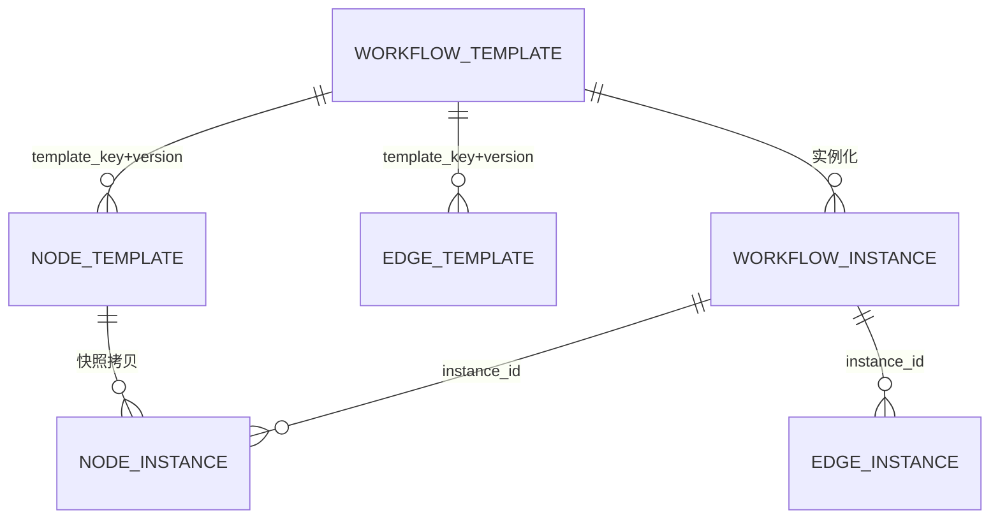

# ⑧ 附录 A · 数据库 DDL（6 张表）与 JDBC 仓储实现

<aside>
🗄️

原型默认跑 `InMemoryWorkflowRepository`（不需数据库即可验收）。本附录给出**可直接上生产的 6 张表 DDL** 与一个**纯 JDBC 仓储实现**，两者实现同一个 `WorkflowRepository` 接口，换库只需改 `SimApplication` 里的一行 `new`。

</aside>

## 数据模型全景



<aside>
🎯

**两体系分离的铁律：实例表不得依赖模版表的当前值。** 所以 `node_instance` 把仿真类型、MCP Server Key、Tool 名、超时、重试次数全部**快照拷贝**一份。否则模版今天改了参数，去年的历史实例就不可复现 —— 在半导体工艺场景这是严重的合规与追溯问题。

</aside>

---

## 1. `sql/schema.sql`

```sql
-- ============================================================
-- 自然语言驱动仿真工作流 · 数据库结构
-- 兼容 MySQL 5.7+ / 8.x（JSON 一律用 TEXT 存，避免低版本不支持 JSON 类型）
-- ============================================================
CREATE DATABASE IF NOT EXISTS sim_workflow
  DEFAULT CHARACTER SET utf8mb4 COLLATE utf8mb4_general_ci;
USE sim_workflow;

-- ------------------------------------------------------------
-- 1/6 工作流模版（模版体系的根）
-- ------------------------------------------------------------
CREATE TABLE IF NOT EXISTS workflow_template (
  id                  BIGINT UNSIGNED NOT NULL AUTO_INCREMENT,
  template_key        VARCHAR(128)    NOT NULL                COMMENT '业务唯一键，如 wf_cov_mesh_dual_slitho',
  version             INT             NOT NULL DEFAULT 1      COMMENT '版本号，模版不原地修改而是逐版本追加',
  name                VARCHAR(256)    NOT NULL,
  description         TEXT                                    COMMENT '自然语言描述，同时用作语义召回素材',
  domain_tag          VARCHAR(64)                             COMMENT '业务域，如 SEMICONDUCTOR / MEMS',
  tags                VARCHAR(512)                            COMMENT '逗号分隔的检索标签',
  source              VARCHAR(16)     NOT NULL DEFAULT 'HUMAN' COMMENT 'HUMAN / AGENT / IMPORT',
  status              VARCHAR(24)     NOT NULL DEFAULT 'DRAFT' COMMENT 'DRAFT / PENDING_CONFIRM / READY / DEPRECATED',
  default_inputs      TEXT                                    COMMENT 'JSON：工作流级默认入参',
  global_timeout_ms   BIGINT          NOT NULL DEFAULT 3600000 COMMENT '整张 DAG 的全局超时',
  fail_fast           TINYINT(1)      NOT NULL DEFAULT 1      COMMENT '关键节点失败是否立即中止全局',
  simulation_types    VARCHAR(256)                            COMMENT '冗余字段：逗号分隔，加速模版召回',
  max_parallel_branch INT             NOT NULL DEFAULT 1      COMMENT '冗余字段：最大并行分支数，召回硬门槛',
  node_count          INT             NOT NULL DEFAULT 0,
  edge_count          INT             NOT NULL DEFAULT 0,
  created_by          VARCHAR(64)                             COMMENT 'agent / 工号',
  confirmed_by        VARCHAR(64)                             COMMENT '人机确认人，AGENT 来源必填',
  confirmed_at        DATETIME        NULL,
  created_at          DATETIME        NOT NULL DEFAULT CURRENT_TIMESTAMP,
  updated_at          DATETIME        NOT NULL DEFAULT CURRENT_TIMESTAMP ON UPDATE CURRENT_TIMESTAMP,
  deleted             TINYINT(1)      NOT NULL DEFAULT 0,
  PRIMARY KEY (id),
  UNIQUE KEY uk_tpl_key_version (template_key, version),
  KEY idx_tpl_status (status, deleted),
  KEY idx_tpl_domain (domain_tag, max_parallel_branch),
  KEY idx_tpl_updated (updated_at)
) ENGINE=InnoDB DEFAULT CHARSET=utf8mb4 COMMENT='工作流模版';

-- ------------------------------------------------------------
-- 2/6 节点模版（绑定仿真类型 + Golden 默认参数）
-- ------------------------------------------------------------
CREATE TABLE IF NOT EXISTS node_template (
  id                BIGINT UNSIGNED NOT NULL AUTO_INCREMENT,
  template_key      VARCHAR(128)    NOT NULL,
  template_version  INT             NOT NULL DEFAULT 1,
  node_key          VARCHAR(64)     NOT NULL                COMMENT 'DAG 内唯一，如 cov_mesh / slitho_low',
  name              VARCHAR(256)    NOT NULL,
  simulation_type   VARCHAR(32)     NOT NULL                COMMENT 'COVENTOR / S_LITHO / ...',
  mcp_server_key    VARCHAR(64)     NOT NULL                COMMENT '路由到哪个 MCP Server',
  tool_prefix       VARCHAR(64)     NOT NULL                COMMENT 'Tool 名前缀，如 coventor',
  run_tool          VARCHAR(96)     NOT NULL                COMMENT '提交作业的 Tool 名',
  status_tool       VARCHAR(96)                             COMMENT '空则视为同步 Tool，不轮询',
  result_tool       VARCHAR(96),
  cancel_tool       VARCHAR(96),
  default_params    TEXT                                    COMMENT 'JSON：Golden Template 默认参数',
  param_mapping     TEXT                                    COMMENT 'JSON：${nodes.x.outputs.y} 透传表达式',
  timeout_ms        BIGINT          NOT NULL DEFAULT 180000 COMMENT '节点级超时',
  retry_limit       INT             NOT NULL DEFAULT 3      COMMENT '最大尝试次数（含首次）',
  poll_interval_ms  BIGINT          NOT NULL DEFAULT 400    COMMENT '轮询间隔',
  is_critical       TINYINT(1)      NOT NULL DEFAULT 1      COMMENT '0=失败不阻断整体',
  pos_x             INT             NOT NULL DEFAULT 0      COMMENT '前端画布坐标',
  pos_y             INT             NOT NULL DEFAULT 0,
  created_at        DATETIME        NOT NULL DEFAULT CURRENT_TIMESTAMP,
  PRIMARY KEY (id),
  UNIQUE KEY uk_node_tpl (template_key, template_version, node_key),
  KEY idx_node_tpl_sim (simulation_type),
  KEY idx_node_tpl_server (mcp_server_key)
) ENGINE=InnoDB DEFAULT CHARSET=utf8mb4 COMMENT='节点模版（绑定仿真类型与默认参数）';

-- ------------------------------------------------------------
-- 3/6 边模版（前驱-后继依赖 + 参数透传）
-- ------------------------------------------------------------
CREATE TABLE IF NOT EXISTS edge_template (
  id                BIGINT UNSIGNED NOT NULL AUTO_INCREMENT,
  template_key      VARCHAR(128)    NOT NULL,
  template_version  INT             NOT NULL DEFAULT 1,
  from_node_key     VARCHAR(64)     NOT NULL                COMMENT '前驱',
  to_node_key       VARCHAR(64)     NOT NULL                COMMENT '后继',
  edge_type         VARCHAR(16)     NOT NULL DEFAULT 'SEQ'  COMMENT 'SEQ 顺序 / COND 条件',
  condition_expr    VARCHAR(512)                            COMMENT '条件表达式，为空则无条件派发',
  data_mapping      TEXT                                    COMMENT 'JSON：边上的参数映射',
  created_at        DATETIME        NOT NULL DEFAULT CURRENT_TIMESTAMP,
  PRIMARY KEY (id),
  UNIQUE KEY uk_edge_tpl (template_key, template_version, from_node_key, to_node_key),
  KEY idx_edge_tpl_to (template_key, template_version, to_node_key)
) ENGINE=InnoDB DEFAULT CHARSET=utf8mb4 COMMENT='边模版（前驱后继关系）';

-- ------------------------------------------------------------
-- 4/6 工作流实例（运行时快照的根）
-- ------------------------------------------------------------
CREATE TABLE IF NOT EXISTS workflow_instance (
  id                BIGINT UNSIGNED NOT NULL AUTO_INCREMENT,
  instance_id        VARCHAR(64)    NOT NULL                COMMENT '业务主键，如 wi-7c1f0aab32d5',
  template_key       VARCHAR(128)   NOT NULL,
  template_version   INT            NOT NULL DEFAULT 1      COMMENT '指向实例化当时的模版版本',
  trace_id           VARCHAR(64)    NOT NULL                COMMENT '全链路跟踪，会随 MCP _meta 下传到 Python',
  agent_session_id   VARCHAR(64)                            COMMENT '哪个对话会话触发的',
  status             VARCHAR(24)    NOT NULL DEFAULT 'PENDING' COMMENT 'PENDING/RUNNING/SUCCEEDED/PARTIAL_SUCCEEDED/FAILED/CANCELLED',
  inputs             TEXT                                   COMMENT 'JSON：工作流级入参快照',
  global_timeout_ms  BIGINT         NOT NULL DEFAULT 3600000,
  fail_fast          TINYINT(1)     NOT NULL DEFAULT 1,
  started_at         DATETIME       NULL,
  finished_at        DATETIME       NULL,
  cost_ms            BIGINT         NOT NULL DEFAULT 0,
  error_message      TEXT,
  created_by         VARCHAR(64),
  opt_version        INT            NOT NULL DEFAULT 0      COMMENT '乐观锁，防多节点调度器并发改同一实例',
  created_at         DATETIME       NOT NULL DEFAULT CURRENT_TIMESTAMP,
  updated_at         DATETIME       NOT NULL DEFAULT CURRENT_TIMESTAMP ON UPDATE CURRENT_TIMESTAMP,
  PRIMARY KEY (id),
  UNIQUE KEY uk_wi_instance (instance_id),
  KEY idx_wi_status (status, updated_at)     COMMENT '扫表找卡住的实例（守护进程）',
  KEY idx_wi_template (template_key, template_version),
  KEY idx_wi_trace (trace_id),
  KEY idx_wi_session (agent_session_id)
) ENGINE=InnoDB DEFAULT CHARSET=utf8mb4 COMMENT='工作流实例';

-- ------------------------------------------------------------
-- 5/6 节点实例（执行快照 + 状态追踪，整个系统写入最频繁的表）
-- ------------------------------------------------------------
CREATE TABLE IF NOT EXISTS node_instance (
  id                BIGINT UNSIGNED NOT NULL AUTO_INCREMENT,
  instance_id       VARCHAR(64)    NOT NULL,
  node_key          VARCHAR(64)    NOT NULL,
  name              VARCHAR(256),
  -- 以下 8 个字段都是从 node_template 拷过来的快照，不得回查模版
  simulation_type   VARCHAR(32)    NOT NULL,
  mcp_server_key    VARCHAR(64)    NOT NULL,
  run_tool          VARCHAR(96)    NOT NULL,
  status_tool       VARCHAR(96),
  result_tool       VARCHAR(96),
  cancel_tool       VARCHAR(96),
  timeout_ms        BIGINT         NOT NULL DEFAULT 180000,
  max_attempts      INT            NOT NULL DEFAULT 3,
  poll_interval_ms  BIGINT         NOT NULL DEFAULT 400,
  is_critical       TINYINT(1)     NOT NULL DEFAULT 1,
  raw_params        TEXT                                   COMMENT 'JSON：模版默认值 + 用户覆盖（未解析）',
  param_mapping     TEXT                                   COMMENT 'JSON：本节点的透传表达式',
  resolved_params   TEXT                                   COMMENT 'JSON：真正发给 MCP 的最终参数（可复现关键）',
  outputs           TEXT                                   COMMENT 'JSON：仿真产物，下游透传的数据源',
  status            VARCHAR(24)    NOT NULL DEFAULT 'PENDING' COMMENT 'PENDING/RUNNING/RETRYING/SUCCEEDED/FAILED/TIMEOUT/SKIPPED/CANCELLED',
  attempt           INT            NOT NULL DEFAULT 0,
  progress          DECIMAL(5,4)   NOT NULL DEFAULT 0,
  stage             VARCHAR(32)                            COMMENT '远端阶段，如 meshing / solving',
  remote_job_id     VARCHAR(96)                            COMMENT 'Python 侧作业号，对账与取消用',
  idempotency_key   VARCHAR(160)                           COMMENT 'instance:node:attempt，防重复提交',
  error_code        VARCHAR(64),
  error_message     TEXT,
  node_log          MEDIUMTEXT                             COMMENT '节点级执行日志（可拆到 ES）',
  started_at        DATETIME       NULL,
  finished_at       DATETIME       NULL,
  cost_ms           BIGINT         NOT NULL DEFAULT 0,
  opt_version       INT            NOT NULL DEFAULT 0,
  created_at        DATETIME       NOT NULL DEFAULT CURRENT_TIMESTAMP,
  updated_at        DATETIME       NOT NULL DEFAULT CURRENT_TIMESTAMP ON UPDATE CURRENT_TIMESTAMP,
  PRIMARY KEY (id),
  UNIQUE KEY uk_ni (instance_id, node_key),
  KEY idx_ni_status (status, updated_at),
  KEY idx_ni_job (remote_job_id),
  KEY idx_ni_sim (simulation_type, status)   COMMENT '按仿真类型统计排队与 license 占用'
) ENGINE=InnoDB DEFAULT CHARSET=utf8mb4 COMMENT='节点实例（执行快照与状态追踪）';

-- ------------------------------------------------------------
-- 6/6 边实例（记录本次执行里依赖到底走不走）
-- ------------------------------------------------------------
CREATE TABLE IF NOT EXISTS edge_instance (
  id              BIGINT UNSIGNED NOT NULL AUTO_INCREMENT,
  instance_id     VARCHAR(64)   NOT NULL,
  from_node_key   VARCHAR(64)   NOT NULL,
  to_node_key     VARCHAR(64)   NOT NULL,
  edge_type       VARCHAR(16)   NOT NULL DEFAULT 'SEQ',
  condition_expr  VARCHAR(512),
  data_mapping    TEXT                                  COMMENT 'JSON：快照的透传映射',
  resolved_data   TEXT                                  COMMENT 'JSON：本次真实透传过去的值（审计用）',
  status          VARCHAR(16)   NOT NULL DEFAULT 'PENDING' COMMENT 'PENDING / ACTIVE / SKIPPED',
  evaluated_at    DATETIME      NULL                    COMMENT '条件评估时间',
  created_at      DATETIME      NOT NULL DEFAULT CURRENT_TIMESTAMP,
  PRIMARY KEY (id),
  UNIQUE KEY uk_ei (instance_id, from_node_key, to_node_key),
  KEY idx_ei_to (instance_id, to_node_key)   COMMENT '前驱守卫按 to 查入边'
) ENGINE=InnoDB DEFAULT CHARSET=utf8mb4 COMMENT='边实例';

-- ============================================================
-- 以下两张为可选增强表（非题目要求的 6 张，但生产强烈建议）
-- ============================================================
CREATE TABLE IF NOT EXISTS agent_session (
  id                  BIGINT UNSIGNED NOT NULL AUTO_INCREMENT,
  session_id          VARCHAR(64)  NOT NULL,
  user_id             VARCHAR(64),
  state               VARCHAR(24)  NOT NULL DEFAULT 'IDLE' COMMENT '对应 AgentSession.State',
  pending_template_key VARCHAR(128)                        COMMENT '待人机确认的模版',
  last_instance_id    VARCHAR(64),
  history             MEDIUMTEXT                           COMMENT 'JSON：完整对话与 tool_calls，实现跨进程恢复',
  created_at          DATETIME     NOT NULL DEFAULT CURRENT_TIMESTAMP,
  updated_at          DATETIME     NOT NULL DEFAULT CURRENT_TIMESTAMP ON UPDATE CURRENT_TIMESTAMP,
  PRIMARY KEY (id),
  UNIQUE KEY uk_session (session_id),
  KEY idx_session_state (state, updated_at)
) ENGINE=InnoDB DEFAULT CHARSET=utf8mb4 COMMENT='Agent 会话（人机确认可跨重启恢复）';

CREATE TABLE IF NOT EXISTS workflow_event (
  id           BIGINT UNSIGNED NOT NULL AUTO_INCREMENT,
  instance_id  VARCHAR(64)  NOT NULL,
  node_key     VARCHAR(64),
  type         VARCHAR(32)  NOT NULL COMMENT 'WORKFLOW_START/NODE_SUBMIT/NODE_PROGRESS/NODE_RETRY/NODE_DONE/WORKFLOW_END',
  status       VARCHAR(24),
  progress     DECIMAL(5,4) NOT NULL DEFAULT 0,
  message      TEXT,
  ts           BIGINT       NOT NULL COMMENT '事件时间戳（毫秒）',
  PRIMARY KEY (id),
  KEY idx_ev_instance (instance_id, id),
  KEY idx_ev_ts (ts)
) ENGINE=InnoDB DEFAULT CHARSET=utf8mb4 COMMENT='引擎事件流（审计与回放）';

-- ============================================================
-- 种子数据：与 SeedData.java 一致的 Golden Template
-- ============================================================
INSERT INTO workflow_template
  (template_key, version, name, description, domain_tag, tags, source, status,
   simulation_types, max_parallel_branch, node_count, edge_count, created_by)
VALUES
  ('wf_cov_mesh_dual_slitho', 1, 'Coventor 网格 + 双光强 S-Litho 并行',
   '先跑一个 Coventor 基础网格仿真，再基于其网格产物并行跑两个不同光强参数的 S-Litho 光刻仿真',
   'SEMICONDUCTOR', 'coventor,slitho,光刻,网格,并行,光强,mems', 'HUMAN', 'READY',
   'COVENTOR,S_LITHO', 2, 3, 2, 'platform')
ON DUPLICATE KEY UPDATE updated_at = CURRENT_TIMESTAMP;

INSERT INTO node_template
  (template_key, template_version, node_key, name, simulation_type, mcp_server_key, tool_prefix,
   run_tool, status_tool, result_tool, cancel_tool, default_params, timeout_ms, retry_limit,
   poll_interval_ms, is_critical, pos_x, pos_y)
VALUES
  ('wf_cov_mesh_dual_slitho', 1, 'cov_mesh', 'Coventor 基础网格仿真', 'COVENTOR', 'coventor', 'coventor',
   'coventor_run_simulation', 'coventor_get_status', 'coventor_get_result', 'coventor_cancel',
   '{"structure":"${inputs.structure:-mems_cantilever}","mesh_size_um":0.5,"material":"Poly-Si","solver":"static"}',
   180000, 3, 400, 1, 0, 0),
  ('wf_cov_mesh_dual_slitho', 1, 'slitho_low', 'S-Litho 低光强 0.8', 'S_LITHO', 'slitho', 'slitho',
   'slitho_run_simulation', 'slitho_get_status', 'slitho_get_result', 'slitho_cancel',
   '{"illumination_intensity":0.8,"numerical_aperture":1.35,"wavelength_nm":193.0,"resist_model":"CAR","mask_file":"${inputs.mask_file:-/mnt/sim/default/mask.gds}"}',
   180000, 3, 400, 1, 240, -80),
  ('wf_cov_mesh_dual_slitho', 1, 'slitho_high', 'S-Litho 高光强 1.2', 'S_LITHO', 'slitho', 'slitho',
   'slitho_run_simulation', 'slitho_get_status', 'slitho_get_result', 'slitho_cancel',
   '{"illumination_intensity":1.2,"numerical_aperture":1.35,"wavelength_nm":193.0,"resist_model":"CAR","mask_file":"${inputs.mask_file:-/mnt/sim/default/mask.gds}"}',
   180000, 3, 400, 1, 240, 80)
ON DUPLICATE KEY UPDATE name = VALUES(name);

INSERT INTO edge_template
  (template_key, template_version, from_node_key, to_node_key, edge_type, data_mapping)
VALUES
  ('wf_cov_mesh_dual_slitho', 1, 'cov_mesh', 'slitho_low', 'SEQ',
   '{"mesh_file":"${nodes.cov_mesh.outputs.mesh_file}"}'),
  ('wf_cov_mesh_dual_slitho', 1, 'cov_mesh', 'slitho_high', 'SEQ',
   '{"mesh_file":"${nodes.cov_mesh.outputs.mesh_file}"}')
ON DUPLICATE KEY UPDATE edge_type = VALUES(edge_type);
```

---

## 2. 关键字段设计走查

| 字段 | 所属表 | 为什么必须有 |
| --- | --- | --- |
| `template_key`  • `version` | 模版三张表 | 模版**不原地改**，改就发新版本；历史实例永远能指回当时的结构 |
| `simulation_types` / `max_parallel_branch` | `workflow_template` | 召回冗余字段。没它就得 join 两张子表再聚合，模版一多直接卡死 |
| `status` = `PENDING_CONFIRM` | `workflow_template` | **人机确认闸门落库**。Agent 新建模版默认这个状态，未确认无法执行也不参与召回 |
| `mcp_server_key` / `run_tool` | 节点两表 | 仿真类型 → MCP 路由表落库，新增仿真类型**不用改 Java 代码** |
| `raw_params` vs `resolved_params` | `node_instance` | 前者是“请求什么”，后者是“实际发了什么”。出了事靠后者定责，也靠它一键复现 |
| `remote_job_id` | `node_instance` | Java 重启后能拿它**对账/继续轮询/取消**，避免孤儿作业烧 license |
| `idempotency_key` | `node_instance` | `instance:node:attempt`，供 Python 侧去重；重试时 attempt 变化才会真重算 |
| `attempt` / `max_attempts` | `node_instance` | 重试可观测；守护进程可以据此做“超过 N 次告警” |
| `progress` / `stage` | `node_instance` | 前端进度条与 SSE 推送的数据源 |
| `opt_version` | 实例两表 | 乐观锁。多节点部署时防两个调度器同时推同一个节点状态 |
| `status` = `SKIPPED` | `edge_instance` | 条件边未命中的现场保留，与“节点失败导致跳过”区分开 |

<aside>
💡

**为何 JSON 一律用 `TEXT` 而不用 `JSON` 列型？** 题目明确说了“Java 后端版本较低”，这类环境往往配的也是 MySQL 5.6/5.7 或国产数据库，JSON 列型与函数支持参差不齐。`TEXT` + 应用层 `MiniJson` 序列化是最小风险选择；如果确定是 MySQL 8，把 `default_params` / `outputs` 换成 `JSON` 并加函数索引即可，仓储代码不用改。

</aside>

---

## 3. `repo/JdbcWorkflowRepository.java`（纯 JDBC，无 ORM）

<aside>
🧷

本类严格实现 Module 3A 里那个 `WorkflowRepository` 接口，与 `InMemoryWorkflowRepository` 可直接对插。只用 `DriverManager` + `PreparedStatement`，不依赖 MyBatis / JPA；生产环境把 `open()` 换成连接池（Druid / HikariCP）的 `dataSource.getConnection()` 即可，其余一行不动。

</aside>

```java
// ===== file: src/main/java/com/sim/agent/repo/JdbcWorkflowRepository.java =====
package com.sim.agent.repo;

import com.sim.agent.domain.EdgeInstance;
import com.sim.agent.domain.EdgeTemplate;
import com.sim.agent.domain.NodeInstance;
import com.sim.agent.domain.NodeStatus;
import com.sim.agent.domain.NodeTemplate;
import com.sim.agent.domain.WorkflowInstance;
import com.sim.agent.domain.WorkflowStatus;
import com.sim.agent.domain.WorkflowTemplate;
import com.sim.agent.json.MiniJson;

import java.sql.Connection;
import java.sql.DriverManager;
import java.sql.PreparedStatement;
import java.sql.ResultSet;
import java.sql.SQLException;
import java.sql.Timestamp;
import java.util.ArrayList;
import java.util.Collections;
import java.util.Comparator;
import java.util.LinkedHashMap;
import java.util.List;
import java.util.Locale;
import java.util.Map;

/**
 * 纯 JDBC 仓储实现。设计要点：
 *  1) 模版写入是「发新版本」语义，永不原地 UPDATE，保障历史实例可复现；
 *  2) 实例写入全部走事务，一次落库 workflow_instance + node_instance + edge_instance；
 *  3) 节点状态回写用乐观锁（opt_version），防多节点调度器互相覆盖；
 *  4) 模版召回先用 SQL 做粗筛（仿真类型 + 并行度 + 关键词 LIKE），再在 Java 里打分。
 */
public class JdbcWorkflowRepository implements WorkflowRepository {

    private final String url;
    private final String user;
    private final String password;

    public JdbcWorkflowRepository(String url, String user, String password) {
        this.url = url;
        this.user = user;
        this.password = password;
        loadDriver();
    }

    private static void loadDriver() {
        try {
            Class.forName("com.mysql.cj.jdbc.Driver");            // MySQL 8 驱动
        } catch (ClassNotFoundException ignore) {
            try {
                Class.forName("com.mysql.jdbc.Driver");           // 5.1.x 旧驱动
            } catch (ClassNotFoundException e) {
                throw new IllegalStateException("classpath 里没有 MySQL JDBC 驱动", e);
            }
        }
    }

    private Connection open() throws SQLException {
        return DriverManager.getConnection(url, user, password);
    }

    /* ==================== 模版体系 ==================== */

    /** 发布新版本（version = max+1），一事务写三张表 */
    @Override
    public WorkflowTemplate saveTemplate(WorkflowTemplate t) {
        Connection c = null;
        try {
            c = open();
            c.setAutoCommit(false);
            t.version = maxVersion(c, t.templateKey) + 1;
            insertTemplate(c, t);
            insertNodeTemplates(c, t);
            insertEdgeTemplates(c, t);
            c.commit();
            System.out.println("[repo] 保存模版 " + t.templateKey + " v" + t.version
                    + " [" + t.name + "] nodes=" + t.nodes.size() + " edges=" + t.edges.size());
            return t;
        } catch (SQLException e) {
            rollback(c);
            throw new RuntimeException("saveTemplate 失败: " + e.getMessage(), e);
        } finally {
            quietClose(c);
        }
    }

    private int maxVersion(Connection c, String key) throws SQLException {
        PreparedStatement ps = c.prepareStatement(
                "SELECT COALESCE(MAX(version),0) FROM workflow_template WHERE template_key=?");
        try {
            ps.setString(1, key);
            ResultSet rs = ps.executeQuery();
            return rs.next() ? rs.getInt(1) : 0;
        } finally {
            ps.close();
        }
    }

    private void insertTemplate(Connection c, WorkflowTemplate t) throws SQLException {
        String sql = "INSERT INTO workflow_template (template_key, version, name, description, domain_tag,"
                + " tags, source, status, default_inputs, global_timeout_ms, fail_fast, simulation_types,"
                + " max_parallel_branch, node_count, edge_count, created_by, confirmed_by, confirmed_at)"
                + " VALUES (?,?,?,?,?,?,?,?,?,?,?,?,?,?,?,?,?,?)";
        PreparedStatement ps = c.prepareStatement(sql);
        try {
            ps.setString(1, t.templateKey);
            ps.setInt(2, t.version);
            ps.setString(3, t.name);
            ps.setString(4, t.description);
            ps.setString(5, t.domainTag);
            ps.setString(6, join(t.tags));
            ps.setString(7, t.source);
            ps.setString(8, t.status.name());
            ps.setString(9, MiniJson.stringify(t.defaultInputs));
            ps.setLong(10, t.globalTimeoutMs);
            ps.setInt(11, t.failFast ? 1 : 0);
            ps.setString(12, join(t.simulationTypes()));
            ps.setInt(13, t.maxParallelBranch());
            ps.setInt(14, t.nodes.size());
            ps.setInt(15, t.edges.size());
            ps.setString(16, t.createdBy);
            ps.setString(17, t.confirmedBy);
            ps.setTimestamp(18, ts(t.confirmedAt));
            ps.executeUpdate();
        } finally {
            ps.close();
        }
    }

    private void insertNodeTemplates(Connection c, WorkflowTemplate t) throws SQLException {
        String sql = "INSERT INTO node_template (template_key, template_version, node_key, name,"
                + " simulation_type, mcp_server_key, tool_prefix, run_tool, status_tool, result_tool,"
                + " cancel_tool, default_params, param_mapping, timeout_ms, retry_limit,"
                + " poll_interval_ms, is_critical, pos_x, pos_y) VALUES (?,?,?,?,?,?,?,?,?,?,?,?,?,?,?,?,?,?,?)";
        PreparedStatement ps = c.prepareStatement(sql);
        try {
            for (NodeTemplate n : t.nodes) {
                ps.setString(1, t.templateKey);
                ps.setInt(2, t.version);
                ps.setString(3, n.nodeKey);
                ps.setString(4, n.name);
                ps.setString(5, n.simulationType);
                ps.setString(6, n.mcpServerKey);
                ps.setString(7, n.toolPrefix);
                ps.setString(8, n.runTool());
                ps.setString(9, n.statusTool());
                ps.setString(10, n.resultTool());
                ps.setString(11, n.cancelTool());
                ps.setString(12, MiniJson.stringify(n.defaultParams));
                ps.setString(13, MiniJson.stringify(n.paramMapping));
                ps.setLong(14, n.timeoutMs);
                ps.setInt(15, n.retryLimit);
                ps.setLong(16, n.pollIntervalMs);
                ps.setInt(17, n.critical ? 1 : 0);
                ps.setInt(18, n.posX);
                ps.setInt(19, n.posY);
                ps.addBatch();
            }
            ps.executeBatch();
        } finally {
            ps.close();
        }
    }

    private void insertEdgeTemplates(Connection c, WorkflowTemplate t) throws SQLException {
        String sql = "INSERT INTO edge_template (template_key, template_version, from_node_key,"
                + " to_node_key, edge_type, condition_expr, data_mapping) VALUES (?,?,?,?,?,?,?)";
        PreparedStatement ps = c.prepareStatement(sql);
        try {
            for (EdgeTemplate e : t.edges) {
                ps.setString(1, t.templateKey);
                ps.setInt(2, t.version);
                ps.setString(3, e.fromNodeKey);
                ps.setString(4, e.toNodeKey);
                ps.setString(5, e.conditionExpr == null ? "SEQ" : "COND");
                ps.setString(6, e.conditionExpr);
                ps.setString(7, MiniJson.stringify(e.dataMapping));
                ps.addBatch();
            }
            ps.executeBatch();
        } finally {
            ps.close();
        }
    }

    /** 取最新版本的模版（含节点与边） */
    @Override
    public WorkflowTemplate findTemplateByKey(String templateKey) {
        Connection c = null;
        try {
            c = open();
            PreparedStatement ps = c.prepareStatement(
                    "SELECT * FROM workflow_template WHERE template_key=? AND deleted=0"
                            + " ORDER BY version DESC LIMIT 1");
            ps.setString(1, templateKey);
            ResultSet rs = ps.executeQuery();
            WorkflowTemplate t = rs.next() ? mapTemplate(rs) : null;
            rs.close();
            ps.close();
            if (t == null) return null;
            loadNodeTemplates(c, t);
            loadEdgeTemplates(c, t);
            return t;
        } catch (SQLException e) {
            throw new RuntimeException("findTemplateByKey 失败: " + e.getMessage(), e);
        } finally {
            quietClose(c);
        }
    }

    @Override
    public WorkflowTemplate findTemplate(String templateKey, int version) {
        Connection c = null;
        try {
            c = open();
            PreparedStatement ps = c.prepareStatement(
                    "SELECT * FROM workflow_template WHERE template_key=? AND version=?");
            ps.setString(1, templateKey);
            ps.setInt(2, version);
            ResultSet rs = ps.executeQuery();
            WorkflowTemplate t = rs.next() ? mapTemplate(rs) : null;
            rs.close();
            ps.close();
            if (t == null) return null;
            loadNodeTemplates(c, t);
            loadEdgeTemplates(c, t);
            return t;
        } catch (SQLException e) {
            throw new RuntimeException("findTemplate 失败: " + e.getMessage(), e);
        } finally {
            quietClose(c);
        }
    }

    /**
     * 模版召回：SQL 粗筛 + Java 打分。
     * 粗筛只看硬条件（READY / 未删 / 并行度达标），避免把打分逻辑写成不可维护的 SQL。
     */
    @Override
    public List<TemplateMatch> searchTemplates(String keyword, List<String> simulationTypes,
                                               Integer parallelBranchHint, int limit) {
        Connection c = null;
        try {
            c = open();
            StringBuilder sb = new StringBuilder(
                    "SELECT * FROM workflow_template WHERE deleted=0 AND status='READY'");
            List<Object> args = new ArrayList<Object>();
            if (parallelBranchHint != null && parallelBranchHint.intValue() > 1) {
                sb.append(" AND max_parallel_branch >= ?");
                args.add(parallelBranchHint);
            }
            if (simulationTypes != null && !simulationTypes.isEmpty()) {
                sb.append(" AND (");
                for (int i = 0; i < simulationTypes.size(); i++) {
                    if (i > 0) sb.append(" AND ");
                    sb.append("simulation_types LIKE ?");
                    args.add("%" + simulationTypes.get(i) + "%");
                }
                sb.append(")");
            }
            sb.append(" ORDER BY updated_at DESC LIMIT 200");

            PreparedStatement ps = c.prepareStatement(sb.toString());
            for (int i = 0; i < args.size(); i++) ps.setObject(i + 1, args.get(i));
            ResultSet rs = ps.executeQuery();
            List<WorkflowTemplate> candidates = new ArrayList<WorkflowTemplate>();
            while (rs.next()) candidates.add(mapTemplate(rs));
            rs.close();
            ps.close();

            List<TemplateMatch> out = new ArrayList<TemplateMatch>();
            for (WorkflowTemplate t : candidates) {
                loadNodeTemplates(c, t);
                loadEdgeTemplates(c, t);
                double score = score(t, keyword, simulationTypes, parallelBranchHint);
                if (score <= 0) continue;
                out.add(new TemplateMatch(t, score, reason(t, score)));
            }
            Collections.sort(out, new Comparator<TemplateMatch>() {
                @Override public int compare(TemplateMatch a, TemplateMatch b) {
                    return Double.compare(b.score, a.score);
                }
            });
            return out.size() > limit ? new ArrayList<TemplateMatch>(out.subList(0, limit)) : out;
        } catch (SQLException e) {
            throw new RuntimeException("searchTemplates 失败: " + e.getMessage(), e);
        } finally {
            quietClose(c);
        }
    }

    /** 词频命中 + 类型覆盖 + 并行度匹配，与内存版保持同一口径 */
    private static double score(WorkflowTemplate t, String keyword,
                               List<String> types, Integer hint) {
        String hay = (t.name + " " + t.description + " " + join(t.tags) + " "
                + join(t.simulationTypes())).toLowerCase(Locale.ROOT);
        double s = 0;
        if (keyword != null) {
            String[] tokens = keyword.toLowerCase(Locale.ROOT).split("[\\s,，、/]+");
            int hit = 0, total = 0;
            for (int i = 0; i < tokens.length; i++) {
                if (tokens[i].isEmpty()) continue;
                total++;
                if (hay.contains(tokens[i])) hit++;
            }
            if (total > 0) s += 0.6 * hit / total;
        }
        if (types != null && !types.isEmpty()) {
            int hit = 0;
            for (String ty : types) if (t.simulationTypes().contains(ty)) hit++;
            s += 0.3 * hit / types.size();
            if (hit < types.size()) return 0;      // 类型没覆盖全，直接判不可用
        }
        if (hint != null) {
            s += t.maxParallelBranch() >= hint.intValue() ? 0.1 : -0.4;
        }
        return s;
    }

    private static String reason(WorkflowTemplate t, double score) {
        return "类型覆盖 " + join(t.simulationTypes()) + "，最大并行分支 "
                + t.maxParallelBranch() + "，得分 " + String.format(Locale.ROOT, "%.2f", score);
    }

    private void loadNodeTemplates(Connection c, WorkflowTemplate t) throws SQLException {
        PreparedStatement ps = c.prepareStatement(
                "SELECT * FROM node_template WHERE template_key=? AND template_version=? ORDER BY id");
        try {
            ps.setString(1, t.templateKey);
            ps.setInt(2, t.version);
            ResultSet rs = ps.executeQuery();
            t.nodes.clear();
            while (rs.next()) {
                NodeTemplate n = new NodeTemplate(rs.getString("node_key"), rs.getString("name"),
                        rs.getString("simulation_type"), rs.getString("mcp_server_key"),
                        rs.getString("tool_prefix"));
                n.defaultParams.putAll(jsonMap(rs.getString("default_params")));
                n.paramMapping.putAll(jsonStringMap(rs.getString("param_mapping")));
                n.timeout(rs.getLong("timeout_ms"))
                 .retry(rs.getInt("retry_limit"))
                 .poll(rs.getLong("poll_interval_ms"))
                 .critical(rs.getInt("is_critical") == 1);
                n.posX = rs.getInt("pos_x");
                n.posY = rs.getInt("pos_y");
                t.nodes.add(n);
            }
            rs.close();
        } finally {
            ps.close();
        }
    }

    private void loadEdgeTemplates(Connection c, WorkflowTemplate t) throws SQLException {
        PreparedStatement ps = c.prepareStatement(
                "SELECT * FROM edge_template WHERE template_key=? AND template_version=? ORDER BY id");
        try {
            ps.setString(1, t.templateKey);
            ps.setInt(2, t.version);
            ResultSet rs = ps.executeQuery();
            t.edges.clear();
            while (rs.next()) {
                EdgeTemplate e = new EdgeTemplate(rs.getString("from_node_key"), rs.getString("to_node_key"));
                e.conditionExpr = rs.getString("condition_expr");
                e.dataMapping.putAll(jsonStringMap(rs.getString("data_mapping")));
                t.edges.add(e);
            }
            rs.close();
        } finally {
            ps.close();
        }
    }

    private WorkflowTemplate mapTemplate(ResultSet rs) throws SQLException {
        WorkflowTemplate t = new WorkflowTemplate();
        t.templateKey = rs.getString("template_key");
        t.version = rs.getInt("version");
        t.name = rs.getString("name");
        t.description = rs.getString("description");
        t.domainTag = rs.getString("domain_tag");
        t.tags.addAll(split(rs.getString("tags")));
        t.source = rs.getString("source");
        t.status = WorkflowStatus.valueOf(rs.getString("status"));
        t.defaultInputs.putAll(jsonMap(rs.getString("default_inputs")));
        t.globalTimeoutMs = rs.getLong("global_timeout_ms");
        t.failFast = rs.getInt("fail_fast") == 1;
        t.createdBy = rs.getString("created_by");
        t.confirmedBy = rs.getString("confirmed_by");
        t.confirmedAt = ms(rs.getTimestamp("confirmed_at"));
        return t;
    }

    /* ==================== 实例体系 ==================== */

    @Override
    public WorkflowInstance saveInstance(WorkflowInstance wi) {
        Connection c = null;
        try {
            c = open();
            c.setAutoCommit(false);
            PreparedStatement ps = c.prepareStatement(
                    "INSERT INTO workflow_instance (instance_id, template_key, template_version, trace_id,"
                            + " agent_session_id, status, inputs, global_timeout_ms, fail_fast, created_by)"
                            + " VALUES (?,?,?,?,?,?,?,?,?,?)");
            ps.setString(1, wi.id);
            ps.setString(2, wi.templateKey);
            ps.setInt(3, wi.templateVersion);
            ps.setString(4, wi.traceId);
            ps.setString(5, wi.agentSessionId);
            ps.setString(6, wi.status.name());
            ps.setString(7, MiniJson.stringify(wi.inputs));
            ps.setLong(8, wi.globalTimeoutMs);
            ps.setInt(9, wi.failFast ? 1 : 0);
            ps.setString(10, wi.createdBy);
            ps.executeUpdate();
            ps.close();

            PreparedStatement pn = c.prepareStatement(
                    "INSERT INTO node_instance (instance_id, node_key, name, simulation_type, mcp_server_key,"
                            + " run_tool, status_tool, result_tool, cancel_tool, timeout_ms, max_attempts,"
                            + " poll_interval_ms, is_critical, raw_params, param_mapping, status)"
                            + " VALUES (?,?,?,?,?,?,?,?,?,?,?,?,?,?,?,?)");
            for (NodeInstance n : wi.nodes) {
                pn.setString(1, wi.id);
                pn.setString(2, n.nodeKey);
                pn.setString(3, n.name);
                pn.setString(4, n.simulationType);
                pn.setString(5, n.mcpServerKey);
                pn.setString(6, n.runTool);
                pn.setString(7, n.statusTool);
                pn.setString(8, n.resultTool);
                pn.setString(9, n.cancelTool);
                pn.setLong(10, n.timeoutMs);
                pn.setInt(11, n.maxAttempts);
                pn.setLong(12, n.pollIntervalMs);
                pn.setInt(13, n.critical ? 1 : 0);
                pn.setString(14, MiniJson.stringify(n.rawParams));
                pn.setString(15, MiniJson.stringify(n.paramMapping));
                pn.setString(16, n.status.name());
                pn.addBatch();
            }
            pn.executeBatch();
            pn.close();

            PreparedStatement pe = c.prepareStatement(
                    "INSERT INTO edge_instance (instance_id, from_node_key, to_node_key, edge_type,"
                            + " condition_expr, data_mapping, status) VALUES (?,?,?,?,?,?,?)");
            for (EdgeInstance e : wi.edges) {
                pe.setString(1, wi.id);
                pe.setString(2, e.fromNodeKey);
                pe.setString(3, e.toNodeKey);
                pe.setString(4, e.conditionExpr == null ? "SEQ" : "COND");
                pe.setString(5, e.conditionExpr);
                pe.setString(6, MiniJson.stringify(e.dataMapping));
                pe.setString(7, e.status);
                pe.addBatch();
            }
            pe.executeBatch();
            pe.close();

            c.commit();
            System.out.println("[repo] 创建实例 " + wi.id + " <- 模版 " + wi.templateKey
                    + " v" + wi.templateVersion + " 节点数=" + wi.nodes.size());
            return wi;
        } catch (SQLException e) {
            rollback(c);
            throw new RuntimeException("saveInstance 失败: " + e.getMessage(), e);
        } finally {
            quietClose(c);
        }
    }

    /** 工作流级状态回写（乐观锁） */
    @Override
    public void touchInstance(WorkflowInstance wi) {
        Connection c = null;
        try {
            c = open();
            PreparedStatement ps = c.prepareStatement(
                    "UPDATE workflow_instance SET status=?, started_at=?, finished_at=?, cost_ms=?,"
                            + " error_message=?, opt_version=opt_version+1 WHERE instance_id=?");
            ps.setString(1, wi.status.name());
            ps.setTimestamp(2, ts(wi.startedAt));
            ps.setTimestamp(3, ts(wi.finishedAt));
            ps.setLong(4, wi.costMs());
            ps.setString(5, wi.errorMessage);
            ps.setString(6, wi.id);
            ps.executeUpdate();
            ps.close();
        } catch (SQLException e) {
            throw new RuntimeException("touchInstance 失败: " + e.getMessage(), e);
        } finally {
            quietClose(c);
        }
    }

    /** 节点级状态回写：高频调用（每次轮询都会进），只写变化列 */
    @Override
    public void touchNode(NodeInstance n) {
        Connection c = null;
        try {
            c = open();
            PreparedStatement ps = c.prepareStatement(
                    "UPDATE node_instance SET status=?, attempt=?, progress=?, stage=?, remote_job_id=?,"
                            + " idempotency_key=?, resolved_params=?, outputs=?, error_code=?, error_message=?,"
                            + " node_log=?, started_at=?, finished_at=?, cost_ms=?, opt_version=opt_version+1"
                            + " WHERE instance_id=? AND node_key=?");
            ps.setString(1, n.status.name());
            ps.setInt(2, n.attempt);
            ps.setDouble(3, n.progress);
            ps.setString(4, n.stage);
            ps.setString(5, n.remoteJobId);
            ps.setString(6, n.idempotencyKey());
            ps.setString(7, MiniJson.stringify(n.resolvedParams));
            ps.setString(8, MiniJson.stringify(n.outputs));
            ps.setString(9, n.errorCode);
            ps.setString(10, n.errorMessage);
            ps.setString(11, n.logText());
            ps.setTimestamp(12, ts(n.startedAt));
            ps.setTimestamp(13, ts(n.finishedAt));
            ps.setLong(14, n.costMs());
            ps.setString(15, n.instanceId);
            ps.setString(16, n.nodeKey);
            ps.executeUpdate();
            ps.close();
        } catch (SQLException e) {
            throw new RuntimeException("touchNode 失败: " + e.getMessage(), e);
        } finally {
            quietClose(c);
        }
    }

    @Override
    public WorkflowInstance findInstance(String instanceId) {
        Connection c = null;
        try {
            c = open();
            PreparedStatement ps = c.prepareStatement(
                    "SELECT * FROM workflow_instance WHERE instance_id=?");
            ps.setString(1, instanceId);
            ResultSet rs = ps.executeQuery();
            if (!rs.next()) { rs.close(); ps.close(); return null; }

            WorkflowInstance wi = new WorkflowInstance();
            wi.id = rs.getString("instance_id");
            wi.templateKey = rs.getString("template_key");
            wi.templateVersion = rs.getInt("template_version");
            wi.traceId = rs.getString("trace_id");
            wi.agentSessionId = rs.getString("agent_session_id");
            wi.status = WorkflowStatus.valueOf(rs.getString("status"));
            wi.inputs.putAll(jsonMap(rs.getString("inputs")));
            wi.globalTimeoutMs = rs.getLong("global_timeout_ms");
            wi.failFast = rs.getInt("fail_fast") == 1;
            wi.startedAt = ms(rs.getTimestamp("started_at"));
            wi.finishedAt = ms(rs.getTimestamp("finished_at"));
            wi.errorMessage = rs.getString("error_message");
            wi.createdBy = rs.getString("created_by");
            rs.close();
            ps.close();

            PreparedStatement pn = c.prepareStatement(
                    "SELECT * FROM node_instance WHERE instance_id=? ORDER BY id");
            pn.setString(1, instanceId);
            ResultSet rn = pn.executeQuery();
            while (rn.next()) {
                NodeInstance n = new NodeInstance();
                n.instanceId = instanceId;
                n.nodeKey = rn.getString("node_key");
                n.name = rn.getString("name");
                n.simulationType = rn.getString("simulation_type");
                n.mcpServerKey = rn.getString("mcp_server_key");
                n.runTool = rn.getString("run_tool");
                n.statusTool = rn.getString("status_tool");
                n.resultTool = rn.getString("result_tool");
                n.cancelTool = rn.getString("cancel_tool");
                n.timeoutMs = rn.getLong("timeout_ms");
                n.maxAttempts = rn.getInt("max_attempts");
                n.pollIntervalMs = rn.getLong("poll_interval_ms");
                n.critical = rn.getInt("is_critical") == 1;
                n.rawParams.putAll(jsonMap(rn.getString("raw_params")));
                n.paramMapping.putAll(jsonStringMap(rn.getString("param_mapping")));
                n.resolvedParams.putAll(jsonMap(rn.getString("resolved_params")));
                n.outputs.putAll(jsonMap(rn.getString("outputs")));
                n.status = NodeStatus.valueOf(rn.getString("status"));
                n.attempt = rn.getInt("attempt");
                n.progress = rn.getDouble("progress");
                n.stage = rn.getString("stage");
                n.remoteJobId = rn.getString("remote_job_id");
                n.errorCode = rn.getString("error_code");
                n.errorMessage = rn.getString("error_message");
                n.startedAt = ms(rn.getTimestamp("started_at"));
                n.finishedAt = ms(rn.getTimestamp("finished_at"));
                wi.nodes.add(n);
            }
            rn.close();
            pn.close();

            PreparedStatement pe = c.prepareStatement(
                    "SELECT * FROM edge_instance WHERE instance_id=? ORDER BY id");
            pe.setString(1, instanceId);
            ResultSet re = pe.executeQuery();
            while (re.next()) {
                EdgeInstance e = new EdgeInstance();
                e.fromNodeKey = re.getString("from_node_key");
                e.toNodeKey = re.getString("to_node_key");
                e.conditionExpr = re.getString("condition_expr");
                e.dataMapping.putAll(jsonStringMap(re.getString("data_mapping")));
                e.status = re.getString("status");
                wi.edges.add(e);
            }
            re.close();
            pe.close();
            return wi;
        } catch (SQLException e) {
            throw new RuntimeException("findInstance 失败: " + e.getMessage(), e);
        } finally {
            quietClose(c);
        }
    }

    /** 守护进程用：找出进程崩溃后卡在 RUNNING 的实例，用于断点续跑 */
    @Override
    public List<String> findStaleRunningInstances(long idleMs, int limit) {
        Connection c = null;
        try {
            c = open();
            PreparedStatement ps = c.prepareStatement(
                    "SELECT instance_id FROM workflow_instance WHERE status='RUNNING'"
                            + " AND updated_at < DATE_SUB(NOW(), INTERVAL ? SECOND) ORDER BY updated_at LIMIT ?");
            ps.setLong(1, idleMs / 1000L);
            ps.setInt(2, limit);
            ResultSet rs = ps.executeQuery();
            List<String> ids = new ArrayList<String>();
            while (rs.next()) ids.add(rs.getString(1));
            rs.close();
            ps.close();
            return ids;
        } catch (SQLException e) {
            throw new RuntimeException("findStaleRunningInstances 失败: " + e.getMessage(), e);
        } finally {
            quietClose(c);
        }
    }

    /* ==================== 小工具 ==================== */

    private static Map<String, Object> jsonMap(String s) {
        if (s == null || s.trim().isEmpty()) return new LinkedHashMap<String, Object>();
        Map<String, Object> m = MiniJson.asMap(MiniJson.parse(s));
        return m == null ? new LinkedHashMap<String, Object>() : m;
    }

    private static Map<String, String> jsonStringMap(String s) {
        Map<String, String> out = new LinkedHashMap<String, String>();
        for (Map.Entry<String, Object> e : jsonMap(s).entrySet()) {
            out.put(e.getKey(), e.getValue() == null ? null : String.valueOf(e.getValue()));
        }
        return out;
    }

    private static String join(List<String> list) {
        if (list == null || list.isEmpty()) return "";
        StringBuilder sb = new StringBuilder();
        for (int i = 0; i < list.size(); i++) {
            if (i > 0) sb.append(',');
            sb.append(list.get(i));
        }
        return sb.toString();
    }

    private static List<String> split(String s) {
        List<String> out = new ArrayList<String>();
        if (s == null || s.trim().isEmpty()) return out;
        String[] parts = s.split(",");
        for (int i = 0; i < parts.length; i++) {
            String v = parts[i].trim();
            if (!v.isEmpty()) out.add(v);
        }
        return out;
    }

    private static Timestamp ts(long ms) {
        return ms <= 0 ? null : new Timestamp(ms);
    }

    private static long ms(Timestamp t) {
        return t == null ? 0L : t.getTime();
    }

    private static void rollback(Connection c) {
        if (c == null) return;
        try { c.rollback(); } catch (SQLException ignore) { }
    }

    private static void quietClose(Connection c) {
        if (c == null) return;
        try { c.close(); } catch (SQLException ignore) { }
    }
}
```

---

## 4. 切换到真库的三步

```bash
# 1) 建库建表 + 写入种子模版
mysql -uroot -p < sql/schema.sql

# 2) 把驱动 jar 放进 classpath（低版本 JDK 用 5.1.49，高版用 8.x）
wget https://repo1.maven.org/maven2/mysql/mysql-connector-java/5.1.49/mysql-connector-java-5.1.49.jar -O lib/mysql.jar
javac -encoding UTF-8 -cp lib/mysql.jar -d out @sources.txt

# 3) 启动时改一行（SimApplication）：
#    final WorkflowRepository repo = new JdbcWorkflowRepository(
#        "jdbc:mysql://127.0.0.1:3306/sim_workflow?useUnicode=true&characterEncoding=utf8&useSSL=false",
#        "root", "******");
#    （用真库时 SeedData.seed(repo) 可以去掉，因为 schema.sql 已经插好了种子数据）
java -cp out:lib/mysql.jar com.sim.agent.app.SimApplication --port 8080
```

## 5. 运维 SQL 速查

```sql
-- 今天失败的节点，按错误码聚合（定位稳定性短木）
SELECT simulation_type, error_code, COUNT(*) c, AVG(cost_ms) avg_cost
FROM node_instance
WHERE status IN ('FAILED','TIMEOUT') AND created_at >= CURDATE()
GROUP BY simulation_type, error_code ORDER BY c DESC;

-- 重试耗尽仍失败的节点（需人工介入）
SELECT instance_id, node_key, attempt, max_attempts, error_code, error_message
FROM node_instance WHERE status='FAILED' AND attempt >= max_attempts;

-- 孤儿作业：Java 侧已终止但远端作业号还在（拿去调 *_cancel 清场）
SELECT instance_id, node_key, mcp_server_key, remote_job_id
FROM node_instance
WHERE remote_job_id IS NOT NULL AND status IN ('TIMEOUT','CANCELLED','FAILED');

-- 当前各仿真类型的在跑数（对照 license 上限做背压）
SELECT simulation_type, COUNT(*) running
FROM node_instance WHERE status IN ('RUNNING','RETRYING') GROUP BY simulation_type;

-- 断点续跑候选：进程崩溃后超过 5 分钟无心跳的实例
SELECT instance_id, template_key, updated_at
FROM workflow_instance
WHERE status='RUNNING' AND updated_at < DATE_SUB(NOW(), INTERVAL 5 MINUTE);

-- 一键复现历史仿真：拿当时真正发出去的参数
SELECT node_key, resolved_params, outputs
FROM node_instance WHERE instance_id='wi-7c1f0aab32d5' ORDER BY id;
```

<aside>
🧯

**写入频率提醒**：`touchNode` 在轮询循环里会高频调用。生产建议两个优化：（1）进度变化小于 5% 且阶段未切换时只刷内存不落库；（2）`node_log` 拆到 ES/对象存储，数据库只留最后 4KB 尾日志。

</aside>