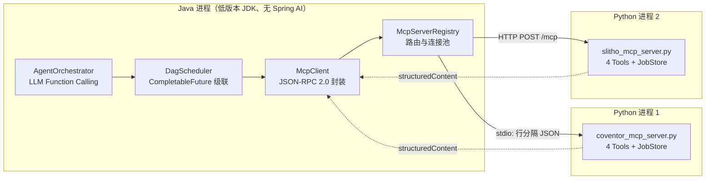
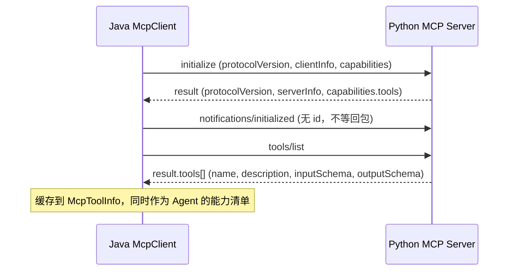
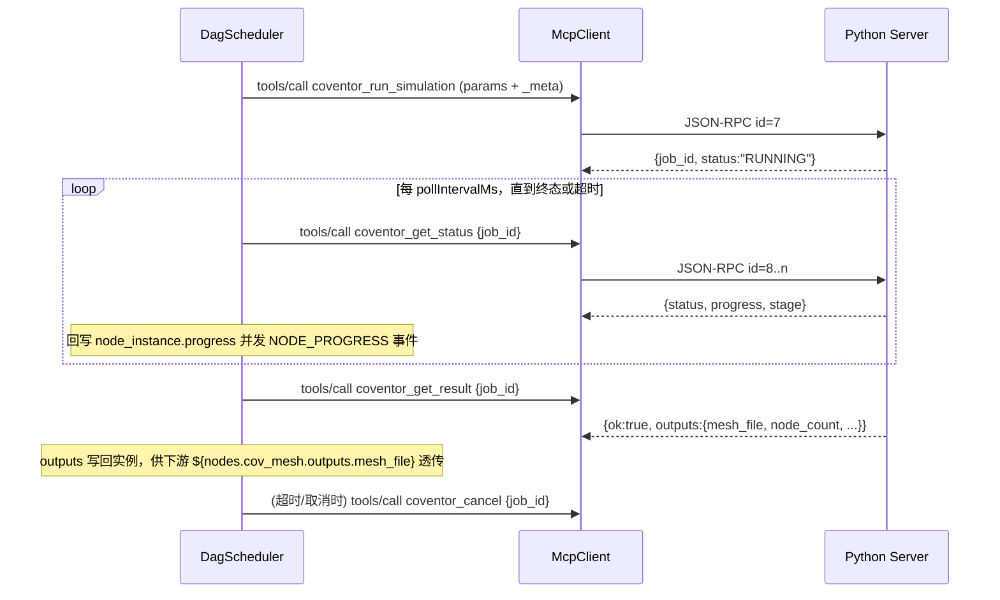
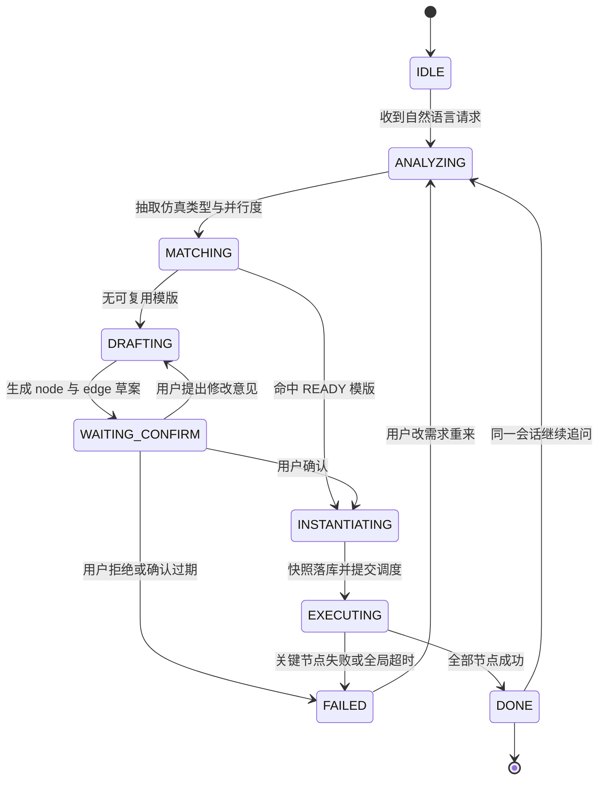
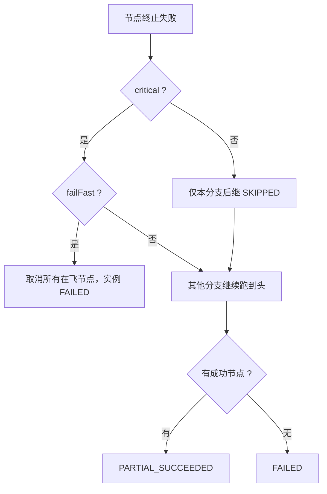

# ⑨ 全链路技术文档 · 通信规范、状态机与容错方案

<aside>
📘

这是题目第 3 部分要的「全链路开发文档」。四个章节一一对应：① MCP 与 Java 引擎通信规范与协议交互图；② 数据库 DDL（6 表）；③ Agent 决策状态机；④ DAG 异常恢复、重试与超时控制。

</aside>

# 一、MCP 与 Java 引擎通信规范

## 1.1 分层与进程边界



## 1.2 两种传输的选型准则

| 维度 | Stdio（子进程） | Streamable HTTP / SSE |
| --- | --- | --- |
| 启动方式 | Java `ProcessBuilder` 拉起 Python | Python 独立部署，监听端口 |
| 适用场景 | 开发/单机/仿真引擎与 Java 同机 | 生产、仿真集群、需要水平扩展 |
| 并发模型 | **单连接串行**，必须按 `id` 配对并加写锁 | 天然并发，只需带 `Mcp-Session-Id` |
| 故障域 | Python 崩溃 = 进程死，Java 能立即感知 | 需要健康检查与重连退避 |
| 致命坑 | **stdout 只能跑协议**，一句 `print` 就能搞死整条链路 | 代理可能缓存/断开长连接，需心跳 |
| 本项目开关 | 默认 | `-Dmcp.slitho.transport=http -Dmcp.slitho.endpoint=http://127.0.0.1:9002/mcp` |

## 1.3 帧格式与必遵铁律

1. **行分隔**：stdio 下一次交互一行，报文内部不得含裸换行；Java 侧统一 `\n` 结尾并 `flush()`。
2. **stdout 纯净**：Python 侧所有日志必须输到 `stderr`；Java 侧单开一个 `mcp-stderr-<key>` 线程排水，避免管道写满导致子进程阻塞。
3. **编码强制 UTF-8**：`PYTHONIOENCODING=utf-8` + Java 侧 `InputStreamReader(is, "UTF-8")`，中文日志才不乱。
4. **请求-响应配对**：`id` 单调递增，响应必须回同 `id`；通知（notification）无 `id`、不等回包。
5. **握手先行**：`initialize` → `notifications/initialized` → `tools/list`，未完成握手不得发 `tools/call`。
6. **版本容谦**：Java 声明 `2025-06-18`，Python 侧在 `SUPPORTED_VERSIONS` 内则回同版，否则降级到自己最高版，Java 接受服务端给的版本。

## 1.4 握手与能力发现（完整报文）



```json
// --> Java 发出
{"jsonrpc":"2.0","id":1,"method":"initialize","params":{
  "protocolVersion":"2025-06-18",
  "clientInfo":{"name":"java-native-mcp-client","version":"1.0.0"},
  "capabilities":{"tools":{},"roots":{"listChanged":false}}}}

// <-- Python 返回
{"jsonrpc":"2.0","id":1,"result":{
  "protocolVersion":"2025-06-18",
  "serverInfo":{"name":"coventor-sim","version":"1.0.0"},
  "capabilities":{"tools":{"listChanged":false}}}}

// --> 初始化完成通知（无 id）
{"jsonrpc":"2.0","method":"notifications/initialized"}
```

## 1.5 长任务三段式：提交 / 轮询 / 取结果

仿真动辄几十分钟，**绝不能把一次 `tools/call` 阻塞到仿真结束**。本项目把每个仿真能力拆成四个 Tool：



| Tool | 语义 | 幂等 |
| --- | --- | --- |
| `*_run_simulation` | 提交作业，立即返回 `job_id` | 靠 `_meta.idempotency_key` 去重 |
| `*_get_status` | 拉取 `status/progress/stage` | 天然幂等 |
| `*_get_result` | 拉取终态产物 | 天然幂等（未完成报 `JOB_NOT_FINISHED`） |
| `*_cancel` | 终止远端作业 | 幂等，重复取消不报错 |

## 1.6 `_meta` 上下文透传约定

每次 `tools/call` 的 `params._meta` 带四个字段，让 Python 侧日志能直接对齐 Java 链路：

```json
{"jsonrpc":"2.0","id":7,"method":"tools/call","params":{
  "name":"coventor_run_simulation",
  "arguments":{"structure":"mems_cantilever","mesh_size_um":0.5,"material":"Poly-Si","solver":"static"},
  "_meta":{
    "workflow_instance_id":"wi-7c1f0aab32d5",
    "trace_id":"tr-9f2c81",
    "node_key":"cov_mesh",
    "attempt":1,
    "idempotency_key":"wi-7c1f0aab32d5:cov_mesh:1"
  }}}
```

## 1.7 错误分层：三类失败绝不能混为一谈

| 层级 | 表现 | Java 侧归一化 | 是否重试 |
| --- | --- | --- | --- |
| 传输层 | 子进程死、管道断、HTTP 5xx、读超时 | `TRANSPORT_ERROR` / `RPC_TIMEOUT` | ✅ 退避重试 |
| 协议层 | JSON-RPC `error` 对象（-32601 方法不存在、-32602 参数非法） | `RPC_ERROR_<code>` | ❌ 代码/参数 bug，重试无意义 |
| 业务层 | `result.isError=true`  • `structuredContent.error_code` | `McpErrors.ToolError(code, retryable)` | 看 `retryable` 字段 |

<aside>
❗

**MCP 协议最容易踩的坑**：业务失败（求解器发散）**不应该**返回 JSON-RPC `error`，而应返回正常 `result` 并置 `isError=true`。因为这类信息需要能被模型/上层看到并判断是否重试；而 JSON-RPC `error` 保留给协议级错误。本项目的 `error_code / retryable` 就放在 `structuredContent` 里，引擎据此决定重试。

</aside>

## 1.8 连接生命周期与资源回收

| 阶段 | 动作 |
| --- | --- |
| 启动 | `McpServerRegistry.defaultLocal()` 串行拉起所有 Server，握手失败即 fail-fast（宁愿启不来也不要跑到一半才发现） |
| 运行 | 每个 Server 一个 `McpClient`，stdio 下用写锁串行化，HTTP 下并发 |
| 健康 | 定时 `ping`；连续失败则重建子进程，并把当前在飞节点标为可重试失败 |
| 关闭 | `shutdown` → 关标准输入 → `waitFor(3s)` → `destroyForcibly()`；JVM `ShutdownHook` 兼底 |

---

# 二、数据库 DDL 设计（6 张表）

完整 DDL、字段走查、种子数据与 JDBC 仓储实现见：[⑧ 附录 A · 数据库 DDL（6 张表）与 JDBC 仓储实现](%E2%91%A7%20%E9%99%84%E5%BD%95%20A%20%C2%B7%20%E6%95%B0%E6%8D%AE%E5%BA%93%20DDL%EF%BC%886%20%E5%BC%A0%E8%A1%A8%EF%BC%89%E4%B8%8E%20JDBC%20%E4%BB%93%E5%82%A8%E5%AE%9E%E7%8E%B0%20fdcc091f760348fd8ab880a8d1c47ecb.md)。这里只给职责划分与三条设计铁律。

| 表 | 体系 | 核心职责 | 唯一约束 |
| --- | --- | --- | --- |
| `workflow_template` | 模版 | 流程定义根，带召回冗余字段与确认状态 | `(template_key, version)` |
| `node_template` | 模版 | 绑定仿真类型 + MCP 路由 + Golden 默认参数 | `(template_key, version, node_key)` |
| `edge_template` | 模版 | 前驱后继依赖 + 参数透传表达式 | `(template_key, version, from, to)` |
| `workflow_instance` | 实例 | 一次执行的根，持有 `trace_id` 与全局超时 | `instance_id` |
| `node_instance` | 实例 | 执行快照 + 状态机 + `remote_job_id`  • 重试计数 | `(instance_id, node_key)` |
| `edge_instance` | 实例 | 本次执行中依赖是否派发（ACTIVE/SKIPPED） | `(instance_id, from, to)` |

**三条铁律**

1. **模版不原地改**：修改即发布 `version+1`，实例永远指向实例化当时的版本。
2. **实例自包含**：节点实例快照仿真类型/Tool/超时/重试，跑起来后不再回查模版。
3. **双参数列**：`raw_params`（请求什么）与 `resolved_params`（实际发了什么）分开存，这是实验可复现与事故定责的底线。

---

# 三、Agent 决策状态机

## 3.1 状态图



## 3.2 状态迁移与工具白名单

每个状态**只开放当前阶段应该能用的工具**，这是防模型乱跑的第一道闸门：

| 状态 | 允许调用的工具 | 归属产物 | 下一状态 |
| --- | --- | --- | --- |
| `ANALYZING` | `list_simulation_capabilities` | 真实的 Tool inputSchema | `MATCHING` |
| `MATCHING` | `search_workflow_templates`、`get_workflow_template` | 候选模版 + 得分 | `INSTANTIATING` / `DRAFTING` |
| `DRAFTING` | `create_workflow_template` | `status=PENDING_CONFIRM` 的模版 | `WAITING_CONFIRM` |
| `WAITING_CONFIRM` | `request_user_confirmation`（仅此一个） | 拓扑摘要 + 待确认参数表 | `INSTANTIATING` / `DRAFTING` / `FAILED` |
| `INSTANTIATING` | `instantiate_and_run` | `workflow_instance` 快照 | `EXECUTING` |
| `EXECUTING` | `get_instance_status` | 节点进度与产物 | `DONE` / `FAILED` |

## 3.3 难点一：依赖关系生成（串还是并）

模型并不天然知道“并行”意味着两个节点共一个前驱。所以把规则写进 System Prompt 并在工具层硬校验：

| 自然语言信号 | 生成结构 |
| --- | --- |
| “先 A 然后 B”、“基于…的输出”、“拿…的结果” | 串行边 `A -> B`，并在边上挂 `data_mapping` |
| “并行跑两个/三个…”、“不同参数各跑一份” | N 个同类型节点，**共同前驱**，彼此无边 |
| “扫参/参数扫描 0.8、1.0、1.2” | 同上，每个取值一个节点，`node_key` 带参数后缀 |
| “如果…就…” | 条件边，`edge_type=COND`  • `condition_expr` |

**工具层必做的四项硬校验**（`create_workflow_template` 内）：

1. `node_key` 唯一、不为空；边的两端必须都存在于节点列表。
2. **无环**：直接跑一次 `TopologySorter.sort()`，拓扑排序失败则拒绍落库并把错误回给模型重试。
3. **无自环、无重复边**；孤岛节点允许但要在确认摘要里高亮提醒。
4. **仿真类型必须在能力清单内**：不在 `McpServerRegistry` 里的类型直接报错，消灭“幻想出一个仿真引擎”这类事故。

## 3.4 难点二：参数补全的优先级

同一个参数可能有五个来源，**优先级写死在代码里，不交给模型自由心证**：

| 优先级 | 来源 | 写入时机 | 例子 |
| --- | --- | --- | --- |
| 1（最高） | 边上的上游透传 `data_mapping` | 运行时 `ParamResolver` 解析 | `mesh_file = ${nodes.cov_mesh.outputs.mesh_file}` |
| 2 | 用户本轮显式指定（`param_overrides`） | 实例化时 | “NA 改成 1.40” |
| 3 | 工作流级 `inputs` | 实例化时 | `structure=mems_cantilever` |
| 4 | 节点模版 `default_params`（Golden） | 实例化时 | `mesh_size_um=0.5` |
| 5（兼底） | Python `inputSchema.default` | 远端执行时 | `resist_model=CAR` |

表达式支持默认值语法 `${inputs.structure:-mems_cantilever}`，因此**模版可以先落库、后补参**，不会因为用户没说器件名就卡住。

**缺参处理三分法**

| 情形 | 做法 |
| --- | --- |
| `required` 且能从上游产物推导 | 自动建边透传，不打扰用户 |
| `required` 但无法推导（如 `structure`） | 写成带默认值的表达式，**并在确认摘要里列出“我替你填了什么”** |
| 可选且有 `default` | 不写入模版，交给 Python 侧默认值，减少冗余快照 |

## 3.5 难点三：人机确认

| 问题 | 方案 |
| --- | --- |
| 什么时候**必须**确认？ | 模版来源为 `AGENT` 且 `status=PENDING_CONFIRM`。命中人工沉淀的 `READY` 模版时不打扰用户 |
| 确认态怎么不丢？ | 会话状态落 `agent_session` 表（`state`  • `pending_template_key`  • `history`），**进程重启也能接着确认** |
| 确认展示什么？ | 拓扑一行流、每个节点的仿真类型与关键参数、Agent 代填的默认值、预估并行度 |
| 拒绝了怎么办？ | 模版置 `DRAFT`（不参与召回），会话回 `DRAFTING`，把用户意见作为新上下文重拟 |
| 确认后的幂等？ | `approveTemplate` 发布 `version+1` 并置 `READY`  • `confirmed_by/at`；重复点确认不会重复跑（会话已离开 `WAITING_CONFIRM`） |
| 确认超时？ | 超过会话确认窗口（建议 30 分钟）自动过期到 `FAILED`，避免悬单占着 license 预算 |

<aside>
🔒

**三道安全阀**（1）**工具白名单 + 参数 Schema 校验**：模型只能调七个声明过的工具，参数不合法直接报错回给模型重试；（2）**回圈上限 `MAX_TOOL_TURNS=8`**：防止工具循环烧 token；（3）**写操作门禁**：只有 `create_workflow_template`（落 `PENDING_CONFIRM`）和 `instantiate_and_run`（需 `READY`）能改库，模型无法绕过确认直接拉起仿真。

</aside>

## 3.6 LLM 不可用时的降级

| 故障 | 降级行为 |
| --- | --- |
| 无 `LLM_API_KEY` / 内网无出口 | 自动切 `HeuristicLlmProvider`（正则 + 关键词抄录器），**工具调用链路与真模型完全一致** |
| LLM 超时 / 429 | 指数退避重试 2 次，仍失败则降级到启发式，并在回复里标注“本次为规则引擎结果，建议人工复核” |
| 输出非法 JSON | `MiniJson.parseLoose` 宽容解析（去 `json 围栏、容尾逗号），仍失败则把错误回注为` tool` 消息让模型自修 |
| 模型幻想不存在的仿真类型 | 能力清单校验拦下，报错文案直接列出可用类型 |

---

# 四、DAG 异常恢复、节点重试与超时控制

## 4.1 四层超时（缺一层都会出现永久挂起）

| 层级 | 默认值 | 控制点 | 超时后的动作 |
| --- | --- | --- | --- |
| 单次 RPC | 20s（`-Dmcp.<key>.timeoutMs`） | `McpClient` 的 `Future.get(timeout)` | 抛 `RPC_TIMEOUT`，归为可重试 |
| 节点级 | 180s（`node_template.timeout_ms`） | 轮询循环的 deadline | 置 `TIMEOUT`，**主动调远端 `*_cancel`** |
| 工作流全局 | 3600s（`global_timeout_ms`） | 调度循环的总 deadline | 取消未完成节点，实例置 `FAILED` |
| 会话确认 | 1800s | `agent_session.updated_at` | 会话过期，模版留 `PENDING_CONFIRM` |

<aside>
⚠️

节点超时后**必须发 `*_cancel`**。否则 Java 侧已经放弃，Python/仿真集群还在算 —— 这就是“孤儿作业”，它会持续占着 license 和计算节点，是仿真平台最常见的资源黑洞。

</aside>

## 4.2 重试分类：重试不是万能药

| 错误类型 | 例子 | 重试 | 理由 |
| --- | --- | --- | --- |
| 瞬时技术故障 | `TRANSPORT_ERROR`、`RPC_TIMEOUT`、子进程被 OOM Kill | ✅ 退避重试 | 重试大概率能好 |
| 求解器可恢复失败 | `SOLVER_DIVERGED`（`retryable=true`） | ✅ 重试 | 随机初值/资源抖动，重算可能过 |
| 参数非法 | `INVALID_PARAM`、`RPC_ERROR_-32602` | ❌ 不重试 | 参数不变，重试 100 次也一样错 |
| 前驱未就绪 | `PRED_NOT_READY` | ❌ 不重试 | 直接 `SKIPPED`，避免无效等待 |
| 人为取消 | `CANCELLED` | ❌ 不重试 | 尊重用户意图 |

**退避公式**（`RetryPolicy`）：`delay = min(initialBackoffMs * multiplier^(attempt-1), maxBackoffMs) * (1 + random(-jitter, +jitter))`，默认 `1000ms / x2 / 上限 30s / 拖动 20%`。抖动是为了防止同层 N 个并行节点**同时重试把仿真集群再打死一次**。

## 4.3 重试的幂等语义

```
idempotency_key = <instance_id>:<node_key>:<attempt>

attempt=1  -> wi-7c1f:cov_mesh:1   提交 → 失败（SOLVER_DIVERGED）
           -> 先尝试 cancel 旧 job（防孤儿）
attempt=2  -> wi-7c1f:cov_mesh:2   新幂等键，真正重算
```

两个关键细节：

1. **重试前先清场**：如果上一次已拿到 `remote_job_id`，先发 `*_cancel` 再重提，否则两个作业同时跑。
2. **`attempt` 进幂等键**：否则 Python 侧会把重试当成重复提交而直接返回旧的失败结果，重试彻底失效。

## 4.4 失败传播与终态判定



| 终态 | 含义 | 业务上怎么用 |
| --- | --- | --- |
| `SUCCEEDED` | 全部节点成功 | 直接取产物 |
| `PARTIAL_SUCCEEDED` | 有成功也有失败/跳过，且未触发快速失败 | 工程上最常见：三个光强扫参挂了一个，剩下两个结果仍有价值 |
| `FAILED` | 关键节点失败或全局超时 | 走断点续跑或人工介入 |
| `CANCELLED` | 人为取消 | 不告警 |

## 4.5 断点续跑（resume）

这是仿真平台的刚需：一个网格节点跑了 40 分钟，不能因为下游光刻参数写错就重跑全图。

| 步骤 | 动作 |
| --- | --- |
| 1 | `repo.findInstance(id)` 拉回完整快照（含已成功节点的 `outputs`） |
| 2 | `scheduler.resume(wi)`：`SUCCEEDED` 节点直接认可不重跑，产物原样供下游透传 |
| 3 | `FAILED / TIMEOUT / SKIPPED / CANCELLED` 节点重置为 `PENDING`，`attempt` 从断点累加 |
| 4 | 重建入度表，从就绪层继续调度 |
| 5 | 若节点有 `remote_job_id` 且远端仍 `RUNNING`，**直接接管轮询而不重提**（进程崩溃场景的救命稻草） |

守护进程每 60s 扫一次：

```sql
SELECT instance_id FROM workflow_instance
WHERE status='RUNNING' AND updated_at < DATE_SUB(NOW(), INTERVAL 5 MINUTE);
```

扫到就 `resume`。配上 `node_instance.remote_job_id` 对账，就能做到**Java 进程重启不丢仿真、不漏孤儿作业**。

## 4.6 背压、熔断与资源护栏

| 机制 | 实现 | 解决的真实问题 |
| --- | --- | --- |
| 节点级并行度 | 固定线程池 `dag-node-N`（`--parallelism`） | 一张 20 节点的图不会瞬时压垮仿真集群 |
| license 信号量 | `setLicenseLimit("S_LITHO", n)` | EDA license 是真金白银，超发就是集体失败 |
| 单 Server 熔断 | 连续 N 次 `TRANSPORT_ERROR` 则短路本 Server 节点，快速失败 | 避免对一个已死的引擎反复重试 |
| 轮询退避 | 长任务轮询间隔逐步拉长（400ms → 2s） | 减少无意义的 RPC 与数据库写入 |
| 写库降频 | 进度变化 <5% 且阶段未切换时不落库 | `node_instance` 写放大最容易把 DB 写满 |

## 4.7 可观测性

| 手段 | 内容 |
| --- | --- |
| 事件流 | `WorkflowEvent`（`WORKFLOW_START/NODE_SUBMIT/NODE_PROGRESS/NODE_RETRY/NODE_DONE/WORKFLOW_END`）同时推 SSE 与 `workflow_event` 表 |
| 链路追踪 | `trace_id` 从 HTTP 请求 → 实例 → MCP `_meta` → Python 日志，一个 ID 串起全链 |
| 报文级日志 | `-Dmcp.verbose=true` 打印每条 JSON-RPC 收发，排查协议问题时必开 |
| 关键指标 | 节点成功率、平均/P95 耗时、重试率、超时率、各仿真类型排队深度、孤儿作业数 |
| 可复现 | `resolved_params`  • `template_version` 两个字段就能把任意历史仿真原样重跑 |

## 4.8 容错演练清单（都能在本原型上真实复现）

| 注入方式 | 期望行为 | 验证命令 |
| --- | --- | --- |
| 求解器首次必失败 | `NODE_RETRY` → 退避 → attempt=2 成功 | `--demo --chaos` |
| 节点超时 | `TIMEOUT`  • 远端 `cancel`  • 下游 `SKIPPED` | `--demo --timeout-demo` |
| Python 进程被杀 | `TRANSPORT_ERROR` → 重试（启用健康检查后重建子进程） | `--port 8080` 后 `kill -9 <python pid>` |
| 参数写错 | `INVALID_PARAM` 直接终止，**不重试** | 手改 `SeedData` 里 `solver` 为非法值 |
| 人为取消 | 在飞节点 `CANCELLED`，远端作业同步终止 | `POST /api/cancel/{id}` |
| LLM 不可用 | 自动降级启发式，链路照跑 | `unset LLM_API_KEY` |

---

# 五、从原型到生产的演进路径

| 阶段 | 动作 | 代价 |
| --- | --- | --- |
| P0（已交付） | 全链路可跑：内存仓储 + stdio MCP + 单机调度 | — |
| P1 | `InMemoryWorkflowRepository` → `JdbcWorkflowRepository`  • 连接池 | 1 行 `new`  • 1 个 jar |
| P2 | MCP 全面转 HTTP，仿真 Server 容器化、多副本 | Python 侧无代码改动，只改启动参数 |
| P3 | 调度器多实例：实例级分布式锁 + `opt_version` 乐观锁 + 守护进程接管 | 引入 Redis / 数据库锁 |
| P4 | 模版召回升级为向量检索（描述 + 拓扑指纹双路） | 加向量库，接口不变 |
| P5 | 人机确认接入工单/审批，模版发布走变更流程 | 与内部 OA 打通 |

<aside>
🎯

设计上的一个刻意选择：**所有演进都不需要重写上层**。`WorkflowRepository`、`McpTransport`、`LlmProvider` 三个接口把“存储、传输、模型”三个最易变的维度隔离了；引擎与 Agent 层只依赖接口，所以从原型到生产是可以“换零件”而不是“重构”。

</aside>