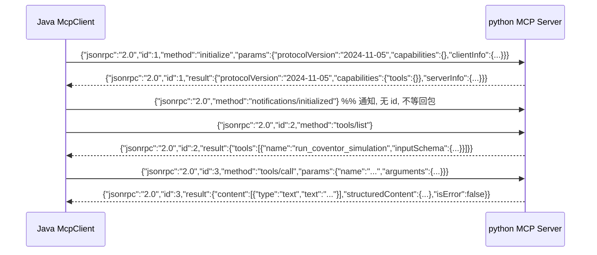
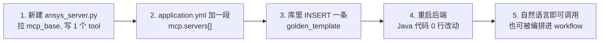

# 02 · Python MCP Server（仿真插件层，mock 实现）

<aside>
🎯

本页目标：让你**彻底看懂 MCP 协议到底是什么**，并拿到 3 个可直接运行的仿真插件。看完你应该能在 5 分钟内新增一个仿真类型。

</aside>

## 1. 先搞清楚：MCP 到底是什么

MCP（Model Context Protocol）本质就三句话：

1. 它是 **JSON-RPC 2.0**，不是 REST。
2. 它跑在 **stdio（标准输入输出）** 或 **Streamable HTTP** 上。stdio 模式下，Java 把 python 脚本当子进程拉起来，**一行一个 JSON 消息**往 stdin 写、从 stdout 读。
3. 它只要求你实现几个固定 method：`initialize`、`tools/list`、`tools/call`（加上可选的 `ping`、`notifications/*`）。

### 1.1 一次完整握手长什么样



<aside>
🚨

**stdio 模式的第一大坑**：stdout 是协议通道，**绝对不能 `print()` 任何调试信息**，否则客户端 JSON 解析直接爆。所有日志必须往 `sys.stderr` 写。下面的 `mcp_base.py` 把这个约束封装成了 `server.log()`。

</aside>

---

## 2. `mcp-servers/python/requirements.txt`

```
# 本方案的 MCP Server 零三方依赖，只用 Python 标准库（内网/离线环境友好）。
# 如果你以后想改用官方 SDK，把下面两行取消注释（需 Python >= 3.10）：
# mcp>=1.2.0
# pydantic>=2.0
```

---

## 3. `common/mcp_base.py` —— 极简 MCP Server 框架

这是整个插件层的地基，**写一次，所有仿真插件复用**。

```python
# mcp-servers/python/common/mcp_base.py
# -*- coding: utf-8 -*-
"""
极简 MCP Server 框架（stdio + JSON-RPC 2.0）。

设计目标：
  1. 零三方依赖，只用标准库，适合仿真集群/内网环境
  2. 完全兼容 MCP 2024-11-05 的 tools 子集，能直接接 Claude Desktop / Cursor / 自研 Java Client
  3. 内置轻量 JSON Schema 校验、结构化错误返回、进度通知

关键约束：
  stdout 只能写 JSON-RPC 消息；日志全部往 stderr。
"""
import json
import os
import sys
import time
import traceback
import uuid
from typing import Any, Callable, Dict, List, Optional

PROTOCOL_VERSION = "2024-11-05"

# ---- JSON-RPC 标准错误码 ----
PARSE_ERROR = -32700
INVALID_REQUEST = -32600
METHOD_NOT_FOUND = -32601
INVALID_PARAMS = -32602
INTERNAL_ERROR = -32603

class McpError(Exception):
    """业务可预期的错误，会被转成 JSON-RPC error 回包"""

    def __init__(self, code: int, message: str, data: Any = None):
        super().__init__(message)
        self.code = code
        self.message = message
        self.data = data

class ToolError(Exception):
    """工具内部执行失败。注意：MCP 规范建议这类错误用 result.isError=true 返回，
    而不是 JSON-RPC error，这样大模型能看到失败原因并自行重试/调整参数。"""

    def __init__(self, message: str, detail: Any = None):
        super().__init__(message)
        self.message = message
        self.detail = detail

class Tool:
    def __init__(self, name: str, description: str, input_schema: Dict[str, Any],
                 handler: Callable[[Dict[str, Any]], Any]):
        self.name = name
        self.description = description
        self.input_schema = input_schema or {"type": "object", "properties": {}}
        self.handler = handler

    def to_schema(self) -> Dict[str, Any]:
        return {
            "name": self.name,
            "description": self.description,
            "inputSchema": self.input_schema,
        }

def _validate(schema: Dict[str, Any], args: Dict[str, Any]) -> None:
    """轻量 JSON Schema 校验：required / type / enum。
    故意不引 jsonschema，避免内网装包麻烦；够用且错误信息对大模型友好。"""
    props = schema.get("properties", {}) or {}
    for field in schema.get("required", []) or []:
        if field not in args or args[field] in (None, ""):
            raise McpError(INVALID_PARAMS, f"缺少必填参数: {field}")

    type_map = {
        "string": str,
        "number": (int, float),
        "integer": int,
        "boolean": bool,
        "array": list,
        "object": dict,
    }
    for key, val in list(args.items()):
        spec = props.get(key)
        if not spec or val is None:
            continue
        expected = spec.get("type")
        py_type = type_map.get(expected)
        if py_type and not isinstance(val, py_type):
            # 大模型常把数字写成字符串，这里做一次宽容转换
            try:
                if expected in ("number", "integer"):
                    args[key] = float(val) if expected == "number" else int(val)
                elif expected == "boolean":
                    args[key] = str(val).lower() in ("true", "1", "yes")
                elif expected == "string":
                    args[key] = str(val)
                else:
                    raise ValueError()
            except Exception:
                raise McpError(INVALID_PARAMS,
                               f"参数 {key} 类型错误，期望 {expected}，实际 {type(val).__name__}")
        enum = spec.get("enum")
        if enum and args[key] not in enum:
            raise McpError(INVALID_PARAMS, f"参数 {key} 必须是之一: {enum}，实际 {args[key]}")

class McpServer:
    def __init__(self, name: str, version: str = "1.0.0", instructions: str = ""):
        self.name = name
        self.version = version
        self.instructions = instructions
        self._tools: Dict[str, Tool] = {}
        self._initialized = False

    # ------------------------------------------------------------------ #
    # 工具注册
    # ------------------------------------------------------------------ #
    def tool(self, name: str, description: str, input_schema: Dict[str, Any]):
        """装饰器：@server.tool(name=..., description=..., input_schema=...)
        handler 签名统一为 fn(args: dict) -> dict
        """

        def deco(fn: Callable[[Dict[str, Any]], Any]):
            self._tools[name] = Tool(name, description, input_schema, fn)
            return fn

        return deco

    # ------------------------------------------------------------------ #
    # I/O
    # ------------------------------------------------------------------ #
    def log(self, msg: str) -> None:
        sys.stderr.write(f"[{time.strftime('%H:%M:%S')}][{self.name}] {msg}\n")
        sys.stderr.flush()

    def _write(self, payload: Dict[str, Any]) -> None:
        sys.stdout.write(json.dumps(payload, ensure_ascii=False) + "\n")
        sys.stdout.flush()

    def notify_progress(self, token: Any, progress: float, total: float = 100.0, message: str = "") -> None:
        """可选：向客户端推送进度通知（长耗时仿真很有用）"""
        if token is None:
            return
        self._write({
            "jsonrpc": "2.0",
            "method": "notifications/progress",
            "params": {"progressToken": token, "progress": progress,
                       "total": total, "message": message},
        })

    # ------------------------------------------------------------------ #
    # 主循环
    # ------------------------------------------------------------------ #
    def run(self) -> None:
        self.log(f"MCP server start, version={self.version}, tools={list(self._tools.keys())}")
        try:
            for line in sys.stdin:
                line = line.strip()
                if not line:
                    continue
                try:
                    msg = json.loads(line)
                except json.JSONDecodeError as e:
                    self._write({"jsonrpc": "2.0", "id": None,
                                 "error": {"code": PARSE_ERROR, "message": f"Parse error: {e}"}})
                    continue
                self._dispatch(msg)
        except KeyboardInterrupt:
            pass
        finally:
            self.log("MCP server exit")

    def _dispatch(self, msg: Dict[str, Any]) -> None:
        method = msg.get("method")
        req_id = msg.get("id")
        params = msg.get("params") or {}

        # id 为 None => notification，不得回包
        if req_id is None:
            self.log(f"<- notification {method}")
            if method == "notifications/initialized":
                self._initialized = True
            return

        started = time.time()
        try:
            result = self._handle(method, params)
            self._write({"jsonrpc": "2.0", "id": req_id, "result": result})
            self.log(f"<- {method} ok in {int((time.time() - started) * 1000)}ms")
        except McpError as e:
            self.log(f"<- {method} mcp-error {e.code} {e.message}")
            self._write({"jsonrpc": "2.0", "id": req_id,
                         "error": {"code": e.code, "message": e.message, "data": e.data}})
        except Exception as e:  # noqa
            self.log(f"<- {method} crashed:\n{traceback.format_exc()}")
            self._write({"jsonrpc": "2.0", "id": req_id,
                         "error": {"code": INTERNAL_ERROR, "message": f"{type(e).__name__}: {e}"}})

    def _handle(self, method: Optional[str], params: Dict[str, Any]) -> Dict[str, Any]:
        if method == "initialize":
            client = (params.get("clientInfo") or {}).get("name", "unknown")
            self.log(f"initialize from client={client}, "
                     f"clientProtocol={params.get('protocolVersion')}")
            return {
                "protocolVersion": PROTOCOL_VERSION,
                "capabilities": {"tools": {"listChanged": False}},
                "serverInfo": {"name": self.name, "version": self.version},
                "instructions": self.instructions,
            }

        if method == "ping":
            return {}

        if method == "tools/list":
            return {"tools": [t.to_schema() for t in self._tools.values()]}

        if method == "tools/call":
            return self._call_tool(params)

        raise McpError(METHOD_NOT_FOUND, f"Method not found: {method}")

    def _call_tool(self, params: Dict[str, Any]) -> Dict[str, Any]:
        name = params.get("name")
        args = params.get("arguments") or {}
        tool = self._tools.get(name)
        if tool is None:
            raise McpError(INVALID_PARAMS,
                           f"Unknown tool: {name}. available={list(self._tools.keys())}")

        _validate(tool.input_schema, args)

        progress_token = ((params.get("_meta") or {}).get("progressToken"))
        call_id = args.get("task_id") or f"{self.name}-{uuid.uuid4().hex[:10]}"
        self.log(f"-> tools/call {name} args={json.dumps(args, ensure_ascii=False)}")

        try:
            data = tool.handler({**args, "__task_id__": call_id,
                                "__progress__": lambda p, m="": self.notify_progress(progress_token, p, 100.0, m)})
        except ToolError as e:
            # 业务失败：用 isError=true 返回，让大模型看得见并自行处理
            payload = {"success": False, "task_id": call_id, "error": e.message, "detail": e.detail}
            return {
                "content": [{"type": "text", "text": json.dumps(payload, ensure_ascii=False, indent=2)}],
                "structuredContent": payload,
                "isError": True,
            }

        if not isinstance(data, dict):
            data = {"result": data}
        data.setdefault("success", True)
        data.setdefault("task_id", call_id)

        return {
            "content": [{"type": "text", "text": json.dumps(data, ensure_ascii=False, indent=2)}],
            "structuredContent": data,
            "isError": False,
        }

def env_bool(key: str, default: bool = False) -> bool:
    v = os.getenv(key)
    return default if v is None else v.strip().lower() in ("1", "true", "yes", "on")
```

<aside>
💡

注意 `_call_tool` 里同时返回了 `content`（给大模型看的文本）和 `structuredContent`（给引擎程序用的结构体）。**这一点对串联仿真致关重要**：workflow 引擎靠 `structuredContent` 把上游结果注入下游参数，而不是去解析一堆自然语言。

</aside>

---

## 4. `common/mock_simulator.py` —— mock 仿真内核

```python
# mcp-servers/python/common/mock_simulator.py
# -*- coding: utf-8 -*-
"""
mock 仿真内核。
真实接入时，只需把 run_mock() 换成：
    subprocess.run([SIM_CLI, "-i", input_file, "-o", out_dir], check=True, timeout=...)
其余代码（Server、Java 客户端、引擎）零改动。
"""
import hashlib
import json
import os
import random
import tempfile
import time
from typing import Any, Callable, Dict

WORK_ROOT = os.getenv("SIM_WORK_DIR", os.path.join(tempfile.gettempdir(), "sim-agent-mock"))

def _seed_of(payload: Dict[str, Any]) -> int:
    """用参数哈希做种子 => 相同参数返回相同结果（幂等、可复现，方便写测试）"""
    raw = json.dumps(payload, sort_keys=True, ensure_ascii=False, default=str)
    return int(hashlib.md5(raw.encode("utf-8")).hexdigest()[:8], 16)

def ensure_workdir(task_id: str) -> str:
    path = os.path.join(WORK_ROOT, task_id)
    os.makedirs(path, exist_ok=True)
    return path

def run_mock(sim_type: str,
             args: Dict[str, Any],
             metric_builder: Callable[[random.Random, Dict[str, Any]], Dict[str, Any]],
             artifacts: Dict[str, str],
             progress: Callable[[float, str], None] = None) -> Dict[str, Any]:
    """
    :param sim_type:        仿真类型标识
    :param args:            入参（含内部 __task_id__）
    :param metric_builder:  给定随机源与入参，产出业务指标
    :param artifacts:       {逻辑名: 文件名}，会在工作目录下生成占位文件
    """
    task_id = args.get("__task_id__", "unknown")
    seconds = float(args.get("mock_seconds", 2))
    seconds = max(0.0, min(seconds, 30.0))       # 守住上限，防止参数乱传把链路卡死

    started = time.time()
    steps = 5
    for i in range(steps):
        time.sleep(seconds / steps)
        if progress:
            progress((i + 1) * 100.0 / steps, f"{sim_type} 计算中 {int((i + 1) * 100 / steps)}%")

    rnd = random.Random(_seed_of({k: v for k, v in args.items() if not k.startswith("__")}))

    workdir = ensure_workdir(task_id)
    files: Dict[str, str] = {}
    for logical, filename in artifacts.items():
        p = os.path.join(workdir, filename)
        with open(p, "w", encoding="utf-8") as f:
            f.write(f"# MOCK {sim_type} artifact: {logical}\n")
            f.write(json.dumps({k: v for k, v in args.items() if not k.startswith("__")},
                               ensure_ascii=False, indent=2))
        files[logical] = p

    result: Dict[str, Any] = {
        "success": True,
        "task_id": task_id,
        "simulation_type": sim_type,
        "status": "COMPLETED",
        "mock": True,
        "cost_ms": int((time.time() - started) * 1000),
        "workdir": workdir,
        "metrics": metric_builder(rnd, args),
    }
    result.update(files)
    return result
```

---

## 5. `coventor_server.py` —— 结构/网格仿真插件

```python
# mcp-servers/python/coventor_server.py
# -*- coding: utf-8 -*-
import os
import sys

sys.path.insert(0, os.path.dirname(os.path.abspath(__file__)))

from common.mcp_base import McpServer, ToolError            # noqa: E402
from common.mock_simulator import run_mock                   # noqa: E402

server = McpServer(
    name="coventor",
    version="1.0.0",
    instructions="Coventor MEMS+ 仿真能力：网格划分、模态/静力/谐响分析。适用于 MEMS 器件结构与多物理场仿真。",
)

SOLVERS = ["MODAL", "STATIC", "HARMONIC"]

# --------------------------------------------------------------------------- #
# tool 1: 网格划分（前处理）
# --------------------------------------------------------------------------- #
MESH_SCHEMA = {
    "type": "object",
    "properties": {
        "model_name": {"type": "string", "description": "器件/模型名称，例：resonator_v1"},
        "mesh_size": {"type": "number", "description": "网格尺寸(um)，越小越精确但越慢，默认 2.0"},
        "element_type": {"type": "string", "enum": ["TET", "HEX"], "description": "单元类型"},
        "mock_seconds": {"type": "number", "description": "mock 模式下的模拟耗时（秒）"},
    },
    "required": ["model_name"],
}

@server.tool(name="run_mesh_generation",
             description="对器件模型做网格划分，输出 mesh 文件与网格质量指标。通常作为结构仿真的前置节点。",
             input_schema=MESH_SCHEMA)
def run_mesh_generation(args):
    mesh_size = float(args.get("mesh_size", 2.0))
    if mesh_size <= 0:
        raise ToolError("mesh_size 必须大于 0", {"mesh_size": mesh_size})

    def metrics(rnd, a):
        elements = int(200000 / max(mesh_size, 0.1) * rnd.uniform(0.8, 1.2))
        return {
            "element_count": elements,
            "node_count": int(elements * 1.7),
            "quality": round(rnd.uniform(0.72, 0.98), 3),   # 网格质量，可用于条件边
            "mesh_size_um": mesh_size,
            "element_type": a.get("element_type", "TET"),
        }

    return run_mock(
        sim_type="MESH",
        args=args,
        metric_builder=metrics,
        artifacts={"mesh_file": f"{args['model_name']}.mesh"},
        progress=args.get("__progress__"),
    )

# --------------------------------------------------------------------------- #
# tool 2: 结构/模态仿真（主体）
# --------------------------------------------------------------------------- #
COVENTOR_SCHEMA = {
    "type": "object",
    "properties": {
        "model_name": {"type": "string", "description": "器件/模型名称"},
        "mesh_file": {"type": "string", "description": "上游网格文件路径；不传则自动用默认网格"},
        "solver": {"type": "string", "enum": SOLVERS, "description": "求解器类型"},
        "temperature": {"type": "number", "description": "环境温度(℃)"},
        "pressure": {"type": "number", "description": "环境气压(Pa)"},
        "modes": {"type": "integer", "description": "模态阶数，默认 3"},
        "mock_seconds": {"type": "number"},
    },
    "required": ["model_name"],
}

@server.tool(name="run_coventor_simulation",
             description=("执行 Coventor MEMS+ 结构/多物理场仿真。支持模态(MODAL)、静力(STATIC)、"
                          "谐响(HARMONIC)分析，输出谐振频率、最大位移、最大应力、品质因子等指标。"),
             input_schema=COVENTOR_SCHEMA)
def run_coventor_simulation(args):
    solver = args.get("solver", "MODAL")
    modes = int(args.get("modes", 3))

    def metrics(rnd, a):
        base_freq = rnd.uniform(18_000, 42_000)
        return {
            "solver": solver,
            "resonant_frequencies_hz": [round(base_freq * (i + 1) * rnd.uniform(0.98, 1.05), 2)
                                        for i in range(modes)],
            "max_displacement_um": round(rnd.uniform(0.05, 2.5), 4),
            "max_stress_mpa": round(rnd.uniform(20, 320), 2),
            "quality_factor": round(rnd.uniform(800, 15000), 1),
            "converged": True,
            "temperature_c": a.get("temperature", 25),
            "pressure_pa": a.get("pressure", 101325),
            "mesh_file_used": a.get("mesh_file") or "<default>",
        }

    return run_mock(
        sim_type="COVENTOR",
        args=args,
        metric_builder=metrics,
        artifacts={
            "result_file": f"{args['model_name']}_{solver.lower()}.result",
            "geometry_file": f"{args['model_name']}_deformed.stl",
        },
        progress=args.get("__progress__"),
    )

# --------------------------------------------------------------------------- #
# tool 3 / 4: 辅助查询类工具（只读，安全，可直接暂给大模型）
# --------------------------------------------------------------------------- #
@server.tool(name="list_solvers",
             description="列出当前 Coventor 环境可用的求解器与适用场景。当用户不确定选哪种分析时调用。",
             input_schema={"type": "object", "properties": {}})
def list_solvers(args):
    return {
        "solvers": [
            {"name": "MODAL", "desc": "模态分析，算谐振频率与振型"},
            {"name": "STATIC", "desc": "静力分析，算变形与应力"},
            {"name": "HARMONIC", "desc": "谐响分析，算频响曲线"},
        ]
    }

@server.tool(name="get_simulation_status",
             description="根据 task_id 查询仿真任务状态（mock 环境下均返回 COMPLETED）。",
             input_schema={"type": "object",
                           "properties": {"task_id": {"type": "string"}},
                           "required": ["task_id"]})
def get_simulation_status(args):
    return {"task_id": args["task_id"], "status": "COMPLETED", "progress": 100}

if __name__ == "__main__":
    server.run()
```

---

## 6. `slitho_server.py` —— 光刻仿真插件

```python
# mcp-servers/python/slitho_server.py
# -*- coding: utf-8 -*-
import os
import sys

sys.path.insert(0, os.path.dirname(os.path.abspath(__file__)))

from common.mcp_base import McpServer, ToolError            # noqa: E402
from common.mock_simulator import run_mock                   # noqa: E402

server = McpServer(
    name="slitho",
    version="1.0.0",
    instructions="S-Litho 光刻仿真：光学成像 + 光刋胶显影，输出 CD/EPE/工艺窗口。",
)

SLITHO_SCHEMA = {
    "type": "object",
    "properties": {
        "mask_file": {"type": "string", "description": "掩模/版图文件路径，可以是上游节点产物"},
        "wavelength_nm": {"type": "number", "description": "曝光波长(nm)，如 193"},
        "numerical_aperture": {"type": "number", "description": "数值孔径 NA，如 1.35"},
        "dose": {"type": "number", "description": "曝光剂量(mJ/cm2)"},
        "focus_nm": {"type": "number", "description": "焦面偏移(nm)"},
        "resist_model": {"type": "string", "description": "光刋胶模型名"},
        "target_cd_nm": {"type": "number", "description": "目标关键尺寸(nm)，默认 45"},
        "mock_seconds": {"type": "number"},
    },
    "required": ["mask_file"],
}

@server.tool(name="run_slitho_simulation",
             description=("执行 S-Litho 光刻仿真（光学成像 + 光刋胶显影），输出关键尺寸 CD、"
                          "边缘位置误差 EPE、图形保真度等指标。输入可以使用上游结构仿真产出的版图文件。"),
             input_schema=SLITHO_SCHEMA)
def run_slitho_simulation(args):
    na = float(args.get("numerical_aperture", 1.35))
    wl = float(args.get("wavelength_nm", 193))
    if na <= 0 or na > 2.0:
        raise ToolError(f"不合法的数值孔径 NA={na}，合理区间 (0, 2.0]", {"numerical_aperture": na})

    target_cd = float(args.get("target_cd_nm", 45))

    def metrics(rnd, a):
        k1 = target_cd * na / wl
        cd = round(target_cd * rnd.uniform(0.93, 1.07), 3)
        return {
            "cd_nm": cd,
            "cd_bias_nm": round(cd - target_cd, 3),
            "epe_nm": round(rnd.uniform(-3.5, 3.5), 3),
            "k1_factor": round(k1, 4),
            "nils": round(rnd.uniform(1.4, 3.2), 3),                # 归一化图像对数斜率
            "dof_nm": round(rnd.uniform(60, 140), 1),               # 焦深
            "exposure_latitude_pct": round(rnd.uniform(4, 12), 2),
            "pattern_fidelity": round(rnd.uniform(0.85, 0.99), 3),
            "wavelength_nm": wl,
            "numerical_aperture": na,
            "dose": a.get("dose", 30),
            "focus_nm": a.get("focus_nm", 0),
            "mask_file_used": a.get("mask_file"),
        }

    return run_mock(
        sim_type="SLITHO",
        args=args,
        metric_builder=metrics,
        artifacts={
            "aerial_image_file": "aerial_image.png",
            "resist_profile_file": "resist_profile.dat",
        },
        progress=args.get("__progress__"),
    )

@server.tool(name="estimate_process_window",
             description="基于一组 dose/focus 扫描估算工艺窗口（共同工艺窗口面积）。适用于工艺鲁棒性评估。",
             input_schema={
                 "type": "object",
                 "properties": {
                     "mask_file": {"type": "string"},
                     "dose_range": {"type": "array", "description": "[min,max]"},
                     "focus_range_nm": {"type": "array", "description": "[min,max]"},
                     "mock_seconds": {"type": "number"},
                 },
                 "required": ["mask_file"],
             })
def estimate_process_window(args):
    def metrics(rnd, a):
        return {
            "process_window_area": round(rnd.uniform(0.4, 0.95), 3),
            "best_dose": round(rnd.uniform(28, 34), 2),
            "best_focus_nm": round(rnd.uniform(-20, 20), 1),
            "robust": True,
        }

    return run_mock("SLITHO_PW", args, metrics,
                    {"pw_plot_file": "process_window.png"},
                    args.get("__progress__"))

@server.tool(name="get_simulation_status",
             description="根据 task_id 查询光刻仿真任务状态。",
             input_schema={"type": "object",
                           "properties": {"task_id": {"type": "string"}},
                           "required": ["task_id"]})
def get_simulation_status(args):
    return {"task_id": args["task_id"], "status": "COMPLETED", "progress": 100}

if __name__ == "__main__":
    server.run()
```

---

## 7. `report_server.py` —— 后处理/报告插件

这个插件专门用来验证「**并行节点汇聚**」：它接收上游多个节点的输出数组。

```python
# mcp-servers/python/report_server.py
# -*- coding: utf-8 -*-
import json
import os
import sys
import time

sys.path.insert(0, os.path.dirname(os.path.abspath(__file__)))

from common.mcp_base import McpServer                        # noqa: E402
from common.mock_simulator import ensure_workdir             # noqa: E402

server = McpServer(name="report", version="1.0.0",
                   instructions="仿真结果后处理：把多个上游节点的结果聚合成一份可阅读报告。")

@server.tool(
    name="generate_report",
    description="把上游仿真节点的结果聚合成一份 Markdown/HTML 报告，返回报告文件路径与摘要。",
    input_schema={
        "type": "object",
        "properties": {
            "title": {"type": "string", "description": "报告标题"},
            "sources": {"type": "array", "description": "上游节点输出列表，每项为一个对象"},
            "format": {"type": "string", "enum": ["MD", "HTML"], "description": "输出格式"},
            "mock_seconds": {"type": "number"},
        },
        "required": ["title"],
    })
def generate_report(args):
    task_id = args["__task_id__"]
    fmt = args.get("format", "MD")
    sources = args.get("sources") or []
    time.sleep(min(float(args.get("mock_seconds", 1)), 10))

    lines = [f"# {args['title']}", "",
             f"- 生成时间：{time.strftime('%Y-%m-%d %H:%M:%S')}",
             f"- 汇总节点数：{len(sources)}", "", "## 各节点结果", ""]
    highlights = {}
    for i, s in enumerate(sources, start=1):
        if not isinstance(s, dict):
            lines += [f"### {i}. 未知节点", "```", str(s), "```", ""]
            continue
        node = s.get("node_key") or s.get("simulation_type") or f"node-{i}"
        metrics = s.get("metrics") or {}
        lines += [f"### {i}. {node}", "```json",
                  json.dumps(metrics, ensure_ascii=False, indent=2), "```", ""]
        for k in ("resonant_frequencies_hz", "cd_nm", "epe_nm", "quality", "max_stress_mpa"):
            if k in metrics:
                highlights[f"{node}.{k}"] = metrics[k]

    body = "\n".join(lines)
    if fmt == "HTML":
        body = "<html><body><pre>" + body + "</pre></body></html>"

    workdir = ensure_workdir(task_id)
    path = os.path.join(workdir, "report.md" if fmt == "MD" else "report.html")
    with open(path, "w", encoding="utf-8") as f:
        f.write(body)

    return {
        "status": "COMPLETED",
        "simulation_type": "REPORT",
        "report_file": path,
        "format": fmt,
        "metrics": {"source_count": len(sources), "highlights": highlights},
        "preview": body[:600],
    }

if __name__ == "__main__":
    server.run()
```

---

## 8. 手工测试（强烈建议先跑这一步）

在接 Java 之前，先用纯命令行验证插件层。**这能把 90% 的问题拦在 Java 之外。**

```bash
cd simulation-agent

# 方式一：一口气发 3 条消息
printf '%s\n' \
 '{"jsonrpc":"2.0","id":1,"method":"initialize","params":{"protocolVersion":"2024-11-05","capabilities":{},"clientInfo":{"name":"cli","version":"1.0"}}}' \
 '{"jsonrpc":"2.0","method":"notifications/initialized"}' \
 '{"jsonrpc":"2.0","id":2,"method":"tools/list"}' \
 '{"jsonrpc":"2.0","id":3,"method":"tools/call","params":{"name":"run_mesh_generation","arguments":{"model_name":"resonator_v1","mesh_size":1.5,"mock_seconds":1}}}' \
 | python3 mcp-servers/python/coventor_server.py 2>/dev/null | python3 -m json.tool --json-lines

# 方式二：交互式（适合调试，每行粘一条 JSON 回车）
python3 mcp-servers/python/slitho_server.py
# 粘入：
# {"jsonrpc":"2.0","id":1,"method":"initialize","params":{"protocolVersion":"2024-11-05","clientInfo":{"name":"cli","version":"1"}}}
# {"jsonrpc":"2.0","id":2,"method":"tools/call","params":{"name":"run_slitho_simulation","arguments":{"mask_file":"/tmp/a.gds","mock_seconds":1}}}
```

预期输出（摘要）：

```json
{"jsonrpc":"2.0","id":3,"result":{
  "content":[{"type":"text","text":"{...}"}],
  "structuredContent":{
    "success":true,
    "task_id":"coventor-1a2b3c4d5e",
    "simulation_type":"MESH",
    "status":"COMPLETED",
    "metrics":{"element_count":142318,"node_count":241940,"quality":0.913,"mesh_size_um":1.5,"element_type":"TET"},
    "mesh_file":"/tmp/sim-agent-mock/coventor-1a2b3c4d5e/resonator_v1.mesh"
  },
  "isError":false}}
```

---

## 9. 如何 5 分钟新增一个仿真插件（插件化的完整清单）

以新增「Ansys 热学仿真」为例：



| 步骤 | 具体动作 | 验收方式 |
| --- | --- | --- |
| 1 | `cp coventor_server.py ansys_server.py`，改 `McpServer(name="ansys")`，写 tool | 命令行 `tools/list` 能看到 |
| 2 | `mcp.servers` 新增一段（name=ansys, args 指到新文件） | 启动日志 `server 'ansys' UP` |
| 3 | `INSERT INTO golden_template(... mcp_server='ansys', mcp_tool='run_thermal_simulation' ...)` | `list_golden_templates` 工具能返回 |
| 4 | 重启 | — |
| 5 | 输入“帮我跑个热学仿真” | Agent 自动路由到新插件 |

<aside>
✅

全程 **不需要改任何 Java 代码**。这就是领导说的「核心引擎化，其他是插件」真正落地的模样。

</aside>

---

## 10. 真实接入仿真工具时需要改什么

| 关注点 | mock 阶段 | 真实阶段的做法 |
| --- | --- | --- |
| 执行方式 | `time.sleep` | `subprocess.run([cli, ...], timeout=..., check=True)`，捕获 stdout/stderr 写日志文件 |
| 耗时 | 1~2 秒 | 可能几十分钟 → **强烈建议改异步**：`submit_xxx_job` 返回 job_id，`get_simulation_status` 轮询 |
| 许可证 | 无 | 在 tool 入口先抢 license，抢不到抛 `ToolError("license busy")` 让引擎重试 |
| 文件路径 | 临时目录 | 改成共享存储/NAS 绑定路径，保证 Java 与 python 看到同一份文件 |
| 并发 | 无限 | 用信号量/队列限流（仿真集群槽位有限） |
| 安全 | 无 | 参数白名单，**绝对不要把大模型传的字符串直接拼进 shell**（`shell=False`  • 数组形式） |

<aside>
🔒

**安全红线**：所有参数最终都可能源于用户自然语言 → 大模型生成。执行真实命令时必须：① `subprocess` 用数组而非字符串；② 文件路径做 `os.path.realpath` + 前缀白名单校验；③ 数值参数做区间夹断。

</aside>