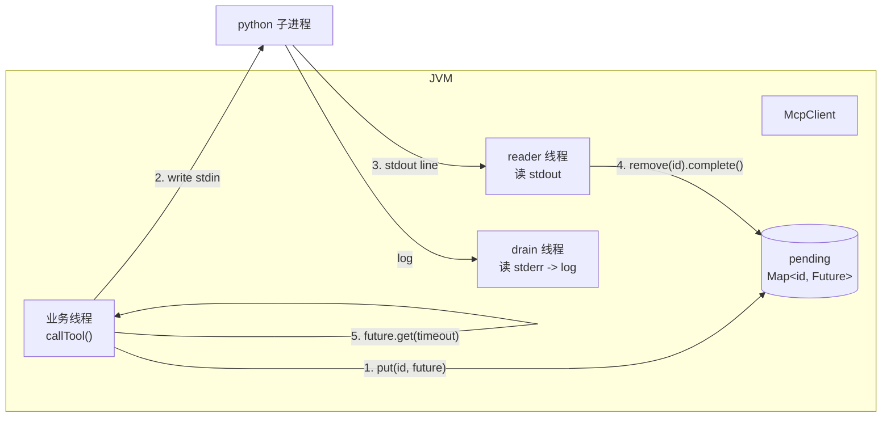

# 03 · Java MCP 客户端：JSON-RPC / stdio / 注册中心

<aside>
🎯

本页实现一个**企业可用的 MCP 客户端**：进程生命周期管理、JSON-RPC id 关联、超时、进度通知、健康检查、自动重连、熔断。这是整个方案里**技术密度最高**的一层，建议逐行读。

</aside>

## 0. 设计要点（先看结论）

| 难点 | 解法 |
| --- | --- |
| stdio 是双向流，响应不保证顺序 | 用 `AtomicLong` 发号 + `ConcurrentHashMap<Long, CompletableFuture>` 做 **id 关联** |
| 读 stdout 不能阻塞业务线程 | 单独开 **daemon reader 线程**，读到一行就分发 |
| python 崩了会挂死所有等待者 | reader 线程退出时 **把所有 pending future 异常完成** |
| 仿真很慢，可能超时 | 每个请求独立超时，超时后从 pending 里摧除，避免内存泄漏 |
| 进程可能被 OOM Killer 干掉 | `@Scheduled` 健康检查 + 指数退避重连 + 达到阀值后熔断 |
| stderr 不读会把缓冲区写满导致 python 卡死 | 单独开 stderr drain 线程（**这个坑超级隐蔽**） |



---

## 1. 协议对象 `mcp/protocol/`

```java
package com.example.simagent.mcp.protocol;

import com.fasterxml.jackson.annotation.JsonInclude;
import lombok.AllArgsConstructor;
import lombok.Data;
import lombok.NoArgsConstructor;

@Data
@NoArgsConstructor
@AllArgsConstructor
@JsonInclude(JsonInclude.Include.NON_NULL)
public class JsonRpcRequest {
    private String jsonrpc = "2.0";
    /** 为 null 则是 notification（不期待回包） */
    private Long id;
    private String method;
    private Object params;

    public static JsonRpcRequest of(Long id, String method, Object params) {
        return new JsonRpcRequest("2.0", id, method, params);
    }

    public static JsonRpcRequest notification(String method, Object params) {
        return new JsonRpcRequest("2.0", null, method, params);
    }
}
```

```java
package com.example.simagent.mcp.protocol;

import com.fasterxml.jackson.annotation.JsonIgnoreProperties;
import com.fasterxml.jackson.databind.JsonNode;
import lombok.Data;

@Data
@JsonIgnoreProperties(ignoreUnknown = true)
public class JsonRpcResponse {
    private String jsonrpc;
    private JsonNode id;          // 可能是 number 也可能是 string，用 JsonNode 兼容
    private JsonNode result;
    private JsonRpcError error;

    public boolean isNotification() {
        return id == null || id.isNull();
    }
}
```

```java
package com.example.simagent.mcp.protocol;

import com.fasterxml.jackson.annotation.JsonIgnoreProperties;
import com.fasterxml.jackson.databind.JsonNode;
import lombok.Data;

@Data
@JsonIgnoreProperties(ignoreUnknown = true)
public class JsonRpcError {
    private int code;
    private String message;
    private JsonNode data;
}
```

```java
package com.example.simagent.mcp.protocol;

import com.fasterxml.jackson.annotation.JsonIgnoreProperties;
import com.fasterxml.jackson.databind.JsonNode;
import lombok.Data;

/** tools/list 返回的单个工具描述 */
@Data
@JsonIgnoreProperties(ignoreUnknown = true)
public class McpToolDefinition {
    private String name;
    private String description;
    /** JSON Schema，直接透传给大模型的 function.parameters */
    private JsonNode inputSchema;
}
```

```java
package com.example.simagent.mcp.protocol;

import com.fasterxml.jackson.annotation.JsonIgnoreProperties;
import com.fasterxml.jackson.databind.JsonNode;
import lombok.Data;

import java.util.ArrayList;
import java.util.List;

@Data
@JsonIgnoreProperties(ignoreUnknown = true)
public class McpCallToolResult {

    private List<McpContent> content = new ArrayList<>();

    /** MCP 的结构化输出，引擎优先用它 */
    private JsonNode structuredContent;

    /** 业务失败标记（与 JSON-RPC error 区分） */
    private boolean isError;

    /** 拼接所有 text 类型 content，给大模型看 */
    public String textContent() {
        StringBuilder sb = new StringBuilder();
        for (McpContent c : content) {
            if ("text".equals(c.getType()) && c.getText() != null) {
                if (sb.length() > 0) {
                    sb.append("\n");
                }
                sb.append(c.getText());
            }
        }
        return sb.toString();
    }
}
```

```java
package com.example.simagent.mcp.protocol;

import com.fasterxml.jackson.annotation.JsonIgnoreProperties;
import lombok.Data;

@Data
@JsonIgnoreProperties(ignoreUnknown = true)
public class McpContent {
    /** text / image / audio / resource / resource_link */
    private String type;
    private String text;
    private String data;
    private String mimeType;
    private String uri;
}
```

```java
package com.example.simagent.mcp;

import lombok.Getter;

@Getter
public class McpException extends RuntimeException {
    private final String serverName;
    private final int code;

    public McpException(String serverName, int code, String msg) {
        super("[mcp:" + serverName + "] " + msg);
        this.serverName = serverName;
        this.code = code;
    }

    public McpException(String serverName, String msg, Throwable cause) {
        super("[mcp:" + serverName + "] " + msg, cause);
        this.serverName = serverName;
        this.code = -1;
    }
}
```

---

## 2. 传输层 `mcp/transport/`

```java
package com.example.simagent.mcp.transport;

import java.io.Closeable;
import java.io.IOException;
import java.util.function.Consumer;

/**
 * MCP 传输层抽象。现在只实现 stdio；
 * 以后想支持远程 MCP（Streamable HTTP / SSE），新写一个实现类即可，McpClient 零改动。
 */
public interface McpTransport extends Closeable {

    String name();

    void start() throws IOException;

    /** 发送一条完整 JSON 消息（实现类负责加换行） */
    void send(String json) throws IOException;

    /** 每收到一条完整 JSON 消息回调一次 */
    void onMessage(Consumer<String> handler);

    /** 传输通道关闭时回调（用于摧除 pending 请求） */
    void onClosed(Runnable handler);

    boolean isAlive();
}
```

```java
package com.example.simagent.mcp.transport;

import lombok.extern.slf4j.Slf4j;

import java.io.BufferedReader;
import java.io.BufferedWriter;
import java.io.File;
import java.io.IOException;
import java.io.InputStreamReader;
import java.io.OutputStreamWriter;
import java.nio.charset.StandardCharsets;
import java.util.ArrayList;
import java.util.List;
import java.util.Map;
import java.util.concurrent.atomic.AtomicBoolean;
import java.util.function.Consumer;

/**
 * stdio 传输：把 python 脚本当子进程拉起，按行收发 JSON。
 *
 * 三个必须注意的工程细节：
 *  1) 必须单独 drain stderr，否则缓冲区满后 python 会卡在 write 上；
 *  2) reader 线程必须是 daemon，否则 JVM 无法退出；
 *  3) send() 必须同步，防止多线程交叉写入导致 JSON 错位。
 */
@Slf4j
public class StdioMcpTransport implements McpTransport {

    private final String serverName;
    private final List<String> command;
    private final Map<String, String> env;
    private final File workDir;

    private volatile Process process;
    private volatile BufferedWriter stdin;
    private volatile Consumer<String> messageHandler;
    private volatile Runnable closedHandler;
    private final AtomicBoolean closed = new AtomicBoolean(false);

    public StdioMcpTransport(String serverName, String command, List<String> args,
                             Map<String, String> env, String workDir) {
        this.serverName = serverName;
        List<String> cmd = new ArrayList<>();
        cmd.add(command);
        if (args != null) {
            cmd.addAll(args);
        }
        this.command = cmd;
        this.env = env;
        this.workDir = (workDir == null || workDir.isBlank())
                ? new File(System.getProperty("user.dir"))
                : new File(workDir);
    }

    @Override
    public String name() {
        return serverName;
    }

    @Override
    public void start() throws IOException {
        ProcessBuilder pb = new ProcessBuilder(command);
        pb.directory(workDir);
        if (env != null && !env.isEmpty()) {
            pb.environment().putAll(env);
        }
        // 不能合并 stderr！否则日志会污染协议通道
        pb.redirectErrorStream(false);

        log.info("[mcp:{}] starting process: {} (cwd={})", serverName, String.join(" ", command), workDir);
        this.process = pb.start();
        this.stdin = new BufferedWriter(
                new OutputStreamWriter(process.getOutputStream(), StandardCharsets.UTF_8));

        Thread reader = new Thread(this::pumpStdout, "mcp-" + serverName + "-stdout");
        reader.setDaemon(true);
        reader.start();

        Thread errReader = new Thread(this::pumpStderr, "mcp-" + serverName + "-stderr");
        errReader.setDaemon(true);
        errReader.start();
    }

    private void pumpStdout() {
        try (BufferedReader br = new BufferedReader(
                new InputStreamReader(process.getInputStream(), StandardCharsets.UTF_8))) {
            String line;
            while ((line = br.readLine()) != null) {
                if (line.isBlank()) {
                    continue;
                }
                log.trace("[mcp:{}] <<< {}", serverName, line);
                Consumer<String> h = messageHandler;
                if (h != null) {
                    try {
                        h.accept(line);
                    } catch (Exception e) {
                        log.error("[mcp:{}] message handler error", serverName, e);
                    }
                }
            }
        } catch (IOException e) {
            if (!closed.get()) {
                log.warn("[mcp:{}] stdout closed: {}", serverName, e.getMessage());
            }
        } finally {
            log.warn("[mcp:{}] reader thread exit, process alive={}", serverName, isAlive());
            Runnable ch = closedHandler;
            if (ch != null) {
                ch.run();
            }
        }
    }

    private void pumpStderr() {
        try (BufferedReader br = new BufferedReader(
                new InputStreamReader(process.getErrorStream(), StandardCharsets.UTF_8))) {
            String line;
            while ((line = br.readLine()) != null) {
                log.debug("[mcp:{}][py] {}", serverName, line);
            }
        } catch (IOException ignored) {
            // 进程退出时正常抛出
        }
    }

    @Override
    public synchronized void send(String json) throws IOException {
        if (!isAlive()) {
            throw new IOException("MCP process is not alive: " + serverName);
        }
        log.trace("[mcp:{}] >>> {}", serverName, json);
        stdin.write(json);
        stdin.write("\n");
        stdin.flush();
    }

    @Override
    public void onMessage(Consumer<String> handler) {
        this.messageHandler = handler;
    }

    @Override
    public void onClosed(Runnable handler) {
        this.closedHandler = handler;
    }

    @Override
    public boolean isAlive() {
        Process p = process;
        return p != null && p.isAlive();
    }

    @Override
    public void close() {
        if (!closed.compareAndSet(false, true)) {
            return;
        }
        try {
            if (stdin != null) {
                stdin.close();
            }
        } catch (Exception ignored) {
        }
        Process p = process;
        if (p != null) {
            p.destroy();
            try {
                if (!p.waitFor(5, java.util.concurrent.TimeUnit.SECONDS)) {
                    p.destroyForcibly();
                }
            } catch (InterruptedException e) {
                Thread.currentThread().interrupt();
                p.destroyForcibly();
            }
        }
        log.info("[mcp:{}] transport closed", serverName);
    }
}
```

---

## 3. `mcp/McpClient.java` —— 协议核心

```java
package com.example.simagent.mcp;

import com.example.simagent.common.JsonUtils;
import com.example.simagent.mcp.protocol.JsonRpcRequest;
import com.example.simagent.mcp.protocol.JsonRpcResponse;
import com.example.simagent.mcp.protocol.McpCallToolResult;
import com.example.simagent.mcp.protocol.McpToolDefinition;
import com.example.simagent.mcp.transport.McpTransport;
import com.fasterxml.jackson.databind.JsonNode;
import com.fasterxml.jackson.databind.node.ObjectNode;
import lombok.extern.slf4j.Slf4j;

import java.io.Closeable;
import java.time.Duration;
import java.util.ArrayList;
import java.util.LinkedHashMap;
import java.util.List;
import java.util.Map;
import java.util.concurrent.CompletableFuture;
import java.util.concurrent.ConcurrentHashMap;
import java.util.concurrent.ExecutionException;
import java.util.concurrent.TimeUnit;
import java.util.concurrent.TimeoutException;
import java.util.concurrent.atomic.AtomicLong;

/**
 * MCP 客户端（一个实例对应一个 MCP Server）。
 * 线程安全：可被 workflow 的多个并行节点同时调用。
 */
@Slf4j
public class McpClient implements Closeable {

    private static final String PROTOCOL_VERSION = "2024-11-05";

    private final String serverName;
    private final McpTransport transport;

    private final AtomicLong idSeq = new AtomicLong(0);
    private final Map<Long, CompletableFuture<JsonNode>> pending = new ConcurrentHashMap<>();

    private volatile List<McpToolDefinition> tools = new ArrayList<>();
    private volatile String serverVersion = "unknown";
    private volatile String instructions = "";

    public McpClient(String serverName, McpTransport transport) {
        this.serverName = serverName;
        this.transport = transport;
    }

    public String getServerName() {
        return serverName;
    }

    public List<McpToolDefinition> getTools() {
        return tools;
    }

    public String getServerVersion() {
        return serverVersion;
    }

    public String getInstructions() {
        return instructions;
    }

    public boolean isAlive() {
        return transport.isAlive();
    }

    // ------------------------------------------------------------------ //
    // 连接：initialize -> notifications/initialized -> tools/list
    // ------------------------------------------------------------------ //
    public void connect(Duration timeout) {
        transport.onMessage(this::onMessage);
        transport.onClosed(this::failAllPending);
        try {
            transport.start();
        } catch (Exception e) {
            throw new McpException(serverName, "进程启动失败: " + e.getMessage(), e);
        }

        ObjectNode initParams = JsonUtils.obj();
        initParams.put("protocolVersion", PROTOCOL_VERSION);
        initParams.set("capabilities", JsonUtils.obj());
        ObjectNode clientInfo = initParams.putObject("clientInfo");
        clientInfo.put("name", "simulation-agent-java");
        clientInfo.put("version", "1.0.0");

        JsonNode initResult = request("initialize", initParams, timeout);
        this.serverVersion = JsonUtils.text(initResult.get("serverInfo"), "version", "unknown");
        this.instructions = JsonUtils.text(initResult, "instructions", "");
        log.info("[mcp:{}] initialized, serverVersion={}, protocol={}",
                serverName, serverVersion, JsonUtils.text(initResult, "protocolVersion", "?"));

        // 通知：无 id，不等回包
        notify("notifications/initialized", JsonUtils.obj());

        this.tools = fetchTools(timeout);
        log.info("[mcp:{}] tools={}", serverName,
                tools.stream().map(McpToolDefinition::getName).toList());
    }

    private List<McpToolDefinition> fetchTools(Duration timeout) {
        JsonNode res = request("tools/list", JsonUtils.obj(), timeout);
        List<McpToolDefinition> list = new ArrayList<>();
        JsonNode arr = res.get("tools");
        if (arr != null && arr.isArray()) {
            for (JsonNode n : arr) {
                list.add(JsonUtils.convert(n, McpToolDefinition.class));
            }
        }
        return list;
    }

    public List<McpToolDefinition> refreshTools(Duration timeout) {
        this.tools = fetchTools(timeout);
        return this.tools;
    }

    public boolean ping(Duration timeout) {
        try {
            request("ping", JsonUtils.obj(), timeout);
            return true;
        } catch (Exception e) {
            log.warn("[mcp:{}] ping failed: {}", serverName, e.getMessage());
            return false;
        }
    }

    // ------------------------------------------------------------------ //
    // 核心：tools/call
    // ------------------------------------------------------------------ //
    public McpCallToolResult callTool(String toolName, Map<String, Object> arguments, Duration timeout) {
        Map<String, Object> params = new LinkedHashMap<>();
        params.put("name", toolName);
        params.put("arguments", arguments == null ? Map.of() : arguments);

        long started = System.currentTimeMillis();
        JsonNode result = request("tools/call", params, timeout);
        McpCallToolResult r = JsonUtils.convert(result, McpCallToolResult.class);
        log.info("[mcp:{}] tools/call {} finished in {}ms, isError={}",
                serverName, toolName, System.currentTimeMillis() - started, r.isError());
        return r;
    }

    public boolean hasTool(String toolName) {
        return tools.stream().anyMatch(t -> t.getName().equals(toolName));
    }

    // ------------------------------------------------------------------ //
    // JSON-RPC 管道
    // ------------------------------------------------------------------ //
    private JsonNode request(String method, Object params, Duration timeout) {
        long id = idSeq.incrementAndGet();
        CompletableFuture<JsonNode> future = new CompletableFuture<>();
        pending.put(id, future);
        try {
            transport.send(JsonUtils.toJson(JsonRpcRequest.of(id, method, params)));
            return future.get(timeout.toMillis(), TimeUnit.MILLISECONDS);
        } catch (TimeoutException e) {
            throw new McpException(serverName, -32000,
                    method + " 超时 (" + timeout.toSeconds() + "s)，请检查 python 进程日志");
        } catch (ExecutionException e) {
            Throwable cause = e.getCause();
            if (cause instanceof McpException me) {
                throw me;
            }
            throw new McpException(serverName, method + " 失败: " + cause.getMessage(), cause);
        } catch (InterruptedException e) {
            Thread.currentThread().interrupt();
            throw new McpException(serverName, method + " 被中断", e);
        } catch (Exception e) {
            throw new McpException(serverName, method + " 发送失败: " + e.getMessage(), e);
        } finally {
            pending.remove(id);   // 无论成败都要清理，防内存泄漏
        }
    }

    private void notify(String method, Object params) {
        try {
            transport.send(JsonUtils.toJson(JsonRpcRequest.notification(method, params)));
        } catch (Exception e) {
            log.warn("[mcp:{}] notification {} 发送失败: {}", serverName, method, e.getMessage());
        }
    }

    /** reader 线程回调：分发响应 / 服务端通知 */
    private void onMessage(String line) {
        JsonRpcResponse resp;
        try {
            resp = JsonUtils.mapper().readValue(line, JsonRpcResponse.class);
        } catch (Exception e) {
            log.warn("[mcp:{}] 无法解析消息: {}", serverName, line);
            return;
        }

        // 服务端主动发的通知（如 notifications/progress）
        if (resp.isNotification()) {
            handleServerNotification(line);
            return;
        }

        long id = resp.getId().asLong();
        CompletableFuture<JsonNode> future = pending.remove(id);
        if (future == null) {
            log.warn("[mcp:{}] 收到无人认领的响应 id={}（可能已超时）", serverName, id);
            return;
        }
        if (resp.getError() != null) {
            future.completeExceptionally(new McpException(serverName,
                    resp.getError().getCode(), resp.getError().getMessage()));
        } else {
            future.complete(resp.getResult() == null ? JsonUtils.obj() : resp.getResult());
        }
    }

    private void handleServerNotification(String raw) {
        JsonNode n = JsonUtils.readTree(raw);
        String method = JsonUtils.text(n, "method", "");
        if ("notifications/progress".equals(method)) {
            JsonNode p = n.path("params");
            log.debug("[mcp:{}] progress {}% {}", serverName,
                    p.path("progress").asDouble(), p.path("message").asText(""));
            // 如需把进度推到前端，在这里发送 AgentEvent 即可
        } else {
            log.debug("[mcp:{}] server notification: {}", serverName, raw);
        }
    }

    /** 进程挂了：把所有等待者唤醒，否则业务线程会死等到超时 */
    private void failAllPending() {
        if (pending.isEmpty()) {
            return;
        }
        log.warn("[mcp:{}] 进程通道关闭，摧除 {} 个未完成请求", serverName, pending.size());
        pending.forEach((id, f) -> f.completeExceptionally(
                new McpException(serverName, -32001, "MCP 进程异常退出，请求被中断")));
        pending.clear();
    }

    @Override
    public void close() {
        failAllPending();
        transport.close();
    }
}
```

---

## 4. `mcp/McpServerHandle.java`

```java
package com.example.simagent.mcp;

import com.example.simagent.config.McpProperties;
import lombok.Data;

import java.util.concurrent.atomic.AtomicInteger;

@Data
public class McpServerHandle {

    public enum Status { DOWN, UP, CIRCUIT_OPEN }

    private final McpProperties.ServerConfig config;
    private volatile McpClient client;
    private volatile Status status = Status.DOWN;
    private volatile String lastError;
    private volatile long lastCheckAt;
    private final AtomicInteger reconnectAttempts = new AtomicInteger(0);

    public McpServerHandle(McpProperties.ServerConfig config) {
        this.config = config;
    }

    public String name() {
        return config.getName();
    }

    public boolean usable() {
        return status == Status.UP && client != null && client.isAlive();
    }
}
```

---

## 5. `mcp/McpServerRegistry.java` —— 插件注册中心

```java
package com.example.simagent.mcp;

import com.example.simagent.common.BizException;
import com.example.simagent.common.ErrorCode;
import com.example.simagent.config.McpProperties;
import com.example.simagent.mcp.protocol.McpToolDefinition;
import com.example.simagent.mcp.transport.StdioMcpTransport;
import lombok.extern.slf4j.Slf4j;
import org.springframework.scheduling.annotation.Scheduled;
import org.springframework.stereotype.Component;

import javax.annotation.PostConstruct;
import javax.annotation.PreDestroy;
import java.time.Duration;
import java.util.ArrayList;
import java.util.Collection;
import java.util.LinkedHashMap;
import java.util.List;
import java.util.Map;

/**
 * MCP Server 注册中心：启动、健康检查、重连、熔断。
 * 引擎和 Agent 只能通过这里拿 client，不得自己 new。
 */
@Slf4j
@Component
public class McpServerRegistry {

    private final McpProperties props;
    private final Map<String, McpServerHandle> handles = new LinkedHashMap<>();

    public McpServerRegistry(McpProperties props) {
        this.props = props;
    }

    @PostConstruct
    public void init() {
        for (McpProperties.ServerConfig cfg : props.getServers()) {
            if (!cfg.isEnabled()) {
                log.info("[mcp] server '{}' disabled, skip", cfg.getName());
                continue;
            }
            McpServerHandle handle = new McpServerHandle(cfg);
            handles.put(cfg.getName(), handle);
            try {
                startServer(handle);
            } catch (Exception e) {
                handle.setStatus(McpServerHandle.Status.DOWN);
                handle.setLastError(e.getMessage());
                log.error("[mcp] server '{}' 启动失败: {}", cfg.getName(), e.getMessage());
                if (props.isFailFastOnStartup()) {
                    throw new IllegalStateException("MCP server 启动失败: " + cfg.getName(), e);
                }
            }
        }
        log.info("[mcp] registry ready, servers={}", handles.keySet());
    }

    private synchronized void startServer(McpServerHandle handle) {
        McpProperties.ServerConfig cfg = handle.getConfig();

        if (!"stdio".equalsIgnoreCase(cfg.getTransport())) {
            throw new IllegalArgumentException("目前仅支持 stdio 传输: " + cfg.getTransport());
        }

        StdioMcpTransport transport = new StdioMcpTransport(
                cfg.getName(), cfg.getCommand(), cfg.getArgs(), cfg.getEnv(), cfg.getWorkDir());
        McpClient client = new McpClient(cfg.getName(), transport);
        client.connect(Duration.ofSeconds(props.getStartupTimeoutSeconds()));

        handle.setClient(client);
        handle.setStatus(McpServerHandle.Status.UP);
        handle.setLastError(null);
        handle.getReconnectAttempts().set(0);
        log.info("[mcp] server '{}' UP, tools={}", cfg.getName(),
                client.getTools().stream().map(McpToolDefinition::getName).toList());
    }

    // ------------------------------------------------------------------ //
    // 对外 API
    // ------------------------------------------------------------------ //
    public McpClient requireClient(String serverName) {
        McpServerHandle h = handles.get(serverName);
        if (h == null) {
            throw new BizException(ErrorCode.MCP_UNAVAILABLE,
                    "未配置的 MCP Server: " + serverName + "，已知: " + handles.keySet());
        }
        if (!h.usable()) {
            // 最后一次挣扎：尝试即时重连
            if (h.getStatus() != McpServerHandle.Status.CIRCUIT_OPEN) {
                tryReconnect(h);
            }
            if (!h.usable()) {
                throw new BizException(ErrorCode.MCP_UNAVAILABLE, String.format(
                        "MCP Server [%s] 不可用，status=%s, lastError=%s",
                        serverName, h.getStatus(), h.getLastError()));
            }
        }
        return h.getClient();
    }

    public Collection<McpServerHandle> handles() {
        return handles.values();
    }

    public McpServerHandle handle(String name) {
        return handles.get(name);
    }

    /** 所有“允许直接暂给大模型”的工具 */
    public List<McpToolRef> exposedTools() {
        List<McpToolRef> refs = new ArrayList<>();
        for (McpServerHandle h : handles.values()) {
            if (!h.getConfig().isExposeToLlm() || !h.usable()) {
                continue;
            }
            for (McpToolDefinition t : h.getClient().getTools()) {
                refs.add(new McpToolRef(h.name(), h.getConfig().getDescription(), t));
            }
        }
        return refs;
    }

    public boolean manualReconnect(String name) {
        McpServerHandle h = handles.get(name);
        if (h == null) {
            return false;
        }
        h.getReconnectAttempts().set(0);
        h.setStatus(McpServerHandle.Status.DOWN);
        return tryReconnect(h);
    }

    // ------------------------------------------------------------------ //
    // 健康检查 + 自动重连
    // ------------------------------------------------------------------ //
    @Scheduled(fixedDelayString = "#{@mcpProperties.healthCheckIntervalSeconds * 1000}")
    public void healthCheck() {
        for (McpServerHandle h : handles.values()) {
            h.setLastCheckAt(System.currentTimeMillis());
            if (h.getStatus() == McpServerHandle.Status.CIRCUIT_OPEN) {
                continue;
            }
            boolean ok = h.getClient() != null
                    && h.getClient().isAlive()
                    && h.getClient().ping(Duration.ofSeconds(5));
            if (ok) {
                h.setStatus(McpServerHandle.Status.UP);
                h.getReconnectAttempts().set(0);
            } else {
                log.warn("[mcp] health check failed for '{}', 尝试重连", h.name());
                h.setStatus(McpServerHandle.Status.DOWN);
                tryReconnect(h);
            }
        }
    }

    private synchronized boolean tryReconnect(McpServerHandle h) {
        int attempt = h.getReconnectAttempts().incrementAndGet();
        if (attempt > props.getMaxReconnectAttempts()) {
            h.setStatus(McpServerHandle.Status.CIRCUIT_OPEN);
            log.error("[mcp] server '{}' 连续 {} 次重连失败，进入熔断，需手动 /api/mcp/{}/reconnect",
                    h.name(), attempt - 1, h.name());
            return false;
        }
        try {
            if (h.getClient() != null) {
                h.getClient().close();
            }
        } catch (Exception ignored) {
        }
        try {
            // 指数退避：1s, 2s, 4s, 8s...
            long backoff = Math.min(1000L << (attempt - 1), 30_000L);
            log.info("[mcp] reconnect '{}' attempt={} after {}ms", h.name(), attempt, backoff);
            Thread.sleep(backoff);
            startServer(h);
            return true;
        } catch (InterruptedException ie) {
            Thread.currentThread().interrupt();
            return false;
        } catch (Exception e) {
            h.setStatus(McpServerHandle.Status.DOWN);
            h.setLastError(e.getMessage());
            log.error("[mcp] reconnect '{}' 失败: {}", h.name(), e.getMessage());
            return false;
        }
    }

    @PreDestroy
    public void shutdown() {
        handles.values().forEach(h -> {
            if (h.getClient() != null) {
                try {
                    h.getClient().close();
                } catch (Exception ignored) {
                }
            }
        });
        log.info("[mcp] all servers closed");
    }

    /** 工具引用：哪个 server 的哪个 tool */
    public record McpToolRef(String serverName, String serverDescription, McpToolDefinition tool) {
    }
}
```

<aside>
⚠️

`@Scheduled(fixedDelayString = "#{@mcpProperties.healthCheckIntervalSeconds * 1000}")` 靠 SpEL 读配置 Bean。因为用了 `@ConfigurationPropertiesScan`，Bean 名默认是 `mcp-com.example.simagent.config.McpProperties` 这种形式。为避免麻烦，**建议在 `McpProperties` 上加 `@Component("mcpProperties")`**（或直接写固定值 `fixedDelay = 30000`）。

</aside>

---

## 6. `mcp/McpToolCatalog.java` —— MCP 工具 → LLM 工具名映射

大模型的 function name 只允许 `[a-zA-Z0-9_-]`，且多个 MCP Server 可能有**同名 tool**（比如两个 server 都有 `get_simulation_status`）。所以必须加名空间前缀。

```java
package com.example.simagent.mcp;

import lombok.extern.slf4j.Slf4j;
import org.springframework.stereotype.Component;

import java.util.LinkedHashMap;
import java.util.Map;

/**
 * 命名规则：mcp__{serverName}__{toolName}
 * 例：mcp__coventor__run_coventor_simulation
 */
@Slf4j
@Component
public class McpToolCatalog {

    public static final String PREFIX = "mcp__";
    private static final String SEP = "__";

    private final McpServerRegistry registry;

    public McpToolCatalog(McpServerRegistry registry) {
        this.registry = registry;
    }

    public String llmName(String serverName, String toolName) {
        return PREFIX + serverName + SEP + toolName;
    }

    public boolean isMcpToolName(String llmName) {
        return llmName != null && llmName.startsWith(PREFIX);
    }

    /** 反解：mcp__coventor__run_x -> [coventor, run_x] */
    public String[] parse(String llmName) {
        String body = llmName.substring(PREFIX.length());
        int idx = body.indexOf(SEP);
        if (idx <= 0) {
            throw new IllegalArgumentException("非法 MCP 工具名: " + llmName);
        }
        return new String[]{body.substring(0, idx), body.substring(idx + SEP.length())};
    }

    /** 当前可用且允许暂给大模型的全部 MCP 工具 */
    public Map<String, McpServerRegistry.McpToolRef> exposed() {
        Map<String, McpServerRegistry.McpToolRef> map = new LinkedHashMap<>();
        for (McpServerRegistry.McpToolRef ref : registry.exposedTools()) {
            map.put(llmName(ref.serverName(), ref.tool().getName()), ref);
        }
        return map;
    }
}
```

---

## 7. 自测：写一个引导测试

```java
package com.example.simagent.mcp;

import com.example.simagent.mcp.protocol.McpCallToolResult;
import org.junit.jupiter.api.Test;
import org.springframework.beans.factory.annotation.Autowired;
import org.springframework.boot.test.context.SpringBootTest;

import java.time.Duration;
import java.util.Map;

import static org.junit.jupiter.api.Assertions.assertFalse;
import static org.junit.jupiter.api.Assertions.assertTrue;

@SpringBootTest
class McpClientIT {

    @Autowired
    private McpServerRegistry registry;

    @Test
    void should_list_and_call_tools() {
        McpClient client = registry.requireClient("coventor");
        assertTrue(client.hasTool("run_coventor_simulation"));

        McpCallToolResult r = client.callTool("run_mesh_generation",
                Map.of("model_name", "resonator_v1", "mesh_size", 1.5, "mock_seconds", 1),
                Duration.ofSeconds(30));

        assertFalse(r.isError());
        System.out.println(r.getStructuredContent().toPrettyString());
        assertTrue(r.getStructuredContent().has("mesh_file"));
    }
}
```

预期日志：

```
[mcp:coventor] starting process: python3 -u mcp-servers/python/coventor_server.py (cwd=/xxx/simulation-agent)
[mcp:coventor][py] [11:02:31][coventor] MCP server start, version=1.0.0, tools=['run_mesh_generation', ...]
[mcp:coventor] initialized, serverVersion=1.0.0, protocol=2024-11-05
[mcp] server 'coventor' UP, tools=[run_mesh_generation, run_coventor_simulation, list_solvers, get_simulation_status]
[mcp:coventor] tools/call run_mesh_generation finished in 1043ms, isError=false
```

---

## 8. 常见故障排查表

| 现象 | 根因 | 解法 |
| --- | --- | --- |
| `无法解析消息: xxx` | python 里有 `print()` 污染了 stdout | 全局搜 `print(`，改成 `server.log()` |
| `initialize 超时` | 未加 `-u`，python 输出被缓冲 | args 里必须带 `-u`（或设 `PYTHONUNBUFFERED=1`） |
| `进程启动失败: Cannot run program "python3"` | PATH 里没有 python3（尤其 Windows） | 配 `PYTHON_BIN=python` 或给绝对路径 |
| 相对路径找不到脚本 | 工作目录不是项目根 | 配 `work-dir`，或改用绝对路径 |
| 仿真跑到一半卡住 | stderr 缓冲区写满 | 必须有 stderr drain 线程（本实现已包含） |
| 中文乱码 | 编码不一致 | env 里设 `PYTHONIOENCODING=utf-8`，Java 侧统一 UTF-8 |
| 重启后熔断不恢复 | 达到 maxReconnectAttempts | 调 `POST /api/mcp/{name}/reconnect` |

<aside>
💡

**为什么没用官方 MCP Java SDK？** 官方 Java SDK 与 Spring AI 生态绑定较紧（面向 Spring Boot 3.x / Reactor），在 Boot 2.6 上引入容易冲突。而 MCP 的 tools 子集就是上面这 300 行，手写可控、无依赖、易排查。待你们升到 Boot 3.x 后，只需把 `McpClient`/`McpTransport` 这两个类换掉，上层零改动。

</aside>