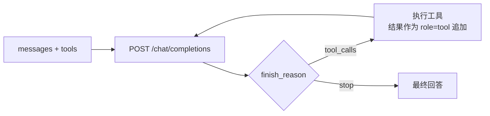

# 04 · LLM 接入层：零框架 Function Calling + Mock 大模型

<aside>
🎯

不用 Spring AI / LangChain4j，自己接大模型到底要写多少东西？**答案：一个 HttpClient + 五个 POJO。** 本页把它完整写出来，并额外提供一个 `MockLlmClient`，**不配 API Key 也能把全链路跑通**。

</aside>

## 0. 为什么手写反而更简单

大模型的 Function Calling 就是一个 HTTP POST：

```
POST {base-url}/chat/completions
Authorization: Bearer sk-xxx

请求：{ model, messages[], tools[], tool_choice, temperature, stream }
响应：{ choices:[{ message:{ role, content, tool_calls[] }, finish_reason }], usage }
```

大模型只会做两件事：① 返回 `content`（说人话）；② 返回 `tool_calls`（请求调工具）。**Agent 框架干的活就是把②执行完把结果塞回 messages 再问一次。** 就这么简单。



<aside>
📘

领导担心的兼容性问题是真存在的：Spring AI 基线是 Spring Boot 3.2+/Spring Framework 6 + JDK 17；LangChain4j 的 Spring Boot Starter 也主要面向 Boot 3.x。在 **Boot 2.6 + Spring 5.3** 上硬接会碰到 `javax.*` vs `jakarta.*`、Reactor 版本、AutoConfiguration 机制差异等一堆问题。手写这一层只有 ~400 行，反而是最稳的选择。

</aside>

---

## 1. 数据模型 `llm/model/`

### 1.1 `ChatMessage`

```java
package com.example.simagent.llm.model;

import com.fasterxml.jackson.annotation.JsonInclude;
import com.fasterxml.jackson.annotation.JsonProperty;
import lombok.AllArgsConstructor;
import lombok.Builder;
import lombok.Data;
import lombok.NoArgsConstructor;

import java.util.List;

/**
 * OpenAI 兼容的消息体。四种 role：
 *  system    —— 系统提示词
 *  user      —— 用户输入
 *  assistant —— 大模型回复（可能带 tool_calls）
 *  tool      —— 工具执行结果（必须带 tool_call_id）
 */
@Data
@Builder
@NoArgsConstructor
@AllArgsConstructor
@JsonInclude(JsonInclude.Include.NON_NULL)
public class ChatMessage {

    private String role;
    private String content;

    /** assistant 消息里的工具调用请求 */
    @JsonProperty("tool_calls")
    private List<ToolCall> toolCalls;

    /** role=tool 时必填，对应上一轮的 toolCall.id */
    @JsonProperty("tool_call_id")
    private String toolCallId;

    /** 可选：工具名（部分网关需要） */
    private String name;

    public static ChatMessage system(String content) {
        return ChatMessage.builder().role("system").content(content).build();
    }

    public static ChatMessage user(String content) {
        return ChatMessage.builder().role("user").content(content).build();
    }

    public static ChatMessage assistant(String content) {
        return ChatMessage.builder().role("assistant").content(content).build();
    }

    public static ChatMessage assistantToolCalls(String content, List<ToolCall> calls) {
        return ChatMessage.builder().role("assistant").content(content).toolCalls(calls).build();
    }

    public static ChatMessage tool(String toolCallId, String name, String content) {
        return ChatMessage.builder()
                .role("tool").toolCallId(toolCallId).name(name).content(content).build();
    }

    public boolean hasToolCalls() {
        return toolCalls != null && !toolCalls.isEmpty();
    }
}
```

### 1.2 `ToolCall` / `FunctionCall`

```java
package com.example.simagent.llm.model;

import com.fasterxml.jackson.annotation.JsonIgnoreProperties;
import com.fasterxml.jackson.annotation.JsonInclude;
import lombok.AllArgsConstructor;
import lombok.Builder;
import lombok.Data;
import lombok.NoArgsConstructor;

@Data
@Builder
@NoArgsConstructor
@AllArgsConstructor
@JsonInclude(JsonInclude.Include.NON_NULL)
@JsonIgnoreProperties(ignoreUnknown = true)
public class ToolCall {
    /** 流式拼接时用得上 */
    private Integer index;
    private String id;
    private String type;            // 固定 "function"
    private FunctionCall function;

    public static ToolCall of(String id, String name, String argsJson) {
        return ToolCall.builder().id(id).type("function")
                .function(new FunctionCall(name, argsJson)).build();
    }
}
```

```java
package com.example.simagent.llm.model;

import com.fasterxml.jackson.annotation.JsonIgnoreProperties;
import com.fasterxml.jackson.annotation.JsonInclude;
import lombok.AllArgsConstructor;
import lombok.Data;
import lombok.NoArgsConstructor;

@Data
@NoArgsConstructor
@AllArgsConstructor
@JsonInclude(JsonInclude.Include.NON_NULL)
@JsonIgnoreProperties(ignoreUnknown = true)
public class FunctionCall {
    private String name;
    /** 注意：大模型返回的是 **JSON 字符串**，不是对象！需要二次解析 */
    private String arguments;
}
```

<aside>
🚨

最容易踩的坑：`function.arguments` 是字符串化的 JSON（例：`"{\"model_name\":\"a\"}"`），而且流式返回时会**一小段一小段拼**。一定要先拼完再解析，而且解析要容错（大模型偶尔会吐出不合法 JSON）。

</aside>

### 1.3 `ToolSpec`

```java
package com.example.simagent.llm.model;

import com.fasterxml.jackson.annotation.JsonInclude;
import com.fasterxml.jackson.databind.JsonNode;
import lombok.AllArgsConstructor;
import lombok.Data;
import lombok.NoArgsConstructor;

import java.util.LinkedHashMap;
import java.util.Map;

/** 传给大模型的工具声明（OpenAI tools 格式） */
@Data
@NoArgsConstructor
@AllArgsConstructor
@JsonInclude(JsonInclude.Include.NON_NULL)
public class ToolSpec {

    private String type = "function";
    private Function function;

    @Data
    @NoArgsConstructor
    @AllArgsConstructor
    @JsonInclude(JsonInclude.Include.NON_NULL)
    public static class Function {
        private String name;
        private String description;
        /** JSON Schema */
        private JsonNode parameters;
    }

    public static ToolSpec of(String name, String description, JsonNode schema) {
        return new ToolSpec("function", new Function(name, description, schema));
    }

    public Map<String, Object> brief() {
        Map<String, Object> m = new LinkedHashMap<>();
        m.put("name", function.getName());
        m.put("desc", function.getDescription());
        return m;
    }
}
```

### 1.4 `LlmRequest` / `LlmResponse` / `Usage`

```java
package com.example.simagent.llm.model;

import com.fasterxml.jackson.annotation.JsonInclude;
import com.fasterxml.jackson.annotation.JsonProperty;
import lombok.Builder;
import lombok.Data;

import java.util.List;

@Data
@Builder
@JsonInclude(JsonInclude.Include.NON_NULL)
public class LlmRequest {
    private String model;
    private List<ChatMessage> messages;
    private List<ToolSpec> tools;
    /** "auto" | "none" | "required" */
    @JsonProperty("tool_choice")
    private String toolChoice;
    private Double temperature;
    @JsonProperty("max_tokens")
    private Integer maxTokens;
    private Boolean stream;
}
```

```java
package com.example.simagent.llm.model;

import lombok.Builder;
import lombok.Data;

import java.util.List;

@Data
@Builder
public class LlmResponse {
    /** 自然语言内容（可为空） */
    private String content;
    /** 工具调用请求（可为空） */
    private List<ToolCall> toolCalls;
    /** stop | tool_calls | length | content_filter */
    private String finishReason;
    private Usage usage;
    private String rawModel;
    private long latencyMs;

    public boolean wantsToolCall() {
        return toolCalls != null && !toolCalls.isEmpty();
    }

    public ChatMessage toAssistantMessage() {
        return wantsToolCall()
                ? ChatMessage.assistantToolCalls(content, toolCalls)
                : ChatMessage.assistant(content == null ? "" : content);
    }
}
```

```java
package com.example.simagent.llm.model;

import com.fasterxml.jackson.annotation.JsonIgnoreProperties;
import com.fasterxml.jackson.annotation.JsonProperty;
import lombok.Data;

@Data
@JsonIgnoreProperties(ignoreUnknown = true)
public class Usage {
    @JsonProperty("prompt_tokens")
    private int promptTokens;
    @JsonProperty("completion_tokens")
    private int completionTokens;
    @JsonProperty("total_tokens")
    private int totalTokens;
}
```

---

## 2. `llm/LlmClient.java` + `LlmException`

```java
package com.example.simagent.llm;

import com.example.simagent.llm.model.LlmRequest;
import com.example.simagent.llm.model.LlmResponse;

import java.util.function.Consumer;

public interface LlmClient {

    /** 同步调用 */
    LlmResponse chat(LlmRequest request);

    /**
     * 流式调用。onDelta 会被频繁回调（每个 token 片段），
     * 用于把大模型“边想边说”的内容实时推到前端。
     * 返回值是拼接完成后的完整响应。
     */
    LlmResponse chatStream(LlmRequest request, Consumer<String> onDelta);

    String modelName();
}
```

```java
package com.example.simagent.llm;

public class LlmException extends RuntimeException {
    public LlmException(String message) {
        super(message);
    }

    public LlmException(String message, Throwable cause) {
        super(message, cause);
    }
}
```

---

## 3. `llm/OpenAiCompatibleLlmClient.java` —— 真实大模型

兼容所有 **OpenAI 格式兼容** 的网关：通义千问 compatible-mode、DeepSeek、智谱、Moonshot、vLLM、Ollama、One-API、Azure OpenAI（路径稍调）。

```java
package com.example.simagent.llm;

import com.example.simagent.common.JsonUtils;
import com.example.simagent.config.LlmProperties;
import com.example.simagent.llm.model.ChatMessage;
import com.example.simagent.llm.model.FunctionCall;
import com.example.simagent.llm.model.LlmRequest;
import com.example.simagent.llm.model.LlmResponse;
import com.example.simagent.llm.model.ToolCall;
import com.example.simagent.llm.model.Usage;
import com.fasterxml.jackson.databind.JsonNode;
import lombok.extern.slf4j.Slf4j;
import org.springframework.boot.autoconfigure.condition.ConditionalOnProperty;
import org.springframework.stereotype.Component;

import java.net.URI;
import java.net.http.HttpClient;
import java.net.http.HttpRequest;
import java.net.http.HttpResponse;
import java.nio.charset.StandardCharsets;
import java.time.Duration;
import java.util.ArrayList;
import java.util.LinkedHashMap;
import java.util.List;
import java.util.Map;
import java.util.function.Consumer;
import java.util.stream.Stream;

/**
 * 零三方依赖的 LLM 客户端，只用 JDK 17 自带的 java.net.http.HttpClient。
 * 支持：非流式 / SSE 流式 / Function Calling / 指数退避重试。
 */
@Slf4j
@Component
@ConditionalOnProperty(name = "agent.llm.mock", havingValue = "false")
public class OpenAiCompatibleLlmClient implements LlmClient {

    private final LlmProperties props;
    private final HttpClient http;

    public OpenAiCompatibleLlmClient(LlmProperties props) {
        this.props = props;
        this.http = HttpClient.newBuilder()
                .connectTimeout(Duration.ofSeconds(15))
                .version(HttpClient.Version.HTTP_1_1)   // 部分网关对 h2 流式支持不好
                .build();
    }

    @Override
    public String modelName() {
        return props.getModel();
    }

    // ------------------------------------------------------------------ //
    // 非流式
    // ------------------------------------------------------------------ //
    @Override
    public LlmResponse chat(LlmRequest request) {
        request.setStream(false);
        fillDefaults(request);
        long started = System.currentTimeMillis();

        String body = JsonUtils.toJson(request);
        String respBody = executeWithRetry(body, false, null);

        JsonNode root = JsonUtils.readTree(respBody);
        checkApiError(root);

        JsonNode choice = root.path("choices").path(0);
        JsonNode message = choice.path("message");

        LlmResponse resp = LlmResponse.builder()
                .content(message.path("content").isNull() ? "" : message.path("content").asText(""))
                .toolCalls(parseToolCalls(message.path("tool_calls")))
                .finishReason(choice.path("finish_reason").asText("stop"))
                .usage(root.has("usage") ? JsonUtils.convert(root.get("usage"), Usage.class) : null)
                .rawModel(root.path("model").asText(props.getModel()))
                .latencyMs(System.currentTimeMillis() - started)
                .build();

        log.info("[llm] chat done in {}ms, finish={}, toolCalls={}, tokens={}",
                resp.getLatencyMs(), resp.getFinishReason(),
                resp.getToolCalls() == null ? 0 : resp.getToolCalls().size(),
                resp.getUsage() == null ? "-" : resp.getUsage().getTotalTokens());
        return resp;
    }

    // ------------------------------------------------------------------ //
    // 流式（SSE）
    // ------------------------------------------------------------------ //
    @Override
    public LlmResponse chatStream(LlmRequest request, Consumer<String> onDelta) {
        if (!Boolean.TRUE.equals(props.getStream())) {
            return chat(request);
        }
        request.setStream(true);
        fillDefaults(request);
        long started = System.currentTimeMillis();

        StringBuilder contentBuf = new StringBuilder();
        // key = tool_calls 的 index，流式下同一个工具的 arguments 会分多帧到达
        Map<Integer, ToolCall> toolCallBuf = new LinkedHashMap<>();
        final String[] finishReason = {"stop"};

        String body = JsonUtils.toJson(request);
        executeWithRetry(body, true, lines -> lines.forEach(line -> {
            if (line == null || line.isBlank() || !line.startsWith("data:")) {
                return;
            }
            String data = line.substring(5).trim();
            if ("[DONE]".equals(data)) {
                return;
            }
            try {
                JsonNode chunk = JsonUtils.readTree(data);
                JsonNode choice = chunk.path("choices").path(0);
                if (choice.hasNonNull("finish_reason")) {
                    finishReason[0] = choice.get("finish_reason").asText("stop");
                }
                JsonNode delta = choice.path("delta");

                String piece = delta.path("content").asText("");
                if (!piece.isEmpty()) {
                    contentBuf.append(piece);
                    if (onDelta != null) {
                        onDelta.accept(piece);
                    }
                }
                mergeToolCallDelta(delta.path("tool_calls"), toolCallBuf);
            } catch (Exception e) {
                log.warn("[llm] 忽略无法解析的 SSE 帧: {}", data);
            }
        }));

        List<ToolCall> calls = new ArrayList<>(toolCallBuf.values());
        LlmResponse resp = LlmResponse.builder()
                .content(contentBuf.toString())
                .toolCalls(calls.isEmpty() ? null : calls)
                .finishReason(calls.isEmpty() ? finishReason[0] : "tool_calls")
                .rawModel(props.getModel())
                .latencyMs(System.currentTimeMillis() - started)
                .build();

        log.info("[llm] stream done in {}ms, contentLen={}, toolCalls={}",
                resp.getLatencyMs(), contentBuf.length(), calls.size());
        return resp;
    }

    /** 流式 tool_calls 合并：按 index 累加 arguments 片段 */
    private void mergeToolCallDelta(JsonNode deltaToolCalls, Map<Integer, ToolCall> buf) {
        if (!deltaToolCalls.isArray()) {
            return;
        }
        for (JsonNode tc : deltaToolCalls) {
            int index = tc.path("index").asInt(0);
            ToolCall exist = buf.computeIfAbsent(index, i -> ToolCall.builder()
                    .index(i).type("function").function(new FunctionCall("", "")).build());
            if (tc.hasNonNull("id")) {
                exist.setId(tc.get("id").asText());
            }
            JsonNode fn = tc.path("function");
            if (fn.hasNonNull("name") && !fn.get("name").asText().isEmpty()) {
                exist.getFunction().setName(fn.get("name").asText());
            }
            if (fn.hasNonNull("arguments")) {
                exist.getFunction().setArguments(
                        (exist.getFunction().getArguments() == null ? "" : exist.getFunction().getArguments())
                                + fn.get("arguments").asText());
            }
        }
    }

    private List<ToolCall> parseToolCalls(JsonNode node) {
        if (node == null || !node.isArray() || node.isEmpty()) {
            return null;
        }
        List<ToolCall> list = new ArrayList<>();
        for (JsonNode n : node) {
            list.add(JsonUtils.convert(n, ToolCall.class));
        }
        return list;
    }

    // ------------------------------------------------------------------ //
    // HTTP + 重试
    // ------------------------------------------------------------------ //
    private String executeWithRetry(String body, boolean stream, Consumer<Stream<String>> lineConsumer) {
        int maxRetries = Math.max(0, props.getMaxRetries());
        RuntimeException last = null;

        for (int attempt = 0; attempt <= maxRetries; attempt++) {
            try {
                HttpRequest req = HttpRequest.newBuilder()
                        .uri(URI.create(trimSlash(props.getBaseUrl()) + "/chat/completions"))
                        .timeout(Duration.ofSeconds(props.getTimeoutSeconds()))
                        .header("Content-Type", "application/json")
                        .header("Authorization", "Bearer " + props.getApiKey())
                        .header("Accept", stream ? "text/event-stream" : "application/json")
                        .POST(HttpRequest.BodyPublishers.ofString(body, StandardCharsets.UTF_8))
                        .build();

                if (stream) {
                    HttpResponse<Stream<String>> resp =
                            http.send(req, HttpResponse.BodyHandlers.ofLines());
                    if (resp.statusCode() >= 400) {
                        throw new LlmException("LLM HTTP " + resp.statusCode());
                    }
                    try (Stream<String> lines = resp.body()) {
                        lineConsumer.accept(lines);
                    }
                    return "";
                }

                HttpResponse<String> resp =
                        http.send(req, HttpResponse.BodyHandlers.ofString(StandardCharsets.UTF_8));
                if (resp.statusCode() == 429 || resp.statusCode() >= 500) {
                    throw new LlmException("LLM HTTP " + resp.statusCode() + ": " + brief(resp.body()));
                }
                if (resp.statusCode() >= 400) {
                    // 4xx（除 429）不重试：参数错了重试也没用
                    throw new LlmException("LLM 请求错误 HTTP " + resp.statusCode()
                            + ": " + brief(resp.body()));
                }
                return resp.body();

            } catch (LlmException e) {
                if (e.getMessage() != null && e.getMessage().contains("请求错误")) {
                    throw e;
                }
                last = e;
            } catch (Exception e) {
                last = new LlmException("LLM 调用异常: " + e.getMessage(), e);
            }

            if (attempt < maxRetries) {
                long backoff = (long) (1000 * Math.pow(2, attempt));
                log.warn("[llm] 第 {} 次调用失败，{}ms 后重试：{}",
                        attempt + 1, backoff, last.getMessage());
                try {
                    Thread.sleep(backoff);
                } catch (InterruptedException ie) {
                    Thread.currentThread().interrupt();
                    break;
                }
            }
        }
        throw last == null ? new LlmException("LLM 调用失败") : last;
    }

    private void checkApiError(JsonNode root) {
        if (root.has("error") && !root.get("error").isNull()) {
            throw new LlmException("LLM 返回错误: " + root.get("error").toString());
        }
        if (!root.has("choices") || root.get("choices").isEmpty()) {
            throw new LlmException("LLM 响应缺少 choices: " + brief(root.toString()));
        }
    }

    private void fillDefaults(LlmRequest r) {
        if (r.getModel() == null) {
            r.setModel(props.getModel());
        }
        if (r.getTemperature() == null) {
            r.setTemperature(props.getTemperature());
        }
        if (r.getMaxTokens() == null) {
            r.setMaxTokens(props.getMaxTokens());
        }
        if (r.getTools() != null && !r.getTools().isEmpty() && r.getToolChoice() == null) {
            r.setToolChoice("auto");
        }
    }

    private static String trimSlash(String s) {
        return s.endsWith("/") ? s.substring(0, s.length() - 1) : s;
    }

    private static String brief(String s) {
        if (s == null) {
            return "";
        }
        return s.length() > 500 ? s.substring(0, 500) + "..." : s;
    }
}
```

---

## 4. `llm/MockLlmClient.java` —— 不要 API Key 也能跑全链路

<aside>
⭐

这个类是本方案的**学习神器**：它把大模型应该做的决策写成了硬编码状态机。先用它把链路跑通、看清数据流，再把 `agent.llm.mock` 改成 `false` 接真模型，对比两者行为差异——这是理解 Agent 最快的路径。

</aside>

```java
package com.example.simagent.llm;

import com.example.simagent.common.JsonUtils;
import com.example.simagent.llm.model.ChatMessage;
import com.example.simagent.llm.model.LlmRequest;
import com.example.simagent.llm.model.LlmResponse;
import com.example.simagent.llm.model.ToolCall;
import com.fasterxml.jackson.databind.JsonNode;
import lombok.extern.slf4j.Slf4j;
import org.springframework.boot.autoconfigure.condition.ConditionalOnProperty;
import org.springframework.stereotype.Component;

import java.util.List;
import java.util.UUID;
import java.util.function.Consumer;

/**
 * 确定性的 Mock 大模型：用“上一步用了哪个工具 + 工具返回了什么”推导下一步。
 *
 * 它模拟的完整决策链（与系统提示词里要求大模型做的一致）：
 *   1. search_workflow_template   查有没有现成 workflow
 *   2a. 命中  -> create_workflow_instance -> run_workflow_instance -> 总结
 *   2b. 未命中 -> list_golden_templates -> create_workflow_template
 *              -> request_user_confirmation -> create_workflow_instance
 *              -> run_workflow_instance -> 总结
 */
@Slf4j
@Component
@ConditionalOnProperty(name = "agent.llm.mock", havingValue = "true", matchIfMissing = true)
public class MockLlmClient implements LlmClient {

    @Override
    public String modelName() {
        return "mock-llm";
    }

    @Override
    public LlmResponse chatStream(LlmRequest request, Consumer<String> onDelta) {
        LlmResponse resp = chat(request);
        // 模拟逐字输出，让前端能看到流式效果
        if (onDelta != null && resp.getContent() != null && !resp.getContent().isEmpty()) {
            for (String seg : splitForStream(resp.getContent())) {
                onDelta.accept(seg);
                sleep(25);
            }
        }
        return resp;
    }

    @Override
    public LlmResponse chat(LlmRequest request) {
        sleep(300);
        List<ChatMessage> msgs = request.getMessages();
        ChatMessage last = msgs.get(msgs.size() - 1);
        String userGoal = firstUserContent(msgs);

        // 第一轮：用户刚发言 -> 先搜现成模版
        if ("user".equals(last.getRole())) {
            return toolCall("search_workflow_template",
                    JsonUtils.toJson(java.util.Map.of("query", userGoal, "limit", 5)),
                    "我先查一下系统里有没有现成的工作流模版可以直接用。");
        }

        if (!"tool".equals(last.getRole())) {
            return finalAnswer("请描述你想执行的仿真任务，比如“先做网格划分再跑 coventor 模态分析”。");
        }

        String toolName = last.getName() == null ? "" : last.getName();
        JsonNode result = safeTree(last.getContent());

        switch (toolName) {
            case "search_workflow_template": {
                boolean matched = result.path("matched").asBoolean(false)
                        || result.path("total").asInt(0) > 0;
                if (matched) {
                    String code = result.path("templates").path(0).path("code")
                            .asText(result.path("bestMatchCode").asText(""));
                    return toolCall("create_workflow_instance",
                            JsonUtils.toJson(java.util.Map.of(
                                    "templateCode", code,
                                    "inputParams", java.util.Map.of("model_name", "resonator_v1",
                                            "mock_seconds", 1))),
                            "找到可用模版 " + code + "，直接基于它创建运行实例。");
                }
                return toolCall("list_golden_templates",
                        JsonUtils.toJson(java.util.Map.of()),
                        "没有现成模版，我看一下可用的仿真能力清单，然后给你组一个新工作流。");
            }
            case "list_golden_templates": {
                // 现实中这段 JSON 是大模型根据能力清单自己组的；mock 里写成固定 DAG
                String args = """
                        {
                          "name": "网格+模态+光刻 并行仿真并汇总",
                          "description": "mesh -> (coventor 模态 | slitho 光刻) -> 报告汇总",
                          "nodes": [
                            {"nodeKey":"mesh","goldenTemplateCode":"GT_MESH_STD",
                             "paramOverrides":{"model_name":"${input.model_name}","mesh_size":1.5}},
                            {"nodeKey":"coventor","goldenTemplateCode":"GT_COVENTOR_MODAL",
                             "paramOverrides":{"model_name":"${input.model_name}",
                                               "mesh_file":"${mesh.output.mesh_file}","solver":"MODAL"}},
                            {"nodeKey":"litho","goldenTemplateCode":"GT_SLITHO_OPC",
                             "paramOverrides":{"mask_file":"${mesh.output.mesh_file}","target_cd_nm":45}},
                            {"nodeKey":"report","goldenTemplateCode":"GT_REPORT_SUMMARY",
                             "paramOverrides":{"title":"仿真汇总报告",
                                               "sources":["${coventor.output}","${litho.output}"]}}
                          ],
                          "edges": [
                            {"from":"mesh","to":"coventor"},
                            {"from":"mesh","to":"litho"},
                            {"from":"coventor","to":"report"},
                            {"from":"litho","to":"report"}
                          ]
                        }
                        """;
                return toolCall("create_workflow_template", args,
                        "根据能力清单，我设计了一个先串后并再汇聚的 DAG：mesh 完成后，coventor 与 slitho 并行，最后汇总报告。");
            }
            case "create_workflow_template": {
                String code = result.path("templateCode").asText("");
                return toolCall("create_workflow_instance",
                        JsonUtils.toJson(java.util.Map.of(
                                "templateCode", code,
                                "inputParams", java.util.Map.of("model_name", "resonator_v1",
                                        "mock_seconds", 1))),
                        "模版已创建（" + code + "）。接下来创建运行实例，创建前会请你确认。");
            }
            case "create_workflow_instance": {
                long instanceId = result.path("instanceId").asLong(0);
                return toolCall("run_workflow_instance",
                        JsonUtils.toJson(java.util.Map.of("instanceId", instanceId)),
                        "实例 #" + instanceId + " 已创建，开始执行。");
            }
            case "run_workflow_instance": {
                return finalAnswer(renderSummary(result));
            }
            default: {
                // 其他工具（包括直接调 MCP 工具）统一总结收尾
                return finalAnswer("工具 `" + toolName + "` 执行完成，结果如下：\n\n```json\n"
                        + brief(last.getContent()) + "\n```");
            }
        }
    }

    // ------------------------------------------------------------------ //
    private String renderSummary(JsonNode result) {
        StringBuilder sb = new StringBuilder();
        sb.append("仿真已执行完成 ✅\n\n");
        sb.append("- 实例状态：").append(result.path("status").asText("-")).append("\n");
        sb.append("- 总耗时：").append(result.path("costMs").asLong(0)).append(" ms\n\n");
        JsonNode nodes = result.path("nodes");
        if (nodes.isArray() && !nodes.isEmpty()) {
            sb.append("| 节点 | 仿真类型 | 状态 | 耗时(ms) | 关键指标 |\n");
            sb.append("| --- | --- | --- | --- | --- |\n");
            for (JsonNode n : nodes) {
                sb.append("| ").append(n.path("nodeKey").asText(""))
                        .append(" | ").append(n.path("simType").asText(""))
                        .append(" | ").append(n.path("status").asText(""))
                        .append(" | ").append(n.path("costMs").asLong(0))
                        .append(" | ").append(brief(n.path("metrics").toString(), 120))
                        .append(" |\n");
            }
        }
        sb.append("\n需要我把参数调一下重跑，或者导出完整报告吗？");
        return sb.toString();
    }

    private LlmResponse toolCall(String name, String argsJson, String thinking) {
        log.info("[mock-llm] -> tool_call {} args={}", name, argsJson.replaceAll("\\s+", " "));
        return LlmResponse.builder()
                .content(thinking)
                .toolCalls(List.of(ToolCall.of("call_" + UUID.randomUUID().toString()
                        .replace("-", "").substring(0, 12), name, argsJson)))
                .finishReason("tool_calls")
                .rawModel("mock-llm")
                .build();
    }

    private LlmResponse finalAnswer(String content) {
        return LlmResponse.builder().content(content)
                .finishReason("stop").rawModel("mock-llm").build();
    }

    private String firstUserContent(List<ChatMessage> msgs) {
        for (int i = msgs.size() - 1; i >= 0; i--) {
            if ("user".equals(msgs.get(i).getRole())) {
                return msgs.get(i).getContent();
            }
        }
        return "";
    }

    private JsonNode safeTree(String raw) {
        try {
            return JsonUtils.readTree(raw);
        } catch (Exception e) {
            return JsonUtils.obj();
        }
    }

    private List<String> splitForStream(String s) {
        List<String> out = new java.util.ArrayList<>();
        int step = 12;
        for (int i = 0; i < s.length(); i += step) {
            out.add(s.substring(i, Math.min(s.length(), i + step)));
        }
        return out;
    }

    private static String brief(String s) {
        return brief(s, 800);
    }

    private static String brief(String s, int max) {
        if (s == null) {
            return "";
        }
        return s.length() > max ? s.substring(0, max) + "..." : s;
    }

    private void sleep(long ms) {
        try {
            Thread.sleep(ms);
        } catch (InterruptedException e) {
            Thread.currentThread().interrupt();
        }
    }
}
```

---

## 5. 接真模型时的配置对照表

| 厂商 | `agent.llm.base-url` | `model` 示例 | 备注 |
| --- | --- | --- | --- |
| 通义千问（阿里云） | `https://dashscope.aliyuncs.com/compatible-mode/v1` | `qwen-plus` / `qwen-max` | 国内常用，Function Calling 支持良好 |
| DeepSeek | `https://api.deepseek.com/v1` | `deepseek-chat` | 便宜、工具调用稳定 |
| 智谱 GLM | `https://open.bigmodel.cn/api/paas/v4` | `glm-4-plus` | — |
| Moonshot | `https://api.moonshot.cn/v1` | `moonshot-v1-32k` | 长上下文 |
| 内网 vLLM | `http://10.x.x.x:8000/v1` | 你部署的模型名 | 需启动时开启 tool-call parser |
| Ollama | `http://localhost:11434/v1` | `qwen2.5:14b` | 本地调试首选 |

切换只需两步：

```bash
export LLM_MOCK=false
export LLM_BASE_URL=https://dashscope.aliyuncs.com/compatible-mode/v1
export LLM_API_KEY=sk-xxxx
export LLM_MODEL=qwen-plus
mvn spring-boot:run
```

<aside>
⚠️

**开源/小参数模型的真实坑**：不少模型叫工具时会把 `arguments` 吐成非法 JSON（尾逗号、单引号、Markdown 代码围栏）。因此下一页的 `AgentOrchestrator` 在解析 arguments 失败时，**不会直接报错结束**，而是把错误作为 tool result 回灌给大模型让它自己重试——这是企业级 Agent 必备的容错设计。

</aside>

---

## 6. 可观测性：`LlmCallLogger`

企业环境下必须能回答“这次仿真花了多少 token、为什么大模型选了这个工具”，所以每次 LLM 调用都落库（表 `agent_llm_call_log`，见 01 页 DDL）。

```java
package com.example.simagent.llm;

import com.example.simagent.common.JsonUtils;
import com.example.simagent.llm.model.LlmRequest;
import com.example.simagent.llm.model.LlmResponse;
import lombok.extern.slf4j.Slf4j;
import org.slf4j.MDC;
import org.springframework.jdbc.core.JdbcTemplate;
import org.springframework.stereotype.Component;

@Slf4j
@Component
public class LlmCallLogger {

    private final JdbcTemplate jdbc;

    public LlmCallLogger(JdbcTemplate jdbc) {
        this.jdbc = jdbc;
    }

    public void log(String sessionId, int step, LlmRequest req, LlmResponse resp, String error) {
        try {
            jdbc.update("""
                            INSERT INTO agent_llm_call_log
                              (session_id, step_no, trace_id, model, prompt_tokens, completion_tokens,
                               total_tokens, latency_ms, finish_reason, tool_calls, error_msg, created_at)
                            VALUES (?,?,?,?,?,?,?,?,?,?,?, CURRENT_TIMESTAMP)
                            """,
                    sessionId, step, MDC.get("traceId"),
                    resp == null ? req.getModel() : resp.getRawModel(),
                    resp == null || resp.getUsage() == null ? 0 : resp.getUsage().getPromptTokens(),
                    resp == null || resp.getUsage() == null ? 0 : resp.getUsage().getCompletionTokens(),
                    resp == null || resp.getUsage() == null ? 0 : resp.getUsage().getTotalTokens(),
                    resp == null ? 0 : resp.getLatencyMs(),
                    resp == null ? null : resp.getFinishReason(),
                    resp == null || resp.getToolCalls() == null
                            ? null : JsonUtils.toJson(resp.getToolCalls()),
                    error);
        } catch (Exception e) {
            log.warn("[llm] 记账失败（不影响主流程）: {}", e.getMessage());
        }
    }
}
```

<aside>
💡

记账失败**绝对不能打断业务**——这是旁路日志的基本原则。同理后面的 `ToolAuditLogger` 也全部 try/catch 吞掉异常。

</aside>