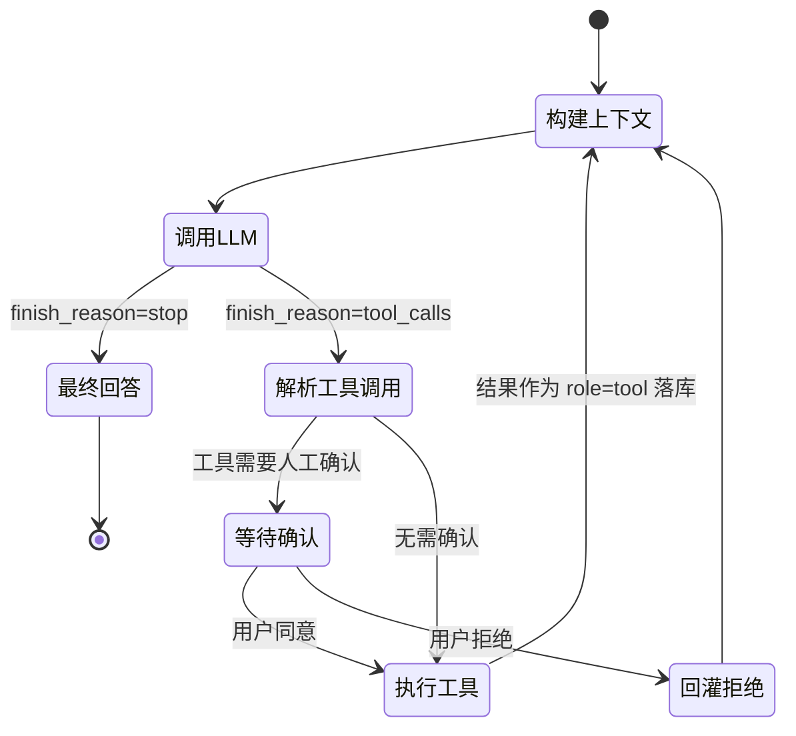

# 05 · Agent 内核：ReAct 循环 / 事件流 / 记忆 / 人工确认

<aside>
🎯

这一页是“核心引擎”的**大脑**。它不认识任何具体仿真类型，只负责：拿工具清单 → 问大模型 → 执行工具 → 回灌结果 → 循环，并在关键动作前**暂停等用户确认**。

</aside>

## 0. ReAct 循环与暂停/恢复模型



<aside>
💡

**最关键的设计决策**：对话历史全量落库（`agent_message`），而不是放内存。这样“等待用户确认”就变成了**无状态暂停**：用户可以关页面、等一小时、换浏览器回来点“确认”，后端从库里重建上下文继续跑。内存态 Agent 根本做不到这个。

</aside>

---

## 1. 工具抽象 `agent/tool/`

```java
package com.example.simagent.agent.tool;

import com.fasterxml.jackson.databind.JsonNode;

/**
 * Agent 工具统一抽象。所有内置工具、MCP 代理工具都实现它。
 * 新增一个能力 = 新增一个 @Component，ToolRegistry 自动收集。
 */
public interface AgentTool {

    /** 工具名，必须全局唯一，只能用 [a-zA-Z0-9_-] */
    String name();

    /** 给大模型看的描述：写清楚什么时候用、返回什么，直接影响决策质量 */
    String description();

    /** 入参 JSON Schema */
    JsonNode parameterSchema();

    /** 是否需要人工确认（写操作/消耗资源的工具建议 true） */
    default boolean requiresConfirmation() {
        return false;
    }

    /** 确认弹窗里展示给用户的文案 */
    default String confirmPrompt(JsonNode args) {
        return "即将执行：" + name();
    }

    ToolResult execute(JsonNode args, ToolContext ctx);
}
```

```java
package com.example.simagent.agent.tool;

import com.example.simagent.common.JsonUtils;
import lombok.AllArgsConstructor;
import lombok.Data;

import java.util.LinkedHashMap;
import java.util.Map;

@Data
@AllArgsConstructor
public class ToolResult {

    private boolean success;
    /** 给大模型看的结果（会被序列化成 JSON 字符串作为 role=tool 的 content） */
    private Object data;
    /** 给前端卡片用的一句话摘要 */
    private String summary;

    public static ToolResult ok(Object data, String summary) {
        return new ToolResult(true, data, summary);
    }

    public static ToolResult fail(String error) {
        Map<String, Object> m = new LinkedHashMap<>();
        m.put("success", false);
        m.put("error", error);
        return new ToolResult(false, m, error);
    }

    /** 转成回灌给大模型的字符串。过长会截断，防止爆 token */
    public String toLlmContent(int maxChars) {
        String json = data instanceof String s ? s : JsonUtils.toJson(data);
        if (json != null && json.length() > maxChars) {
            return json.substring(0, maxChars)
                    + "\n...[已截断，完整结果请通过查询工具获取]";
        }
        return json;
    }
}
```

```java
package com.example.simagent.agent.tool;

import com.example.simagent.agent.event.AgentEventSink;
import lombok.Builder;
import lombok.Data;

@Data
@Builder
public class ToolContext {
    private String sessionId;
    private String userId;
    private int step;
    private String toolCallId;
    /** 工具内部可以主动向前端推送进度（如 workflow 节点状态） */
    private AgentEventSink sink;
    /** 本次调用是否已经过用户确认 */
    private boolean confirmed;
}
```

```java
package com.example.simagent.agent.tool;

import com.example.simagent.config.AgentProperties;
import com.example.simagent.llm.model.ToolSpec;
import com.example.simagent.mcp.McpServerRegistry;
import com.example.simagent.mcp.McpToolCatalog;
import com.example.simagent.agent.tool.mcp.McpDelegatingTool;
import lombok.extern.slf4j.Slf4j;
import org.springframework.stereotype.Component;

import java.util.ArrayList;
import java.util.LinkedHashMap;
import java.util.List;
import java.util.Map;

/**
 * 工具注册表：
 *   内置工具（静态，Spring 注入） + MCP 工具（动态，根据当前存活的 MCP Server 实时生成）
 *
 * 这里是“插件化”的第二个关键点：新插件上线后无需重启就能被大模型看到。
 */
@Slf4j
@Component
public class ToolRegistry {

    private final Map<String, AgentTool> builtin = new LinkedHashMap<>();
    private final McpToolCatalog catalog;
    private final McpServerRegistry mcpRegistry;
    private final AgentProperties agentProps;

    public ToolRegistry(List<AgentTool> tools,
                        McpToolCatalog catalog,
                        McpServerRegistry mcpRegistry,
                        AgentProperties agentProps) {
        this.catalog = catalog;
        this.mcpRegistry = mcpRegistry;
        this.agentProps = agentProps;
        for (AgentTool t : tools) {
            if (builtin.put(t.name(), t) != null) {
                throw new IllegalStateException("工具名重复: " + t.name());
            }
        }
        log.info("[agent] builtin tools = {}", builtin.keySet());
    }

    /** 根据工具名拿工具（MCP 工具为动态包装） */
    public AgentTool find(String name) {
        AgentTool t = builtin.get(name);
        if (t != null) {
            return t;
        }
        if (catalog.isMcpToolName(name)) {
            McpServerRegistry.McpToolRef ref = catalog.exposed().get(name);
            if (ref != null) {
                return new McpDelegatingTool(name, ref, mcpRegistry, agentProps);
            }
        }
        return null;
    }

    /** 本轮传给大模型的完整工具声明 */
    public List<ToolSpec> toolSpecs() {
        List<ToolSpec> specs = new ArrayList<>();
        builtin.values().forEach(t ->
                specs.add(ToolSpec.of(t.name(), t.description(), t.parameterSchema())));
        catalog.exposed().forEach((llmName, ref) -> specs.add(ToolSpec.of(
                llmName,
                "[" + ref.serverName() + " 仿真插件] " + ref.tool().getDescription(),
                ref.tool().getInputSchema())));
        return specs;
    }

    public Map<String, AgentTool> builtinTools() {
        return builtin;
    }

    public boolean needConfirm(String toolName) {
        if (agentProps.getConfirmRequiredTools() != null
                && agentProps.getConfirmRequiredTools().contains(toolName)) {
            return true;
        }
        AgentTool t = find(toolName);
        return t != null && t.requiresConfirmation();
    }
}
```

---

## 2. 事件流 `agent/event/`

```java
package com.example.simagent.agent.event;

public enum AgentEventType {
    SESSION_START,      // 会话开始
    THINKING,           // 大模型思考中（可带阶段描述）
    ASSISTANT_DELTA,    // 流式文本片段
    TOOL_CALL,          // 准备执行工具
    TOOL_RESULT,        // 工具执行结果
    NODE_STATUS,        // workflow 节点状态变化（引擎推送）
    CONFIRM_REQUIRED,   // 需要人工确认，会话暂停
    FINAL_ANSWER,       // 最终回答
    ERROR,
    DONE                // 本轮结束（前端可关 EventSource）
}
```

```java
package com.example.simagent.agent.event;

import lombok.Builder;
import lombok.Data;

import java.util.LinkedHashMap;
import java.util.Map;

@Data
@Builder
public class AgentEvent {

    private AgentEventType type;
    private String sessionId;
    private int step;
    private long ts;
    private Map<String, Object> data;

    private static AgentEvent of(AgentEventType type, String sessionId, int step,
                                 Map<String, Object> data) {
        return AgentEvent.builder().type(type).sessionId(sessionId).step(step)
                .ts(System.currentTimeMillis()).data(data).build();
    }

    public static AgentEvent sessionStart(String sid) {
        return of(AgentEventType.SESSION_START, sid, 0, map("sessionId", sid));
    }

    public static AgentEvent thinking(String sid, int step, String text) {
        return of(AgentEventType.THINKING, sid, step, map("text", text));
    }

    public static AgentEvent delta(String sid, int step, String piece) {
        return of(AgentEventType.ASSISTANT_DELTA, sid, step, map("delta", piece));
    }

    public static AgentEvent toolCall(String sid, int step, String toolCallId,
                                      String toolName, Object args) {
        Map<String, Object> m = new LinkedHashMap<>();
        m.put("toolCallId", toolCallId);
        m.put("toolName", toolName);
        m.put("arguments", args);
        return of(AgentEventType.TOOL_CALL, sid, step, m);
    }

    public static AgentEvent toolResult(String sid, int step, String toolCallId, String toolName,
                                        boolean success, String summary, Object data, long costMs) {
        Map<String, Object> m = new LinkedHashMap<>();
        m.put("toolCallId", toolCallId);
        m.put("toolName", toolName);
        m.put("success", success);
        m.put("summary", summary);
        m.put("data", data);
        m.put("costMs", costMs);
        return of(AgentEventType.TOOL_RESULT, sid, step, m);
    }

    public static AgentEvent nodeStatus(String sid, long instanceId, String nodeKey,
                                        String simType, String status, Object payload) {
        Map<String, Object> m = new LinkedHashMap<>();
        m.put("instanceId", instanceId);
        m.put("nodeKey", nodeKey);
        m.put("simType", simType);
        m.put("status", status);
        m.put("payload", payload);
        return of(AgentEventType.NODE_STATUS, sid, 0, m);
    }

    public static AgentEvent confirmRequired(String sid, int step, String toolCallId,
                                            String toolName, String prompt, Object args) {
        Map<String, Object> m = new LinkedHashMap<>();
        m.put("toolCallId", toolCallId);
        m.put("toolName", toolName);
        m.put("prompt", prompt);
        m.put("arguments", args);
        return of(AgentEventType.CONFIRM_REQUIRED, sid, step, m);
    }

    public static AgentEvent finalAnswer(String sid, int step, String content) {
        return of(AgentEventType.FINAL_ANSWER, sid, step, map("content", content));
    }

    public static AgentEvent error(String sid, int step, String message) {
        return of(AgentEventType.ERROR, sid, step, map("message", message));
    }

    public static AgentEvent done(String sid, int step, String reason) {
        return of(AgentEventType.DONE, sid, step, map("reason", reason));
    }

    private static Map<String, Object> map(String k, Object v) {
        Map<String, Object> m = new LinkedHashMap<>();
        m.put(k, v);
        return m;
    }
}
```

```java
package com.example.simagent.agent.event;

public interface AgentEventSink {

    void emit(AgentEvent event);

    /** 正常结束 */
    void complete();

    /** 异常结束 */
    void completeWithError(Throwable t);

    /** 空实现：用于后台任务/单测 */
    AgentEventSink NOOP = new AgentEventSink() {
        public void emit(AgentEvent event) {
        }

        public void complete() {
        }

        public void completeWithError(Throwable t) {
        }
    };
}
```

```java
package com.example.simagent.agent.event;

import com.example.simagent.common.JsonUtils;
import lombok.extern.slf4j.Slf4j;
import org.springframework.web.servlet.mvc.method.annotation.SseEmitter;

import java.io.IOException;
import java.util.concurrent.atomic.AtomicBoolean;

/** 把 AgentEvent 写到 SSE 连接。线程安全：引擎的并行节点线程也会往里写。 */
@Slf4j
public class SseEventSink implements AgentEventSink {

    private final String sessionId;
    private final SseEmitter emitter;
    private final AtomicBoolean closed = new AtomicBoolean(false);

    public SseEventSink(String sessionId, SseEmitter emitter) {
        this.sessionId = sessionId;
        this.emitter = emitter;
    }

    @Override
    public synchronized void emit(AgentEvent event) {
        if (closed.get()) {
            return;
        }
        try {
            emitter.send(SseEmitter.event()
                    .name(event.getType().name().toLowerCase())
                    .data(JsonUtils.toJson(event), org.springframework.http.MediaType.APPLICATION_JSON));
        } catch (IOException | IllegalStateException e) {
            // 用户关页面就会进这里，不应该打成 ERROR 日志
            log.debug("[sse:{}] 连接已断开: {}", sessionId, e.getMessage());
            closed.set(true);
        }
    }

    @Override
    public void complete() {
        if (closed.compareAndSet(false, true)) {
            try {
                emitter.complete();
            } catch (Exception ignored) {
            }
        }
    }

    @Override
    public void completeWithError(Throwable t) {
        if (closed.compareAndSet(false, true)) {
            try {
                emitter.completeWithError(t);
            } catch (Exception ignored) {
            }
        }
    }
}
```

```java
package com.example.simagent.agent.event;

import lombok.extern.slf4j.Slf4j;
import org.springframework.stereotype.Component;

import java.util.Map;
import java.util.concurrent.ConcurrentHashMap;

/**
 * sessionId -> 当前活跃的 SSE 通道。
 * 作用：workflow 引擎在**子线程**里跑节点，依旧能把节点状态推到正确的前端连接。
 */
@Slf4j
@Component
public class SseSessionRegistry {

    private final Map<String, AgentEventSink> sinks = new ConcurrentHashMap<>();

    public void register(String sessionId, AgentEventSink sink) {
        sinks.put(sessionId, sink);
    }

    public void unregister(String sessionId) {
        sinks.remove(sessionId);
    }

    public AgentEventSink get(String sessionId) {
        return sinks.getOrDefault(sessionId, AgentEventSink.NOOP);
    }

    public int activeCount() {
        return sinks.size();
    }
}
```

---

## 3. 记忆层 `agent/memory/`

```java
package com.example.simagent.agent.memory;

public enum SessionStatus {
    IDLE, RUNNING, WAITING_CONFIRM, CLOSED
}
```

```java
package com.example.simagent.agent.memory;

import lombok.Data;

import java.sql.Timestamp;

@Data
public class AgentSession {
    private String sessionId;
    private String userId;
    private String title;
    private SessionStatus status;
    /** 等待确认时的动作快照（JSON） */
    private String pendingAction;
    private Timestamp createdAt;
    private Timestamp updatedAt;
}
```

```java
package com.example.simagent.agent.memory;

import lombok.Data;

@Data
public class AgentMessage {
    private long id;
    private String sessionId;
    private int seq;
    private String role;        // system/user/assistant/tool
    private String content;
    private String toolCalls;   // assistant 的 tool_calls JSON
    private String toolCallId;  // tool 消息对应的 id
    private String toolName;
}
```

```java
package com.example.simagent.agent.memory;

import com.example.simagent.agent.hitl.PendingAction;
import com.example.simagent.common.JsonUtils;
import com.example.simagent.llm.model.ChatMessage;
import com.example.simagent.llm.model.ToolCall;
import lombok.extern.slf4j.Slf4j;
import org.springframework.jdbc.core.JdbcTemplate;
import org.springframework.jdbc.core.RowMapper;
import org.springframework.stereotype.Repository;
import org.springframework.transaction.annotation.Transactional;

import java.util.ArrayList;
import java.util.List;

/**
 * 会话与消息持久化。用 JdbcTemplate，不引 JPA，方便你直接套到现有项目。
 */
@Slf4j
@Repository
public class ConversationStore {

    private final JdbcTemplate jdbc;

    public ConversationStore(JdbcTemplate jdbc) {
        this.jdbc = jdbc;
    }

    private static final RowMapper<AgentSession> SESSION_MAPPER = (rs, i) -> {
        AgentSession s = new AgentSession();
        s.setSessionId(rs.getString("session_id"));
        s.setUserId(rs.getString("user_id"));
        s.setTitle(rs.getString("title"));
        s.setStatus(SessionStatus.valueOf(rs.getString("status")));
        s.setPendingAction(rs.getString("pending_action"));
        s.setCreatedAt(rs.getTimestamp("created_at"));
        s.setUpdatedAt(rs.getTimestamp("updated_at"));
        return s;
    };

    private static final RowMapper<AgentMessage> MSG_MAPPER = (rs, i) -> {
        AgentMessage m = new AgentMessage();
        m.setId(rs.getLong("id"));
        m.setSessionId(rs.getString("session_id"));
        m.setSeq(rs.getInt("seq"));
        m.setRole(rs.getString("role"));
        m.setContent(rs.getString("content"));
        m.setToolCalls(rs.getString("tool_calls"));
        m.setToolCallId(rs.getString("tool_call_id"));
        m.setToolName(rs.getString("tool_name"));
        return m;
    };

    // ------------------------------------------------------------------ //
    // session
    // ------------------------------------------------------------------ //
    @Transactional
    public AgentSession ensureSession(String sessionId, String userId, String title) {
        List<AgentSession> list = jdbc.query(
                "SELECT * FROM agent_session WHERE session_id = ?", SESSION_MAPPER, sessionId);
        if (!list.isEmpty()) {
            return list.get(0);
        }
        jdbc.update("""
                INSERT INTO agent_session (session_id, user_id, title, status, created_at, updated_at)
                VALUES (?,?,?,?, CURRENT_TIMESTAMP, CURRENT_TIMESTAMP)
                """, sessionId, userId, abbreviate(title, 80), SessionStatus.IDLE.name());
        log.info("[session] created {} for user {}", sessionId, userId);
        return jdbc.queryForObject(
                "SELECT * FROM agent_session WHERE session_id = ?", SESSION_MAPPER, sessionId);
    }

    public AgentSession getSession(String sessionId) {
        List<AgentSession> list = jdbc.query(
                "SELECT * FROM agent_session WHERE session_id = ?", SESSION_MAPPER, sessionId);
        return list.isEmpty() ? null : list.get(0);
    }

    public void updateStatus(String sessionId, SessionStatus status) {
        jdbc.update("UPDATE agent_session SET status=?, updated_at=CURRENT_TIMESTAMP "
                + "WHERE session_id=?", status.name(), sessionId);
    }

    public void savePendingAction(String sessionId, PendingAction action) {
        jdbc.update("UPDATE agent_session SET pending_action=?, status=?, "
                        + "updated_at=CURRENT_TIMESTAMP WHERE session_id=?",
                action == null ? null : JsonUtils.toJson(action),
                action == null ? SessionStatus.RUNNING.name() : SessionStatus.WAITING_CONFIRM.name(),
                sessionId);
    }

    public PendingAction loadPendingAction(String sessionId) {
        AgentSession s = getSession(sessionId);
        if (s == null || s.getPendingAction() == null || s.getPendingAction().isBlank()) {
            return null;
        }
        return JsonUtils.parse(s.getPendingAction(), PendingAction.class);
    }

    public void clearPendingAction(String sessionId) {
        jdbc.update("UPDATE agent_session SET pending_action=NULL, "
                + "updated_at=CURRENT_TIMESTAMP WHERE session_id=?", sessionId);
    }

    // ------------------------------------------------------------------ //
    // message
    // ------------------------------------------------------------------ //
    @Transactional
    public void append(String sessionId, String role, String content,
                       List<ToolCall> toolCalls, String toolCallId, String toolName) {
        Integer maxSeq = jdbc.queryForObject(
                "SELECT COALESCE(MAX(seq), 0) FROM agent_message WHERE session_id=?",
                Integer.class, sessionId);
        jdbc.update("""
                        INSERT INTO agent_message
                          (session_id, seq, role, content, tool_calls, tool_call_id, tool_name, created_at)
                        VALUES (?,?,?,?,?,?,?, CURRENT_TIMESTAMP)
                        """,
                sessionId, (maxSeq == null ? 0 : maxSeq) + 1, role, content,
                toolCalls == null || toolCalls.isEmpty() ? null : JsonUtils.toJson(toolCalls),
                toolCallId, toolName);
    }

    public void appendUser(String sessionId, String content) {
        append(sessionId, "user", content, null, null, null);
    }

    public void appendAssistant(String sessionId, String content, List<ToolCall> calls) {
        append(sessionId, "assistant", content, calls, null, null);
    }

    public void appendTool(String sessionId, String toolCallId, String toolName, String content) {
        append(sessionId, "tool", content, null, toolCallId, toolName);
    }

    /** 载入最近 limit 条消息，转成 LLM 能直接吃的格式 */
    public List<ChatMessage> loadHistory(String sessionId, int limit) {
        List<AgentMessage> rows = jdbc.query("""
                SELECT * FROM (
                  SELECT * FROM agent_message WHERE session_id=? ORDER BY seq DESC LIMIT ?
                ) t ORDER BY seq ASC
                """, MSG_MAPPER, sessionId, limit);

        List<ChatMessage> out = new ArrayList<>();
        for (AgentMessage m : rows) {
            switch (m.getRole()) {
                case "user" -> out.add(ChatMessage.user(m.getContent()));
                case "assistant" -> {
                    List<ToolCall> calls = null;
                    if (m.getToolCalls() != null && !m.getToolCalls().isBlank()) {
                        calls = JsonUtils.parseList(m.getToolCalls(), ToolCall.class);
                    }
                    out.add(calls == null
                            ? ChatMessage.assistant(m.getContent())
                            : ChatMessage.assistantToolCalls(m.getContent(), calls));
                }
                case "tool" -> out.add(ChatMessage.tool(
                        m.getToolCallId(), m.getToolName(), m.getContent()));
                default -> {
                    // system 消息不入库，每次由 SystemPromptBuilder 实时生成
                }
            }
        }
        return sanitize(out);
    }

    /**
     * 关键清洗：OpenAI 协议要求每个 role=tool 消息必须能对应到前面某个 assistant 的 tool_call_id。
     * 历史被截断后可能出现“孤儿 tool 消息”，不清掉会被网关直接 400。
     */
    private List<ChatMessage> sanitize(List<ChatMessage> msgs) {
        java.util.Set<String> knownIds = new java.util.HashSet<>();
        for (ChatMessage m : msgs) {
            if (m.hasToolCalls()) {
                m.getToolCalls().forEach(tc -> knownIds.add(tc.getId()));
            }
        }
        List<ChatMessage> out = new ArrayList<>();
        for (ChatMessage m : msgs) {
            if ("tool".equals(m.getRole()) && !knownIds.contains(m.getToolCallId())) {
                log.debug("[memory] 丢弃孤儿 tool 消息 toolCallId={}", m.getToolCallId());
                continue;
            }
            out.add(m);
        }
        // 开头不能是 tool 消息
        while (!out.isEmpty() && "tool".equals(out.get(0).getRole())) {
            out.remove(0);
        }
        return out;
    }

    private static String abbreviate(String s, int max) {
        if (s == null) {
            return null;
        }
        return s.length() <= max ? s : s.substring(0, max);
    }
}
```

<aside>
🚨

`sanitize()` 这段是真实踩过的坑：开了 `history-limit` 截断后，很可能把 `assistant(tool_calls)` 截掉但留下了 `tool` 消息，网关会直接返回 `400 messages with role 'tool' must be a response to a preceding message with 'tool_calls'`。必须清洗。

</aside>

---

## 4. 人工确认 `agent/hitl/`

```java
package com.example.simagent.agent.hitl;

import lombok.AllArgsConstructor;
import lombok.Data;
import lombok.NoArgsConstructor;

/** 等待确认的动作快照（序列化后存 agent_session.pending_action） */
@Data
@NoArgsConstructor
@AllArgsConstructor
public class PendingAction {
    private String toolCallId;
    private String toolName;
    /** 工具入参 JSON 字符串 */
    private String argumentsJson;
    private String prompt;
    private int step;
    private long createdAt;
}
```

```java
package com.example.simagent.agent.hitl;

import com.example.simagent.agent.memory.ConversationStore;
import com.example.simagent.agent.memory.SessionStatus;
import com.example.simagent.common.BizException;
import com.example.simagent.common.ErrorCode;
import lombok.extern.slf4j.Slf4j;
import org.springframework.stereotype.Service;

@Slf4j
@Service
public class ConfirmationService {

    private final ConversationStore store;

    public ConfirmationService(ConversationStore store) {
        this.store = store;
    }

    public void park(String sessionId, PendingAction action) {
        action.setCreatedAt(System.currentTimeMillis());
        store.savePendingAction(sessionId, action);
        log.info("[hitl] session {} 暂停，等待确认工具 {}", sessionId, action.getToolName());
    }

    public PendingAction take(String sessionId) {
        PendingAction action = store.loadPendingAction(sessionId);
        if (action == null) {
            throw new BizException(ErrorCode.INVALID_STATE,
                    "当前会话没有待确认的动作，无需确认");
        }
        store.clearPendingAction(sessionId);
        store.updateStatus(sessionId, SessionStatus.RUNNING);
        return action;
    }
}
```

---

## 5. 审计 `agent/audit/`

```java
package com.example.simagent.agent.audit;

import lombok.Builder;
import lombok.Data;

@Data
@Builder
public class ToolAuditRecord {
    private String sessionId;
    private String userId;
    private int step;
    private String traceId;
    private String toolName;
    private String arguments;
    private boolean success;
    private String resultSummary;
    private String errorMsg;
    private long costMs;
    private boolean confirmed;
}
```

```java
package com.example.simagent.agent.audit;

import lombok.extern.slf4j.Slf4j;
import org.springframework.jdbc.core.JdbcTemplate;
import org.springframework.stereotype.Component;

@Slf4j
@Component
public class ToolAuditLogger {

    private final JdbcTemplate jdbc;

    public ToolAuditLogger(JdbcTemplate jdbc) {
        this.jdbc = jdbc;
    }

    public void record(ToolAuditRecord r) {
        try {
            jdbc.update("""
                            INSERT INTO agent_tool_audit
                              (session_id, user_id, step_no, trace_id, tool_name, arguments,
                               success, result_summary, error_msg, cost_ms, confirmed, created_at)
                            VALUES (?,?,?,?,?,?,?,?,?,?,?, CURRENT_TIMESTAMP)
                            """,
                    r.getSessionId(), r.getUserId(), r.getStep(), r.getTraceId(), r.getToolName(),
                    truncate(r.getArguments(), 4000), r.isSuccess(),
                    truncate(r.getResultSummary(), 1000), truncate(r.getErrorMsg(), 2000),
                    r.getCostMs(), r.isConfirmed());
        } catch (Exception e) {
            log.warn("[audit] 写入失败（不影响主流程）: {}", e.getMessage());
        }
    }

    private String truncate(String s, int max) {
        if (s == null) {
            return null;
        }
        return s.length() <= max ? s : s.substring(0, max);
    }
}
```

---

## 6. `agent/SystemPromptBuilder.java` —— Prompt 工程

<aside>
🔑

**提示词就是 Agent 的“业务代码”**。你的仿真领域知识、决策流程、红线全部写在这里。下面这份提示词把领导说的四阶段流程硬约束住了。

</aside>

```java
package com.example.simagent.agent;

import com.example.simagent.agent.tool.ToolRegistry;
import com.example.simagent.llm.model.ToolSpec;
import com.example.simagent.mcp.McpServerHandle;
import com.example.simagent.mcp.McpServerRegistry;
import org.springframework.stereotype.Component;

import java.time.LocalDateTime;
import java.time.format.DateTimeFormatter;
import java.util.List;

@Component
public class SystemPromptBuilder {

    private final ToolRegistry toolRegistry;
    private final McpServerRegistry mcpRegistry;

    public SystemPromptBuilder(ToolRegistry toolRegistry, McpServerRegistry mcpRegistry) {
        this.toolRegistry = toolRegistry;
        this.mcpRegistry = mcpRegistry;
    }

    public String build() {
        StringBuilder sb = new StringBuilder();

        sb.append("""
                # 角色
                你是一个半导体/MEMS 仿真平台的调度助手。你的职责是把用户的自然语言需求，
                翻译成平台上可执行的仿真工作流，并驱动它跑完，最后用业务语言报告结果。

                # 领域概念（必须理解）
                - Golden Template（黄金模版）：一个已调好参数的单个仿真任务，每个模版绑定一个仿真工具。
                  用户通常不需要手填参数，默认值已经在模版里。
                - Workflow Template（工作流模版）：把多个 Golden Template 以串联/并联方式编排成 DAG。
                  node = 一个仿真步骤（引用某个 Golden Template），edge = 步骤之间的依赖关系。
                - Workflow Instance（工作流实例）：模版的一次具体运行，才会真正消耗仿真资源。
                  模版只是图纸，实例才是施工。

                # 四阶段决策流程（严格按此执行）
                1. 【需求分析】弄清楚用户要做哪几种仿真、有无先后依赖、能否并行。
                   信息确实不够（比如完全没提仿真类型）才反问，不要为了参数细节反复询问。
                2. 【复用优先】先调 search_workflow_template 查现成工作流。
                   命中则直接用，不要重复造轮子。
                3. 【编排】没有现成模版时，先调 list_golden_templates 拿能力清单，
                   再调 create_workflow_template 创建模版（DRAFT 状态），并向用户说明你的编排思路。
                4. 【执行】调 create_workflow_instance 创建实例，再调 run_workflow_instance 执行；
                   执行完毕后用表格总结每个节点的关键指标。

                # 硬性规则
                - 参数优先用 Golden Template 的默认值；用户明确提到的值才覆盖。不要凭空逆造参数。
                - 节点间传递数据用占位符：${节点key.output.字段名}；引用用户输入用 ${input.字段名}。
                  例：下游 coventor 节点的 mesh_file 应写成 ${mesh.output.mesh_file}。
                - 并行判定：两个节点之间没有数据依赖时，就不要连边，让引擎自动并行。
                - 写操作（创建实例、执行仿真）会触发用户确认，你只需正常发起调用，系统会自动拦。
                - 工具报错时，先读错误信息尝试修正参数重试一次；连续失败则停下来向用户解释原因。
                - 绝对不要编造仿真结果。所有数字必须来自工具返回值。
                - 用中文回答，简洁专业，关键结果用 Markdown 表格。

                """);

        // 把当前存活的仿真插件实时写进提示词
        sb.append("# 当前可用仿真插件（MCP Server）\n");
        for (McpServerHandle h : mcpRegistry.handles()) {
            sb.append("- ").append(h.name())
                    .append(" [").append(h.getStatus()).append("] ")
                    .append(h.getConfig().getDescription() == null ? "" : h.getConfig().getDescription())
                    .append("\n");
        }

        sb.append("\n# 可用工具概览\n");
        List<ToolSpec> specs = toolRegistry.toolSpecs();
        for (ToolSpec s : specs) {
            sb.append("- `").append(s.getFunction().getName()).append("`: ")
                    .append(firstLine(s.getFunction().getDescription())).append("\n");
        }

        sb.append("\n# 当前时间\n")
                .append(LocalDateTime.now().format(DateTimeFormatter.ofPattern("yyyy-MM-dd HH:mm:ss")))
                .append("\n");

        sb.append("""

                # 输出要求
                - 每次调工具前，先用一两句话说明你要做什么以及为什么（会展示给用户）。
                - 不要把工具名、JSON、堆栈扫进最终回答，用业务语言描述。
                - 仿真完成后的总结必须包含：整体状态、每个节点的关键指标、下一步建议。
                """);

        return sb.toString();
    }

    private String firstLine(String s) {
        if (s == null) {
            return "";
        }
        int i = s.indexOf('\n');
        String t = i < 0 ? s : s.substring(0, i);
        return t.length() > 160 ? t.substring(0, 160) + "..." : t;
    }
}
```

---

## 7. `agent/AgentOrchestrator.java` —— 主循环

```java
package com.example.simagent.agent;

import com.example.simagent.agent.audit.ToolAuditLogger;
import com.example.simagent.agent.audit.ToolAuditRecord;
import com.example.simagent.agent.event.AgentEvent;
import com.example.simagent.agent.event.AgentEventSink;
import com.example.simagent.agent.hitl.ConfirmationService;
import com.example.simagent.agent.hitl.PendingAction;
import com.example.simagent.agent.memory.ConversationStore;
import com.example.simagent.agent.memory.SessionStatus;
import com.example.simagent.agent.tool.AgentTool;
import com.example.simagent.agent.tool.ToolContext;
import com.example.simagent.agent.tool.ToolRegistry;
import com.example.simagent.agent.tool.ToolResult;
import com.example.simagent.common.JsonUtils;
import com.example.simagent.config.AgentProperties;
import com.example.simagent.llm.LlmCallLogger;
import com.example.simagent.llm.LlmClient;
import com.example.simagent.llm.model.ChatMessage;
import com.example.simagent.llm.model.LlmRequest;
import com.example.simagent.llm.model.LlmResponse;
import com.example.simagent.llm.model.ToolCall;
import com.fasterxml.jackson.databind.JsonNode;
import lombok.extern.slf4j.Slf4j;
import org.slf4j.MDC;
import org.springframework.stereotype.Service;

import java.util.ArrayList;
import java.util.List;

/**
 * Agent 主循环（ReAct）。设计原则：
 *  1. 无状态：所有上下文从 DB 重建，支持跨请求暂停/恢复；
 *  2. 容错：工具异常、JSON 解析失败都不会终止会话，而是回灌给大模型自修正；
 *  3. 可观测：每步都有事件推送 + 审计落库。
 */
@Slf4j
@Service
public class AgentOrchestrator {

    private static final int TOOL_RESULT_MAX_CHARS = 6000;

    private final LlmClient llm;
    private final ToolRegistry tools;
    private final SystemPromptBuilder promptBuilder;
    private final ConversationStore store;
    private final ConfirmationService confirmations;
    private final ToolAuditLogger audit;
    private final LlmCallLogger llmLogger;
    private final AgentProperties props;

    public AgentOrchestrator(LlmClient llm, ToolRegistry tools, SystemPromptBuilder promptBuilder,
                             ConversationStore store, ConfirmationService confirmations,
                             ToolAuditLogger audit, LlmCallLogger llmLogger, AgentProperties props) {
        this.llm = llm;
        this.tools = tools;
        this.promptBuilder = promptBuilder;
        this.store = store;
        this.confirmations = confirmations;
        this.audit = audit;
        this.llmLogger = llmLogger;
        this.props = props;
    }

    // ------------------------------------------------------------------ //
    // 入口 1：用户发新消息
    // ------------------------------------------------------------------ //
    public void handleUserMessage(String sessionId, String userId, String message,
                                  AgentEventSink sink) {
        try {
            store.ensureSession(sessionId, userId, message);
            store.updateStatus(sessionId, SessionStatus.RUNNING);
            store.appendUser(sessionId, message);
            sink.emit(AgentEvent.sessionStart(sessionId));
            loop(sessionId, userId, sink, 1);
        } catch (Exception e) {
            log.error("[agent] session {} 异常", sessionId, e);
            sink.emit(AgentEvent.error(sessionId, 0, describe(e)));
            store.updateStatus(sessionId, SessionStatus.IDLE);
            sink.emit(AgentEvent.done(sessionId, 0, "error"));
            sink.complete();
        }
    }

    // ------------------------------------------------------------------ //
    // 入口 2：用户点了确认/拒绝
    // ------------------------------------------------------------------ //
    public void resumeAfterConfirm(String sessionId, String userId, boolean approved,
                                   String comment, AgentEventSink sink) {
        try {
            PendingAction action = confirmations.take(sessionId);
            int step = action.getStep();

            if (!approved) {
                String refuse = JsonUtils.toJson(java.util.Map.of(
                        "success", false,
                        "rejectedByUser", true,
                        "userComment", comment == null ? "" : comment,
                        "hint", "用户拒绝了这个操作，请根据用户意见调整方案或询问用户"));
                store.appendTool(sessionId, action.getToolCallId(), action.getToolName(), refuse);
                sink.emit(AgentEvent.toolResult(sessionId, step, action.getToolCallId(),
                        action.getToolName(), false, "用户已拒绝", null, 0));
            } else {
                executeToolAndPersist(sessionId, userId, step, sink,
                        ToolCall.of(action.getToolCallId(), action.getToolName(),
                                action.getArgumentsJson()),
                        true);
            }
            loop(sessionId, userId, sink, step + 1);
        } catch (Exception e) {
            log.error("[agent] resume session {} 异常", sessionId, e);
            sink.emit(AgentEvent.error(sessionId, 0, describe(e)));
            sink.emit(AgentEvent.done(sessionId, 0, "error"));
            sink.complete();
        }
    }

    // ------------------------------------------------------------------ //
    // 核心循环
    // ------------------------------------------------------------------ //
    private void loop(String sessionId, String userId, AgentEventSink sink, int startStep) {
        int maxSteps = props.getMaxSteps();

        for (int step = startStep; step <= maxSteps; step++) {
            MDC.put("step", String.valueOf(step));
            sink.emit(AgentEvent.thinking(sessionId, step, "分析中..."));

            List<ChatMessage> messages = new ArrayList<>();
            messages.add(ChatMessage.system(promptBuilder.build()));
            messages.addAll(store.loadHistory(sessionId, props.getHistoryLimit()));

            LlmRequest request = LlmRequest.builder()
                    .messages(messages)
                    .tools(tools.toolSpecs())
                    .toolChoice("auto")
                    .build();

            LlmResponse resp;
            final int currentStep = step;
            try {
                resp = llm.chatStream(request,
                        piece -> sink.emit(AgentEvent.delta(sessionId, currentStep, piece)));
                llmLogger.log(sessionId, step, request, resp, null);
            } catch (Exception e) {
                llmLogger.log(sessionId, step, request, null, e.getMessage());
                throw e;
            }

            // 落库 assistant 消息（包含 tool_calls，不能丢，否则后续 tool 消息会成为孤儿）
            store.appendAssistant(sessionId, resp.getContent(), resp.getToolCalls());

            // 没有工具调用 => 本轮结束
            if (!resp.wantsToolCall()) {
                sink.emit(AgentEvent.finalAnswer(sessionId, step,
                        resp.getContent() == null ? "" : resp.getContent()));
                store.updateStatus(sessionId, SessionStatus.IDLE);
                sink.emit(AgentEvent.done(sessionId, step, "stop"));
                sink.complete();
                return;
            }

            // 有工具调用：逐个处理（大模型可能一次返回多个）
            for (ToolCall call : resp.getToolCalls()) {
                String toolName = call.getFunction() == null ? null : call.getFunction().getName();
                String argsJson = call.getFunction() == null ? "{}"
                        : (call.getFunction().getArguments() == null ? "{}"
                        : call.getFunction().getArguments());

                sink.emit(AgentEvent.toolCall(sessionId, step, call.getId(), toolName,
                        JsonUtils.tryReadTree(argsJson)));

                // 需要确认 => 暂停，把现场存库，结束本次 HTTP 请求
                if (tools.needConfirm(toolName)) {
                    AgentTool t = tools.find(toolName);
                    String prompt = t == null ? ("即将执行 " + toolName)
                            : t.confirmPrompt(JsonUtils.tryReadTree(argsJson));

                    confirmations.park(sessionId, new PendingAction(
                            call.getId(), toolName, argsJson, prompt, step, 0));
                    sink.emit(AgentEvent.confirmRequired(sessionId, step, call.getId(),
                            toolName, prompt, JsonUtils.tryReadTree(argsJson)));
                    sink.emit(AgentEvent.done(sessionId, step, "waiting_confirm"));
                    sink.complete();
                    return;
                }

                executeToolAndPersist(sessionId, userId, step, sink, call, false);
            }
        }

        // 超过步数上限：不能无限循环烧 token
        String msg = "已达到单轮最大执行步数 " + maxSteps
                + "，已自动停止。你可以说“继续”让我接着执行。";
        store.appendAssistant(sessionId, msg, null);
        sink.emit(AgentEvent.finalAnswer(sessionId, maxSteps, msg));
        store.updateStatus(sessionId, SessionStatus.IDLE);
        sink.emit(AgentEvent.done(sessionId, maxSteps, "max_steps"));
        sink.complete();
    }

    // ------------------------------------------------------------------ //
    // 工具执行（含容错、审计、事件）
    // ------------------------------------------------------------------ //
    private void executeToolAndPersist(String sessionId, String userId, int step,
                                       AgentEventSink sink, ToolCall call, boolean confirmed) {
        String toolName = call.getFunction().getName();
        String argsJson = call.getFunction().getArguments();
        long started = System.currentTimeMillis();

        ToolResult result;
        try {
            AgentTool tool = tools.find(toolName);
            if (tool == null) {
                result = ToolResult.fail("不存在的工具: " + toolName
                        + "。请从工具清单中选择。");
            } else {
                JsonNode args;
                try {
                    args = JsonUtils.readTree(
                            argsJson == null || argsJson.isBlank() ? "{}" : argsJson);
                } catch (Exception parseErr) {
                    // 小参数模型常见问题：把错误回灌，让大模型重新生成参数
                    result = ToolResult.fail("入参不是合法 JSON：" + parseErr.getMessage()
                            + "。请重新生成符合 schema 的参数。原始内容: " + brief(argsJson, 300));
                    finish(sessionId, userId, step, sink, call, toolName, argsJson,
                            result, started, confirmed);
                    return;
                }
                ToolContext ctx = ToolContext.builder()
                        .sessionId(sessionId).userId(userId).step(step)
                        .toolCallId(call.getId()).sink(sink).confirmed(confirmed).build();
                result = tool.execute(args, ctx);
            }
        } catch (Exception e) {
            log.error("[agent] 工具 {} 执行异常", toolName, e);
            result = ToolResult.fail("工具执行异常: " + describe(e));
        }

        finish(sessionId, userId, step, sink, call, toolName, argsJson, result, started, confirmed);
    }

    private void finish(String sessionId, String userId, int step, AgentEventSink sink,
                        ToolCall call, String toolName, String argsJson,
                        ToolResult result, long started, boolean confirmed) {
        long cost = System.currentTimeMillis() - started;
        String llmContent = result.toLlmContent(TOOL_RESULT_MAX_CHARS);

        store.appendTool(sessionId, call.getId(), toolName, llmContent);
        sink.emit(AgentEvent.toolResult(sessionId, step, call.getId(), toolName,
                result.isSuccess(), result.getSummary(), result.getData(), cost));

        audit.record(ToolAuditRecord.builder()
                .sessionId(sessionId).userId(userId).step(step).traceId(MDC.get("traceId"))
                .toolName(toolName).arguments(argsJson).success(result.isSuccess())
                .resultSummary(result.getSummary())
                .errorMsg(result.isSuccess() ? null : result.getSummary())
                .costMs(cost).confirmed(confirmed).build());

        log.info("[agent] step={} tool={} success={} cost={}ms",
                step, toolName, result.isSuccess(), cost);
    }

    private static String describe(Throwable e) {
        String m = e.getMessage();
        return (m == null || m.isBlank()) ? e.getClass().getSimpleName() : m;
    }

    private static String brief(String s, int max) {
        if (s == null) {
            return "";
        }
        return s.length() <= max ? s : s.substring(0, max) + "...";
    }
}
```

---

## 8. 为什么这么写：三个企业级细节

| 细节 | 业余写法 | 本方案写法 | 带来的好处 |
| --- | --- | --- | --- |
| 上下文 | `List<Message>` 放内存 | 全量落库 + 每步重建 | 可暂停、可重启、可审计、可多实例部署 |
| 工具报错 | 直接 throw，会话挂掉 | 封成 `ToolResult.fail` 回灌 | 大模型能自己换参数重试，成功率高很多 |
| 确认 | 弹窗阻塞线程等 | 落库 + 断开 SSE + 新请求恢复 | 不占线程，能等一小时，能换设备 |

<aside>
🔒

**步数上限是安全红线，不是优化项**。没有 `maxSteps`，一个死循环（工具总报错 → 大模型总重试）能在几分钟内烧掉大量 token，还会反复消耗仿真集群资源。生产环境建议再加一层单会话 token 预算。

</aside>