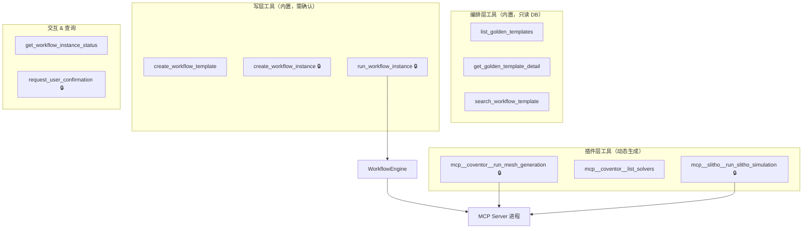

# 06 · Agent 工具集：8 个内置工具 + MCP 代理工具

<aside>
🎯

大模型的“手脚”都在这一页。一句话记住分工：**内置工具管“编排与调度”（workflow 层），MCP 工具管“具体仿真”（插件层）**。两者绝不混在一起。

</aside>

## 0. 开工前：给 `JsonUtils` 补四个方法

05 页和本页用到了几个 01 页没写的工具方法，请把它们补到 `common/JsonUtils.java`：

```java
// ---- 补充到 com.example.simagent.common.JsonUtils ----

/** 字符串 -> 对象 */
public static <T> T parse(String json, Class<T> type) {
    try {
        return MAPPER.readValue(json, type);
    } catch (Exception e) {
        throw new IllegalArgumentException("JSON 解析失败: " + e.getMessage(), e);
    }
}

/** 字符串 -> List<对象> */
public static <T> java.util.List<T> parseList(String json, Class<T> type) {
    try {
        return MAPPER.readValue(json,
                MAPPER.getTypeFactory().constructCollectionType(java.util.List.class, type));
    } catch (Exception e) {
        throw new IllegalArgumentException("JSON 数组解析失败: " + e.getMessage(), e);
    }
}

/** 容错版 readTree：解析失败返回空对象，用于日志/事件展示 */
public static com.fasterxml.jackson.databind.JsonNode tryReadTree(String json) {
    try {
        return readTree(json == null || json.isBlank() ? "{}" : json);
    } catch (Exception e) {
        com.fasterxml.jackson.databind.node.ObjectNode n = obj();
        n.put("_rawUnparsable", json);
        return n;
    }
}

/** JsonNode -> Map<String,Object>（null 安全） */
public static java.util.Map<String, Object> toMap(com.fasterxml.jackson.databind.JsonNode node) {
    if (node == null || node.isNull() || !node.isObject()) {
        return new java.util.LinkedHashMap<>();
    }
    return MAPPER.convertValue(node,
            new com.fasterxml.jackson.core.type.TypeReference<java.util.LinkedHashMap<String, Object>>() {
            });
}
```

---

## 1. 本页依赖的 07 页接口契约

工具层不直接写 SQL，全部调 Service。**07 页必须按这个签名实现**：

```java
// workflow/repository/GoldenTemplateRepository
List<GoldenTemplate> findAllEnabled();
List<GoldenTemplate> search(String keyword, String simType);
GoldenTemplate findByCode(String code);
GoldenTemplate requireByCode(String code);          // 不存在抛 BizException

// workflow/service/WorkflowTemplateService
List<WorkflowTemplate> search(String keyword, int limit);
WorkflowGraph loadGraph(String templateCode);
WorkflowTemplate createFromSpec(JsonNode spec, String createdBy);   // 含 DAG 校验，落 DRAFT
void publish(String templateCode);

// workflow/service/WorkflowInstanceService
WorkflowInstance createFromTemplate(String templateCode, Map<String,Object> inputParams,
                                    String sessionId, String idempotentKey);
WorkflowInstance requireById(long instanceId);
List<NodeInstance> nodesOf(long instanceId);
Map<String,Object> summarize(long instanceId);      // 给大模型看的紧凑快照

// workflow/engine/WorkflowEngine
WorkflowRunResult run(long instanceId, String sessionId);
```

---

## 2. `list_golden_templates` —— 能力清单

```java
package com.example.simagent.agent.tool.builtin;

import com.example.simagent.agent.tool.AgentTool;
import com.example.simagent.agent.tool.ToolContext;
import com.example.simagent.agent.tool.ToolResult;
import com.example.simagent.common.JsonUtils;
import com.example.simagent.workflow.domain.GoldenTemplate;
import com.example.simagent.workflow.repository.GoldenTemplateRepository;
import com.fasterxml.jackson.databind.JsonNode;
import org.springframework.stereotype.Component;

import java.util.ArrayList;
import java.util.LinkedHashMap;
import java.util.List;
import java.util.Map;

/**
 * 把平台的仿真能力（Golden Template）告诉大模型。
 * 这是大模型能编排出正确 DAG 的前提——它必须先知道“有哪些积木”。
 */
@Component
public class ListGoldenTemplatesTool implements AgentTool {

    private final GoldenTemplateRepository repo;

    public ListGoldenTemplatesTool(GoldenTemplateRepository repo) {
        this.repo = repo;
    }

    @Override
    public String name() {
        return "list_golden_templates";
    }

    @Override
    public String description() {
        return """
                列出平台上所有可用的仿真能力（Golden Template 黄金模版）。
                每个模版 = 一个已调好参数的单个仿真任务，返回 code / 仿真类型 / 参数 schema / 默认参数 / 预估耗时。
                使用时机：需要新建工作流模版前，先调此工具拿到可用积木清单。
                """;
    }

    @Override
    public JsonNode parameterSchema() {
        return JsonUtils.readTree("""
                {
                  "type": "object",
                  "properties": {
                    "simType": {
                      "type": "string",
                      "description": "可选，按仿真类型筛选，如 MESH / COVENTOR / SLITHO / REPORT"
                    },
                    "keyword": {
                      "type": "string",
                      "description": "可选，按名称或描述模糊搜索"
                    }
                  }
                }
                """);
    }

    @Override
    public ToolResult execute(JsonNode args, ToolContext ctx) {
        String simType = JsonUtils.text(args, "simType", null);
        String keyword = JsonUtils.text(args, "keyword", null);

        List<GoldenTemplate> list = (simType == null && keyword == null)
                ? repo.findAllEnabled() : repo.search(keyword, simType);

        List<Map<String, Object>> items = new ArrayList<>();
        for (GoldenTemplate g : list) {
            Map<String, Object> m = new LinkedHashMap<>();
            m.put("code", g.getCode());
            m.put("name", g.getName());
            m.put("simType", g.getSimType());
            m.put("description", g.getDescription());
            m.put("estMinutes", g.getEstMinutes());
            m.put("defaultParams", JsonUtils.tryReadTree(g.getDefaultParams()));
            m.put("paramSchema", JsonUtils.tryReadTree(g.getParamSchema()));
            items.add(m);
        }

        Map<String, Object> data = new LinkedHashMap<>();
        data.put("success", true);
        data.put("total", items.size());
        data.put("templates", items);
        data.put("hint", "编排时请用 code 引用模版；参数优先使用 defaultParams，仅覆盖用户明确提到的字段");
        return ToolResult.ok(data, "找到 " + items.size() + " 个可用仿真能力");
    }
}
```

---

## 3. `get_golden_template_detail`

```java
package com.example.simagent.agent.tool.builtin;

import com.example.simagent.agent.tool.AgentTool;
import com.example.simagent.agent.tool.ToolContext;
import com.example.simagent.agent.tool.ToolResult;
import com.example.simagent.common.JsonUtils;
import com.example.simagent.workflow.domain.GoldenTemplate;
import com.example.simagent.workflow.repository.GoldenTemplateRepository;
import com.fasterxml.jackson.databind.JsonNode;
import org.springframework.stereotype.Component;

import java.util.LinkedHashMap;
import java.util.Map;

@Component
public class GetGoldenTemplateDetailTool implements AgentTool {

    private final GoldenTemplateRepository repo;

    public GetGoldenTemplateDetailTool(GoldenTemplateRepository repo) {
        this.repo = repo;
    }

    @Override
    public String name() {
        return "get_golden_template_detail";
    }

    @Override
    public String description() {
        return "查看单个黄金模版的完整详情（完整参数 schema、默认值、绑定的仿真工具）。"
                + "当你不确定某个模版需要哪些参数时调用。";
    }

    @Override
    public JsonNode parameterSchema() {
        return JsonUtils.readTree("""
                {
                  "type": "object",
                  "properties": {
                    "code": { "type": "string", "description": "黄金模版 code，如 GT_COVENTOR_MODAL" }
                  },
                  "required": ["code"]
                }
                """);
    }

    @Override
    public ToolResult execute(JsonNode args, ToolContext ctx) {
        String code = JsonUtils.text(args, "code", null);
        if (code == null || code.isBlank()) {
            return ToolResult.fail("缺少必填参数 code");
        }
        GoldenTemplate g = repo.findByCode(code);
        if (g == null) {
            return ToolResult.fail("不存在的黄金模版 code=" + code
                    + "，请先调 list_golden_templates 确认可用模版");
        }
        Map<String, Object> data = new LinkedHashMap<>();
        data.put("success", true);
        data.put("code", g.getCode());
        data.put("name", g.getName());
        data.put("simType", g.getSimType());
        data.put("description", g.getDescription());
        data.put("mcpServer", g.getMcpServer());
        data.put("mcpTool", g.getMcpTool());
        data.put("estMinutes", g.getEstMinutes());
        data.put("paramSchema", JsonUtils.tryReadTree(g.getParamSchema()));
        data.put("defaultParams", JsonUtils.tryReadTree(g.getDefaultParams()));
        return ToolResult.ok(data, "模版 " + code + " 详情");
    }
}
```

---

## 4. `search_workflow_template` —— 复用优先

```java
package com.example.simagent.agent.tool.builtin;

import com.example.simagent.agent.tool.AgentTool;
import com.example.simagent.agent.tool.ToolContext;
import com.example.simagent.agent.tool.ToolResult;
import com.example.simagent.common.JsonUtils;
import com.example.simagent.workflow.domain.EdgeTemplate;
import com.example.simagent.workflow.domain.NodeTemplate;
import com.example.simagent.workflow.domain.WorkflowGraph;
import com.example.simagent.workflow.domain.WorkflowTemplate;
import com.example.simagent.workflow.service.WorkflowTemplateService;
import com.fasterxml.jackson.databind.JsonNode;
import lombok.extern.slf4j.Slf4j;
import org.springframework.stereotype.Component;

import java.util.ArrayList;
import java.util.LinkedHashMap;
import java.util.List;
import java.util.Map;

/**
 * 搜现成工作流模版。返回时**把 DAG 结构一并展开**，
 * 让大模型能自己判断“这个模版是不是真的满足用户需求”，而不是只看名字瞎猜。
 */
@Slf4j
@Component
public class SearchWorkflowTemplateTool implements AgentTool {

    private final WorkflowTemplateService service;

    public SearchWorkflowTemplateTool(WorkflowTemplateService service) {
        this.service = service;
    }

    @Override
    public String name() {
        return "search_workflow_template";
    }

    @Override
    public String description() {
        return """
                根据用户需求搜索现有的工作流模版（Workflow Template）。
                返回每个候选模版的 code / 名称 / 描述 / 节点列表 / 边列表，供你判断是否匹配。
                必须在创建新模版之前先调用此工具（复用优先原则）。
                如果 matched=false，说明没有可用模版，需要你自己编排一个新的。
                """;
    }

    @Override
    public JsonNode parameterSchema() {
        return JsonUtils.readTree("""
                {
                  "type": "object",
                  "properties": {
                    "query": {
                      "type": "string",
                      "description": "搜索关键词，建议用仿真类型或业务目标，如 'coventor 模态' 或 '网格 光刻'"
                    },
                    "limit": { "type": "integer", "description": "最多返回条数，默认 5" }
                  },
                  "required": ["query"]
                }
                """);
    }

    @Override
    public ToolResult execute(JsonNode args, ToolContext ctx) {
        String query = JsonUtils.text(args, "query", "");
        int limit = args.path("limit").asInt(5);

        List<WorkflowTemplate> found = service.search(query, limit);

        List<Map<String, Object>> items = new ArrayList<>();
        for (WorkflowTemplate t : found) {
            Map<String, Object> m = new LinkedHashMap<>();
            m.put("code", t.getCode());
            m.put("name", t.getName());
            m.put("description", t.getDescription());
            m.put("status", t.getStatus());
            try {
                WorkflowGraph graph = service.loadGraph(t.getCode());
                List<Map<String, Object>> nodes = new ArrayList<>();
                for (NodeTemplate n : graph.getNodes()) {
                    Map<String, Object> nm = new LinkedHashMap<>();
                    nm.put("nodeKey", n.getNodeKey());
                    nm.put("goldenTemplateCode", n.getGoldenTemplateCode());
                    nm.put("simType", n.getSimType());
                    nodes.add(nm);
                }
                List<String> edges = new ArrayList<>();
                for (EdgeTemplate e : graph.getEdges()) {
                    edges.add(e.getFromNodeKey() + " -> " + e.getToNodeKey()
                            + (e.getConditionExpr() == null ? "" : " [if " + e.getConditionExpr() + "]"));
                }
                m.put("nodes", nodes);
                m.put("edges", edges);
            } catch (Exception e) {
                log.warn("[tool] 载入模版 {} 结构失败: {}", t.getCode(), e.getMessage());
                m.put("graphError", e.getMessage());
            }
            items.add(m);
        }

        Map<String, Object> data = new LinkedHashMap<>();
        data.put("success", true);
        data.put("matched", !items.isEmpty());
        data.put("total", items.size());
        data.put("templates", items);
        data.put("nextStep", items.isEmpty()
                ? "没有命中：请先调 list_golden_templates，再调 create_workflow_template 新建模版"
                : "已命中：确认节点与边确实满足需求后，直接调 create_workflow_instance");
        return ToolResult.ok(data, items.isEmpty() ? "未找到可用工作流模版"
                : "找到 " + items.size() + " 个候选模版");
    }
}
```

---

## 5. `create_workflow_template` —— 大模型写 DAG

<aside>
🔥

这是全链路里**技术密度最高**的一个工具：大模型的输出直接变成持久化的拓扑结构。因此 schema 要写得极其详细（带 example），而且落库前**必须做 DAG 校验**（环、孤立节点、引用不存在的 nodeKey / goldenTemplateCode）。

</aside>

```java
package com.example.simagent.agent.tool.builtin;

import com.example.simagent.agent.tool.AgentTool;
import com.example.simagent.agent.tool.ToolContext;
import com.example.simagent.agent.tool.ToolResult;
import com.example.simagent.common.BizException;
import com.example.simagent.common.JsonUtils;
import com.example.simagent.workflow.domain.WorkflowTemplate;
import com.example.simagent.workflow.service.WorkflowTemplateService;
import com.fasterxml.jackson.databind.JsonNode;
import lombok.extern.slf4j.Slf4j;
import org.springframework.stereotype.Component;

import java.util.LinkedHashMap;
import java.util.Map;

@Slf4j
@Component
public class CreateWorkflowTemplateTool implements AgentTool {

    private final WorkflowTemplateService service;

    public CreateWorkflowTemplateTool(WorkflowTemplateService service) {
        this.service = service;
    }

    @Override
    public String name() {
        return "create_workflow_template";
    }

    @Override
    public String description() {
        return """
                创建一个新的工作流模版（DAG），状态为 DRAFT。仅当 search_workflow_template 没有命中时使用。
                要求：
                - 每个 node 必须引用一个存在的 goldenTemplateCode（先调 list_golden_templates 确认）；
                - nodeKey 在模版内唯一，建议用短小写英文，如 mesh / coventor / litho / report；
                - 只在真正存在依赖时连边；无依赖的节点不连边，引擎会自动并行执行；
                - 节点参数中可用占位符：${上游nodeKey.output.字段} 引用上游输出，${input.字段} 引用用户输入；
                - 不要形成环（A->B->A），不要出现游离节点（除单节点模版）。
                创建成功后返回 templateCode，后续用它创建实例。
                """;
    }

    @Override
    public JsonNode parameterSchema() {
        return JsonUtils.readTree("""
                {
                  "type": "object",
                  "properties": {
                    "name": { "type": "string", "description": "模版名称，中文，简短清楚" },
                    "description": { "type": "string", "description": "编排思路说明" },
                    "nodes": {
                      "type": "array",
                      "description": "节点列表，至少一个",
                      "items": {
                        "type": "object",
                        "properties": {
                          "nodeKey": { "type": "string", "description": "模版内唯一标识，如 mesh" },
                          "goldenTemplateCode": { "type": "string", "description": "引用的黄金模版 code" },
                          "name": { "type": "string", "description": "可选，节点显示名" },
                          "paramOverrides": {
                            "type": "object",
                            "description": "参数覆盖，只写需要改的字段；可用 ${nodeKey.output.x} / ${input.x} 占位符"
                          },
                          "retry": { "type": "integer", "description": "可选，失败重试次数，默认 0" },
                          "timeoutSec": { "type": "integer", "description": "可选，单节点超时秒" }
                        },
                        "required": ["nodeKey", "goldenTemplateCode"]
                      }
                    },
                    "edges": {
                      "type": "array",
                      "description": "依赖边列表；单节点模版可传空数组",
                      "items": {
                        "type": "object",
                        "properties": {
                          "from": { "type": "string", "description": "上游 nodeKey" },
                          "to": { "type": "string", "description": "下游 nodeKey" },
                          "conditionExpr": {
                            "type": "string",
                            "description": "可选条件表达式（SpEL），例：#outputs['mesh']['quality'] > 0.8"
                          }
                        },
                        "required": ["from", "to"]
                      }
                    }
                  },
                  "required": ["name", "nodes", "edges"]
                }
                """);
    }

    @Override
    public ToolResult execute(JsonNode args, ToolContext ctx) {
        try {
            WorkflowTemplate t = service.createFromSpec(args, ctx.getUserId());
            Map<String, Object> data = new LinkedHashMap<>();
            data.put("success", true);
            data.put("templateCode", t.getCode());
            data.put("templateId", t.getId());
            data.put("name", t.getName());
            data.put("status", t.getStatus());
            data.put("nodeCount", args.path("nodes").size());
            data.put("edgeCount", args.path("edges").size());
            data.put("nextStep", "已创建 DRAFT 模版。向用户简要说明编排思路，"
                    + "然后调 create_workflow_instance（系统会让用户确认）");
            return ToolResult.ok(data, "工作流模版已创建: " + t.getCode());
        } catch (BizException e) {
            // 校验失败时把具体原因回灌，大模型能自己修 DAG 重试
            log.warn("[tool] 模版校验失败: {}", e.getMessage());
            return ToolResult.fail("模版校验失败：" + e.getMessage()
                    + "。请修正后重新提交。");
        }
    }
}
```

---

## 6. `create_workflow_instance`（需确认）

```java
package com.example.simagent.agent.tool.builtin;

import com.example.simagent.agent.tool.AgentTool;
import com.example.simagent.agent.tool.ToolContext;
import com.example.simagent.agent.tool.ToolResult;
import com.example.simagent.common.JsonUtils;
import com.example.simagent.workflow.domain.NodeInstance;
import com.example.simagent.workflow.domain.WorkflowInstance;
import com.example.simagent.workflow.service.WorkflowInstanceService;
import com.fasterxml.jackson.databind.JsonNode;
import org.springframework.stereotype.Component;

import java.util.ArrayList;
import java.util.LinkedHashMap;
import java.util.List;
import java.util.Map;

/**
 * 模版 -> 实例。这是“图纸变施工单”的一步，需要用户确认。
 */
@Component
public class CreateWorkflowInstanceTool implements AgentTool {

    private final WorkflowInstanceService service;

    public CreateWorkflowInstanceTool(WorkflowInstanceService service) {
        this.service = service;
    }

    @Override
    public String name() {
        return "create_workflow_instance";
    }

    @Override
    public String description() {
        return """
                基于工作流模版创建一个可执行实例（会拷贝模版的 node/edge 为实例，并合并用户输入参数）。
                实例创建后不会自动执行，需再调 run_workflow_instance。
                此操作需要用户确认。
                """;
    }

    @Override
    public boolean requiresConfirmation() {
        return true;
    }

    @Override
    public String confirmPrompt(JsonNode args) {
        return "即将基于模版 【" + JsonUtils.text(args, "templateCode", "?")
                + "】 创建工作流实例，输入参数："
                + args.path("inputParams").toString() + "\n确认创建？";
    }

    @Override
    public JsonNode parameterSchema() {
        return JsonUtils.readTree("""
                {
                  "type": "object",
                  "properties": {
                    "templateCode": { "type": "string", "description": "工作流模版 code" },
                    "inputParams": {
                      "type": "object",
                      "description": "本次运行的全局输入参数，对应节点里的 ${input.x} 占位符"
                    },
                    "remark": { "type": "string", "description": "可选备注" }
                  },
                  "required": ["templateCode"]
                }
                """);
    }

    @Override
    public ToolResult execute(JsonNode args, ToolContext ctx) {
        String templateCode = JsonUtils.text(args, "templateCode", null);
        if (templateCode == null || templateCode.isBlank()) {
            return ToolResult.fail("缺少必填参数 templateCode");
        }
        Map<String, Object> inputParams = JsonUtils.toMap(args.get("inputParams"));

        // 幂等键：同一会话 + 同一模版 + 同一参数 => 不重复建实例
        String idempotentKey = ctx.getSessionId() + "|" + templateCode + "|"
                + Integer.toHexString(JsonUtils.toJson(inputParams).hashCode());

        WorkflowInstance inst = service.createFromTemplate(
                templateCode, inputParams, ctx.getSessionId(), idempotentKey);

        List<Map<String, Object>> nodes = new ArrayList<>();
        for (NodeInstance n : service.nodesOf(inst.getId())) {
            Map<String, Object> m = new LinkedHashMap<>();
            m.put("nodeKey", n.getNodeKey());
            m.put("simType", n.getSimType());
            m.put("mcpServer", n.getMcpServer());
            m.put("mcpTool", n.getMcpTool());
            m.put("status", n.getStatus());
            m.put("params", JsonUtils.tryReadTree(n.getParams()));
            nodes.add(m);
        }

        Map<String, Object> data = new LinkedHashMap<>();
        data.put("success", true);
        data.put("instanceId", inst.getId());
        data.put("templateCode", templateCode);
        data.put("status", inst.getStatus());
        data.put("nodes", nodes);
        data.put("nextStep", "调 run_workflow_instance 并传入 instanceId 开始执行");
        return ToolResult.ok(data, "实例 #" + inst.getId() + " 已创建，共 " + nodes.size() + " 个节点");
    }
}
```

---

## 7. `run_workflow_instance`（需确认）

```java
package com.example.simagent.agent.tool.builtin;

import com.example.simagent.agent.tool.AgentTool;
import com.example.simagent.agent.tool.ToolContext;
import com.example.simagent.agent.tool.ToolResult;
import com.example.simagent.common.JsonUtils;
import com.example.simagent.workflow.engine.WorkflowEngine;
import com.example.simagent.workflow.engine.WorkflowRunResult;
import com.fasterxml.jackson.databind.JsonNode;
import lombok.extern.slf4j.Slf4j;
import org.springframework.stereotype.Component;

import java.util.LinkedHashMap;
import java.util.Map;

/**
 * 真正执行仿真。引擎会按 DAG 拓扑并行调用各节点对应的 MCP Server。
 * 执行过程中节点状态会通过 SSE 实时推送给前端。
 */
@Slf4j
@Component
public class RunWorkflowInstanceTool implements AgentTool {

    private final WorkflowEngine engine;

    public RunWorkflowInstanceTool(WorkflowEngine engine) {
        this.engine = engine;
    }

    @Override
    public String name() {
        return "run_workflow_instance";
    }

    @Override
    public String description() {
        return """
                执行一个已创建的工作流实例（真正跑仿真）。
                引擎自动按拓扑排序执行，无依赖节点并行，并把上游输出注入下游参数。
                返回每个节点的状态、耗时、关键指标与产物路径。此操作需要用户确认。
                """;
    }

    @Override
    public boolean requiresConfirmation() {
        return true;
    }

    @Override
    public String confirmPrompt(JsonNode args) {
        return "即将执行工作流实例 #" + args.path("instanceId").asLong(0)
                + "（会真正调用仿真插件并消耗计算资源）。确认开始？";
    }

    @Override
    public JsonNode parameterSchema() {
        return JsonUtils.readTree("""
                {
                  "type": "object",
                  "properties": {
                    "instanceId": { "type": "integer", "description": "工作流实例 ID" }
                  },
                  "required": ["instanceId"]
                }
                """);
    }

    @Override
    public ToolResult execute(JsonNode args, ToolContext ctx) {
        long instanceId = args.path("instanceId").asLong(0);
        if (instanceId <= 0) {
            return ToolResult.fail("instanceId 无效，请先调 create_workflow_instance");
        }

        WorkflowRunResult result = engine.run(instanceId, ctx.getSessionId());

        Map<String, Object> data = new LinkedHashMap<>();
        data.put("success", result.isSuccess());
        data.put("instanceId", instanceId);
        data.put("status", result.getStatus());
        data.put("costMs", result.getCostMs());
        data.put("nodes", result.getNodes());
        if (!result.isSuccess()) {
            data.put("failedNodes", result.getFailedNodeKeys());
            data.put("errorMsg", result.getErrorMsg());
            data.put("hint", "向用户说明失败节点与原因；若为参数问题可建议修正后重跑");
        }
        return new ToolResult(result.isSuccess(), data,
                "实例 #" + instanceId + " 执行" + (result.isSuccess() ? "成功" : "失败")
                        + "，耗时 " + result.getCostMs() + "ms");
    }
}
```

---

## 8. `get_workflow_instance_status`

```java
package com.example.simagent.agent.tool.builtin;

import com.example.simagent.agent.tool.AgentTool;
import com.example.simagent.agent.tool.ToolContext;
import com.example.simagent.agent.tool.ToolResult;
import com.example.simagent.common.JsonUtils;
import com.example.simagent.workflow.service.WorkflowInstanceService;
import com.fasterxml.jackson.databind.JsonNode;
import org.springframework.stereotype.Component;

import java.util.Map;

@Component
public class GetWorkflowInstanceStatusTool implements AgentTool {

    private final WorkflowInstanceService service;

    public GetWorkflowInstanceStatusTool(WorkflowInstanceService service) {
        this.service = service;
    }

    @Override
    public String name() {
        return "get_workflow_instance_status";
    }

    @Override
    public String description() {
        return "查询工作流实例的当前状态与每个节点的执行情况（包括输出指标与产物路径）。"
                + "用户询问进展、或你需要引用早先运行结果时调用。";
    }

    @Override
    public JsonNode parameterSchema() {
        return JsonUtils.readTree("""
                {
                  "type": "object",
                  "properties": {
                    "instanceId": { "type": "integer", "description": "工作流实例 ID" }
                  },
                  "required": ["instanceId"]
                }
                """);
    }

    @Override
    public ToolResult execute(JsonNode args, ToolContext ctx) {
        long id = args.path("instanceId").asLong(0);
        if (id <= 0) {
            return ToolResult.fail("instanceId 无效");
        }
        Map<String, Object> snapshot = service.summarize(id);
        return ToolResult.ok(snapshot, "实例 #" + id + " 状态：" + snapshot.get("status"));
    }
}
```

---

## 9. `request_user_confirmation` —— 主动反问

<aside>
💡

上面两个写工具是**系统强制拦截**的确认；而这个工具是让**大模型主动**发起确认（比如“我打算这样编排，你看行不行？”）。两者走同一套 HITL 机制。

</aside>

```java
package com.example.simagent.agent.tool.builtin;

import com.example.simagent.agent.tool.AgentTool;
import com.example.simagent.agent.tool.ToolContext;
import com.example.simagent.agent.tool.ToolResult;
import com.example.simagent.common.JsonUtils;
import com.fasterxml.jackson.databind.JsonNode;
import org.springframework.stereotype.Component;

import java.util.LinkedHashMap;
import java.util.Map;

@Component
public class RequestUserConfirmationTool implements AgentTool {

    @Override
    public String name() {
        return "request_user_confirmation";
    }

    @Override
    public String description() {
        return "当你需要用户对方案、参数或风险做出确认时调用。会在前端弹出确认卡片并暂停执行，"
                + "用户点确认/拒绝后你会收到结果。不要用它问可以自己推断的琐碎参数。";
    }

    @Override
    public boolean requiresConfirmation() {
        return true;
    }

    @Override
    public String confirmPrompt(JsonNode args) {
        String q = JsonUtils.text(args, "question", "请确认是否继续？");
        String detail = JsonUtils.text(args, "detail", "");
        return detail.isBlank() ? q : q + "\n\n" + detail;
    }

    @Override
    public JsonNode parameterSchema() {
        return JsonUtils.readTree("""
                {
                  "type": "object",
                  "properties": {
                    "question": { "type": "string", "description": "要确认的问题，一句话" },
                    "detail": { "type": "string", "description": "可选，补充说明，如编排方案、预估耗时" }
                  },
                  "required": ["question"]
                }
                """);
    }

    @Override
    public ToolResult execute(JsonNode args, ToolContext ctx) {
        // 能进到这里，说明用户已经点了“确认”（拒绝路径在 Orchestrator 里就返回了）
        Map<String, Object> data = new LinkedHashMap<>();
        data.put("success", true);
        data.put("approved", true);
        data.put("question", JsonUtils.text(args, "question", ""));
        data.put("hint", "用户已确认，请继续执行后续步骤");
        return ToolResult.ok(data, "用户已确认");
    }
}
```

---

## 10. `McpDelegatingTool` —— 把 MCP 工具变成 Agent 工具

```java
package com.example.simagent.agent.tool.mcp;

import com.example.simagent.agent.tool.AgentTool;
import com.example.simagent.agent.tool.ToolContext;
import com.example.simagent.agent.tool.ToolResult;
import com.example.simagent.common.JsonUtils;
import com.example.simagent.config.AgentProperties;
import com.example.simagent.mcp.McpServerRegistry;
import com.example.simagent.mcp.protocol.McpCallToolResult;
import com.fasterxml.jackson.databind.JsonNode;
import lombok.extern.slf4j.Slf4j;

import java.util.LinkedHashMap;
import java.util.Map;

/**
 * 把一个 MCP Server 的工具包成 AgentTool。无状态，由 ToolRegistry 按需 new。
 *
 * 设计说明：
 *   正常业务路径下，仿真应该走 workflow 引擎（有实例、有节点记录、可追溯）。
 *   但保留直接调 MCP 工具的能力很有用：
 *     - 查询类工具（list_solvers / get_simulation_status）不必开 workflow；
 *     - 用户就想快速试一下单个仿真；
 *     - 调试插件时直接验证。
 */
@Slf4j
public class McpDelegatingTool implements AgentTool {

    private final String llmName;
    private final McpServerRegistry.McpToolRef ref;
    private final McpServerRegistry registry;
    private final AgentProperties agentProps;

    public McpDelegatingTool(String llmName, McpServerRegistry.McpToolRef ref,
                             McpServerRegistry registry, AgentProperties agentProps) {
        this.llmName = llmName;
        this.ref = ref;
        this.registry = registry;
        this.agentProps = agentProps;
    }

    @Override
    public String name() {
        return llmName;
    }

    @Override
    public String description() {
        return "[" + ref.serverName() + " 仿真插件] " + ref.tool().getDescription()
                + "\n注意：多步骤/可复用的仿真请优先走 workflow 流程，此工具适用于查询类操作或单步快速验证。";
    }

    @Override
    public JsonNode parameterSchema() {
        JsonNode schema = ref.tool().getInputSchema();
        return schema == null ? JsonUtils.readTree("{\"type\":\"object\",\"properties\":{}}") : schema;
    }

    /** 写类 MCP 工具（run_*）同样要确认；查询类（list_*/get_*）直接放行 */
    @Override
    public boolean requiresConfirmation() {
        String raw = ref.tool().getName();
        return raw != null && raw.startsWith("run_");
    }

    @Override
    public String confirmPrompt(JsonNode args) {
        return "即将直接调用仿真插件 【" + ref.serverName() + "/" + ref.tool().getName()
                + "】，参数：" + args.toString() + "\n确认执行？";
    }

    @Override
    public ToolResult execute(JsonNode args, ToolContext ctx) {
        long started = System.currentTimeMillis();
        try {
            Map<String, Object> arguments = JsonUtils.toMap(args);
            McpCallToolResult raw = registry.requireClient(ref.serverName())
                    .callTool(ref.tool().getName(), arguments);

            String text = raw.textContent();
            Map<String, Object> data = new LinkedHashMap<>();
            data.put("success", !raw.isError());
            data.put("server", ref.serverName());
            data.put("tool", ref.tool().getName());
            data.put("costMs", System.currentTimeMillis() - started);
            // MCP 返回的 text 通常就是 JSON 字符串，能解就解，解不了就原文上
            JsonNode parsed = JsonUtils.tryReadTree(text);
            data.put("result", parsed.has("_rawUnparsable") ? text : parsed);

            return new ToolResult(!raw.isError(), data,
                    ref.serverName() + "/" + ref.tool().getName()
                            + (raw.isError() ? " 执行失败" : " 执行成功"));
        } catch (Exception e) {
            log.error("[mcp-tool] 调用 {} 失败", llmName, e);
            return ToolResult.fail("仿真插件调用失败：" + e.getMessage()
                    + "。可以提醒用户检查插件进程状态，或改用 workflow 流程重试。");
        }
    }
}
```

---

## 11. 工具全景图



| 工具 | 读/写 | 需确认 | 典型调用时机 |
| --- | --- | --- | --- |
| `list_golden_templates` | 读 | 否 | 新建模版前拿能力清单 |
| `get_golden_template_detail` | 读 | 否 | 不确定参数时 |
| `search_workflow_template` | 读 | 否 | **每轮首选** |
| `create_workflow_template` | 写 | 否（DRAFT 无副作用） | 搜不到现成模版 |
| `create_workflow_instance` | 写 | ✅ | 确定要跑了 |
| `run_workflow_instance` | 写 | ✅ | 真正执行仿真 |
| `get_workflow_instance_status` | 读 | 否 | 查进展/引用历史结果 |
| `request_user_confirmation` | — | ✅ | 主动征求意见 |
| `mcp__*__run_*` | 写 | ✅ | 单步快速验证 |
| `mcp__*__list_*` / `get_*` | 读 | 否 | 查插件元信息 |

<aside>
⚠️

**工具描述就是提示词的一部分**。工具多了以后，大模型选错工具的根本原因几乎总是描述写得含糊。写描述时必须回答三件事：什么时候用、不该什么时候用、返回什么。上面每个 `description()` 都是这个套路。

</aside>

<aside>
🧱

**新增一个能力需要改多少代码？** 如果是新仿真类型：写一个 Python MCP Server + 配置一行 `mcp.servers` + 插一条 `golden_template` 记录，**Java 代码零修改**。如果是新编排能力（比如“导出 PDF 报告到邮箱”）：新增一个 `@Component implements AgentTool`，也是零修改现有代码。这就是领导说的“核心引擎化 + 插件化”落到代码上的样子。

</aside>