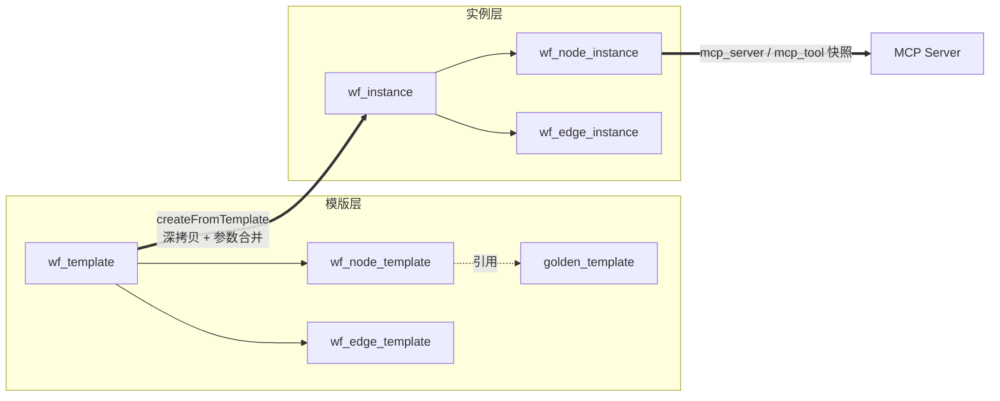
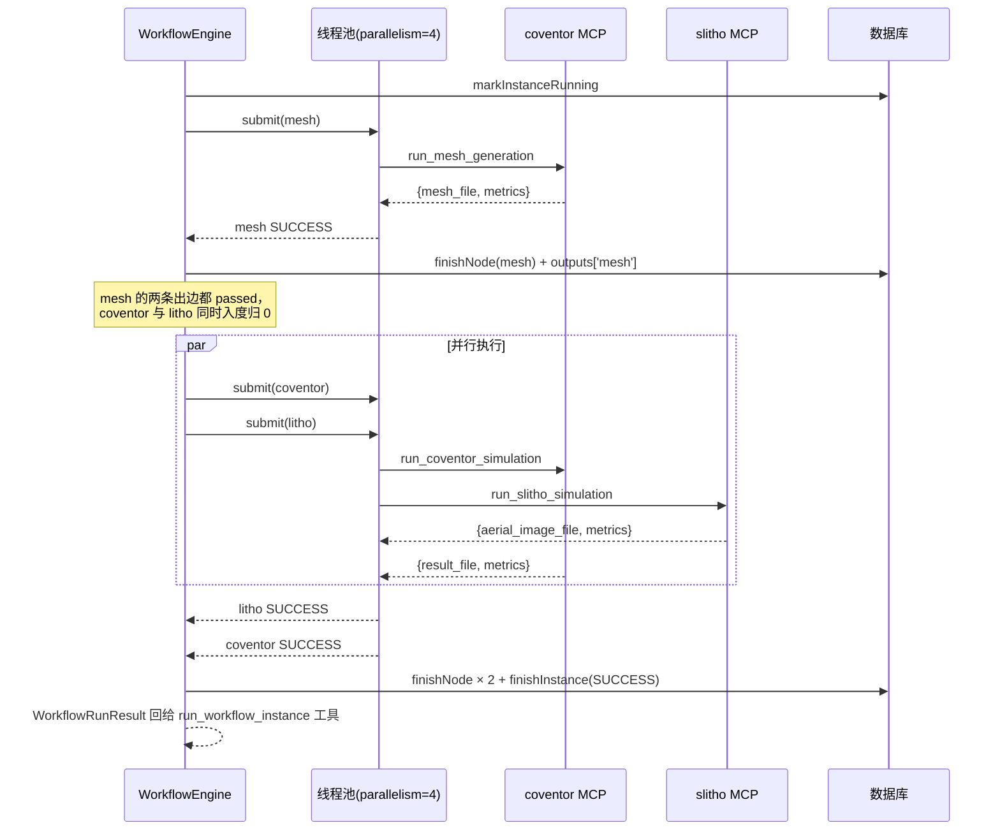

# 07 · Workflow 领域层与 DAG 并行执行引擎

<aside>
🎯

这一页是“核心引擎”的**心脏**：把模版拷成实例、按拓扑并行跑节点、把上游输出注入下游参数、根据 node 的仿真类型路由到对应 MCP Server。**它不知道 coventor 和 slitho 的区别——这正是插件化的精髓。**

</aside>

## 0. 执行模型一图看懂



<aside>
🔑

**为什么实例要拷 `mcp_server` / `mcp_tool` 快照？** 因为半年后有人把 `golden_template` 的绑定工具改了，你仍然需要能回答“当时那次仿真到底调的是哪个工具”。**实例层必须自包含、不依赖模版当前状态**——这是可审计系统的铁律。

</aside>

---

## 1. 领域对象 `workflow/domain/`

```java
package com.example.simagent.workflow.domain;

public enum TemplateStatus {
    DRAFT, PUBLISHED, ARCHIVED
}
```

```java
package com.example.simagent.workflow.domain;

/** 节点与实例共用的运行状态 */
public enum RunStatus {
    PENDING, RUNNING, SUCCESS, FAILED, SKIPPED, CANCELED;

    public boolean isTerminal() {
        return this == SUCCESS || this == FAILED || this == SKIPPED || this == CANCELED;
    }
}
```

```java
package com.example.simagent.workflow.domain;

import lombok.Data;

@Data
public class GoldenTemplate {
    private Long id;
    private String code;
    private String name;
    private String simType;
    /** ★ 插件路由的关键两字段 */
    private String mcpServer;
    private String mcpTool;
    private String paramSchema;      // JSON 字符串
    private String defaultParams;    // JSON 字符串
    private Integer estMinutes;
    private String description;
    private Boolean enabled;
}
```

```java
package com.example.simagent.workflow.domain;

import lombok.Data;

@Data
public class WorkflowTemplate {
    private Long id;
    private String code;
    private String name;
    private String description;
    private String status;       // TemplateStatus
    private Integer version;
    private String createdBy;
}
```

```java
package com.example.simagent.workflow.domain;

import lombok.Data;

@Data
public class NodeTemplate {
    private Long id;
    private Long templateId;
    private String nodeKey;
    private String name;
    private Long goldenTemplateId;
    /** 联表带出，方便展示与校验 */
    private String goldenTemplateCode;
    private String simType;
    private String mcpServer;
    private String mcpTool;
    private String defaultParams;
    private String paramOverrides;
    private Integer retry;
    private Integer timeoutSec;
    private Integer sortNo;
}
```

```java
package com.example.simagent.workflow.domain;

import lombok.Data;

@Data
public class EdgeTemplate {
    private Long id;
    private Long templateId;
    private String fromNodeKey;
    private String toNodeKey;
    private String conditionExpr;
}
```

```java
package com.example.simagent.workflow.domain;

import lombok.AllArgsConstructor;
import lombok.Data;

import java.util.List;

@Data
@AllArgsConstructor
public class WorkflowGraph {
    private WorkflowTemplate template;
    private List<NodeTemplate> nodes;
    private List<EdgeTemplate> edges;
}
```

```java
package com.example.simagent.workflow.domain;

import lombok.Data;

import java.sql.Timestamp;

@Data
public class WorkflowInstance {
    private Long id;
    private Long templateId;
    private String templateCode;
    private String name;
    private String status;           // RunStatus
    private String sessionId;
    private String idempotentKey;
    private String inputParams;      // JSON
    private Long costMs;
    private String errorMsg;
    private Timestamp startedAt;
    private Timestamp finishedAt;
}
```

```java
package com.example.simagent.workflow.domain;

import lombok.Data;

import java.sql.Timestamp;

@Data
public class NodeInstance {
    private Long id;
    private Long instanceId;
    private String nodeKey;
    private String name;
    private String simType;
    /** ★ 从 golden_template 拷下来的快照 */
    private String mcpServer;
    private String mcpTool;
    private String params;       // 最终入参 JSON（含未解析的占位符）
    private String output;       // 执行结果 JSON
    private String status;       // RunStatus
    private Integer attempt;
    private Integer retry;
    private Integer timeoutSec;
    private Long costMs;
    private String errorMsg;
    private Integer sortNo;
    private Timestamp startedAt;
    private Timestamp finishedAt;
}
```

```java
package com.example.simagent.workflow.domain;

import lombok.Data;

@Data
public class EdgeInstance {
    private Long id;
    private Long instanceId;
    private String fromNodeKey;
    private String toNodeKey;
    private String conditionExpr;
    /** 条件是否通过（null = 未评估） */
    private Boolean passed;
}
```

---

## 2. Repository 层

### 2.1 `GoldenTemplateRepository`

```java
package com.example.simagent.workflow.repository;

import com.example.simagent.common.BizException;
import com.example.simagent.common.ErrorCode;
import com.example.simagent.workflow.domain.GoldenTemplate;
import org.springframework.jdbc.core.JdbcTemplate;
import org.springframework.jdbc.core.RowMapper;
import org.springframework.stereotype.Repository;

import java.util.List;

@Repository
public class GoldenTemplateRepository {

    private final JdbcTemplate jdbc;

    public GoldenTemplateRepository(JdbcTemplate jdbc) {
        this.jdbc = jdbc;
    }

    public static final RowMapper<GoldenTemplate> MAPPER = (rs, i) -> {
        GoldenTemplate g = new GoldenTemplate();
        g.setId(rs.getLong("id"));
        g.setCode(rs.getString("code"));
        g.setName(rs.getString("name"));
        g.setSimType(rs.getString("sim_type"));
        g.setMcpServer(rs.getString("mcp_server"));
        g.setMcpTool(rs.getString("mcp_tool"));
        g.setParamSchema(rs.getString("param_schema"));
        g.setDefaultParams(rs.getString("default_params"));
        g.setEstMinutes(rs.getInt("est_minutes"));
        g.setDescription(rs.getString("description"));
        g.setEnabled(rs.getBoolean("enabled"));
        return g;
    };

    public List<GoldenTemplate> findAllEnabled() {
        return jdbc.query("SELECT * FROM golden_template WHERE enabled = TRUE ORDER BY sim_type, code",
                MAPPER);
    }

    public List<GoldenTemplate> search(String keyword, String simType) {
        StringBuilder sql = new StringBuilder(
                "SELECT * FROM golden_template WHERE enabled = TRUE");
        List<Object> params = new java.util.ArrayList<>();
        if (simType != null && !simType.isBlank()) {
            sql.append(" AND UPPER(sim_type) = UPPER(?)");
            params.add(simType.trim());
        }
        if (keyword != null && !keyword.isBlank()) {
            sql.append(" AND (LOWER(name) LIKE ? OR LOWER(description) LIKE ? OR LOWER(code) LIKE ?)");
            String like = "%" + keyword.trim().toLowerCase() + "%";
            params.add(like);
            params.add(like);
            params.add(like);
        }
        sql.append(" ORDER BY sim_type, code");
        return jdbc.query(sql.toString(), MAPPER, params.toArray());
    }

    public GoldenTemplate findByCode(String code) {
        List<GoldenTemplate> list = jdbc.query(
                "SELECT * FROM golden_template WHERE code = ?", MAPPER, code);
        return list.isEmpty() ? null : list.get(0);
    }

    public GoldenTemplate requireByCode(String code) {
        GoldenTemplate g = findByCode(code);
        if (g == null) {
            throw new BizException(ErrorCode.NOT_FOUND, "黄金模版不存在: " + code);
        }
        return g;
    }
}
```

### 2.2 `WorkflowTemplateRepository`

```java
package com.example.simagent.workflow.repository;

import com.example.simagent.workflow.domain.EdgeTemplate;
import com.example.simagent.workflow.domain.NodeTemplate;
import com.example.simagent.workflow.domain.WorkflowTemplate;
import org.springframework.jdbc.core.JdbcTemplate;
import org.springframework.jdbc.core.RowMapper;
import org.springframework.jdbc.support.GeneratedKeyHolder;
import org.springframework.jdbc.support.KeyHolder;
import org.springframework.stereotype.Repository;

import java.sql.PreparedStatement;
import java.sql.Statement;
import java.util.List;

@Repository
public class WorkflowTemplateRepository {

    private final JdbcTemplate jdbc;

    public WorkflowTemplateRepository(JdbcTemplate jdbc) {
        this.jdbc = jdbc;
    }

    private static final RowMapper<WorkflowTemplate> T_MAPPER = (rs, i) -> {
        WorkflowTemplate t = new WorkflowTemplate();
        t.setId(rs.getLong("id"));
        t.setCode(rs.getString("code"));
        t.setName(rs.getString("name"));
        t.setDescription(rs.getString("description"));
        t.setStatus(rs.getString("status"));
        t.setVersion(rs.getInt("version"));
        t.setCreatedBy(rs.getString("created_by"));
        return t;
    };

    /** 节点模版 join golden_template，一次拿全 */
    private static final RowMapper<NodeTemplate> N_MAPPER = (rs, i) -> {
        NodeTemplate n = new NodeTemplate();
        n.setId(rs.getLong("id"));
        n.setTemplateId(rs.getLong("template_id"));
        n.setNodeKey(rs.getString("node_key"));
        n.setName(rs.getString("name"));
        n.setGoldenTemplateId(rs.getLong("golden_template_id"));
        n.setGoldenTemplateCode(rs.getString("gt_code"));
        n.setSimType(rs.getString("gt_sim_type"));
        n.setMcpServer(rs.getString("gt_mcp_server"));
        n.setMcpTool(rs.getString("gt_mcp_tool"));
        n.setDefaultParams(rs.getString("gt_default_params"));
        n.setParamOverrides(rs.getString("param_overrides"));
        n.setRetry(rs.getInt("retry"));
        n.setTimeoutSec(rs.getInt("timeout_sec"));
        n.setSortNo(rs.getInt("sort_no"));
        return n;
    };

    private static final RowMapper<EdgeTemplate> E_MAPPER = (rs, i) -> {
        EdgeTemplate e = new EdgeTemplate();
        e.setId(rs.getLong("id"));
        e.setTemplateId(rs.getLong("template_id"));
        e.setFromNodeKey(rs.getString("from_node_key"));
        e.setToNodeKey(rs.getString("to_node_key"));
        e.setConditionExpr(rs.getString("condition_expr"));
        return e;
    };

    public List<WorkflowTemplate> search(String keyword, int limit) {
        if (keyword == null || keyword.isBlank()) {
            return jdbc.query("SELECT * FROM wf_template WHERE status <> 'ARCHIVED' "
                    + "ORDER BY id DESC LIMIT ?", T_MAPPER, limit);
        }
        // 简单分词：按空白拆词，任一命中即可（满足 Agent 场景的召回率需求）
        String[] words = keyword.trim().toLowerCase().split("\\s+");
        StringBuilder sql = new StringBuilder(
                "SELECT * FROM wf_template WHERE status <> 'ARCHIVED' AND (");
        List<Object> params = new java.util.ArrayList<>();
        for (int i = 0; i < words.length; i++) {
            if (i > 0) {
                sql.append(" OR ");
            }
            sql.append("LOWER(name) LIKE ? OR LOWER(description) LIKE ? OR LOWER(code) LIKE ?");
            String like = "%" + words[i] + "%";
            params.add(like);
            params.add(like);
            params.add(like);
        }
        sql.append(") ORDER BY CASE status WHEN 'PUBLISHED' THEN 0 ELSE 1 END, id DESC LIMIT ?");
        params.add(limit);
        return jdbc.query(sql.toString(), T_MAPPER, params.toArray());
    }

    public WorkflowTemplate findByCode(String code) {
        List<WorkflowTemplate> list = jdbc.query(
                "SELECT * FROM wf_template WHERE code = ?", T_MAPPER, code);
        return list.isEmpty() ? null : list.get(0);
    }

    public List<NodeTemplate> findNodes(long templateId) {
        return jdbc.query("""
                SELECT n.*, g.code AS gt_code, g.sim_type AS gt_sim_type,
                       g.mcp_server AS gt_mcp_server, g.mcp_tool AS gt_mcp_tool,
                       g.default_params AS gt_default_params
                  FROM wf_node_template n
                  JOIN golden_template g ON g.id = n.golden_template_id
                 WHERE n.template_id = ?
                 ORDER BY n.sort_no, n.id
                """, N_MAPPER, templateId);
    }

    public List<EdgeTemplate> findEdges(long templateId) {
        return jdbc.query("SELECT * FROM wf_edge_template WHERE template_id = ? ORDER BY id",
                E_MAPPER, templateId);
    }

    public long insertTemplate(WorkflowTemplate t) {
        KeyHolder kh = new GeneratedKeyHolder();
        jdbc.update(con -> {
            PreparedStatement ps = con.prepareStatement("""
                    INSERT INTO wf_template (code, name, description, status, version, created_by,
                                             created_at, updated_at)
                    VALUES (?,?,?,?,?,?, CURRENT_TIMESTAMP, CURRENT_TIMESTAMP)
                    """, Statement.RETURN_GENERATED_KEYS);
            ps.setString(1, t.getCode());
            ps.setString(2, t.getName());
            ps.setString(3, t.getDescription());
            ps.setString(4, t.getStatus());
            ps.setInt(5, t.getVersion() == null ? 1 : t.getVersion());
            ps.setString(6, t.getCreatedBy());
            return ps;
        }, kh);
        return kh.getKey().longValue();
    }

    public void insertNode(NodeTemplate n) {
        jdbc.update("""
                INSERT INTO wf_node_template (template_id, node_key, name, golden_template_id,
                                              param_overrides, retry, timeout_sec, sort_no, created_at)
                VALUES (?,?,?,?,?,?,?,?, CURRENT_TIMESTAMP)
                """, n.getTemplateId(), n.getNodeKey(), n.getName(), n.getGoldenTemplateId(),
                n.getParamOverrides(), n.getRetry(), n.getTimeoutSec(), n.getSortNo());
    }

    public void insertEdge(EdgeTemplate e) {
        jdbc.update("""
                INSERT INTO wf_edge_template (template_id, from_node_key, to_node_key,
                                              condition_expr, created_at)
                VALUES (?,?,?,?, CURRENT_TIMESTAMP)
                """, e.getTemplateId(), e.getFromNodeKey(), e.getToNodeKey(), e.getConditionExpr());
    }

    public void updateStatus(String code, String status) {
        jdbc.update("UPDATE wf_template SET status=?, updated_at=CURRENT_TIMESTAMP WHERE code=?",
                status, code);
    }
}
```

### 2.3 `WorkflowInstanceRepository`

```java
package com.example.simagent.workflow.repository;

import com.example.simagent.workflow.domain.EdgeInstance;
import com.example.simagent.workflow.domain.NodeInstance;
import com.example.simagent.workflow.domain.WorkflowInstance;
import org.springframework.jdbc.core.JdbcTemplate;
import org.springframework.jdbc.core.RowMapper;
import org.springframework.jdbc.support.GeneratedKeyHolder;
import org.springframework.jdbc.support.KeyHolder;
import org.springframework.stereotype.Repository;

import java.sql.PreparedStatement;
import java.sql.Statement;
import java.util.List;

@Repository
public class WorkflowInstanceRepository {

    private final JdbcTemplate jdbc;

    public WorkflowInstanceRepository(JdbcTemplate jdbc) {
        this.jdbc = jdbc;
    }

    private static final RowMapper<WorkflowInstance> I_MAPPER = (rs, i) -> {
        WorkflowInstance w = new WorkflowInstance();
        w.setId(rs.getLong("id"));
        w.setTemplateId(rs.getLong("template_id"));
        w.setTemplateCode(rs.getString("template_code"));
        w.setName(rs.getString("name"));
        w.setStatus(rs.getString("status"));
        w.setSessionId(rs.getString("session_id"));
        w.setIdempotentKey(rs.getString("idempotent_key"));
        w.setInputParams(rs.getString("input_params"));
        w.setCostMs(rs.getLong("cost_ms"));
        w.setErrorMsg(rs.getString("error_msg"));
        w.setStartedAt(rs.getTimestamp("started_at"));
        w.setFinishedAt(rs.getTimestamp("finished_at"));
        return w;
    };

    private static final RowMapper<NodeInstance> N_MAPPER = (rs, i) -> {
        NodeInstance n = new NodeInstance();
        n.setId(rs.getLong("id"));
        n.setInstanceId(rs.getLong("instance_id"));
        n.setNodeKey(rs.getString("node_key"));
        n.setName(rs.getString("name"));
        n.setSimType(rs.getString("sim_type"));
        n.setMcpServer(rs.getString("mcp_server"));
        n.setMcpTool(rs.getString("mcp_tool"));
        n.setParams(rs.getString("params"));
        n.setOutput(rs.getString("output"));
        n.setStatus(rs.getString("status"));
        n.setAttempt(rs.getInt("attempt"));
        n.setRetry(rs.getInt("retry"));
        n.setTimeoutSec(rs.getInt("timeout_sec"));
        n.setCostMs(rs.getLong("cost_ms"));
        n.setErrorMsg(rs.getString("error_msg"));
        n.setSortNo(rs.getInt("sort_no"));
        n.setStartedAt(rs.getTimestamp("started_at"));
        n.setFinishedAt(rs.getTimestamp("finished_at"));
        return n;
    };

    private static final RowMapper<EdgeInstance> E_MAPPER = (rs, i) -> {
        EdgeInstance e = new EdgeInstance();
        e.setId(rs.getLong("id"));
        e.setInstanceId(rs.getLong("instance_id"));
        e.setFromNodeKey(rs.getString("from_node_key"));
        e.setToNodeKey(rs.getString("to_node_key"));
        e.setConditionExpr(rs.getString("condition_expr"));
        Object passed = rs.getObject("passed");
        e.setPassed(passed == null ? null : rs.getBoolean("passed"));
        return e;
    };

    public long insertInstance(WorkflowInstance w) {
        KeyHolder kh = new GeneratedKeyHolder();
        jdbc.update(con -> {
            PreparedStatement ps = con.prepareStatement("""
                    INSERT INTO wf_instance (template_id, template_code, name, status, session_id,
                                             idempotent_key, input_params, cost_ms, created_at, updated_at)
                    VALUES (?,?,?,?,?,?,?,0, CURRENT_TIMESTAMP, CURRENT_TIMESTAMP)
                    """, Statement.RETURN_GENERATED_KEYS);
            ps.setLong(1, w.getTemplateId());
            ps.setString(2, w.getTemplateCode());
            ps.setString(3, w.getName());
            ps.setString(4, w.getStatus());
            ps.setString(5, w.getSessionId());
            ps.setString(6, w.getIdempotentKey());
            ps.setString(7, w.getInputParams());
            return ps;
        }, kh);
        return kh.getKey().longValue();
    }

    public void insertNode(NodeInstance n) {
        jdbc.update("""
                INSERT INTO wf_node_instance (instance_id, node_key, name, sim_type, mcp_server,
                                              mcp_tool, params, status, attempt, retry, timeout_sec,
                                              cost_ms, sort_no, created_at, updated_at)
                VALUES (?,?,?,?,?,?,?,?,0,?,?,0,?, CURRENT_TIMESTAMP, CURRENT_TIMESTAMP)
                """, n.getInstanceId(), n.getNodeKey(), n.getName(), n.getSimType(),
                n.getMcpServer(), n.getMcpTool(), n.getParams(), n.getStatus(),
                n.getRetry(), n.getTimeoutSec(), n.getSortNo());
    }

    public void insertEdge(EdgeInstance e) {
        jdbc.update("""
                INSERT INTO wf_edge_instance (instance_id, from_node_key, to_node_key,
                                              condition_expr, created_at)
                VALUES (?,?,?,?, CURRENT_TIMESTAMP)
                """, e.getInstanceId(), e.getFromNodeKey(), e.getToNodeKey(), e.getConditionExpr());
    }

    public WorkflowInstance findById(long id) {
        List<WorkflowInstance> list = jdbc.query(
                "SELECT * FROM wf_instance WHERE id = ?", I_MAPPER, id);
        return list.isEmpty() ? null : list.get(0);
    }

    public WorkflowInstance findByIdempotentKey(String key) {
        List<WorkflowInstance> list = jdbc.query(
                "SELECT * FROM wf_instance WHERE idempotent_key = ?", I_MAPPER, key);
        return list.isEmpty() ? null : list.get(0);
    }

    public List<NodeInstance> findNodes(long instanceId) {
        return jdbc.query("SELECT * FROM wf_node_instance WHERE instance_id = ? "
                + "ORDER BY sort_no, id", N_MAPPER, instanceId);
    }

    public List<EdgeInstance> findEdges(long instanceId) {
        return jdbc.query("SELECT * FROM wf_edge_instance WHERE instance_id = ? ORDER BY id",
                E_MAPPER, instanceId);
    }

    // --------------------------- 状态推进 --------------------------- //

    public void markInstanceRunning(long id) {
        jdbc.update("UPDATE wf_instance SET status='RUNNING', started_at=CURRENT_TIMESTAMP, "
                + "updated_at=CURRENT_TIMESTAMP WHERE id=?", id);
    }

    public void finishInstance(long id, String status, long costMs, String errorMsg) {
        jdbc.update("UPDATE wf_instance SET status=?, cost_ms=?, error_msg=?, "
                        + "finished_at=CURRENT_TIMESTAMP, updated_at=CURRENT_TIMESTAMP WHERE id=?",
                status, costMs, errorMsg, id);
    }

    public void markNodeRunning(long instanceId, String nodeKey, int attempt, String resolvedParams) {
        jdbc.update("UPDATE wf_node_instance SET status='RUNNING', attempt=?, params=?, "
                        + "started_at=CURRENT_TIMESTAMP, updated_at=CURRENT_TIMESTAMP "
                        + "WHERE instance_id=? AND node_key=?",
                attempt, resolvedParams, instanceId, nodeKey);
    }

    public void finishNode(long instanceId, String nodeKey, String status,
                          String output, long costMs, String errorMsg) {
        jdbc.update("UPDATE wf_node_instance SET status=?, output=?, cost_ms=?, error_msg=?, "
                        + "finished_at=CURRENT_TIMESTAMP, updated_at=CURRENT_TIMESTAMP "
                        + "WHERE instance_id=? AND node_key=?",
                status, output, costMs, errorMsg, instanceId, nodeKey);
    }

    public void markEdgePassed(long instanceId, String from, String to, boolean passed) {
        jdbc.update("UPDATE wf_edge_instance SET passed=? WHERE instance_id=? "
                + "AND from_node_key=? AND to_node_key=?", passed, instanceId, from, to);
    }
}
```

---

## 3. `DagValidator` —— 拦住大模型的胡说

```java
package com.example.simagent.workflow.engine;

import com.example.simagent.common.BizException;
import com.example.simagent.common.ErrorCode;
import com.fasterxml.jackson.databind.JsonNode;
import org.springframework.stereotype.Component;

import java.util.ArrayDeque;
import java.util.ArrayList;
import java.util.Deque;
import java.util.HashMap;
import java.util.HashSet;
import java.util.LinkedHashSet;
import java.util.List;
import java.util.Map;
import java.util.Set;

/**
 * 对大模型生成的 DAG 做完整校验。报错信息写得具体 = 大模型能自己修好。
 */
@Component
public class DagValidator {

    private static final java.util.regex.Pattern NODE_KEY =
            java.util.regex.Pattern.compile("^[a-zA-Z][a-zA-Z0-9_]{0,31}$");

    public void validateSpec(JsonNode spec, Set<String> knownGoldenCodes) {
        JsonNode nodes = spec.path("nodes");
        JsonNode edges = spec.path("edges");

        if (!nodes.isArray() || nodes.isEmpty()) {
            throw new BizException(ErrorCode.INVALID_PARAM, "nodes 不能为空，至少需要一个节点");
        }

        // 1. nodeKey 合法且唯一，goldenTemplateCode 必须存在
        Set<String> keys = new LinkedHashSet<>();
        for (JsonNode n : nodes) {
            String key = n.path("nodeKey").asText("");
            String gt = n.path("goldenTemplateCode").asText("");
            if (!NODE_KEY.matcher(key).matches()) {
                throw new BizException(ErrorCode.INVALID_PARAM,
                        "非法 nodeKey '" + key + "'：必须以字母开头，仅含字母/数字/下划线，长度≤ 32");
            }
            if (!keys.add(key)) {
                throw new BizException(ErrorCode.INVALID_PARAM, "nodeKey 重复: " + key);
            }
            if (gt.isBlank()) {
                throw new BizException(ErrorCode.INVALID_PARAM,
                        "节点 " + key + " 缺少 goldenTemplateCode");
            }
            if (!knownGoldenCodes.contains(gt)) {
                throw new BizException(ErrorCode.INVALID_PARAM,
                        "节点 " + key + " 引用了不存在的 goldenTemplateCode='" + gt
                                + "'，可用值：" + knownGoldenCodes);
            }
        }

        // 2. 边必须指向已知节点，不能自环，不能重复
        Map<String, List<String>> adj = new HashMap<>();
        Map<String, Integer> indegree = new HashMap<>();
        keys.forEach(k -> {
            adj.put(k, new ArrayList<>());
            indegree.put(k, 0);
        });
        Set<String> edgeDedup = new HashSet<>();

        if (edges.isArray()) {
            for (JsonNode e : edges) {
                String from = e.path("from").asText("");
                String to = e.path("to").asText("");
                if (!keys.contains(from) || !keys.contains(to)) {
                    throw new BizException(ErrorCode.INVALID_PARAM,
                            "边 " + from + "->" + to + " 引用了不存在的节点，已知节点：" + keys);
                }
                if (from.equals(to)) {
                    throw new BizException(ErrorCode.INVALID_PARAM, "不允许自环: " + from);
                }
                if (!edgeDedup.add(from + "->" + to)) {
                    throw new BizException(ErrorCode.INVALID_PARAM,
                            "重复的边: " + from + "->" + to);
                }
                adj.get(from).add(to);
                indegree.merge(to, 1, Integer::sum);
            }
        }

        // 3. Kahn 拓扑排序查环
        Deque<String> queue = new ArrayDeque<>();
        Map<String, Integer> deg = new HashMap<>(indegree);
        deg.forEach((k, v) -> {
            if (v == 0) {
                queue.add(k);
            }
        });
        int visited = 0;
        while (!queue.isEmpty()) {
            String cur = queue.poll();
            visited++;
            for (String next : adj.get(cur)) {
                if (deg.merge(next, -1, Integer::sum) == 0) {
                    queue.add(next);
                }
            }
        }
        if (visited != keys.size()) {
            throw new BizException(ErrorCode.INVALID_PARAM,
                    "DAG 中存在环（或不可达节点），已拓扑访问 " + visited
                            + "/" + keys.size() + " 个节点，请检查依赖关系");
        }

        // 4. 多节点时不允许游离节点（无入边也无出边）
        if (keys.size() > 1) {
            Set<String> connected = new HashSet<>();
            adj.forEach((from, tos) -> {
                if (!tos.isEmpty()) {
                    connected.add(from);
                    connected.addAll(tos);
                }
            });
            for (String k : keys) {
                if (!connected.contains(k)) {
                    throw new BizException(ErrorCode.INVALID_PARAM,
                            "节点 " + k + " 既无上游也无下游，无法确定其在流程中的位置；"
                                    + "如确实需要并行独立执行，请说明理由或拆成单独模版");
                }
            }
        }
    }
}
```

---

## 4. `ParamResolver` —— 占位符注入

<aside>
💡

这是“串联”能真正工作的关键：上游输出如何变成下游输入。支持三种形式：`${input.x}`、`${mesh.output.mesh_file}`（字段）、`${mesh.output}`（整个对象）。

</aside>

```java
package com.example.simagent.workflow.engine;

import com.example.simagent.common.BizException;
import com.example.simagent.common.ErrorCode;
import lombok.extern.slf4j.Slf4j;
import org.springframework.stereotype.Component;

import java.util.ArrayList;
import java.util.LinkedHashMap;
import java.util.List;
import java.util.Map;
import java.util.regex.Matcher;
import java.util.regex.Pattern;

@Slf4j
@Component
public class ParamResolver {

    /** 匹配 ${...}，支持 ${input.a.b} / ${nodeKey.output.x} / ${nodeKey.output} */
    private static final Pattern PH = Pattern.compile("\\$\\{([^}]+)}");

    @SuppressWarnings("unchecked")
    public Object resolve(Object raw, ExecutionContext ctx) {
        if (raw instanceof String s) {
            return resolveString(s, ctx);
        }
        if (raw instanceof Map<?, ?> map) {
            Map<String, Object> out = new LinkedHashMap<>();
            map.forEach((k, v) -> out.put(String.valueOf(k), resolve(v, ctx)));
            return out;
        }
        if (raw instanceof List<?> list) {
            List<Object> out = new ArrayList<>();
            list.forEach(v -> out.add(resolve(v, ctx)));
            return out;
        }
        return raw;
    }

    private Object resolveString(String s, ExecutionContext ctx) {
        Matcher m = PH.matcher(s);
        if (!m.find()) {
            return s;
        }
        // 整串就是一个占位符 => 保留原始类型（数字/对象/数组）
        m.reset();
        if (m.matches()) {
            return lookup(m.group(1).trim(), ctx);
        }
        // 拼接场景 => 全部转字符串
        m.reset();
        StringBuilder sb = new StringBuilder();
        int last = 0;
        while (m.find()) {
            sb.append(s, last, m.start());
            Object v = lookup(m.group(1).trim(), ctx);
            sb.append(v == null ? "" : String.valueOf(v));
            last = m.end();
        }
        sb.append(s.substring(last));
        return sb.toString();
    }

    /** expr 形如 input.model_name / mesh.output.mesh_file / mesh.output */
    private Object lookup(String expr, ExecutionContext ctx) {
        String[] parts = expr.split("\\.");
        if (parts.length < 2) {
            throw new BizException(ErrorCode.INVALID_PARAM,
                    "无法识别的占位符 ${" + expr + "}，正确形式："
                            + "${input.字段} 或 ${节点key.output.字段}");
        }

        Object cursor;
        int idx;
        if ("input".equals(parts[0])) {
            cursor = ctx.getInputParams();
            idx = 1;
        } else {
            String nodeKey = parts[0];
            if (!"output".equals(parts[1])) {
                throw new BizException(ErrorCode.INVALID_PARAM,
                        "占位符 ${" + expr + "} 第二段必须是 'output'");
            }
            Map<String, Object> out = ctx.getOutputs().get(nodeKey);
            if (out == null) {
                throw new BizException(ErrorCode.INVALID_STATE,
                        "占位符 ${" + expr + "} 引用的上游节点 '" + nodeKey
                                + "' 尚未成功执行或不存在（可能缺少一条 " + nodeKey + "-> 当前节点 的边）");
            }
            cursor = out;
            idx = 2;
        }

        for (int i = idx; i < parts.length && cursor != null; i++) {
            if (cursor instanceof Map<?, ?> map) {
                cursor = map.get(parts[i]);
            } else {
                return null;
            }
        }
        return cursor;
    }
}
```

---

## 5. `ConditionEvaluator` —— 条件分支

```java
package com.example.simagent.workflow.engine;

import lombok.extern.slf4j.Slf4j;
import org.springframework.expression.EvaluationContext;
import org.springframework.expression.Expression;
import org.springframework.expression.ExpressionParser;
import org.springframework.expression.spel.standard.SpelExpressionParser;
import org.springframework.expression.spel.support.SimpleEvaluationContext;
import org.springframework.stereotype.Component;

/**
 * 边上的条件表达式求值。例：
 *   #outputs['mesh']['metrics']['quality'] > 0.8
 *   #input['mode'] == 'FULL'
 *
 * 安全要点：用 SimpleEvaluationContext.forReadOnlyDataBinding()，
 * 它**禁止方法调用与类型引用**，避免大模型写出
 * T(java.lang.Runtime).getRuntime().exec(...) 这种注入表达式。
 */
@Slf4j
@Component
public class ConditionEvaluator {

    private final ExpressionParser parser = new SpelExpressionParser();

    public boolean evaluate(String expr, ExecutionContext ctx) {
        if (expr == null || expr.isBlank()) {
            return true;
        }
        try {
            EvaluationContext ec = SimpleEvaluationContext.forReadOnlyDataBinding().build();
            ec.setVariable("outputs", ctx.getOutputs());
            ec.setVariable("input", ctx.getInputParams());
            Expression e = parser.parseExpression(expr);
            Boolean r = e.getValue(ec, Boolean.class);
            return Boolean.TRUE.equals(r);
        } catch (Exception e) {
            // 表达式写错不应该让整个仿真挂掉，但必须记日志并保守处理（不通过）
            log.warn("[engine] 条件表达式求值失败，视为不通过: {} -> {}", expr, e.getMessage());
            return false;
        }
    }
}
```

<aside>
🚨

JDK 15 已经**移除 Nashorn**，所以 JDK 17 上不能再用 `ScriptEngineManager("js")` 跑条件表达式。SpEL 是 Spring 自带的，零额外依赖。但**千万不要用 `StandardEvaluationContext`**——它允许 `T(...)` 类引用和任意方法调用，等于把 RCE 漏洞交给大模型。

</aside>

---

## 6. 执行上下文与结果对象

```java
package com.example.simagent.workflow.engine;

import lombok.Data;

import java.util.Map;
import java.util.concurrent.ConcurrentHashMap;

/** 一次运行的共享上下文。outputs 会被多个并行节点线程读写，必须用并发容器。 */
@Data
public class ExecutionContext {
    private final long instanceId;
    private final String sessionId;
    private final Map<String, Object> inputParams;
    private final Map<String, Map<String, Object>> outputs = new ConcurrentHashMap<>();

    public ExecutionContext(long instanceId, String sessionId, Map<String, Object> inputParams) {
        this.instanceId = instanceId;
        this.sessionId = sessionId;
        this.inputParams = inputParams == null ? new ConcurrentHashMap<>() : inputParams;
    }

    public void putOutput(String nodeKey, Map<String, Object> output) {
        outputs.put(nodeKey, output == null ? Map.of() : output);
    }
}
```

```java
package com.example.simagent.workflow.engine;

import lombok.AllArgsConstructor;
import lombok.Data;

import java.util.Map;

@Data
@AllArgsConstructor
public class NodeExecResult {
    private String nodeKey;
    private String simType;
    private boolean success;
    private String status;               // SUCCESS / FAILED
    private Map<String, Object> output;
    private String errorMsg;
    private long costMs;
    private int attempt;

    public static NodeExecResult ok(String nodeKey, String simType,
                                    Map<String, Object> output, long costMs, int attempt) {
        return new NodeExecResult(nodeKey, simType, true, "SUCCESS", output, null, costMs, attempt);
    }

    public static NodeExecResult failed(String nodeKey, String simType,
                                        String error, long costMs, int attempt) {
        return new NodeExecResult(nodeKey, simType, false, "FAILED", null, error, costMs, attempt);
    }
}
```

```java
package com.example.simagent.workflow.engine;

import lombok.Builder;
import lombok.Data;

import java.util.List;
import java.util.Map;

@Data
@Builder
public class WorkflowRunResult {
    private boolean success;
    private String status;
    private long costMs;
    private List<Map<String, Object>> nodes;
    private List<String> failedNodeKeys;
    private String errorMsg;
}
```

---

## 7. `NodeExecutor` / `SimulationNodeExecutor` —— 路由到 MCP

```java
package com.example.simagent.workflow.engine;

import com.example.simagent.workflow.domain.NodeInstance;

import java.util.Map;

public interface NodeExecutor {

    /** 能否处理该节点（按仿真类型/执行方式分发） */
    boolean supports(NodeInstance node);

    /** 执行并返回结构化输出 */
    Map<String, Object> execute(NodeInstance node, Map<String, Object> resolvedParams,
                               ExecutionContext ctx);
}
```

```java
package com.example.simagent.workflow.engine;

import com.example.simagent.common.BizException;
import com.example.simagent.common.ErrorCode;
import com.example.simagent.common.JsonUtils;
import com.example.simagent.mcp.McpClient;
import com.example.simagent.mcp.McpServerRegistry;
import com.example.simagent.mcp.protocol.McpCallToolResult;
import com.example.simagent.workflow.domain.NodeInstance;
import com.fasterxml.jackson.databind.JsonNode;
import lombok.extern.slf4j.Slf4j;
import org.springframework.core.annotation.Order;
import org.springframework.stereotype.Component;

import java.util.LinkedHashMap;
import java.util.Map;

/**
 * 默认执行器：把节点路由到它声明的 MCP Server 工具。
 *
 * 这个类就是“插件化”的最后一公里：
 *   引擎不知道 coventor/slitho 有什么区别，它只看 node.mcpServer + node.mcpTool。
 *   新增仿真类型 => 只需数据库里多一行 golden_template，Java 代码不动。
 */
@Slf4j
@Order(100)
@Component
public class SimulationNodeExecutor implements NodeExecutor {

    private final McpServerRegistry registry;

    public SimulationNodeExecutor(McpServerRegistry registry) {
        this.registry = registry;
    }

    @Override
    public boolean supports(NodeInstance node) {
        return node.getMcpServer() != null && !node.getMcpServer().isBlank();
    }

    @Override
    public Map<String, Object> execute(NodeInstance node, Map<String, Object> params,
                                      ExecutionContext ctx) {
        McpClient client = registry.requireClient(node.getMcpServer());

        // 把节点上下文透传给插件，方便插件侧日志与工作目录隔离
        Map<String, Object> args = new LinkedHashMap<>(params);
        args.putIfAbsent("__instance_id__", ctx.getInstanceId());
        args.putIfAbsent("__node_key__", node.getNodeKey());

        McpCallToolResult raw = client.callTool(node.getMcpTool(), args);
        String text = raw.textContent();

        if (raw.isError()) {
            throw new BizException(ErrorCode.MCP_CALL_FAILED,
                    "仿真插件返回错误: " + brief(text));
        }

        JsonNode parsed = JsonUtils.tryReadTree(text);
        if (parsed.has("_rawUnparsable")) {
            // 插件返回的不是 JSON，包一层保留原文
            Map<String, Object> out = new LinkedHashMap<>();
            out.put("success", true);
            out.put("raw", text);
            return out;
        }
        if (parsed.has("success") && !parsed.get("success").asBoolean(true)) {
            throw new BizException(ErrorCode.MCP_CALL_FAILED,
                    "仿真失败: " + parsed.path("error").asText(brief(text)));
        }

        Map<String, Object> output = JsonUtils.toMap(parsed);
        log.info("[engine] node={} 仿真完成 server={} tool={} keys={}",
                node.getNodeKey(), node.getMcpServer(), node.getMcpTool(), output.keySet());
        return output;
    }

    private String brief(String s) {
        if (s == null) {
            return "";
        }
        return s.length() > 500 ? s.substring(0, 500) + "..." : s;
    }
}
```

---

## 8. `WorkflowEngine` —— 并行调度主体

```java
package com.example.simagent.workflow.engine;

import com.example.simagent.agent.event.AgentEvent;
import com.example.simagent.agent.event.AgentEventSink;
import com.example.simagent.agent.event.SseSessionRegistry;
import com.example.simagent.common.BizException;
import com.example.simagent.common.ErrorCode;
import com.example.simagent.common.JsonUtils;
import com.example.simagent.config.AgentProperties;
import com.example.simagent.workflow.domain.EdgeInstance;
import com.example.simagent.workflow.domain.NodeInstance;
import com.example.simagent.workflow.domain.RunStatus;
import com.example.simagent.workflow.domain.WorkflowInstance;
import com.example.simagent.workflow.repository.WorkflowInstanceRepository;
import lombok.extern.slf4j.Slf4j;
import org.slf4j.MDC;
import org.springframework.stereotype.Service;

import javax.annotation.PreDestroy;
import java.util.ArrayList;
import java.util.LinkedHashMap;
import java.util.LinkedHashSet;
import java.util.List;
import java.util.Map;
import java.util.Set;
import java.util.concurrent.BlockingQueue;
import java.util.concurrent.CompletableFuture;
import java.util.concurrent.ExecutorService;
import java.util.concurrent.Executors;
import java.util.concurrent.LinkedBlockingQueue;
import java.util.concurrent.ThreadFactory;
import java.util.concurrent.TimeUnit;
import java.util.concurrent.atomic.AtomicInteger;

/**
 * DAG 并行执行引擎。
 *
 * 调度算法（就就是拓扑排序的并行版）：
 *   1. 算出每个节点的入度；入度 0 的进就绪集合；
 *   2. 把就绪节点一次性交给线程池（线程池大小 = parallelism，天然限流）；
 *   3. 每完成一个节点：写入 outputs、评估出边条件、递减下游入度；
 *   4. 下游入度归 0 且所有入边都 passed => 就绪，否则 SKIPPED 并向下传播；
 *   5. 直到无运行中且无就绪节点。
 */
@Slf4j
@Service
public class WorkflowEngine {

    private final WorkflowInstanceRepository repo;
    private final List<NodeExecutor> executors;
    private final ParamResolver paramResolver;
    private final ConditionEvaluator conditionEvaluator;
    private final SseSessionRegistry sseRegistry;
    private final AgentProperties props;
    private final ExecutorService pool;

    public WorkflowEngine(WorkflowInstanceRepository repo,
                          List<NodeExecutor> executors,
                          ParamResolver paramResolver,
                          ConditionEvaluator conditionEvaluator,
                          SseSessionRegistry sseRegistry,
                          AgentProperties props) {
        this.repo = repo;
        this.executors = executors;
        this.paramResolver = paramResolver;
        this.conditionEvaluator = conditionEvaluator;
        this.sseRegistry = sseRegistry;
        this.props = props;

        int parallelism = Math.max(1, props.getWorkflow().getParallelism());
        AtomicInteger seq = new AtomicInteger();
        ThreadFactory tf = r -> {
            Thread t = new Thread(r, "wf-node-" + seq.incrementAndGet());
            t.setDaemon(true);
            return t;
        };
        this.pool = Executors.newFixedThreadPool(parallelism, tf);
        log.info("[engine] 初始化完成，parallelism={}, executors={}", parallelism, executors.size());
    }

    // ================================================================== //
    public WorkflowRunResult run(long instanceId, String sessionId) {
        WorkflowInstance inst = repo.findById(instanceId);
        if (inst == null) {
            throw new BizException(ErrorCode.NOT_FOUND, "工作流实例不存在: " + instanceId);
        }
        if (RunStatus.RUNNING.name().equals(inst.getStatus())) {
            throw new BizException(ErrorCode.INVALID_STATE,
                    "实例 #" + instanceId + " 正在执行中，请勿重复提交");
        }

        List<NodeInstance> nodes = repo.findNodes(instanceId);
        List<EdgeInstance> edges = repo.findEdges(instanceId);
        if (nodes.isEmpty()) {
            throw new BizException(ErrorCode.INVALID_STATE, "实例没有任何节点");
        }

        AgentEventSink sink = sseRegistry.get(sessionId);
        ExecutionContext ctx = new ExecutionContext(instanceId, sessionId,
                JsonUtils.toMap(JsonUtils.tryReadTree(inst.getInputParams())));

        // ---------- 图结构预处理 ----------
        Map<String, NodeInstance> nodeMap = new LinkedHashMap<>();
        nodes.forEach(n -> nodeMap.put(n.getNodeKey(), n));

        Map<String, List<EdgeInstance>> outEdges = new LinkedHashMap<>();
        Map<String, Integer> indegree = new LinkedHashMap<>();
        nodeMap.keySet().forEach(k -> {
            outEdges.put(k, new ArrayList<>());
            indegree.put(k, 0);
        });
        for (EdgeInstance e : edges) {
            outEdges.computeIfAbsent(e.getFromNodeKey(), k -> new ArrayList<>()).add(e);
            indegree.merge(e.getToNodeKey(), 1, Integer::sum);
        }

        Deque<String> ready = new java.util.ArrayDeque<>();
        indegree.forEach((k, v) -> {
            if (v == 0) {
                ready.add(k);
            }
        });

        Set<String> skipped = new LinkedHashSet<>();
        List<String> failed = new ArrayList<>();
        BlockingQueue<NodeExecResult> completed = new LinkedBlockingQueue<>();
        int running = 0;
        long started = System.currentTimeMillis();
        String traceId = MDC.get("traceId");

        repo.markInstanceRunning(instanceId);
        log.info("[engine] 开始执行实例 #{}，节点数={}，边数={}",
                instanceId, nodes.size(), edges.size());

        boolean aborted = false;

        try {
            while (!ready.isEmpty() || running > 0) {

                // 1) 下发所有就绪节点（线程池自然限制并发度）
                while (!ready.isEmpty()) {
                    if (aborted) {
                        ready.clear();
                        break;
                    }
                    String key = ready.poll();
                    NodeInstance node = nodeMap.get(key);
                    running++;
                    int timeoutSec = node.getTimeoutSec() == null || node.getTimeoutSec() <= 0
                            ? props.getWorkflow().getNodeTimeoutSeconds() : node.getTimeoutSec();

                    CompletableFuture
                            .supplyAsync(() -> runNodeWithRetry(node, ctx, sink, traceId), pool)
                            .orTimeout(timeoutSec, TimeUnit.SECONDS)
                            .whenComplete((r, err) -> completed.offer(err == null ? r
                                    : NodeExecResult.failed(node.getNodeKey(), node.getSimType(),
                                    "节点执行超时或异常(" + timeoutSec + "s): " + err.getMessage(),
                                    0, 1)));
                }

                if (running == 0) {
                    break;
                }

                // 2) 等任意一个节点完成
                NodeExecResult r = completed.take();
                running--;

                if (r.isSuccess()) {
                    ctx.putOutput(r.getNodeKey(), r.getOutput());
                } else {
                    failed.add(r.getNodeKey());
                    if (props.getWorkflow().isFailFast()) {
                        log.warn("[engine] 节点 {} 失败，failFast=true，停止下发新节点", r.getNodeKey());
                        aborted = true;
                    }
                }

                // 3) 推进下游
                for (EdgeInstance e : outEdges.getOrDefault(r.getNodeKey(), List.of())) {
                    boolean pass = r.isSuccess()
                            && conditionEvaluator.evaluate(e.getConditionExpr(), ctx);
                    repo.markEdgePassed(instanceId, e.getFromNodeKey(), e.getToNodeKey(), pass);

                    String to = e.getToNodeKey();
                    if (!pass) {
                        // 入边不通 => 下游直接 SKIPPED，并递归向下传播
                        propagateSkip(to, outEdges, nodeMap, indegree, skipped, instanceId, sink, ctx);
                        continue;
                    }
                    if (indegree.merge(to, -1, Integer::sum) == 0 && !skipped.contains(to)) {
                        if (!aborted) {
                            ready.add(to);
                        }
                    }
                }
            }
        } catch (InterruptedException ie) {
            Thread.currentThread().interrupt();
            throw new BizException(ErrorCode.INTERNAL_ERROR, "执行被中断");
        }

        // ---------- 汇总 ----------
        long cost = System.currentTimeMillis() - started;
        List<NodeInstance> finalNodes = repo.findNodes(instanceId);
        boolean success = failed.isEmpty();
        String status = success ? RunStatus.SUCCESS.name() : RunStatus.FAILED.name();
        String errorMsg = success ? null
                : "失败节点: " + failed + "；首个错误: " + firstError(finalNodes, failed);

        repo.finishInstance(instanceId, status, cost, errorMsg);
        log.info("[engine] 实例 #{} 结束 status={} cost={}ms failed={} skipped={}",
                instanceId, status, cost, failed, skipped);

        return WorkflowRunResult.builder()
                .success(success).status(status).costMs(cost)
                .nodes(toBriefList(finalNodes))
                .failedNodeKeys(failed).errorMsg(errorMsg)
                .build();
    }

    // ================================================================== //
    // 单节点执行（含重试）
    // ================================================================== //
    private NodeExecResult runNodeWithRetry(NodeInstance node, ExecutionContext ctx,
                                            AgentEventSink sink, String traceId) {
        if (traceId != null) {
            MDC.put("traceId", traceId);   // 线程池线程需要手动传递 MDC
        }
        int maxAttempt = 1 + (node.getRetry() == null ? props.getWorkflow().getNodeRetry()
                : node.getRetry());
        long started = System.currentTimeMillis();
        String lastError = null;

        for (int attempt = 1; attempt <= maxAttempt; attempt++) {
            try {
                // 每次重试都重新解析参数（上游可能已变化）
                Map<String, Object> rawParams = JsonUtils.toMap(
                        JsonUtils.tryReadTree(node.getParams()));
                @SuppressWarnings("unchecked")
                Map<String, Object> resolved =
                        (Map<String, Object>) paramResolver.resolve(rawParams, ctx);

                repo.markNodeRunning(ctx.getInstanceId(), node.getNodeKey(), attempt,
                        JsonUtils.toJson(resolved));
                sink.emit(AgentEvent.nodeStatus(ctx.getSessionId(), ctx.getInstanceId(),
                        node.getNodeKey(), node.getSimType(), RunStatus.RUNNING.name(),
                        Map.of("attempt", attempt, "mcpServer", node.getMcpServer(),
                                "mcpTool", node.getMcpTool(), "params", resolved)));

                NodeExecutor executor = executors.stream()
                        .filter(e -> e.supports(node)).findFirst()
                        .orElseThrow(() -> new BizException(ErrorCode.INVALID_STATE,
                                "没有可用的执行器处理节点 " + node.getNodeKey()));

                Map<String, Object> output = executor.execute(node, resolved, ctx);
                long cost = System.currentTimeMillis() - started;

                repo.finishNode(ctx.getInstanceId(), node.getNodeKey(),
                        RunStatus.SUCCESS.name(), JsonUtils.toJson(output), cost, null);
                sink.emit(AgentEvent.nodeStatus(ctx.getSessionId(), ctx.getInstanceId(),
                        node.getNodeKey(), node.getSimType(), RunStatus.SUCCESS.name(),
                        Map.of("costMs", cost, "output", output)));

                return NodeExecResult.ok(node.getNodeKey(), node.getSimType(),
                        output, cost, attempt);

            } catch (Exception e) {
                lastError = e.getMessage();
                log.warn("[engine] 节点 {} 第 {}/{} 次执行失败: {}",
                        node.getNodeKey(), attempt, maxAttempt, lastError);
                if (attempt < maxAttempt) {
                    sleep(props.getWorkflow().getRetryBackoffMs() * attempt);
                }
            }
        }

        long cost = System.currentTimeMillis() - started;
        repo.finishNode(ctx.getInstanceId(), node.getNodeKey(),
                RunStatus.FAILED.name(), null, cost, lastError);
        sink.emit(AgentEvent.nodeStatus(ctx.getSessionId(), ctx.getInstanceId(),
                node.getNodeKey(), node.getSimType(), RunStatus.FAILED.name(),
                Map.of("costMs", cost, "error", String.valueOf(lastError))));

        return NodeExecResult.failed(node.getNodeKey(), node.getSimType(),
                lastError, cost, maxAttempt);
    }

    /** 上游失败/条件不通 => 下游全部 SKIPPED（递归传播） */
    private void propagateSkip(String nodeKey,
                               Map<String, List<EdgeInstance>> outEdges,
                               Map<String, NodeInstance> nodeMap,
                               Map<String, Integer> indegree,
                               Set<String> skipped,
                               long instanceId,
                               AgentEventSink sink,
                               ExecutionContext ctx) {
        if (!skipped.add(nodeKey)) {
            return;
        }
        NodeInstance node = nodeMap.get(nodeKey);
        if (node != null) {
            repo.finishNode(instanceId, nodeKey, RunStatus.SKIPPED.name(), null, 0,
                    "上游未成功执行或条件不满足，跳过");
            sink.emit(AgentEvent.nodeStatus(ctx.getSessionId(), instanceId, nodeKey,
                    node.getSimType(), RunStatus.SKIPPED.name(), Map.of()));
        }
        for (EdgeInstance e : outEdges.getOrDefault(nodeKey, List.of())) {
            repo.markEdgePassed(instanceId, e.getFromNodeKey(), e.getToNodeKey(), false);
            indegree.merge(e.getToNodeKey(), -1, Integer::sum);
            propagateSkip(e.getToNodeKey(), outEdges, nodeMap, indegree, skipped,
                    instanceId, sink, ctx);
        }
    }

    private List<Map<String, Object>> toBriefList(List<NodeInstance> nodes) {
        List<Map<String, Object>> out = new ArrayList<>();
        for (NodeInstance n : nodes) {
            Map<String, Object> m = new LinkedHashMap<>();
            m.put("nodeKey", n.getNodeKey());
            m.put("simType", n.getSimType());
            m.put("status", n.getStatus());
            m.put("costMs", n.getCostMs());
            m.put("attempt", n.getAttempt());
            var output = JsonUtils.tryReadTree(n.getOutput());
            m.put("metrics", output.path("metrics").isMissingNode()
                    ? Map.of() : JsonUtils.toMap(output.get("metrics")));
            m.put("artifacts", collectArtifacts(output));
            if (n.getErrorMsg() != null) {
                m.put("error", n.getErrorMsg());
            }
            out.add(m);
        }
        return out;
    }

    /** 从输出里挑出 *_file 字段作为产物清单 */
    private Map<String, Object> collectArtifacts(com.fasterxml.jackson.databind.JsonNode output) {
        Map<String, Object> a = new LinkedHashMap<>();
        output.fields().forEachRemaining(en -> {
            if (en.getKey().endsWith("_file") || "workdir".equals(en.getKey())) {
                a.put(en.getKey(), en.getValue().asText());
            }
        });
        return a;
    }

    private String firstError(List<NodeInstance> nodes, List<String> failedKeys) {
        for (NodeInstance n : nodes) {
            if (failedKeys.contains(n.getNodeKey()) && n.getErrorMsg() != null) {
                return n.getErrorMsg();
            }
        }
        return "未知错误";
    }

    private void sleep(long ms) {
        try {
            Thread.sleep(ms);
        } catch (InterruptedException e) {
            Thread.currentThread().interrupt();
        }
    }

    @PreDestroy
    public void shutdown() {
        pool.shutdownNow();
    }
}
```

<aside>
⚠️

两个必须知道的坐标：
① `import java.util.Deque;` 别忘（上面用了 `Deque<String> ready`）。
② `CompletableFuture.orTimeout()` **只会让返回的 future 超时异常完成，不会真的中断正在跑的任务**。所以真正的兵家必争之地是 MCP 层的 `call-timeout-seconds`（见 03 页）——那里的超时会真正把 pending 请求失败掉。两层超时配合才安全。

</aside>

---

## 9. Service 层

### 9.1 `WorkflowTemplateService`

```java
package com.example.simagent.workflow.service;

import com.example.simagent.common.BizException;
import com.example.simagent.common.ErrorCode;
import com.example.simagent.common.JsonUtils;
import com.example.simagent.workflow.domain.*;
import com.example.simagent.workflow.engine.DagValidator;
import com.example.simagent.workflow.repository.GoldenTemplateRepository;
import com.example.simagent.workflow.repository.WorkflowTemplateRepository;
import com.fasterxml.jackson.databind.JsonNode;
import lombok.extern.slf4j.Slf4j;
import org.springframework.stereotype.Service;
import org.springframework.transaction.annotation.Transactional;

import java.time.LocalDateTime;
import java.time.format.DateTimeFormatter;
import java.util.List;
import java.util.Set;
import java.util.stream.Collectors;

@Slf4j
@Service
public class WorkflowTemplateService {

    private final WorkflowTemplateRepository repo;
    private final GoldenTemplateRepository goldenRepo;
    private final DagValidator validator;

    public WorkflowTemplateService(WorkflowTemplateRepository repo,
                                   GoldenTemplateRepository goldenRepo,
                                   DagValidator validator) {
        this.repo = repo;
        this.goldenRepo = goldenRepo;
        this.validator = validator;
    }

    public List<WorkflowTemplate> search(String keyword, int limit) {
        return repo.search(keyword, limit <= 0 ? 5 : Math.min(limit, 20));
    }

    public WorkflowTemplate requireByCode(String code) {
        WorkflowTemplate t = repo.findByCode(code);
        if (t == null) {
            throw new BizException(ErrorCode.NOT_FOUND, "工作流模版不存在: " + code);
        }
        return t;
    }

    public WorkflowGraph loadGraph(String templateCode) {
        WorkflowTemplate t = requireByCode(templateCode);
        return new WorkflowGraph(t, repo.findNodes(t.getId()), repo.findEdges(t.getId()));
    }

    /**
     * 把大模型生成的 spec 落成模版。全程在一个事务里，校验不过全部回滚。
     */
    @Transactional
    public WorkflowTemplate createFromSpec(JsonNode spec, String createdBy) {
        Set<String> knownCodes = goldenRepo.findAllEnabled().stream()
                .map(GoldenTemplate::getCode).collect(Collectors.toSet());
        validator.validateSpec(spec, knownCodes);

        String code = "WFT_AI_" + LocalDateTime.now()
                .format(DateTimeFormatter.ofPattern("yyyyMMddHHmmss"))
                + "_" + Integer.toHexString((int) (System.nanoTime() & 0xFFFF));

        WorkflowTemplate t = new WorkflowTemplate();
        t.setCode(code);
        t.setName(spec.path("name").asText("AI 生成工作流"));
        t.setDescription(spec.path("description").asText(""));
        t.setStatus(TemplateStatus.DRAFT.name());
        t.setVersion(1);
        t.setCreatedBy(createdBy == null ? "agent" : createdBy);
        long templateId = repo.insertTemplate(t);
        t.setId(templateId);

        int sort = 0;
        for (JsonNode n : spec.path("nodes")) {
            GoldenTemplate g = goldenRepo.requireByCode(n.path("goldenTemplateCode").asText());
            NodeTemplate nt = new NodeTemplate();
            nt.setTemplateId(templateId);
            nt.setNodeKey(n.path("nodeKey").asText());
            nt.setName(n.path("name").asText(g.getName()));
            nt.setGoldenTemplateId(g.getId());
            nt.setParamOverrides(n.has("paramOverrides")
                    ? JsonUtils.toJson(JsonUtils.toMap(n.get("paramOverrides"))) : "{}");
            nt.setRetry(n.path("retry").asInt(0));
            nt.setTimeoutSec(n.path("timeoutSec").asInt(0));
            nt.setSortNo(sort++);
            repo.insertNode(nt);
        }

        for (JsonNode e : spec.path("edges")) {
            EdgeTemplate et = new EdgeTemplate();
            et.setTemplateId(templateId);
            et.setFromNodeKey(e.path("from").asText());
            et.setToNodeKey(e.path("to").asText());
            String cond = e.path("conditionExpr").asText("");
            et.setConditionExpr(cond.isBlank() ? null : cond);
            repo.insertEdge(et);
        }

        log.info("[template] AI 创建模版 {} nodes={} edges={}",
                code, spec.path("nodes").size(), spec.path("edges").size());
        return t;
    }

    public void publish(String templateCode) {
        requireByCode(templateCode);
        repo.updateStatus(templateCode, TemplateStatus.PUBLISHED.name());
    }
}
```

### 9.2 `WorkflowInstanceService`

```java
package com.example.simagent.workflow.service;

import com.example.simagent.common.BizException;
import com.example.simagent.common.ErrorCode;
import com.example.simagent.common.JsonUtils;
import com.example.simagent.workflow.domain.*;
import com.example.simagent.workflow.repository.WorkflowInstanceRepository;
import com.example.simagent.workflow.repository.WorkflowTemplateRepository;
import lombok.extern.slf4j.Slf4j;
import org.springframework.stereotype.Service;
import org.springframework.transaction.annotation.Transactional;

import java.util.ArrayList;
import java.util.LinkedHashMap;
import java.util.List;
import java.util.Map;

@Slf4j
@Service
public class WorkflowInstanceService {

    private final WorkflowInstanceRepository repo;
    private final WorkflowTemplateRepository templateRepo;
    private final WorkflowTemplateService templateService;

    public WorkflowInstanceService(WorkflowInstanceRepository repo,
                                   WorkflowTemplateRepository templateRepo,
                                   WorkflowTemplateService templateService) {
        this.repo = repo;
        this.templateRepo = templateRepo;
        this.templateService = templateService;
    }

    /**
     * 模版 -> 实例的深拷贝。参数优先级：
     *   golden_template.default_params  <  node.param_overrides
     * （占位符不在这里展开，留给引擎运行时解析）
     */
    @Transactional
    public WorkflowInstance createFromTemplate(String templateCode, Map<String, Object> inputParams,
                                               String sessionId, String idempotentKey) {
        if (idempotentKey != null) {
            WorkflowInstance exist = repo.findByIdempotentKey(idempotentKey);
            if (exist != null) {
                log.info("[instance] 幂等命中，复用实例 #{}", exist.getId());
                return exist;
            }
        }

        WorkflowGraph graph = templateService.loadGraph(templateCode);
        if (graph.getNodes().isEmpty()) {
            throw new BizException(ErrorCode.INVALID_STATE, "模版 " + templateCode + " 没有节点");
        }

        WorkflowInstance inst = new WorkflowInstance();
        inst.setTemplateId(graph.getTemplate().getId());
        inst.setTemplateCode(templateCode);
        inst.setName(graph.getTemplate().getName());
        inst.setStatus(RunStatus.PENDING.name());
        inst.setSessionId(sessionId);
        inst.setIdempotentKey(idempotentKey);
        inst.setInputParams(JsonUtils.toJson(inputParams == null ? Map.of() : inputParams));
        long id = repo.insertInstance(inst);
        inst.setId(id);

        for (NodeTemplate nt : graph.getNodes()) {
            Map<String, Object> params = new LinkedHashMap<>();
            params.putAll(JsonUtils.toMap(JsonUtils.tryReadTree(nt.getDefaultParams())));
            params.putAll(JsonUtils.toMap(JsonUtils.tryReadTree(nt.getParamOverrides())));

            NodeInstance ni = new NodeInstance();
            ni.setInstanceId(id);
            ni.setNodeKey(nt.getNodeKey());
            ni.setName(nt.getName());
            ni.setSimType(nt.getSimType());
            ni.setMcpServer(nt.getMcpServer());   // ★ 快照
            ni.setMcpTool(nt.getMcpTool());       // ★ 快照
            ni.setParams(JsonUtils.toJson(params));
            ni.setStatus(RunStatus.PENDING.name());
            ni.setRetry(nt.getRetry());
            ni.setTimeoutSec(nt.getTimeoutSec());
            ni.setSortNo(nt.getSortNo());
            repo.insertNode(ni);
        }

        for (EdgeTemplate et : graph.getEdges()) {
            EdgeInstance ei = new EdgeInstance();
            ei.setInstanceId(id);
            ei.setFromNodeKey(et.getFromNodeKey());
            ei.setToNodeKey(et.getToNodeKey());
            ei.setConditionExpr(et.getConditionExpr());
            repo.insertEdge(ei);
        }

        log.info("[instance] 创建实例 #{} 模版={} 节点={} 边={}",
                id, templateCode, graph.getNodes().size(), graph.getEdges().size());
        return inst;
    }

    public WorkflowInstance requireById(long instanceId) {
        WorkflowInstance w = repo.findById(instanceId);
        if (w == null) {
            throw new BizException(ErrorCode.NOT_FOUND, "工作流实例不存在: " + instanceId);
        }
        return w;
    }

    public List<NodeInstance> nodesOf(long instanceId) {
        return repo.findNodes(instanceId);
    }

    public List<EdgeInstance> edgesOf(long instanceId) {
        return repo.findEdges(instanceId);
    }

    /** 给大模型/前端用的紧凑快照 */
    public Map<String, Object> summarize(long instanceId) {
        WorkflowInstance w = requireById(instanceId);
        List<Map<String, Object>> nodes = new ArrayList<>();
        for (NodeInstance n : repo.findNodes(instanceId)) {
            Map<String, Object> m = new LinkedHashMap<>();
            m.put("nodeKey", n.getNodeKey());
            m.put("simType", n.getSimType());
            m.put("status", n.getStatus());
            m.put("costMs", n.getCostMs());
            m.put("attempt", n.getAttempt());
            m.put("output", JsonUtils.tryReadTree(n.getOutput()));
            if (n.getErrorMsg() != null) {
                m.put("error", n.getErrorMsg());
            }
            nodes.add(m);
        }
        Map<String, Object> out = new LinkedHashMap<>();
        out.put("success", true);
        out.put("instanceId", instanceId);
        out.put("templateCode", w.getTemplateCode());
        out.put("status", w.getStatus());
        out.put("costMs", w.getCostMs());
        out.put("inputParams", JsonUtils.tryReadTree(w.getInputParams()));
        out.put("errorMsg", w.getErrorMsg());
        out.put("nodes", nodes);
        return out;
    }
}
```

---

## 10. 一次完整执行的时序（并行场景）



---

## 11. 四种编排语义怎么落到这套代码上

| 业务语义 | 模版怎么存 | 引擎行为 |
| --- | --- | --- |
| **串联** A→B | 一条边 `A->B` | B 入度 1，等 A 成功后才就绪 |
| **并联** A→B、A→C | 两条边同一个 from | A 完成后 B/C 同时入度归 0，线程池并行跑 |
| **汇聚** B→D、C→D | 两条边同一个 to | D 入度 2，必须 B、C 均成功才执行 |
| **条件分支** | 边上 `condition_expr` | 评估为 false → 该边 `passed=0`，下游整条分支 SKIPPED |

<aside>
🧩

注意汇聚节点的语义选择：本实现是 **AND 汇聚**（所有入边都得 passed）。如果你的业务需要 **OR 汇聚**（任一上游成功就跑），把 `indegree` 改成“已有一条入边 passed 就置 0”即可，但建议先在 `wf_edge_template` 加一个 `join_type` 字段显式声明，不要隐式切换行为。

</aside>

### 失败语义对照

| 情况 | `fail-fast: true`（默认） | `fail-fast: false` |
| --- | --- | --- |
| 节点 B 失败 | 不再下发新节点，已在跑的节点跑完 | 继续跑其他无关分支 |
| B 的下游 | SKIPPED | SKIPPED（不受影响） |
| 实例最终状态 | FAILED | FAILED |

---

## 12. 新增一个仿真类型：5 步 checklist

<aside>
✅

① 写 `mcp-servers/python/xxx_server.py`（照抛 02 页模板，实现 `run_xxx_simulation`）。
② `application.yml` 的 `mcp.servers` 加一段（name/command/args/description）。
③ `golden_template` 插一行，填好 `sim_type` / `mcp_server` / `mcp_tool` / `param_schema` / `default_params`。
④ 重启应用，看日志里 `McpServerRegistry` 是否拉到新工具。
⑤ 对着 Agent 说一句自然语言验证。
**全程 Java 代码零修改**。

</aside>

---

## 13. 这一层最容易踩的坑

| 坑 | 后果 | 正确做法 |
| --- | --- | --- |
| 实例不拷 `mcp_server`/`mcp_tool`，跑的时候反查模版 | 模版一改，历史记录全乱 | 实例层快照自包含 |
| `outputs` 用 `HashMap` | 并行节点写冲突、丢数据 | `ConcurrentHashMap` |
| 在事务里调 MCP（长耗时） | 数据库连接被长期占用、连接池耗尽 | 引擎不加 `@Transactional`，每步状态独立提交 |
| 用 `StandardEvaluationContext` 跑 SpEL | 大模型可返回 RCE 表达式 | `SimpleEvaluationContext.forReadOnlyDataBinding()` |
| 只靠 `orTimeout` 做超时 | 线程泄漏（任务仍在跑） | MCP 层 `call-timeout-seconds`  • 节点级 `orTimeout` 双保险 |
| 线程池线程不传 MDC | 日志里 traceId 丢失，无法串联全链 | `runNodeWithRetry` 开头手动 `MDC.put` |
| 重试不重新解析参数 | 占位符永远是旧值 | 每次 attempt 重新 `paramResolver.resolve` |