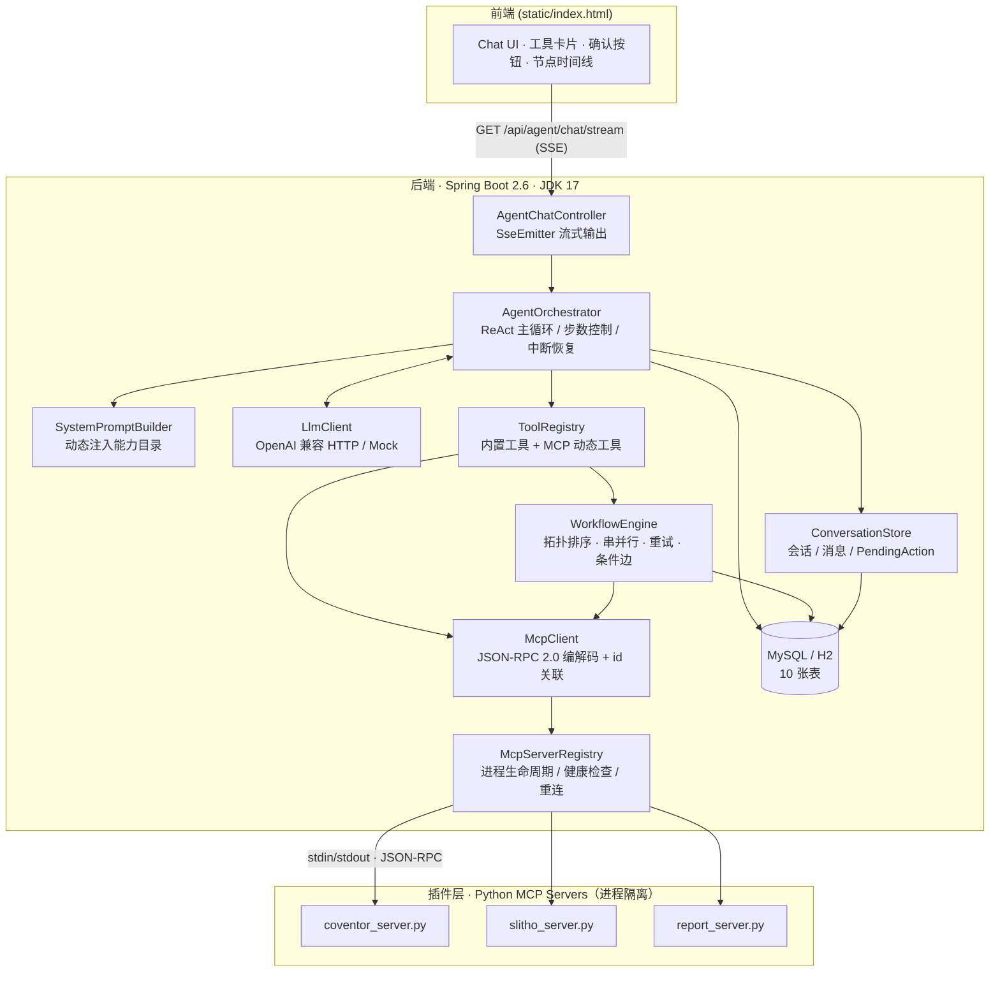
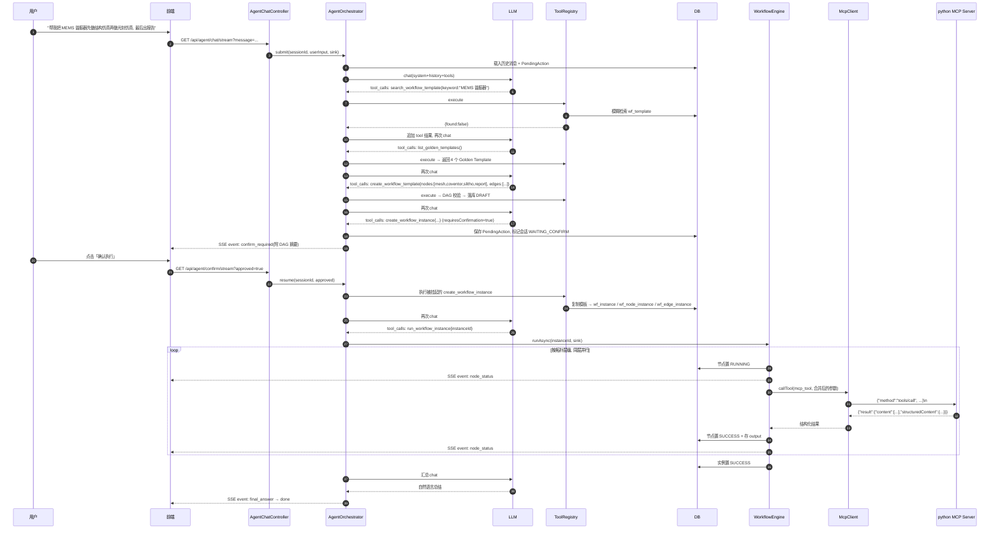
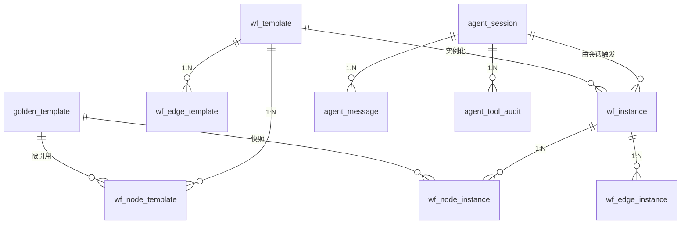

# 仿真 Agent 系统实现方案（MCP 插件 + 自研 Agent 内核 + Workflow 引擎）

<aside>
🎯

**一句话目标**：用 JDK 17 + Spring Boot 2.6 **纯手写**（不引入 Spring AI / LangChain4j）实现「自然语言 → 需求分析 → 复用或新建 Workflow 模板 → 人工确认 → 创建实例 → DAG 调度 → 按节点仿真类型调用对应 Python MCP Server」的完整闭环。仿真脚本用 mock，链路真实可跑。

</aside>

## 一、先把领导的想法翻译成架构

领导说的「核心引擎化，其他相当于插件」，翻译成工程语言就是下面这张对照表。**这张表是整个方案的地基，务必先看懂再看代码。**

| 领导的表述 | 工程落点 | 本方案对应模块 |
| --- | --- | --- |
| 每个仿真任务封装成一个 python MCP Server | 用 **JSON-RPC 2.0 over stdio** 的标准协议把仿真能力「外挂」出去，新增仿真类型 = 新增一个 .py 文件 + 一条配置 | `mcp-servers/python/*.py` |
| 后端 Agent 分析用户需求 | **自研 ReAct 循环 + OpenAI 兼容 function calling**，不依赖任何 Agent 框架 | `agent/AgentOrchestrator`  • `llm/*` |
| 查找是否有现成 workflow | Agent 的一个 **Tool**：`search_workflow_template` | `agent/tool/builtin/*` |
| 没有就先创建 workflow 模板 | Agent 的一个 **Tool**：`create_workflow_template`（带 DAG 合法性校验） | `CreateWorkflowTemplateTool` |
| 用户没问题后再创建实例 | **HITL（Human-in-the-loop）中断 / 恢复机制**，敏感工具必须人工确认 | `agent/hitl/*`  • `PendingAction` |
| 根据实例中每个 node 识别仿真类型，调对应 MCP Server | **DAG 执行引擎 + 路由表**：`node → goldenTemplate → (mcpServer, mcpTool)` | `workflow/engine/*` |
| 核心引擎化，其他是插件 | 引擎只认 **抽象节点**，不认「coventor / slitho」；仿真类型信息全部沉到数据（Golden Template）+ 配置（mcp-servers）里 | 全局设计约束 |

### 1.1 三条铁律（决定了这套代码为什么这么写）

1. **引擎里不允许出现 `if (type == COVENTOR)`**。节点执行时只做一件事：从 Golden Template 上读出 `mcp_server` / `mcp_tool`，然后交给 `McpClient`。新增仿真类型对 Java 代码是**零改动**。
2. **大模型只做「决策」，不做「执行」**。LLM 输出的永远是「调用哪个工具 + 什么参数」，真正的落库、建实例、跑 DAG 全部由 Java 确定性代码完成。这是企业级 Agent 与玩具 Demo 的分水岭。
3. **一切副作用操作必须可确认、可审计、可重放**。`create_workflow_instance`、`run_workflow_instance` 默认走人工确认；所有工具调用写 `agent_tool_audit` 表。

---

## 二、总体架构



### 2.1 分层职责

| 层 | 包 | 职责 | 绝对不能做的事 |
| --- | --- | --- | --- |
| Web 层 | `controller` | SSE 建流、参数校验、鉴权、事件透传 | 写业务逻辑 |
| Agent 内核 | `agent` | ReAct 循环、工具编排、记忆、HITL、审计 | 直接 JDBC、直接起 python 进程 |
| 工具层 | `agent.tool` | 把「业务能力」包成 LLM 能理解的 JSON Schema | 自己拼 Prompt |
| LLM 适配层 | `llm` | HTTP、重试、SSE 解析、tool_calls 归一化 | 感知业务概念 |
| 领域层 | `workflow`、`golden` | 模板 / 实例 CRUD、DAG 校验、参数合并 | 感知 LLM |
| 执行引擎 | `workflow.engine` | 拓扑调度、并发、重试、状态机、条件边 | 感知具体仿真类型 |
| MCP 适配层 | `mcp` | 协议编解码、进程管理、超时、重连 | 感知 workflow |
| 插件层 | `mcp-servers/python` | 真正调用仿真工具（当前 mock） | 访问业务库 |

---

## 三、核心时序：一次「复杂仿真」的完整生命周期



---

## 四、工程目录树

```
simulation-agent/
├── pom.xml
├── mcp-servers/                                  # ← 插件层（python）
│   └── python/
│       ├── requirements.txt
│       ├── common/
│       │   ├── __init__.py
│       │   ├── mcp_base.py                       # 极简 MCP Server 框架（stdio + JSON-RPC）
│       │   └── mock_simulator.py                 # mock 仿真内核
│       ├── coventor_server.py                    # 结构/多物理场仿真插件
│       ├── slitho_server.py                      # 光刻仿真插件
│       └── report_server.py                      # 后处理/报告插件
└── src/main/
    ├── java/com/example/simagent/
    │   ├── SimAgentApplication.java
    │   ├── common/
    │   │   ├── R.java                            # 统一响应体
    │   │   ├── BizException.java
    │   │   ├── ErrorCode.java
    │   │   ├── GlobalExceptionHandler.java
    │   │   ├── JsonUtils.java
    │   │   └── TraceIdFilter.java                # MDC traceId
    │   ├── config/
    │   │   ├── AgentProperties.java
    │   │   ├── LlmProperties.java
    │   │   ├── McpProperties.java
    │   │   ├── ThreadPoolConfig.java
    │   │   └── WebConfig.java                    # CORS + 静态资源
    │   ├── llm/                                  # ← LLM 适配层
    │   │   ├── LlmClient.java
    │   │   ├── OpenAiCompatibleLlmClient.java
    │   │   ├── MockLlmClient.java                # 无 API Key 也能跑通全链路
    │   │   ├── LlmException.java
    │   │   └── model/{ChatMessage,ToolCall,FunctionCall,ToolSpec,LlmRequest,LlmResponse,Usage}.java
    │   ├── mcp/                                  # ← MCP 适配层
    │   │   ├── protocol/{JsonRpcRequest,JsonRpcResponse,JsonRpcError,McpToolDefinition,McpCallToolResult,McpContent}.java
    │   │   ├── transport/{McpTransport,StdioMcpTransport}.java
    │   │   ├── McpClient.java
    │   │   ├── McpException.java
    │   │   ├── McpServerHandle.java
    │   │   ├── McpServerRegistry.java
    │   │   └── McpToolCatalog.java
    │   ├── agent/                                # ← Agent 内核
    │   │   ├── AgentOrchestrator.java            # ★ ReAct 主循环
    │   │   ├── SystemPromptBuilder.java
    │   │   ├── event/{AgentEvent,AgentEventType,AgentEventSink,SseEventSink,SseSessionRegistry}.java
    │   │   ├── memory/{ConversationStore,AgentSession,AgentMessage,SessionStatus}.java
    │   │   ├── hitl/{PendingAction,ConfirmationService}.java
    │   │   ├── audit/{ToolAuditLogger,ToolAuditRecord}.java
    │   │   └── tool/
    │   │       ├── AgentTool.java
    │   │       ├── ToolContext.java
    │   │       ├── ToolResult.java
    │   │       ├── ToolRegistry.java
    │   │       ├── mcp/McpDelegatingTool.java
    │   │       └── builtin/
    │   │           ├── ListGoldenTemplatesTool.java
    │   │           ├── GetGoldenTemplateDetailTool.java
    │   │           ├── SearchWorkflowTemplateTool.java
    │   │           ├── CreateWorkflowTemplateTool.java
    │   │           ├── CreateWorkflowInstanceTool.java
    │   │           ├── RunWorkflowInstanceTool.java
    │   │           ├── GetWorkflowInstanceStatusTool.java
    │   │           └── RequestUserConfirmationTool.java
    │   ├── golden/                               # ← Golden Template 领域
    │   │   ├── GoldenTemplate.java
    │   │   ├── GoldenTemplateRepository.java
    │   │   └── GoldenTemplateService.java
    │   ├── workflow/                             # ← Workflow 领域 + 引擎
    │   │   ├── domain/{WorkflowTemplate,NodeTemplate,EdgeTemplate,WorkflowInstance,NodeInstance,EdgeInstance,WorkflowGraph,RunStatus,TemplateStatus}.java
    │   │   ├── repository/{WorkflowTemplateRepository,WorkflowInstanceRepository}.java
    │   │   ├── service/{WorkflowTemplateService,WorkflowInstanceService}.java
    │   │   └── engine/{WorkflowEngine,DagValidator,NodeExecutor,SimulationNodeExecutor,ParamResolver,ConditionEvaluator,ExecutionContext,NodeExecResult}.java
    │   └── controller/
    │       ├── AgentChatController.java
    │       ├── WorkflowController.java
    │       ├── McpAdminController.java
    │       └── dto/{ChatRequest,ConfirmRequest,WorkflowInstanceVO,NodeInstanceVO}.java
    └── resources/
        ├── application.yml
        ├── db/{schema.sql,data.sql}
        └── static/index.html                     # 前端 Demo
```

---

## 五、数据模型总览（10 张表）

你原有的 6 张表（3 模板 + 3 实例）保持不变，本方案只是**补齐了 Agent 侧的 4 张表**，并在 Golden Template 上新增两个关键列。



<aside>
🔑

**最关键的两个字段**：`golden_template.mcp_server` 和 `golden_template.mcp_tool`。它们就是「node → MCP Server」的路由表。引擎拿到节点后 **只查这两列**，因此新增仿真类型不需要改一行 Java 代码 —— 这就是「核心引擎化 + 插件化」的物理落点。

</aside>

---

## 六、代码阅读顺序（建议照这个顺序学）

| # | 子页 | 学什么 |
| --- | --- | --- |
| 01 | 工程骨架 | 依赖为什么这么选、10 张表 DDL、种子数据 |
| 02 | Python MCP Server | MCP 协议长什么样、如何 5 分钟新增一个仿真插件 |
| 03 | Java MCP 客户端 | JSON-RPC id 关联、stdio 进程管理、健康检查与重连 |
| 04 | LLM 接入层 | 不用框架怎么做 function calling、SSE 流式、Mock 兜底 |
| 05 | Agent 内核 | ReAct 循环怎么写、记忆怎么存、HITL 中断/恢复怎么做 |
| 06 | Agent 工具集 | 业务能力如何暴露成 JSON Schema、Prompt 与工具如何配合 |
| 07 | Workflow 引擎 | 模板→实例、拓扑排序、串并行、条件边、参数继承与上游注入 |
| 08 | Web 层与前端 | SSE 事件协议、前端渲染工具卡片与确认按钮 |
| 09 | 全链路开发文档 | 协议细节、扩展清单、可观测性、压测与上线注意事项 |

---

## 七、快速启动（5 步跑通）

```bash
# 0) 前置：JDK 17、Maven 3.6+、Python 3.9+
python3 --version && java -version

# 1) 安装 python 侧依赖（本方案的 MCP Server 零三方依赖，requirements 只是占位）
cd mcp-servers/python && pip install -r requirements.txt && cd -

# 2) 单独手测一个 MCP Server（验证插件层 OK）
printf '%s\n' \
  '{"jsonrpc":"2.0","id":1,"method":"initialize","params":{"protocolVersion":"2024-11-05","clientInfo":{"name":"cli","version":"1.0"}}}' \
  '{"jsonrpc":"2.0","id":2,"method":"tools/list"}' \
  '{"jsonrpc":"2.0","id":3,"method":"tools/call","params":{"name":"run_coventor_simulation","arguments":{"model_name":"resonator_v1","mesh_size":2.0,"mock_seconds":1}}}' \
  | python3 mcp-servers/python/coventor_server.py

# 3) 启动后端（默认 LLM_MOCK=true，无需任何 API Key 即可跑通全链路）
mvn -q spring-boot:run

# 4) 打开 http://localhost:8080/ 输入：
#    "帮我做一个 MEMS 谐振器的完整仿真：先结构仿真，再光刻仿真，最后生成报告"

# 5) 接真实大模型（任选一个 OpenAI 兼容端点）
export LLM_MOCK=false
export LLM_BASE_URL=https://dashscope.aliyuncs.com/compatible-mode/v1
export LLM_API_KEY=sk-xxxxxxxx
export LLM_MODEL=qwen-plus
mvn -q spring-boot:run
```

<aside>
⚠️

**关于 Spring Boot 2.6 + JDK 17**：官方支持（Spring Boot 2.5+ 已支持 JDK 17，2.6 正式声明兼容）。真正的坑不是 JDK，而是 **Spring AI 要求 Spring Boot 3.2+ / JDK 17+ 的 Spring 6 基线**，LangChain4j 的 Spring Boot Starter 也主要面向 Boot 3.x。所以领导让你手写是对的 —— 本方案只用到 `spring-boot-starter-web`、`starter-jdbc`、Jackson 和 JDK 内置 `java.net.http.HttpClient`，**零 Agent 框架依赖**，后续想迁移到 Spring AI 也只需要替换 `llm` 和 `mcp` 两个包。

</aside>

[01 · 工程骨架：pom.xml / 配置 / 10 张表 DDL / 种子数据](01%20%C2%B7%20%E5%B7%A5%E7%A8%8B%E9%AA%A8%E6%9E%B6%EF%BC%9Apom%20xml%20%E9%85%8D%E7%BD%AE%2010%20%E5%BC%A0%E8%A1%A8%20DDL%20%E7%A7%8D%E5%AD%90%E6%95%B0%E6%8D%AE%20dcd225ff1b3c448aa7d9cc1bf2e4cca5.md)

[02 · Python MCP Server（仿真插件层，mock 实现）](02%20%C2%B7%20Python%20MCP%20Server%EF%BC%88%E4%BB%BF%E7%9C%9F%E6%8F%92%E4%BB%B6%E5%B1%82%EF%BC%8Cmock%20%E5%AE%9E%E7%8E%B0%EF%BC%89%20ccfdc404ba4b458eba54d01bd35e09c0.md)

[03 · Java MCP 客户端：JSON-RPC / stdio / 注册中心](03%20%C2%B7%20Java%20MCP%20%E5%AE%A2%E6%88%B7%E7%AB%AF%EF%BC%9AJSON-RPC%20stdio%20%E6%B3%A8%E5%86%8C%E4%B8%AD%E5%BF%83%203d99275ac3ab45018e57078e49f610bf.md)

[04 · LLM 接入层：零框架 Function Calling + Mock 大模型](04%20%C2%B7%20LLM%20%E6%8E%A5%E5%85%A5%E5%B1%82%EF%BC%9A%E9%9B%B6%E6%A1%86%E6%9E%B6%20Function%20Calling%20+%20Mock%20%E5%A4%A7%E6%A8%A1%E5%9E%8B%2057bfd55c2082441cbb85fe943ab3a59e.md)

[05 · Agent 内核：ReAct 循环 / 事件流 / 记忆 / 人工确认](05%20%C2%B7%20Agent%20%E5%86%85%E6%A0%B8%EF%BC%9AReAct%20%E5%BE%AA%E7%8E%AF%20%E4%BA%8B%E4%BB%B6%E6%B5%81%20%E8%AE%B0%E5%BF%86%20%E4%BA%BA%E5%B7%A5%E7%A1%AE%E8%AE%A4%203a3d7b86f92b4384b49668c618fabeb7.md)

[06 · Agent 工具集：8 个内置工具 + MCP 代理工具](06%20%C2%B7%20Agent%20%E5%B7%A5%E5%85%B7%E9%9B%86%EF%BC%9A8%20%E4%B8%AA%E5%86%85%E7%BD%AE%E5%B7%A5%E5%85%B7%20+%20MCP%20%E4%BB%A3%E7%90%86%E5%B7%A5%E5%85%B7%204ab3a0e355564aff9cec5f1241c35099.md)

[07 · Workflow 领域层与 DAG 并行执行引擎](07%20%C2%B7%20Workflow%20%E9%A2%86%E5%9F%9F%E5%B1%82%E4%B8%8E%20DAG%20%E5%B9%B6%E8%A1%8C%E6%89%A7%E8%A1%8C%E5%BC%95%E6%93%8E%206c522fce16654d249d741c2034156c49.md)

[08 · Web 层：SSE 接口 / 控制器 / 原生前端页面](08%20%C2%B7%20Web%20%E5%B1%82%EF%BC%9ASSE%20%E6%8E%A5%E5%8F%A3%20%E6%8E%A7%E5%88%B6%E5%99%A8%20%E5%8E%9F%E7%94%9F%E5%89%8D%E7%AB%AF%E9%A1%B5%E9%9D%A2%207a5ace003ad14bf084b76fa2f0aad02b.md)

[09 · 全链路开发文档：MCP / Client / Agent](09%20%C2%B7%20%E5%85%A8%E9%93%BE%E8%B7%AF%E5%BC%80%E5%8F%91%E6%96%87%E6%A1%A3%EF%BC%9AMCP%20Client%20Agent%20f5656501f8484b1bb3737c0718a866f0.md)